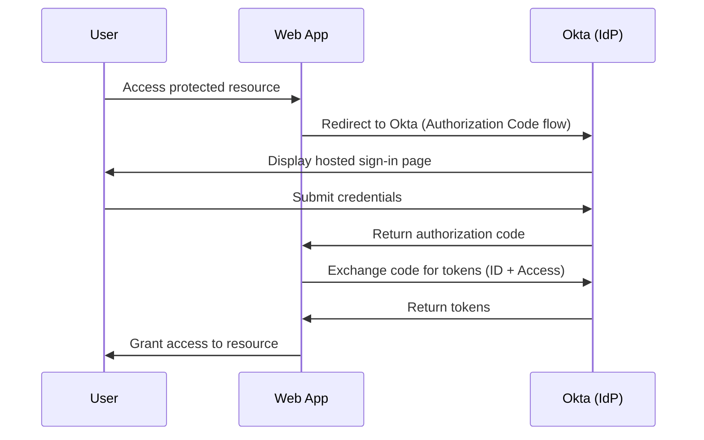
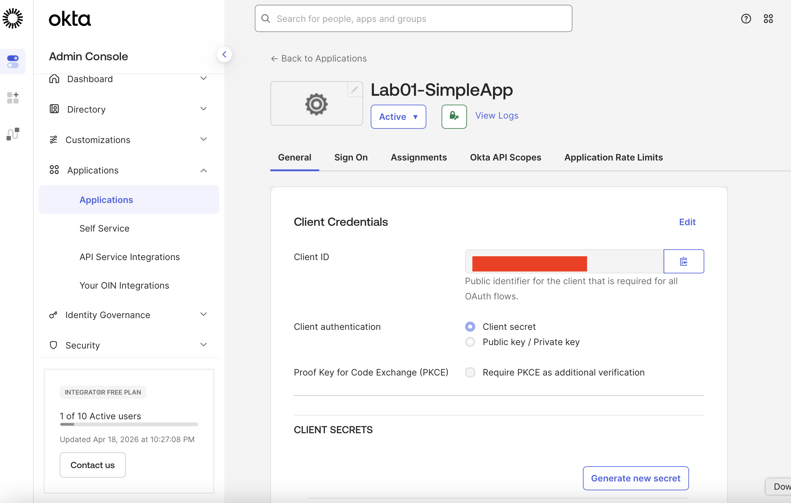
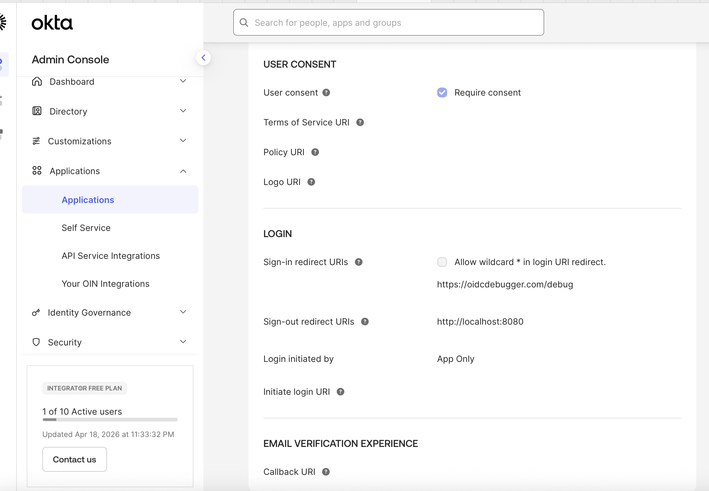
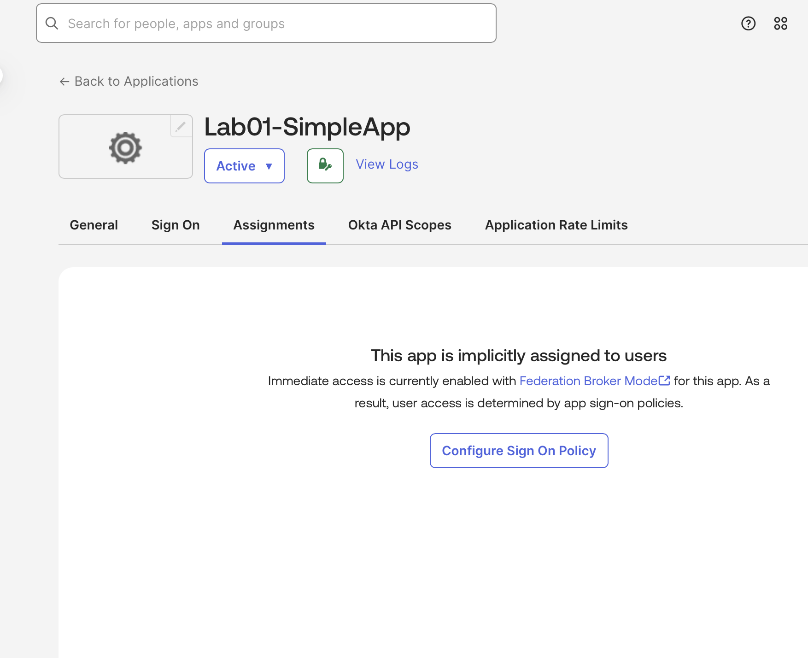
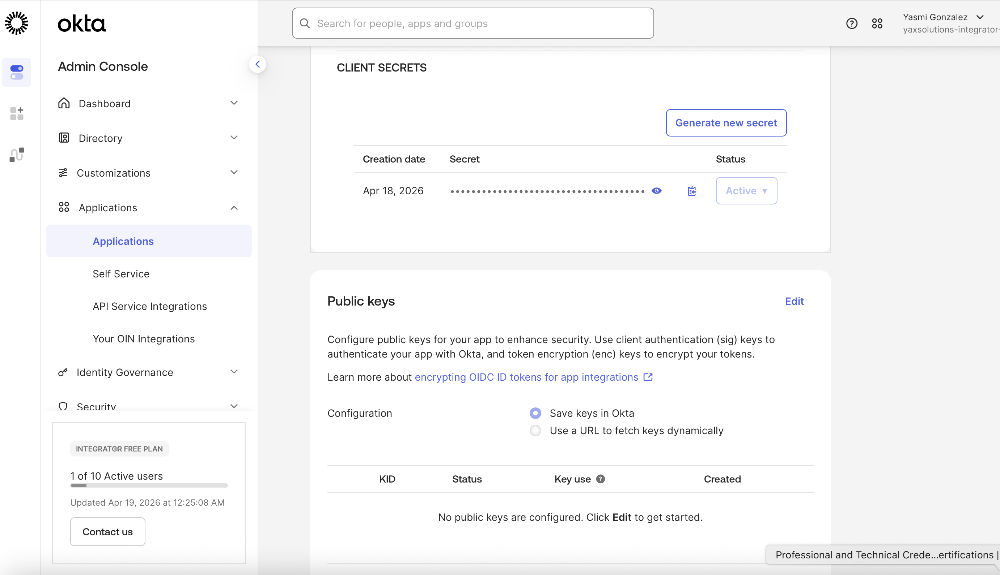
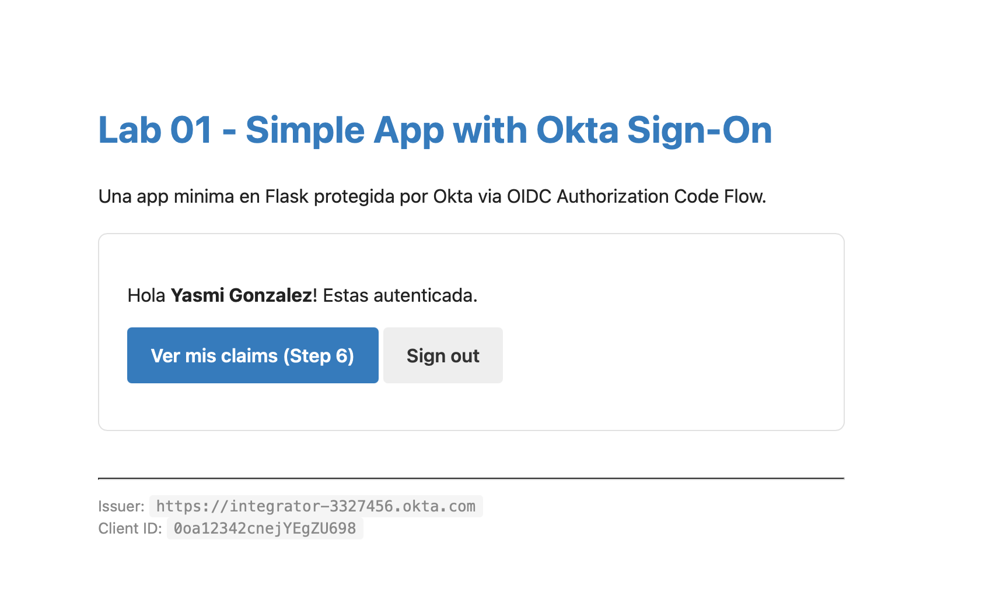
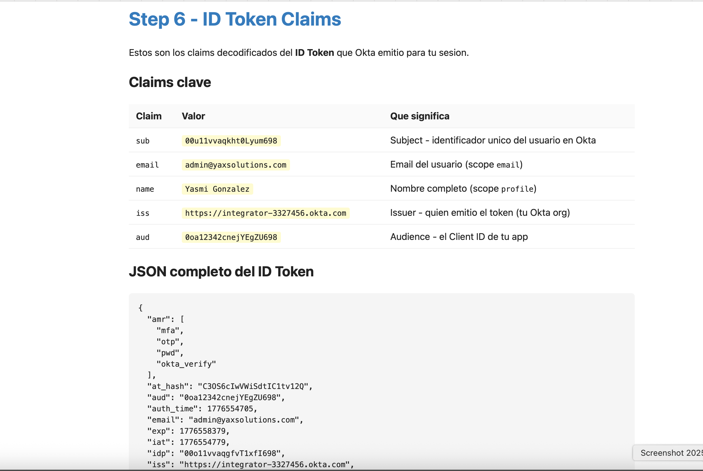

# 01 · Build a Simple App with Sign-In

---

## Why this matters

Every IAM journey starts here. Before you can talk about MFA, SSO, or zero-trust policies, you need to understand how an application delegates authentication to an identity provider and why that's better than managing passwords in your own database.

This lab simulates exactly what a developer at a mid-sized company would do on day one: register a new internal app in Okta and wire it up so that employees log in through Okta's hosted sign-in page instead of a custom form. Simple in concept, foundational in practice.

---

## Architecture

---

## Prerequisites

- Active Okta Developer org (free at [developer.okta.com](https://developer.okta.com))
- Node.js 18+ installed locally
- Basic understanding of OAuth 2.0 / OIDC

---

## Lab Walkthrough

### Step 1 · Create a new application in Okta

Navigate to **Applications → Applications** in the Admin Console and click **Create App Integration**.

> Select **OIDC - OpenID Connect** as the sign-in method and **Web Application** as the application type.

*Okta prompts you to choose the sign-in method — OIDC is the modern, recommended choice over SAML for new apps.*

---

### Step 2 · Configure sign-in and sign-out redirect URIs

Set the **Sign-in redirect URI** to your local app callback (e.g., `http://localhost:3000/callback`) and the **Sign-out redirect URI** to your home page.

*These URIs tell Okta where to send the user after a successful login or logout they must match exactly what your app expects.*

---

### Step 3 · Assign the app to users or groups

Under the **Assignments** tab, assign the application to yourself (or a test group) so the sign-in flow can be tested.

*Without an assignment, Okta will return an error when a user tries to access the app a common gotcha for first-timers.*

---

### Step 4 · Note your Client ID and Client Secret

Copy the **Client ID** and **Client Secret** from the application's General tab. You'll use these in your app's environment variables.

*Treat the Client Secret like a password never commit it to source control.*

---

### Step 5 · Configure the app and test sign-in

Add your Okta domain, Client ID, and Client Secret to the app's `.env` file. Start the app and visit the protected route to trigger the sign-in flow.

*The hosted sign-in page is served by Okta, meaning your app never touches the credentials Okta handles that entirely.*

---

### Step 6 · Verify the ID token claims

After a successful login, inspect the decoded ID token to confirm the user claims (sub, email, name) are present.

*The ID token is a signed JWT — your app uses it to know who the user is without querying Okta again.*

---

## What I Learned

- The OIDC Authorization Code flow is the only flow you should use for web apps the implicit flow (tokens in the URL) was deprecated for good reason.
- Redirect URI mismatches are the #1 error developers hit in this lab. Okta is strict even a trailing slash will break it.
- The difference between the **ID token** (who the user is) and the **Access token** (what the user can do) clicked for me here more than in any documentation.

---

## Real-World Applications

- Replacing a legacy login form with Okta's hosted page for an internal HR tool
- Onboarding a new SaaS app to the company's identity provider in a day
- Giving a contractor scoped access to one specific app without a full AD account

---

## Resources

- [Okta OIDC & OAuth 2.0 API](https://developer.okta.com/docs/reference/api/oidc/)
- [Okta Sign-In Widget](https://developer.okta.com/code/javascript/okta_sign-in_widget/)
- [Authorization Code Flow explained](https://developer.okta.com/blog/2018/04/10/oauth-authorization-code-grant-type)

