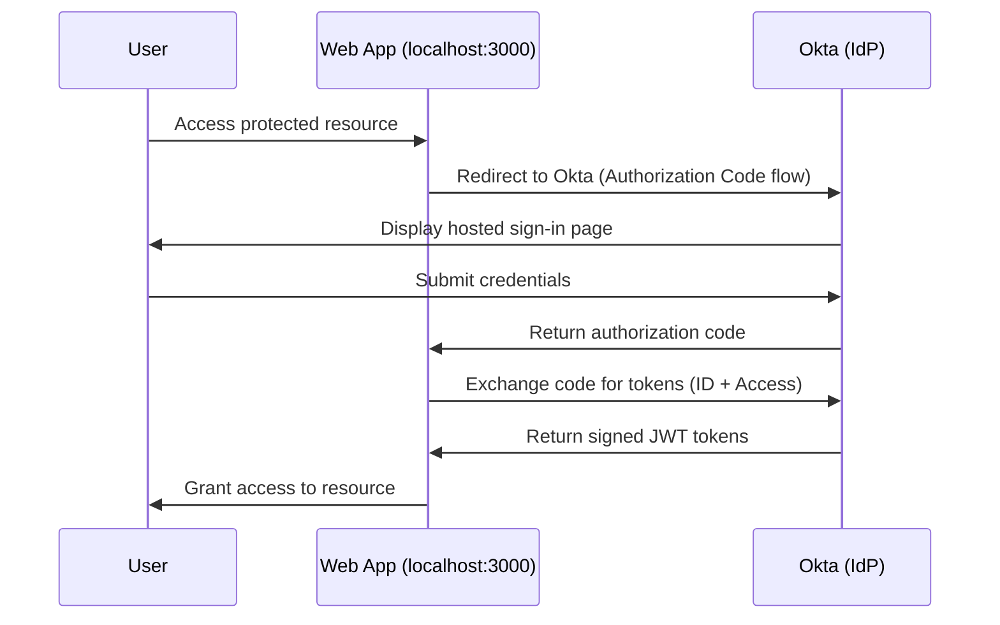

# 01 · Build a Simple App with Sign-In

---

## ⚠️ Real-World Risk

> **61% of breaches involve stolen or misused credentials** (Verizon DBIR 2024). Applications that manage their own password databases are a primary attack target delegating authentication to a dedicated identity provider eliminates that attack surface entirely.

Without a centralised IdP:
- Every app stores its own credentials → multiple breach targets
- No central visibility into who is accessing what
- Password resets, MFA, and lockout policies managed inconsistently per app

This lab implements the **OIDC Authorization Code flow** the industry standard for secure web app authentication.

---

## 🛠 What I Built

- **OIDC Web Application** registered in Okta Admin Console
- **Authorization Code Flow** configured end-to-end with PKCE
- **Sign-in and sign-out redirect URIs** configured and tested
- **App assigned to a user** tested the full login flow in a live Okta Developer org
- **ID token decoded and inspected** verified claims (sub, email, name) at jwt.io
- **Client credentials** secured via environment variables (never committed to source control)

---

## Architecture

> The app never touches the user's credentials. Okta handles the entire authentication transaction and returns a signed JWT the app can trust.

---

## Lab Walkthrough

### Step 1 · Create a new application in Okta

Navigate to **Applications → Applications** in the Admin Console and click **Create App Integration**.

Select **OIDC - OpenID Connect** as the sign-in method and **Web Application** as the application type.

*OIDC is the modern, recommended choice over SAML for new web apps it uses short-lived tokens instead of XML assertions.*

---

### Step 2 · Configure sign-in and sign-out redirect URIs

Set the **Sign-in redirect URI** to `http://localhost:3000/callback` and the **Sign-out redirect URI** to `http://localhost:3000`.

*These URIs are an allowlist Okta will refuse any redirect that doesn't match exactly. Even a trailing slash breaks it.*

---

### Step 3 · Assign the app to a user

Under the **Assignments** tab, assign the application to your test user.

*Without an assignment Okta returns an access denied error. This is intentional it enforces least-privilege by default.*

---

### Step 4 · Copy Client ID and Client Secret

From the **General** tab, copy the Client ID and Client Secret into your `.env` file.

*The Client Secret must never be committed to source control. Use environment variables or a secrets manager in production.*

---

### Step 5 · Trigger the sign-in flow

Start the app and navigate to the protected route. Okta's hosted sign-in page loads automatically.

*The hosted sign-in page is served entirely by Okta the app never handles credentials. This is the core security benefit of delegated authentication.*

---

### Step 6 · Verify the ID token claims

After login, decode the ID token at [jwt.io](https://jwt.io) to inspect the claims.

*The `sub` claim is the unique user identifier. The `email` and `name` claims come from the Okta user profile. The `aud` claim locks the token to your specific app.*

---

## What I Learned

**The redirect URI mismatch is the #1 error in this lab.** Okta is strict a trailing slash, `http` vs `https`, or a wrong port will cause an `error=redirect_uri_mismatch` response. The fix is always to check the Admin Console and match the URI character for character.

**The ID token and Access token serve different purposes.** The ID token tells your app *who the user is*. The Access token tells downstream APIs *what the user is allowed to do*. Mixing these up is one of the most common security mistakes in OAuth implementations.

**The Authorization Code flow protects the token from the browser.** The code is exchanged server-side for tokens the token never appears in the URL. The deprecated Implicit flow returned tokens directly in the URL fragment, which exposed them to browser history and referrer headers.

**The hosted sign-in page is a security feature, not a limitation.** Your app never touches credentials. If the app is compromised, the attacker still can't intercept passwords Okta handles that entirely.

---

## Troubleshooting

| Error | Cause | Fix |
|---|---|---|
| `redirect_uri_mismatch` | URI in app doesn't match `.env` exactly | Check for trailing slash or wrong port in Admin Console |
| `user is not assigned to the client application` | App not assigned to the user | Admin Console → Assignments → assign the user |
| `invalid_client` | Wrong Client ID or Secret in `.env` | Re-copy from General tab — check for spaces |
| Token missing claims | Profile attributes not mapped | Admin Console → Sign On → Edit → add attributes to token |

---

## Real-World Applications

- **Replacing a legacy login form** on an internal HR or finance tool with Okta's hosted page no code changes to authentication logic, no password storage
- **Onboarding a new SaaS integration** to the company's identity provider in under a day using the Okta Integration Network
- **Giving a contractor scoped access** to one specific application without creating a full Active Directory account

---

## Environment

- **Okta Developer Org** free tier at [developer.okta.com](https://developer.okta.com)
- **Node.js 18 + Express** local web app
- **jwt.io** for decoding and inspecting the ID token

---

## Resources

- [Okta OIDC & OAuth 2.0 API](https://developer.okta.com/docs/reference/api/oidc/)
- [Authorization Code Flow with PKCE](https://developer.okta.com/blog/2019/08/22/okta-authjs-pkce)
- [ID tokens vs Access tokens explained](https://developer.okta.com/blog/2019/10/21/illustrated-guide-to-oauth-and-oidc)
