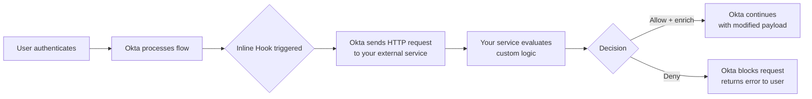
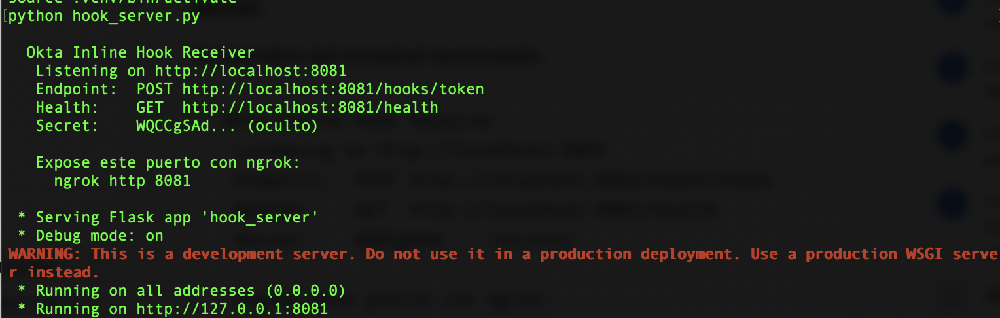
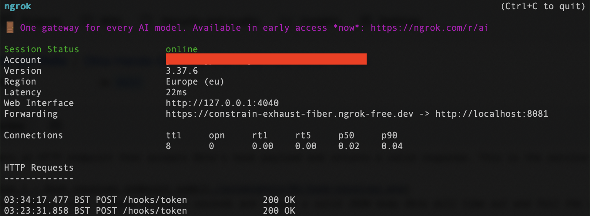
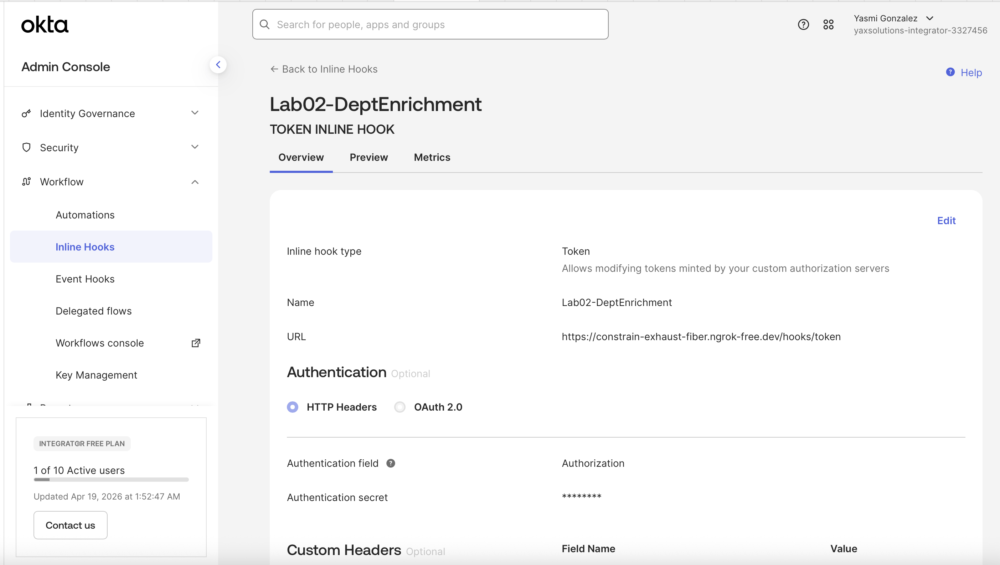
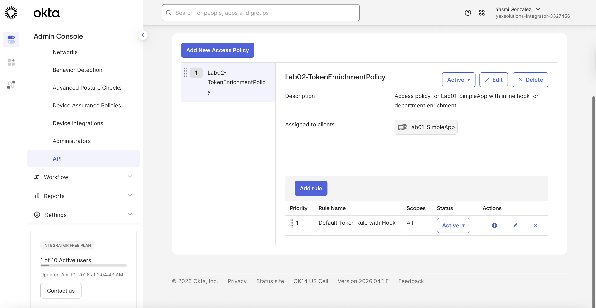
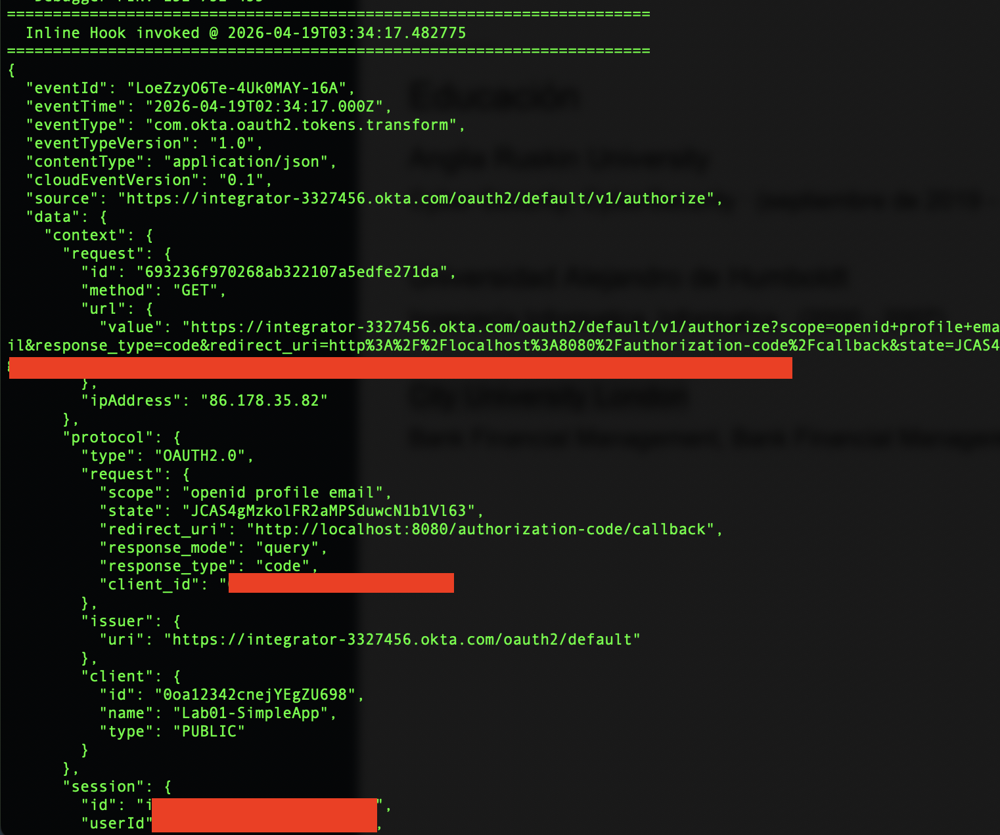
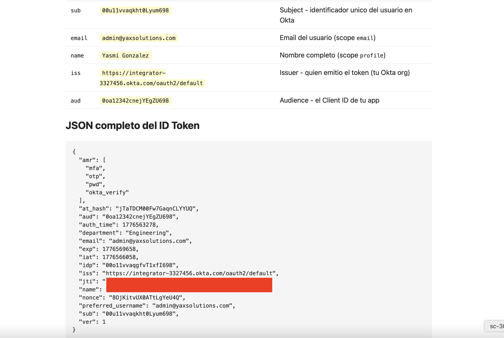

# 02 · Add Inline Hooks

---

## Why this matters

Okta's default authentication flows are powerful out of the box, but real enterprise environments are never that clean. You need to enrich tokens with data from your own systems, block logins based on custom business rules, or trigger side effects when specific auth events happen.

Inline Hooks let you inject your own logic into Okta's pipeline without forking or replacing it. Think of them as middleware for authentication Okta pauses, calls your API, waits for your decision, then continues (or stops) based on what you return. This is how IAM engineers customize identity behavior without touching Okta's internals.

---

## Architecture

---

## Types of Inline Hooks Covered

| Hook Type | When it fires | Common use case |
|---|---|---|
| **Token Inline Hook** | Before Okta mints a token | Add custom claims from your DB |
| **Registration Inline Hook** | During self-service registration | Validate the email against an allowlist |
| **SAML Assertion Inline Hook** | Before Okta sends a SAML response | Add attributes from an HR system |

---

## Prerequisites

- Completed Lab 01 (working Okta application)
- A publicly accessible HTTPS endpoint (use [ngrok](https://ngrok.com) for local development)
- Basic knowledge of REST APIs and JSON

---

## Lab Walkthrough

### Step 1 · Build a simple hook receiver endpoint

Create an HTTP endpoint that accepts Okta's hook payload and returns a valid response. This is the service Okta will call mid-flow.

*Your endpoint must respond within 3 seconds and return a valid JSON body Okta will time out and fail the auth if it doesn't.*

---

### Step 2 · Expose the endpoint publicly via ngrok

Since Okta needs to reach your service over the internet, expose your local server using ngrok and copy the HTTPS URL.

*For production, this would be a Lambda function, Cloud Run service, or any deployed API ngrok is dev-only.*

---

### Step 3 · Register the hook in Okta Admin Console

Go to **Workflow → Inline Hooks** and click **Add Inline Hook**. Select the hook type, paste your endpoint URL, and set up the authentication header.

*Okta signs the hook request with a header secret your endpoint should verify this before processing the payload.*

---

### Step 4 · Attach the hook to the right flow

For a Token Inline Hook, navigate to the authorization server (**Security → API**), open your server, go to **Access Policies**, and attach the hook to the token issuance step.

*The hook only fires for tokens issued through this specific authorization server scoping prevents unintended behavior.*

---

### Step 5 · Test the hook with a real login

Trigger the auth flow and watch your endpoint receive Okta's request. Check the payload it contains the user's profile, the token being minted, and context about the request.

*The payload is rich you can use it to query your own systems and decide what to add or deny based on real-time data.*

---

### Step 6 · Return enriched claims and verify the token

Return a response that adds a custom claim (e.g., `department` from your HR system). Decode the resulting access token to confirm the claim is present.

*The custom claim is now part of every token issued for this user downstream services can use it without hitting Okta or your DB again.*

---

## What I Learned

- **Timing is everything.** The 3-second timeout is real and strict. In production, your hook service needs to be fast no synchronous DB calls if you can help it; use a cache.
- The hook payload uses a **commands** array pattern to return actions. Getting the JSON structure wrong silently fails Okta doesn't always surface clear errors.
- **Token vs. Event hooks** are different things. Token hooks modify tokens mid-issuance; Event hooks are async notifications after the fact. I initially confused the two.

---

## Real-World Applications

- Adding a user's cost center (from SAP or Workday) as a token claim so APIs can enforce department-level authorization
- Blocking login for contractors outside of business hours using a custom `time-of-access` rule
- Triggering a SIEM alert when a privileged account logs in from a new country

---

## Resources

- [Okta Inline Hooks reference](https://developer.okta.com/docs/concepts/inline-hooks/)
- [Token Inline Hook guide](https://developer.okta.com/docs/guides/token-inline-hook/)
- [Verifying hook requests](https://developer.okta.com/docs/guides/common-hook-set-up-steps/)

