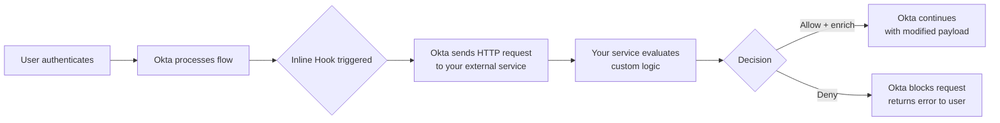

# 02 · Add Inline Hooks


---

## Why this matters

Okta's default authentication flows are powerful out of the box, but real enterprise environments are never that clean. You need to enrich tokens with data from your own systems, block logins based on custom business rules, or trigger side effects when specific auth events happen.

Inline Hooks let you inject your own logic into Okta's pipeline without forking or replacing it. Think of them as middleware for authentication Okta pauses, calls your API, waits for your decision, then continues (or stops) based on what you return. This is how IAM engineers customize identity behavior without touching Okta's internals.

---

## Architecture



---

## Types of Inline Hooks Covered

| Hook Type | When it fires | Common use case |
|---|---|---|
| **Token Inline Hook** | Before Okta mints a token | Add custom claims from your DB |
| **Registration Inline Hook** | During self-service registration | Validate the email against an allowlist |
| **SAML Assertion Inline Hook** | Before Okta sends a SAML response | Add attributes from an HR system |

---

## Prerequisites

- Completed Lab 01 (working Okta application)
- A publicly accessible HTTPS endpoint (use [ngrok](https://ngrok.com) for local development)
- Basic knowledge of REST APIs and JSON

---

## Lab Walkthrough

### Step 1 · Build a simple hook receiver endpoint

Create an HTTP endpoint that accepts Okta's hook payload and returns a valid response. This is the service Okta will call mid-flow.


*Your endpoint must respond within 3 seconds and return a valid JSON body Okta will time out and fail the auth if it doesn't.*


### Environment setup

```bash
# Create project directory
mkdir -p ~/Okta-Hands-On-Labs-IAM/lab02-inline-hooks
cd ~/Okta-Hands-On-Labs-IAM/lab02-inline-hooks

# Python virtual environment
python3 -m venv .venv
source .venv/bin/activate

# Install dependencies
pip install -r requirements.txt
```

### Generate and configure the HOOK_SECRET

```bash
# Copy template
cp .env.example .env

# Generate a random secret
python3 -c "import secrets; print(secrets.token_urlsafe(32))"

# Edit .env and paste the secret
nano .env
```

### Run the server

```bash
source .venv/bin/activate
python hook_server.py
```

Expected output:

```
  Okta Inline Hook Receiver
   Listening on http://localhost:8081
   Endpoint:  POST http://localhost:8081/hooks/token
   Health:    GET  http://localhost:8081/health
   Secret:    WQCCgSAd... (oculto)

 * Serving Flask app 'hook_server'
 * Running on http://127.0.0.1:8081
```

---

### Step 2 · Expose the endpoint publicly via ngrok

Okta must reach the hook server over HTTPS from the public internet, so `localhost:8081` is exposed via ngrok.

### Install ngrok (Homebrew on macOS)

```bash
# Install
brew install ngrok

# Or upgrade if already installed
brew upgrade ngrok
```

### Configure authtoken

Obtained from [https://dashboard.ngrok.com/get-started/your-authtoken](https://dashboard.ngrok.com/get-started/your-authtoken):

```bash
# Create config directory if it does not exist
mkdir -p "$HOME/Library/Application Support/ngrok"

# Register the authtoken
ngrok config add-authtoken <my-ngrok-authtoken>

# Verify
ngrok version
```

### Start the tunnel

```bash
ngrok http 8081
```

Output:

```
Session Status    online
Region            Europe (eu)
Web Interface     http://127.0.0.1:4040
Forwarding        https://constrain-exhaust-fiber.ngrok-free.dev -> http://localhost:8081
```


*For production, this would be a Lambda function, Cloud Run service, or any deployed API ngrok is dev-only.*

**Note:**  On ngrok's free plan the public URL is dynamic and changes every time ngrok is restarted. When that happens the URL must be updated in Okta (Step 3).
---

### Step 3 · Register the hook in Okta Admin Console

Go to **Workflow → Inline Hooks** and click **Add Inline Hook**. Select the hook type, paste your endpoint URL, and set up the authentication header.


*Okta signs the hook request with a header secret your endpoint should verify this before processing the payload.*

### Sync the secret safely

To avoid copy/paste errors between `.env` and Okta, copy the secret directly to the clipboard:

```bash
grep HOOK_SECRET .env | cut -d= -f2 | tr -d '\n' | pbcopy
```

Then paste into Okta's **Authentication secret** field and save.
---

### Step 4 · Attach the hook to the right flow

For a Token Inline Hook, navigate to the authorization server (**Security → API**), open your server, go to **Access Policies**, and attach the hook to the token issuance step.

### Create the Access Policy

Navigation: **Security → API → Authorization Servers → default → Access Policies → Add New Access Policy**

| Field | Value |
|---|---|
| **Name** | `Lab02-TokenEnrichmentPolicy` |
| **Description** | `Access policy for Lab01-SimpleApp with inline hook for department enrichment` |
| **Assign to clients** | `Lab01-SimpleApp` |

### Add the Rule

Inside the policy, click **Add Rule**:

| Field | Value |
|---|---|
| **Rule name** | `Default Token Rule with Hook` |
| **IF Grant type is** | `Authorization Code` |
| **AND User is** | `Any user assigned the app` |
| **AND Scopes requested** | `Any scopes` |
| **THEN Use this inline hook** | `Lab02-DeptEnrichment` |

### Order the policies

The access policy was dragged to **position 1** at the top of the list so that it is evaluated first.


*The hook only fires for tokens issued through this specific authorization server scoping prevents unintended behavior.*

---

### Step 5 · Test the hook with a real login

Trigger the auth flow and watch your endpoint receive Okta's request. Check the payload it contains the user's profile, the token being minted, and context about the request.
### Update Lab 01 to use the Custom Authorization Server

In `lab01-flask-app/.env`:

```bash
# Before (Org AS):
# OKTA_ISSUER=https://integrator-3327456.okta.com/oauth2/v1

# After (Custom AS — required for inline hooks):
OKTA_ISSUER=https://integrator-3327456.okta.com/oauth2/default
```

### Run all three services

```bash
# Terminal 1 — Hook server
cd ~/Okta-Hands-On-Labs-IAM/lab02-inline-hooks
source .venv/bin/activate
python hook_server.py

# Terminal 2 — ngrok tunnel
ngrok http 8081

# Terminal 3 — Lab 01 Flask app
cd ~/Okta-Hands-On-Labs-IAM/lab01-flask-app
source .venv/bin/activate
python app.py
```

### Trigger the flow

1. Open an incognito window (Cmd+Shift+N)
2. Navigate to `http://localhost:8080`
3. Click **Sign in with Okta**
4. Authenticate with `admin@yaxsolutions.com`

### Confirm the hook fired

In Terminal 1 (hook server):


*The payload is rich you can use it to query your own systems and decide what to add or deny based on real-time data.*

```
======================================================================
  Inline Hook invoked @ 2026-04-19T03:23:31
======================================================================
{
  "data": {
    "context": {
      "user": {
        "profile": {
          "email": "admin@yaxsolutions.com",
          ...
        }
      }
    }
  }
}
======================================================================
  Enriching token for admin@yaxsolutions.com
   Department: Engineering
   Employee ID: E-1042
127.0.0.1 - - [19/Apr/2026 03:23:31] "POST /hooks/token HTTP/1.1" 200 -
```

The `POST /hooks/token 200` confirms that Okta called the hook during the token issuance phase and received the enrichment commands successfully.

---

### Step 6 · Return enriched claims and verify the token

Return a response that adds a custom claim (e.g., `department` from your HR system). Decode the resulting access token to confirm the claim is present.

en the authenticated session, navigate to:

```
http://localhost:8080/profile
```

The JSON response includes the custom claims added by the hook:

```json
{
  "sub": "00u...",
  "email": "admin@yaxsolutions.com",
  "name": "Yasmi Gonzalez",
  "department": "Engineering",
  "employee_id": "E-1042",
  "clearance_level": "L3"
}
```

The `department`, `employee_id`, and `clearance_level` fields were **not** part of the user's Okta profile. They were added dynamically by the inline hook at token issuance time, simulating a lookup against an HR system.


*The custom claim is now part of every token issued for this user downstream services can use it without hitting Okta or your DB again.*

### decode the access token

Copying the raw `access_token` and pasting it into [https://jwt.io](https://jwt.io) shows the decoded payload with all the custom claims present. This confirms that the enrichment happens at the token level and propagates to any downstream API that consumes the access token.

---
## Troubleshooting log

The following issues were encountered and resolved during the lab:

| Symptom | Root cause | Fix |
|---|---|---|
| `ngrok.yml: no such file or directory` | ngrok config dir did not exist | `mkdir -p "$HOME/Library/Application Support/ngrok"` then `ngrok config add-authtoken ...` |
| `ModuleNotFoundError: dotenv` | Virtual environment not activated | `source .venv/bin/activate` before `python hook_server.py` |
| `Address already in use` on port 8081 | A previous hook server process was still running | `lsof -ti:8081 \| xargs kill -9` |
| `502 Bad Gateway` on POST /hooks/token (ngrok log) | Hook server was not running when Okta called it | Start Terminal 1 (hook server) before triggering a login |
| `The endpoint ... is offline` HTML response | ngrok tunnel was not running | Start ngrok with `ngrok http 8081` in a dedicated terminal |
| `401 Invalid auth header` in hook server logs | Shared secret in Okta did not match `.env` | Re-sync with `pbcopy` from `.env` and paste into Okta's `Authentication secret` |
| `department: "Unknown"` in the token | The Okta user email did not match the mock directory key | Updated `EMPLOYEE_DIRECTORY` key from `yasmi.gonzalez@gmail.com` to `admin@yaxsolutions.com` |
| Hook did not fire, no POST in hook server logs | Lab 01 was still using the Org AS (`/oauth2/v1`) | Changed `OKTA_ISSUER` to the Custom AS (`/oauth2/default`) |

---

## Lessons learned

- **Token Inline Hooks require a Custom Authorization Server.** The Org AS (`/oauth2/v1`) does not support inline hooks. Always target `/oauth2/default/` or a dedicated custom AS.
- **Ngrok free plan URLs are dynamic.** Any restart of ngrok requires updating the URL in Okta's inline hook configuration. A reserved subdomain (paid feature) avoids this friction.
- **Shared secrets must match exactly.** A single trailing whitespace or missed character breaks the auth check. Using `pbcopy` to transfer the secret removes the human error.
- **Always match the email case.** The mock HR lookup uses `email.lower()` real production systems should normalize emails before any directory lookup.
- **The ngrok web dashboard (`http://127.0.0.1:4040`) is invaluable for debugging.** It shows every request Okta sends, including headers and body, which is faster than reading logs.

---

## Real-World Applications

- Adding a user's cost center (from SAP or Workday) as a token claim so APIs can enforce department-level authorization
- Blocking login for contractors outside of business hours using a custom `time-of-access` rule
- Triggering a SIEM alert when a privileged account logs in from a new country

---

## Resources

- [Okta Inline Hooks reference](https://developer.okta.com/docs/concepts/inline-hooks/)
- [Token Inline Hook guide](https://developer.okta.com/docs/guides/token-inline-hook/)
- [Verifying hook requests](https://developer.okta.com/docs/guides/common-hook-set-up-steps/)

