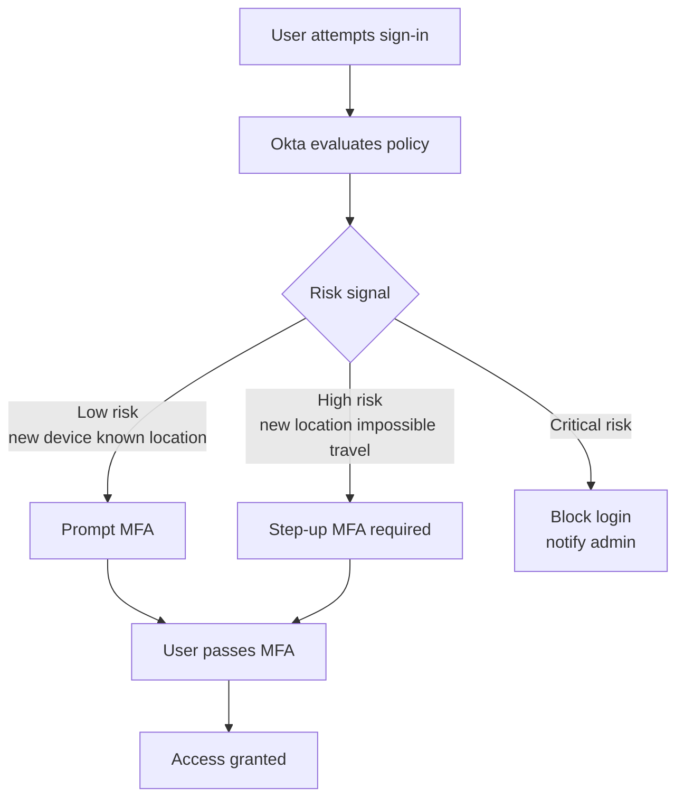
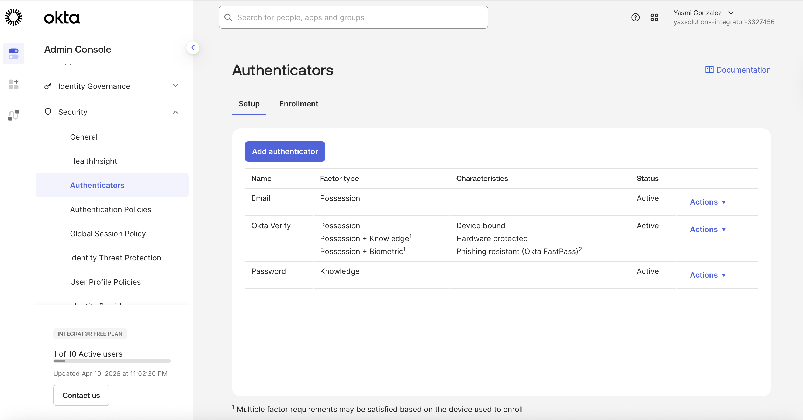
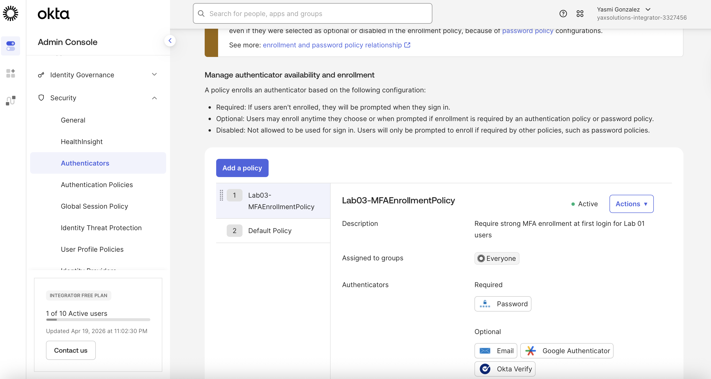
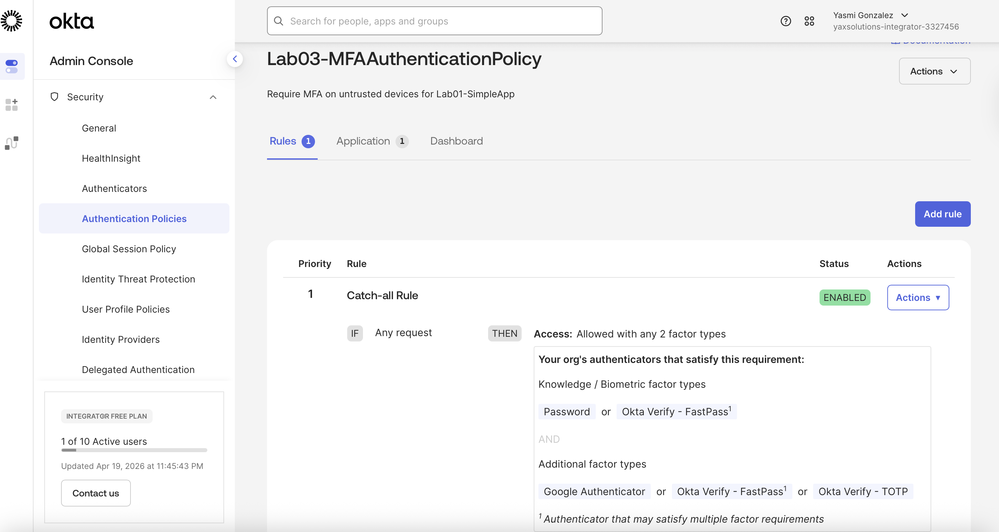
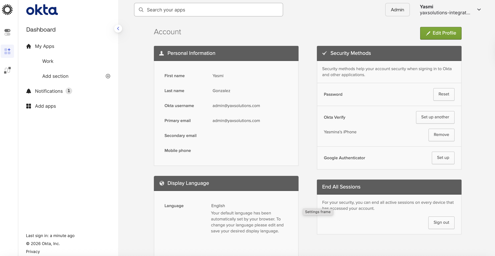
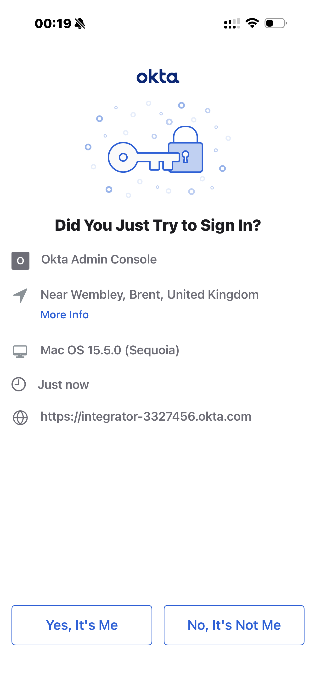
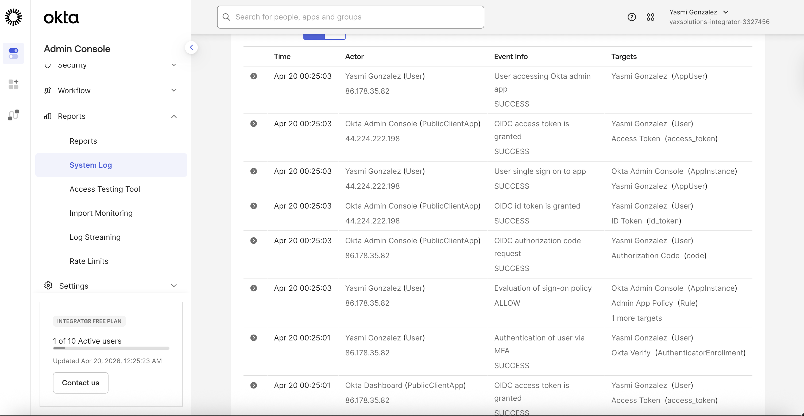

# 03 · Secure with MFA

---

## Why this matters

Passwords are broken. Not because the concept is bad, but because people reuse them, phishing works, and credential stuffing attacks run 24/7. The single most impactful security control any organization can implement is a second factor and doing it wrong (annoying users every login, or enforcing it only sometimes) creates both security gaps and employee frustration.

This lab goes beyond "enable MFA" and covers how to configure it thoughtfully: which factors to offer, when to require them, how to give users flexibility while keeping the security team happy, and how adaptive MFA can make the experience feel invisible for low-risk logins.

---

## Architecture

---

## MFA Factors Configured

| Factor | Type | Trust level | Use case |
|---|---|---|---|
| Okta Verify (push) | App-based | High | Default second factor |
| TOTP (Google Authenticator) | App-based | High | Fallback for no smartphone |
| SMS OTP | SMS-based | Medium | Legacy fallback |
| Security Key (WebAuthn) | Hardware | Very high | Privileged users |

---

## Prerequisites

- Okta org with at least one test user
- Smartphone with Okta Verify installed (for push testing)
- Completed Lab 01 recommended

---

## Lab Walkthrough

### Step 1 · Configure MFA factors in Okta

Navigate to **Security → Authenticators** and review which factors are available. Enable **Okta Verify**, **Google Authenticator**, and optionally **SMS**.

*Okta differentiates between authenticators (how you prove identity) and enrollment policies (when users must set them up).*

---

### Step 2 · Create an authenticator enrollment policy

Go to **Security → Authenticators → Enrollment** and create a policy that requires users to enroll in at least one strong factor within their first login.

*Setting "Required" on enrollment means users cannot skip MFA setup they're gently forced through it on first login.*

---

### Step 3 · Create a sign-on policy with MFA requirement

Under **Security → Authentication Policies**, create a rule that challenges with MFA when the user's device is not already trusted or when they're coming from a new IP.

*The rule builder is where you balance security and UX requiring MFA every single time frustrates users without adding proportional security.*

---

### Step 4 · Enroll a test user in Okta Verify

Log in as your test user and complete the Okta Verify enrollment flow. Scan the QR code with the Okta Verify app on your phone.

*The QR code contains a one-time setup token it expires quickly, so scan it promptly.*

---

### Step 5 · Test the push notification flow

Trigger a sign-in and watch the push notification arrive on your phone. Approve it and observe the browser session being granted.

*Push approval is seamless for users one tap vs. typing a 6-digit code. This is why push is the preferred default factor.*

---

### Step 6 · Test the policy trigger conditions

Sign in from a new browser (incognito) to simulate an untrusted device. Confirm that MFA is challenged again, while a trusted browser skips the challenge.

*Device trust is stored as a cookie in the browser clearing cookies or using a private window resets that trust.*

---

## What I Learned

**La diferencia entre Authenticator, Enrollment Policy y Sign-On Policy es lo que más confunde al principio.** Son tres capas distintas: el Authenticator es el método en sí (Okta Verify, SMS, etc.). La Enrollment Policy define *quién debe registrar* qué método y cuándo. La Sign-On Policy define *cuándo se exige* MFA para acceder. Las tres tienen que estar alineadas para que el flujo funcione configurar solo una no es suficiente.

**El orden de las reglas dentro de una política importa.** Okta evalúa las reglas de arriba a abajo y aplica la primera que coincide. Si tienes una regla permisiva arriba y una restrictiva abajo, la restrictiva nunca se evalúa. Este es el error más común al configurar Sign-On Policies en producción.

**Okta Verify push notification es la experiencia de usuario más limpia.** El usuario no teclea ningún código simplemente aprueba la notificación en el móvil. Esto reduce la fricción lo suficiente como para que los usuarios acepten MFA sin resistencia. En despliegues reales, la adopción de MFA sube significativamente cuando se usa push en lugar de TOTP.

**Adaptive MFA evalúa contexto, no solo identidad.** Okta puede exigir MFA solo cuando detecta riesgo acceso desde una IP desconocida, un país diferente, o un dispositivo no reconocido. En el mismo lab, un usuario desde su oficina habitual puede entrar sin MFA mientras que el mismo usuario desde una IP nueva es desafiado. Esto reduce la fricción para usuarios legítimos sin bajar la seguridad.

**La diferencia entre MFA en el IdP y MFA en la app.** Cuando MFA se configura en Okta, todas las apps que usan Okta como IdP se benefician automáticamente sin tocar el código de ninguna app. Si MFA se configura app por app, cada integración es un punto de fallo independiente y el mantenimiento se multiplica.

---

## Troubleshooting

| Error | Causa | Fix |
|---|---|---|
| MFA prompt no aparece | La Sign-On Policy no tiene una regla que exija MFA | Admin Console → Security → Authentication Policies → verifica que la regla requiere MFA |
| `Authenticator not allowed` | El authenticator no está habilitado en la org | Admin Console → Security → Authenticators → activa Okta Verify |
| Usuario no puede enrolarse | La Enrollment Policy no permite enrolamiento para ese usuario o grupo | Verifica que el usuario está en el grupo objetivo de la Enrollment Policy |
| Push notification no llega | Okta Verify no está vinculado a la cuenta correcta | Desvincula el dispositivo en Admin Console → User → More Actions → Remove Authenticator y re-enrola |
| `Factor not enrolled` al hacer login | El usuario saltó el enrolamiento en el paso anterior | Forzar re-enrolamiento desde Admin Console o esperar al siguiente login con política Required |

---

## Real-World Applications

**Protección de acceso a aplicaciones críticas.** En una empresa financiera, el acceso al ERP o al sistema de nóminas requiere MFA siempre independientemente de desde dónde acceda el usuario. La Sign-On Policy en Okta lo aplica de forma centralizada sin modificar ninguna de esas aplicaciones.

**MFA adaptativo para empleados remotos.** Durante la pandemia, muchas empresas activaron MFA solo para accesos fuera de la red corporativa. Con Okta, esto se configura con una condición de red en la Sign-On Policy los empleados en oficina no son interrumpidos y los remotos son desafiados automáticamente.

**Cumplimiento con regulaciones de seguridad.** PCI-DSS, SOC 2, e ISO 27001 exigen autenticación fuerte para acceso a sistemas que manejan datos sensibles. Configurar MFA en Okta y exportar los logs de autenticación proporciona la evidencia auditable que los auditores requieren.

**Reducción del impacto de credential stuffing.** Los ataques de credential stuffing usan listas de usuario/contraseña filtradas de otras brechas. Con MFA habilitado, una contraseña comprometida no es suficiente para entrar el atacante necesita también el dispositivo físico del usuario. Esto elimina prácticamente el riesgo de este tipo de ataque.

---

## Resources

- [Okta MFA overview](https://help.okta.com/en-us/content/topics/security/mfa.htm)
- [Adaptive MFA with behavior detection](https://help.okta.com/en-us/content/topics/security/behavior-detection.htm)
- [WebAuthn / FIDO2 in Okta](https://help.okta.com/en-us/content/topics/security/webauthn.htm)

