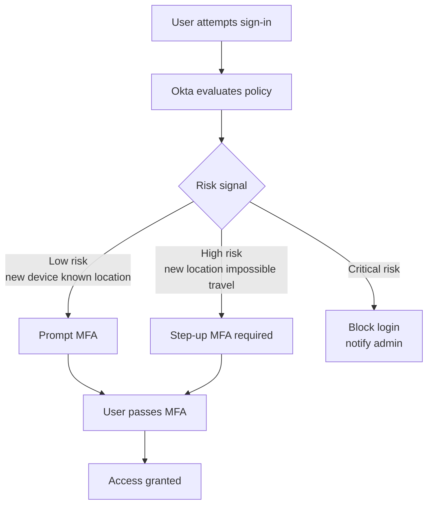

# 03 · Secure with MFA

---

## Why this matters

Passwords are broken. Not because the concept is bad, but because people reuse them, phishing works, and credential stuffing attacks run 24/7. The single most impactful security control any organization can implement is a second factor and doing it wrong (annoying users every login, or enforcing it only sometimes) creates both security gaps and employee frustration.

This lab goes beyond "enable MFA" and covers how to configure it thoughtfully: which factors to offer, when to require them, how to give users flexibility while keeping the security team happy, and how adaptive MFA can make the experience feel invisible for low-risk logins.

---

## Architecture

---

## MFA Factors Configured

| Factor | Type | Trust level | Use case |
|---|---|---|---|
| Okta Verify (push) | App-based | High | Default second factor |
| TOTP (Google Authenticator) | App-based | High | Fallback for no smartphone |
| SMS OTP | SMS-based | Medium | Legacy fallback |
| Security Key (WebAuthn) | Hardware | Very high | Privileged users |

---

## Prerequisites

- Okta org with at least one test user
- Smartphone with Okta Verify installed (for push testing)
- Completed Lab 01 recommended

---

## Lab Walkthrough

### Step 1 · Configure MFA factors in Okta

Navigate to **Security → Authenticators** and review which factors are available. Enable **Okta Verify**, **Google Authenticator**, and optionally **SMS**.

*Okta differentiates between authenticators (how you prove identity) and enrollment policies (when users must set them up).*

---

### Step 2 · Create an authenticator enrollment policy

Go to **Security → Authenticators → Enrollment** and create a policy that requires users to enroll in at least one strong factor within their first login.

*Setting "Required" on enrollment means users cannot skip MFA setup they're gently forced through it on first login.*

---

### Step 3 · Create a sign-on policy with MFA requirement

Under **Security → Authentication Policies**, create a rule that challenges with MFA when the user's device is not already trusted or when they're coming from a new IP.

*The rule builder is where you balance security and UX requiring MFA every single time frustrates users without adding proportional security.*

---

### Step 4 · Enroll a test user in Okta Verify

Log in as your test user and complete the Okta Verify enrollment flow. Scan the QR code with the Okta Verify app on your phone.

*The QR code contains a one-time setup token it expires quickly, so scan it promptly.*

---

### Step 5 · Test the push notification flow

Trigger a sign-in and watch the push notification arrive on your phone. Approve it and observe the browser session being granted.

*Push approval is seamless for users one tap vs. typing a 6-digit code. This is why push is the preferred default factor.*

---

### Step 6 · Test the policy trigger conditions

Sign in from a new browser (incognito) to simulate an untrusted device. Confirm that MFA is challenged again, while a trusted browser skips the challenge.

*Device trust is stored as a cookie in the browser clearing cookies or using a private window resets that trust.*

---

## What I Learned

- **Enrollment policy vs. sign-on policy** is a distinction that confused me early. Enrollment controls when users set up a factor; sign-on policy controls when they're challenged to use it. You need both.
- SMS OTP is better than nothing, but SIM-swap attacks mean it shouldn't be the only option for high-privilege accounts.
- Users will call the help desk if MFA prompts too often. The right answer is adaptive policies, not disabling MFA.
- **Number matching** (introduced in Okta Verify) prevents push bombing attacks users must type the number shown on screen into the app before approving.

---

## Real-World Applications

- Requiring hardware security keys (YubiKeys) for IT admins and C-suite without affecting regular employees
- Triggering step-up MFA only when a user tries to access payroll data, not on every login
- Allowing users to self-register for MFA but requiring IT approval before the account is fully activated

---

## Resources

- [Okta MFA overview](https://help.okta.com/en-us/content/topics/security/mfa.htm)
- [Adaptive MFA with behavior detection](https://help.okta.com/en-us/content/topics/security/behavior-detection.htm)
- [WebAuthn / FIDO2 in Okta](https://help.okta.com/en-us/content/topics/security/webauthn.htm)

