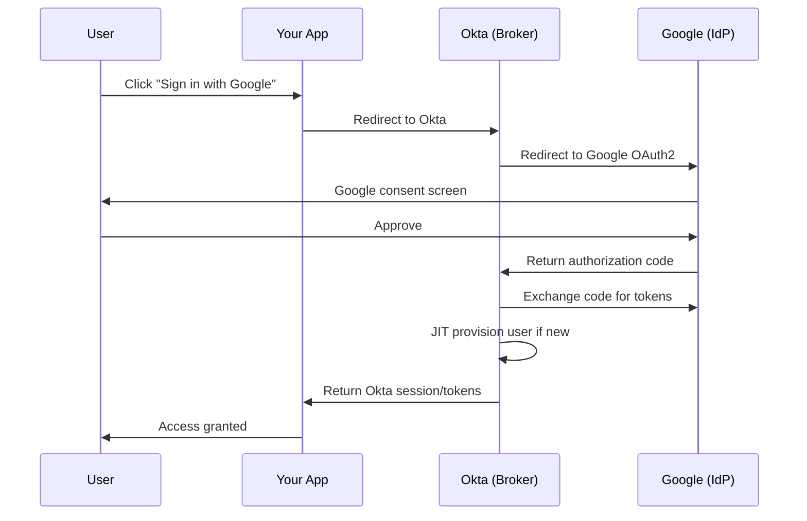

# 04 · Social Login (Google)

---

## Why this matters

Friction kills conversion. When a customer lands on your app's login page and sees "Sign in with Google," most will click it without a second thought, they already trust Google with their identity and they don't want another password to manage.

But this isn't just a UX improvement. From a security standpoint, social login with Okta as the broker means your app never sees Google credentials, your security team still gets a single pane of glass for access management, and you can apply your own policies (like MFA or device trust) on top of the social identity. This lab shows you how to configure Google as an Identity Provider in Okta and use Okta as the federation broker.

---

## Architecture

---

## Prerequisites

- Google Cloud Platform account (free tier is fine)
- Okta org with an existing application (Lab 01 recommended)
- Basic understanding of OAuth 2.0 flows

---

## Lab Walkthrough

### Step 1 · Create OAuth credentials in Google Cloud Console

Go to **Google Cloud Console → APIs & Services → Credentials** and create a new **OAuth 2.0 Client ID** of type "Web application."

*You'll configure the authorized redirect URI in a moment, leave it for now and come back after you have Okta's callback URL.*

---

### Step 2 · Get Okta's redirect URI for Google

In Okta Admin Console, go to **Security → Identity Providers → Add Identity Provider → Google**. Copy the **Redirect URI** that Okta generates — it looks like `https://<your-okta-domain>/oauth2/v1/authorize/callback`.

*This URI is what Google will redirect to after the user approves paste it back into your Google Cloud OAuth client configuration.*

---

### Step 3 · Configure Google as an Identity Provider in Okta

Back in Okta, complete the Google IdP setup by pasting the **Client ID** and **Client Secret** from Google Cloud.

*The "Account Link Policy" controls what happens when an existing Okta user's email matches a Google account, set this carefully to avoid duplicate accounts.*

---

### Step 4 · Add routing rules to direct users to Google

Under **Security → Identity Providers → Routing Rules**, create a rule that shows the "Sign in with Google" button on your app's login page.

*Routing rules can target specific apps, user attributes, or network zones, you can show Google login only for a customer-facing app, not for internal employee apps.*

---

### Step 5 · Test the Google sign-in flow

Open your app's login page and confirm the "Sign in with Google" button appears. Click it and go through the Google OAuth consent screen.

*The Google consent screen shows your app's name and what permissions it's requesting, branding matters here.*

---

### Step 6 · Verify JIT user provisioning in Okta

After a new user signs in via Google, check the Okta Admin Console under **Directory → People** to confirm a new user was created automatically.

*Just-in-Time provisioning means you don't pre-create user accounts, Okta creates them on first login from the social IdP.*

---

### Step 7 · Inspect the profile mappings

Under the Google IdP settings, review **Profile Master** settings and attribute mappings to confirm that `email`, `firstName`, and `lastName` are pulled correctly from Google's profile.

*Google returns different claim names than Okta's standard profile the mapping step normalizes them so your apps always get consistent data.*

---

## What I Learned

- **Account linking** is the trickiest part. If a user has an existing Okta account with the same email as their Google account, you need to decide whether to auto-link or prompt them getting this wrong creates orphaned accounts.
- The "Profile Master" setting controls whether Google can update the Okta profile on subsequent logins. For social login, this is usually fine; for enterprise IdPs, you might want Okta to be the master instead.
- You can apply Okta's own MFA policies on top of social loginsjust because a user authenticated with Google doesn't mean Okta skips its own policies.

---

## Real-World Applications

- B2C SaaS apps allowing customers to sign up and log in with their existing Google or Microsoft accounts
- Offering social login as a self-service option alongside enterprise SSO for the same app
- Using Google Workspace as the primary IdP for a company that's "Google-first" but needs Okta's policy engine and app catalog

---

## Resources

- [Okta Social Identity Providers](https://developer.okta.com/docs/guides/add-an-external-idp/google/main/)
- [Google OAuth 2.0 for Web Apps](https://developers.google.com/identity/protocols/oauth2/web-server)
- [Just-in-Time Provisioning](https://help.okta.com/en-us/content/topics/directory/jit-provisioning.htm)

