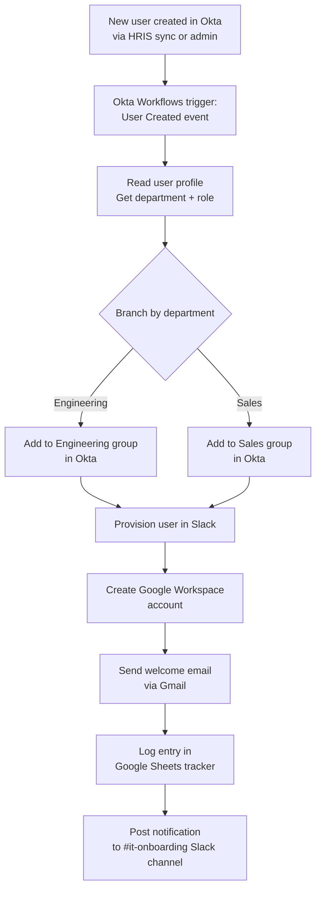
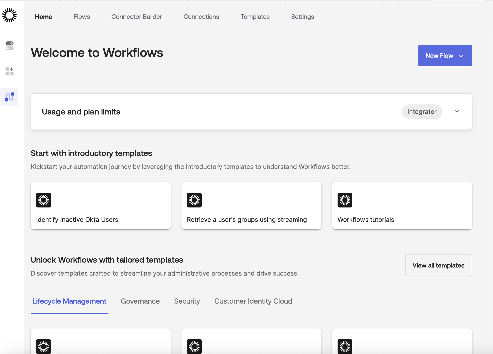
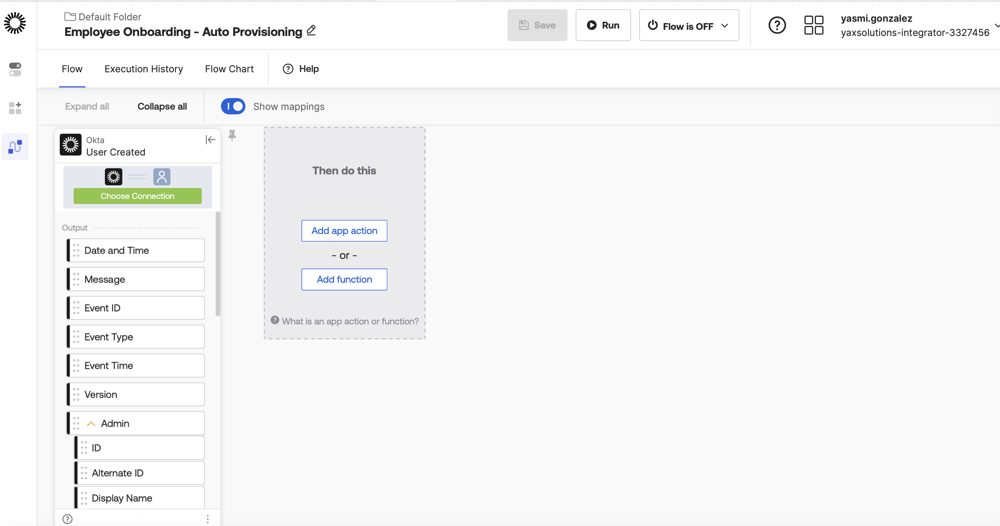
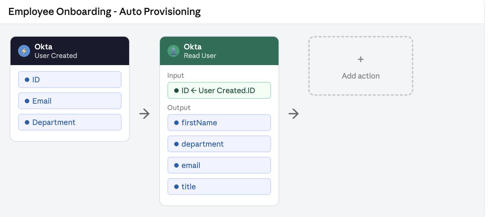
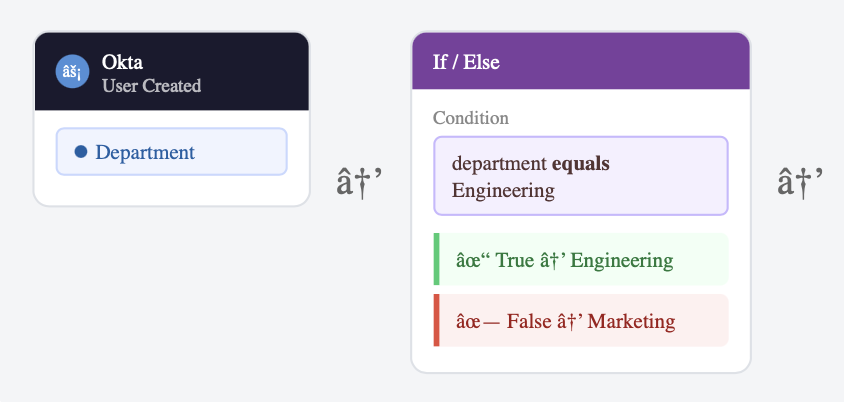
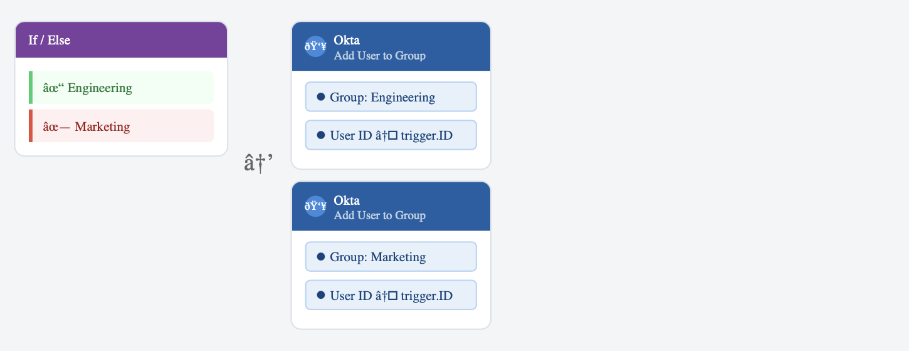
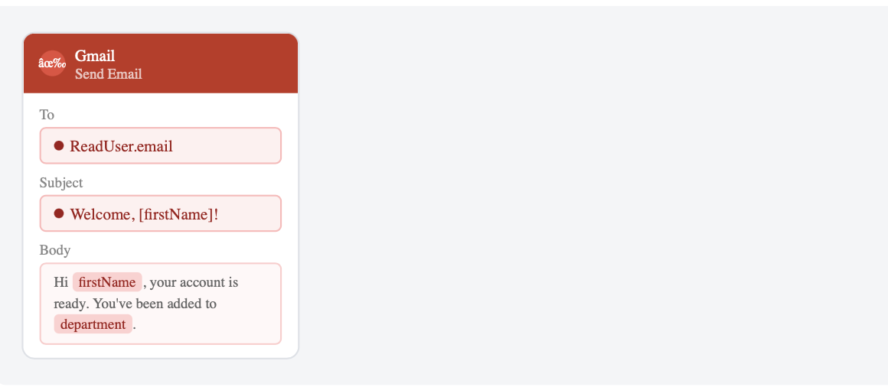
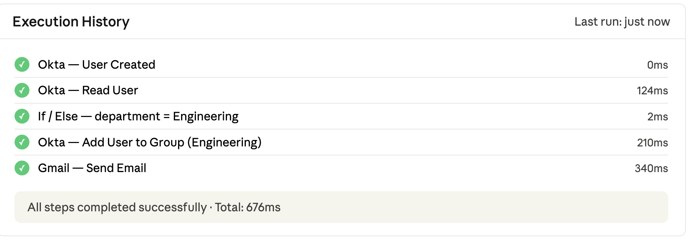

# 05 · Okta Workflows — Employee Onboarding

---

## Why this matters

Onboarding a new employee sounds simple give them an account and access to the tools they need. In reality, it's a choreography of tasks across HR, IT, and multiple SaaS platforms. Done manually, it takes days, introduces mistakes, and creates security gaps (an account created but never properly configured is a liability).

Okta Workflows lets you automate that choreography without writing code. This lab builds a real onboarding flow: when a new user is created in Okta, they're automatically added to the right groups, provisioned in Slack and Google Workspace, sent a welcome email, and logged in a tracking sheet. What used to take an IT person half a day now happens in seconds.

---

## Architecture

---

## Prerequisites

- Okta org with Workflows enabled
- Slack workspace (admin access)
- Google Workspace or Gmail account for testing
- Basic understanding of if/then logic

---

## Lab Walkthrough

### Step 1 · Open Okta Workflows console

Navigate to **Workflow → Workflows Console** from the Okta Admin sidebar. This is a separate, visual no-code environment.

*The Workflows console is separate from the Admin Console it's designed for automation builders, not just Okta admins.*

---

### Step 2 · Create a new flow and set the trigger

Click **New Flow** and select the trigger **User → Created**. This tells Okta to start this flow whenever a new user is added to the directory.

*Triggers are the "when" there are dozens of Okta events you can trigger from, including group changes, password resets, and MFA enrollments.*

---

### Step 3 · Read the user's profile attributes

Add a **Get User** card to pull the full user profile. Map the `department` and `title` fields you'll use these to branch the flow.

*Okta Workflows uses a card-based visual builder each card is a step, and you drag connections between output fields and input fields.*

---

### Step 4 · Add conditional branching by department

Use an **If/Else** card to route users to different group assignments based on their `department` value.

*The branching logic here is what saves hours of manual IT work a single flow handles every new hire regardless of their team.*

---

### Step 5 · Add the user to the appropriate Okta group

Under each branch, add an **Okta → Add User to Group** card. Select the group that corresponds to each department.

*Group membership drives app assignments, by adding a user to the right group, their app provisioning cascades automatically.*

---

### Step 6 · Connect to Slack and provision the user

Add a **Slack → Create User** card (using an existing Slack connection). Map the Okta user's email to the Slack invitation field.

*Okta Workflows has pre-built connectors for 100+ apps, no API documentation needed, just authorize the connection and pick the action.*

---

### Step 7 · Send a welcome email

Add a **Gmail → Send Email** card. Use the user's `firstName` and `email` from the trigger to personalize the message.

*Dynamic field references (shown in blue bubbles) pull values from earlier cards — the email body auto-fills with the actual user's name.*

---

### Step 8 · Test the flow with a new user

Click **Test** in the Workflows console, create a test user in Okta, and watch the flow execute card by card. Check the execution log for any errors.

*The execution log is your best friend for debugging, each card shows inputs, outputs, and any error messages with full detail.*

---

## What I Learned

- **Error handling matters more than the happy path.** A flow that provisions Slack but then fails on Google Workspace leaves the user in a partial state. Add error branches and notifications for failures.
- The drag-and-drop mapping can be finicky. I spent time figuring out that you need to hover precisely over an output field to get the connection handle to appear.
- **Flow versions** exist but aren't immediately obvious. Before testing destructive changes, duplicate your flow.
- Okta Workflows is genuinely no-code for most tasks, but complex logic (loops, complex string manipulation) benefits from the built-in **Functions** library.

---

## Real-World Applications

- Full new-hire provisioning: HRIS triggers Okta, Okta triggers provisioning across all company apps in under 60 seconds
- Contractor lifecycle management: auto-deprovision accounts on the contract end date without any manual IT action
- Department transfer: detect a user's `department` change in Okta and automatically adjust group memberships, Slack channels, and app access

---

## Resources

- [Okta Workflows documentation](https://help.okta.com/wf/en-us/content/topics/workflows/workflows-main.htm)
- [Okta Workflows connector library](https://www.okta.com/integrations/?category=okta-workflows)
- [Building your first Okta Workflow](https://developer.okta.com/blog/2021/10/15/okta-workflows)

