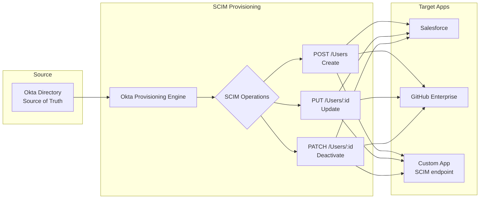
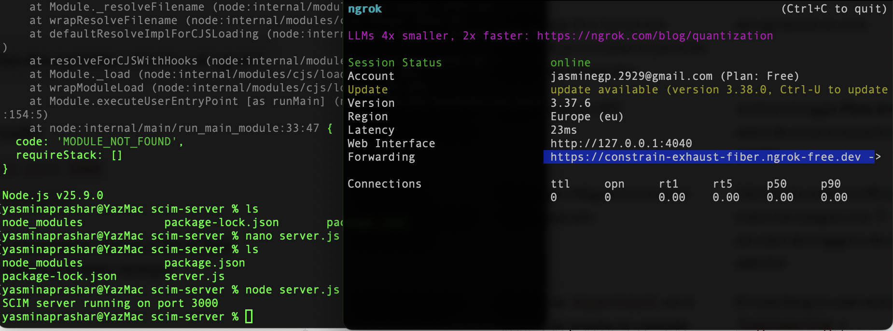
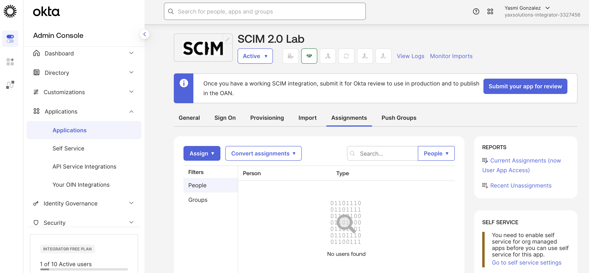
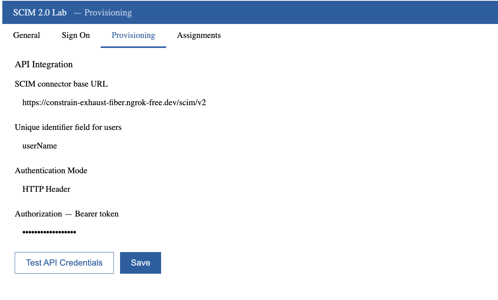
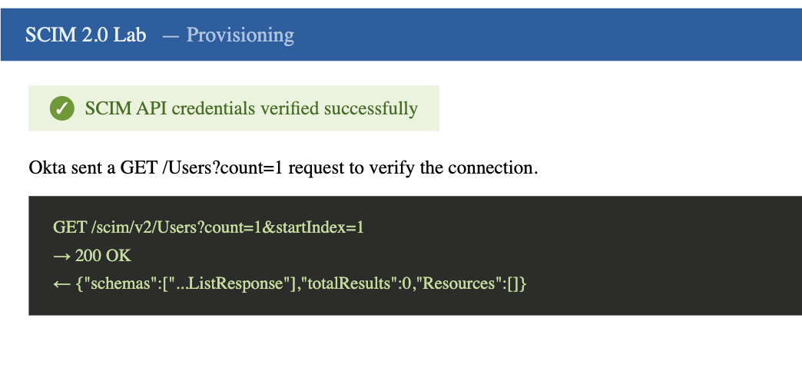
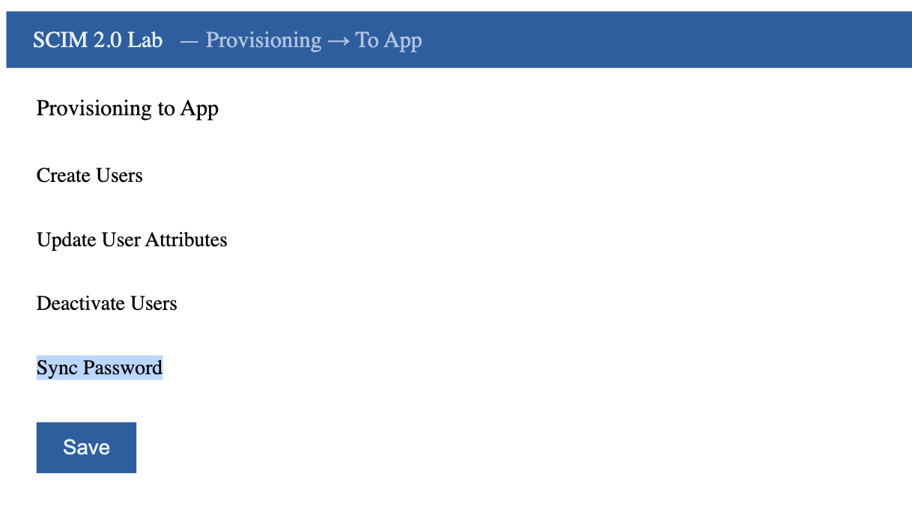
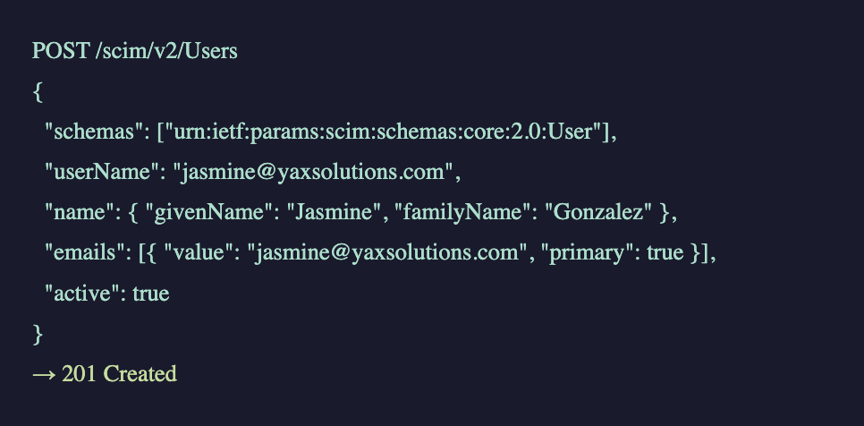
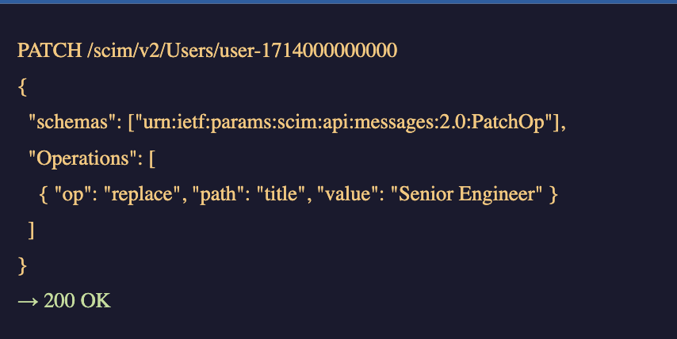
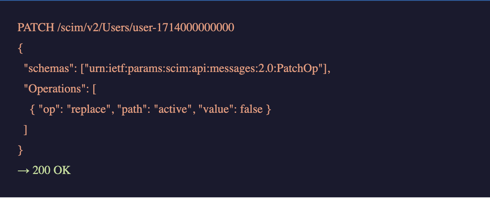

# 06 · SCIM 2.0 Provisioning

---

## Why this matters

Single Sign-On solves authentication. But what about the full lifecycle of a user account creation, updates, and deactivation across every app the company uses? Without automated provisioning, IT manually creates accounts in Salesforce, GitHub, Jira, and a dozen other tools every time someone joins. And when someone leaves, those accounts often aren't removed for weeks.

SCIM (System for Cross-domain Identity Management) is the protocol that solves this. Okta acts as the provisioning engine it pushes creates, updates, and deactivations to any app that speaks SCIM. This lab implements SCIM provisioning end-to-end, including a custom SCIM 2.0 endpoint, so you understand what's happening under the hood when Okta provisions to real apps.

---

## Architecture

---

## SCIM Operations Covered

| Operation | HTTP Method | Okta trigger | What happens |
|---|---|---|---|
| Create user | `POST /Users` | User assigned to app | Account created in target app |
| Update user | `PUT /Users/{id}` | Profile attribute changes | Attributes synced to app |
| Deactivate user | `PATCH /Users/{id}` | User removed from app / deactivated | Account disabled in app |
| Import users | `GET /Users` | Manual import | Existing accounts linked to Okta |

---

## Prerequisites

- Okta org with provisioning features enabled
- A SCIM test server (this lab uses [SCIMulate](https://scimulate.com) or a local mock)
- Postman or similar REST client for debugging
- Familiarity with REST APIs and JSON

---

## Lab Walkthrough

### Step 1 · Set up a SCIM 2.0 test endpoint

For this lab, deploy a simple SCIM server that logs requests and returns valid responses. You can use an existing SCIM mock or the lightweight Node.js SCIM server in this repo's `/scim-server` folder.

*Running your own SCIM server is the fastest way to understand the protocol you see exactly what Okta sends and what your app needs to return.*

---

### Step 2 · Create a custom app integration in Okta

In **Applications → Create App Integration**, choose **SWA** or use the Okta Integration Network search. For a custom SCIM app, go to **Applications → Browse App Catalog → Create New App → SCIM 2.0**.

*Real apps in the Okta Integration Network (Salesforce, GitHub, etc.) have pre-built SCIM connectors but understanding the raw protocol makes debugging much easier.*

---

### Step 3 · Configure the SCIM provisioning connection

Under the app's **Provisioning** tab, enable provisioning and enter your SCIM endpoint URL and authentication token.

*Okta supports both Bearer token and OAuth 2.0 authentication for SCIM connections Bearer token is simpler for testing, OAuth 2.0 for production.*

---

### Step 4 · Test the SCIM connection

Click **Test API Credentials** Okta will send a `GET /Users?count=1` request to verify the connection is working.

*If this fails, check the ngrok/tunnel URL is active and that your server returns the correct `application/scim+json` content type.*

---

### Step 5 · Enable provisioning features

Under **Provisioning → To App**, enable **Create Users**, **Update User Attributes**, and **Deactivate Users**.

*Each feature maps to a SCIM operation, you can enable them selectively based on what your target app supports.*

---

### Step 6 · Assign a user and watch the SCIM POST

Assign a test user to the app. Watch your SCIM server's logs Okta will immediately send a `POST /Users` request with the user's profile.

*The SCIM payload includes the user's Okta profile attributes mapped to SCIM standard attributes like `userName`, `name.givenName`, and `emails`.*

---

### Step 7 · Update a user attribute and observe the PATCH

Change the test user's `title` in Okta. Your SCIM server should receive a `PATCH /Users/{id}` request with just the changed attribute.

*SCIM uses PATCH for partial updates only changed attributes are sent, not the full profile. This is more efficient than PUT for large user objects.*

---

### Step 8 · Deactivate the user and verify SCIM PATCH

Remove the user from the app or deactivate them in Okta. Confirm a `PATCH /Users/{id}` is sent with `"active": false`.

*SCIM deactivation doesn't delete the account in the target app, it sets active=false, which most apps interpret as a disabled state.*

---

## What I Learned

**SCIM es el protocolo que hace que el lifecycle management sea escalable.** Sin SCIM, cada app tiene su propia API con su propio formato el equipo de IT tiene que escribir integraciones custom para cada una. Con SCIM, todas las apps hablan el mismo idioma. Okta envía un `POST /Users` para crear, un `PATCH /Users/{id}` para actualizar, y otro `PATCH` con `"active": false` para desactivar. Una vez entiendes el patrón, se aplica igual a Salesforce, GitHub, Slack o cualquier app con SCIM support.

**La diferencia entre POST y PATCH en SCIM es importante.** `POST /Users` crea un usuario nuevo y devuelve un `id` que Okta almacena para futuras operaciones. `PATCH /Users/{id}` actualiza solo los atributos que cambiaron no el perfil completo. Esto es más eficiente que PUT (que envía todo el objeto) y tiene implicaciones reales en producción: si tu app maneja miles de usuarios, PATCH reduce significativamente el tráfico y el procesamiento.

**Okta no elimina usuarios en el sistema destino los desactiva.** El PATCH de deactivation envía `"active": false`, no un DELETE. Esto es intencional SCIM asume que los datos del usuario tienen valor histórico (logs, auditoría, registros). La decisión de borrar definitivamente es de la app destino, no del IdP. En producción, muchas empresas nunca borran cuentas por esta razón.

**El campo `id` que devuelve tu servidor es crítico.** Cuando Okta recibe el `201 Created` del POST, extrae el `id` del response y lo almacena. Todos los PATCHs futuros usarán ese `id`. Si tu servidor devuelve un `id` inconsistente o no lo incluye, Okta perderá el tracking del usuario y las actualizaciones fallarán.

**El `content-type: application/scim+json` no es opcional.** Okta verifica que el servidor responda con el content type correcto. Un servidor que devuelve `application/json` puede funcionar en testing pero fallar en producción dependiendo de la versión del conector. El header correcto es parte del estándar RFC 7644.

**ngrok free tiene limitaciones reales para webhooks.** En un entorno de producción o con licencia, el túnel es transparente. En el plan gratuito, ngrok intercepta requests programáticas con una pantalla de verificación. Esto es una limitación del entorno de lab, no del protocolo SCIM en producción el servidor SCIM tendría un dominio propio con certificado TLS válido.

---

## Troubleshooting

| Error | Causa | Fix |
|---|---|---|
| `Error authenticating: Unauthorized` | El Bearer token en Okta no coincide con el que valida el servidor | Verificar que el token en Okta Admin Console y en el servidor son exactamente iguales — sin espacios extra |
| `Invalid JSON received from the SCIM server` | El servidor devuelve texto plano o HTML en vez de JSON | Verificar que el `Content-Type` del response es `application/scim+json` y que el body es JSON válido |
| `Test API Credentials` falla con timeout | ngrok no está corriendo o la URL cambió | Reiniciar ngrok y actualizar la SCIM Base URL en Okta con la nueva URL |
| Usuario asignado pero no aparece en el servidor | La feature `Create Users` no está habilitada en Provisioning → To App | Admin Console → app → Provisioning → To App → activar Create Users |
| PATCH de atributo no llega al servidor | El atributo no está mapeado en el profile mapping de Okta | Admin Console → app → Provisioning → Attribute Mappings → verificar el mapeo del atributo |
| `302 Found` en lugar de JSON | ngrok free intercepta la request con pantalla de verificación | Usar ngrok con authtoken configurado o un servidor con dominio propio |
| El `id` del usuario se pierde entre sesiones | El servidor no persiste el `id` devuelto en el POST | Usar una base de datos o almacenamiento en memoria persistente en el servidor SCIM |

---

---

## Real-World Applications

- Automating GitHub Enterprise seat management users appear in GitHub the moment they join the Engineering group in Okta
- Ensuring deprovisioned employees can't access Salesforce within seconds of their last day, without any IT manual action
- Synchronizing user profile updates (name changes, department changes) across all SaaS apps automatically

---

## Resources

- [SCIM 2.0 specification (RFC 7644)](https://datatracker.ietf.org/doc/html/rfc7644)
- [Okta SCIM provisioning overview](https://developer.okta.com/docs/concepts/scim/)
- [Building a SCIM server for Okta](https://developer.okta.com/docs/guides/scim-provisioning-integration-overview/)

