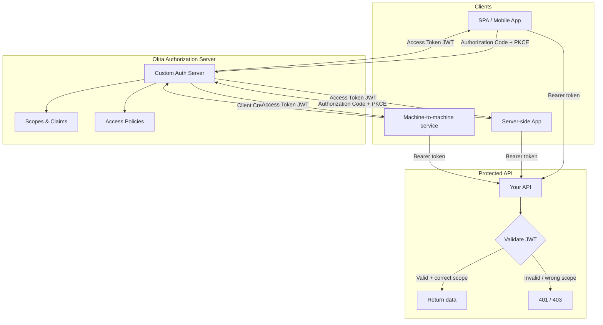
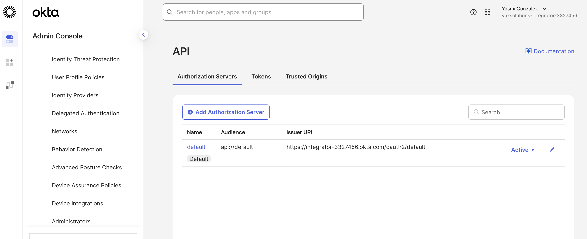
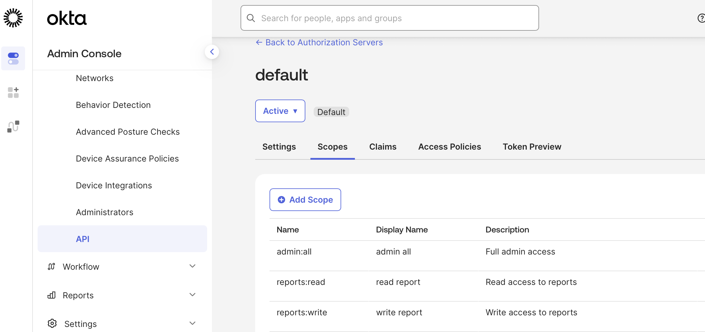
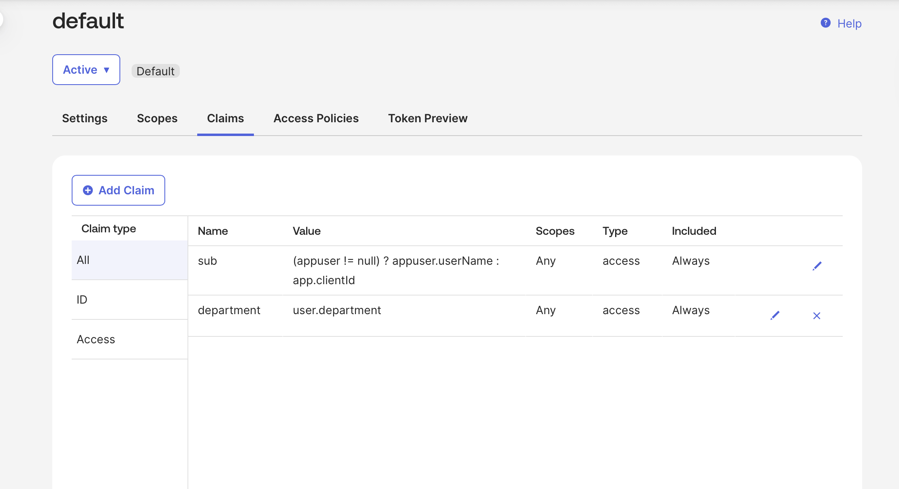
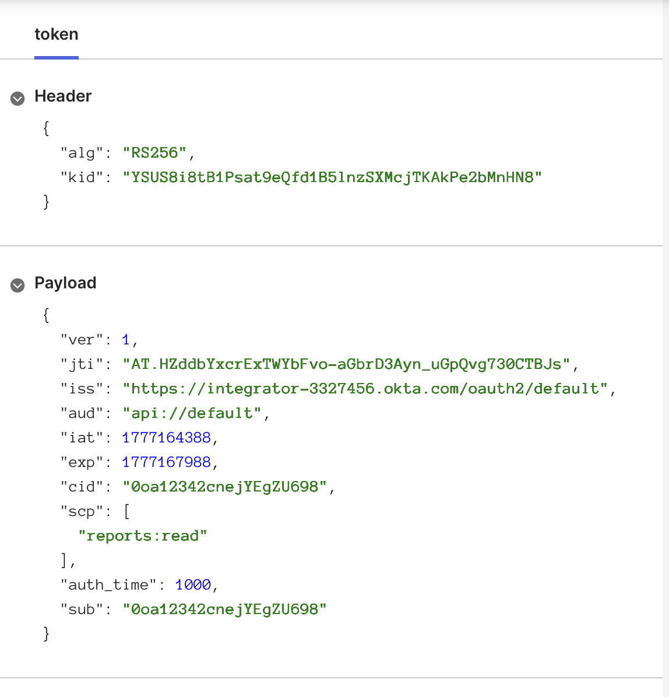
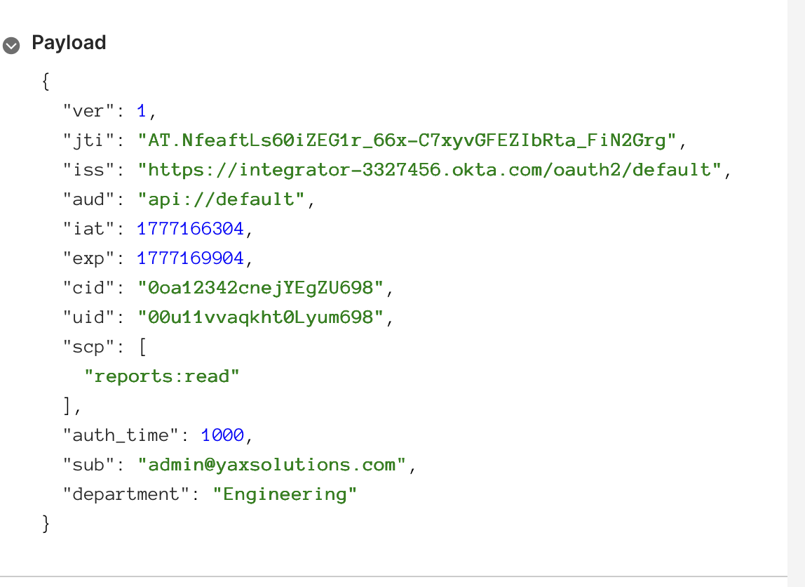
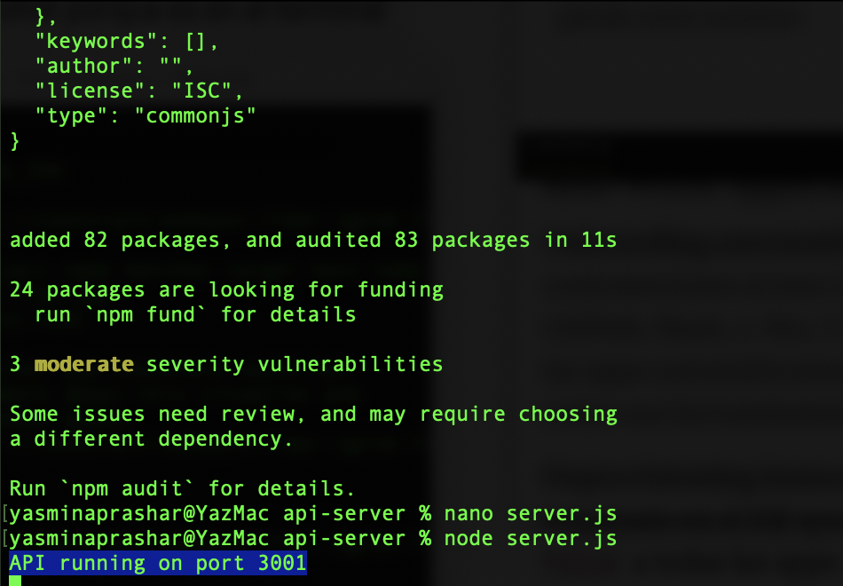
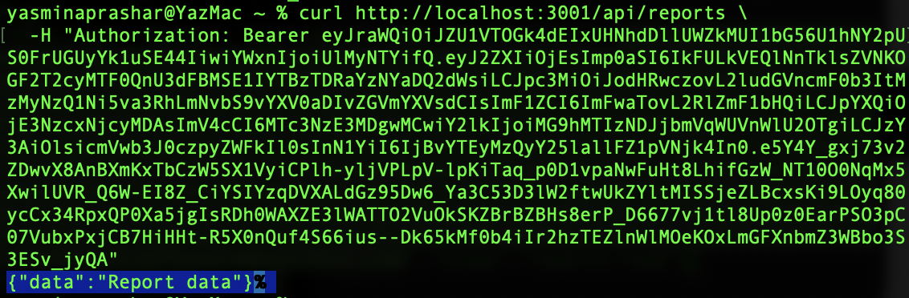

# 07 · API Access Management

---

## Why this matters

Modern applications are a mesh of APIs. A mobile app calls a backend. A backend calls third-party services. Microservices call each other. Every one of those calls needs to be authorized not just authenticated. Who is calling? What are they allowed to do? Does this token give them permission for *this specific resource*?

Okta API Access Management extends OAuth 2.0 with a fully configurable authorization server. You define the scopes (what actions mean), claims (what's in the token), and policies (who gets what). Your APIs then validate the tokens without calling Okta on every request. This lab implements the full pattern end-to-end: issue tokens, restrict access by scope, and validate tokens in a real API.

---

## Architecture

---

## Prerequisites

- Okta org with API Access Management enabled (requires paid tier or Developer edition)
- Basic API built in Node.js / Express (sample in `/api` folder)
- Postman for testing token flows
- Understanding of OAuth 2.0 scopes and JWT structure

---

## Lab Walkthrough

### Step 1 · Create a custom authorization server

Navigate to **Security → API → Authorization Servers** and click **Add Authorization Server**. Set the audience to your API's base URL (e.g., `https://api.yourcompany.com`).

*Okta provides a built-in "default" auth server, but custom auth servers let you define distinct audiences, scopes, and policies per API — essential for multi-API environments.*

---

### Step 2 · Define scopes for your API

Under the auth server's **Scopes** tab, create scopes that represent what clients can do with your API (e.g., `reports:read`, `reports:write`, `admin:all`).

*Scopes are what clients *request* they're not what users can do. Policies (next step) control which clients can actually get which scopes.*

---

### Step 3 · Create access policies and rules

Under **Access Policies**, create a policy that applies to your registered application. Add a rule that grants `reports:read` to regular users and `admin:all` only to users in the Admins group.

*This is where Okta's real power shows the same authorization server, same app, but different users get different scopes based on their group membership.*

---

### Step 4 · Add custom claims to the access token

Under **Claims**, add a custom claim called `department` with a value mapped from the user's Okta profile. Set it to appear in the **Access Token** only.

*Adding claims to the token means your API doesn't need to query Okta on every request — all the authorization context travels in the JWT itself.*

---

### Step 5 · Get a token using Postman

Use the **Authorization Code + PKCE** flow in Postman to request a token from your custom auth server. Include the scope `reports:read` in the request.

*PKCE (Proof Key for Code Exchange) prevents authorization code interception attacks — use it for any public client (SPA, mobile app).*

---

### Step 6 · Inspect the token at jwt.io

Paste the access token into [jwt.io](https://jwt.io) and inspect the payload. Confirm the `scp` claim contains your requested scope and the custom `department` claim is present.

*The `aud` claim in the token must match the audience your API is configured to accept — a common source of 401 errors.*

---

### Step 7 · Protect your API with token validation

In your Express API, add the `@okta/jwt-verifier` middleware to validate the token signature and check scopes on protected routes.

*Your API validates the token locally using Okta's public JWKS (JSON Web Key Set) no Okta network call on every request, just a cryptographic signature verification.*

---

### Step 8 · Test scope enforcement

Call the API with a token that has `reports:
- read` it should succeed on GET endpoints. Then try a POST endpoint that requires `reports: write` it should return 403.

*Granular scope enforcement at the route level is the difference between "authenticated" (who you are) and "authorized" (what you can do).*

---

## What I Learned

- The **audience (`aud`) claim** must match exactly between what the auth server issues and what your API expects. This tripped me up for a while a trailing slash difference caused 401s until I aligned them.
- Okta's **token introspection endpoint** is useful for opaque tokens, but for JWTs, local validation is faster and doesn't create a dependency on Okta being up.
- **Client credentials flow** (machine-to-machine) uses no user context the client itself authenticates. Good for service accounts and scheduled jobs.
- Scopes should model *actions*, not *resources*. `reports:read` is better than `GET:/api/reports` the former is portable, the latter is implementation-coupled.

---
## Troubleshooting

| Error | Causa | Fix |
|---|---|---|
| `400 Bad Request` al hacer GET al authorize endpoint directamente | El endpoint `/v1/authorize` no acepta GET directo sin parámetros OAuth — necesita un flujo completo | Usar el tab Authorization de Postman con OAuth 2.0 configurado, no llamar al endpoint directamente |
| `invalid 'state' parameter` en Postman desktop con orgs Integrator | Bug conocido entre Postman desktop y las orgs Integrator de Okta — el state parameter se corrompe en el handshake | Usar Postman Web (`web.postman.co`) en vez de la app desktop, o usar curl directamente |
| `Authentication window was closed` en Postman | El Callback URL estaba vacío — Postman no sabía a dónde redirigir después del login | Añadir `https://oauth.pstmn.io/v1/callback` en el campo Callback URL de Postman Y en los Sign-in redirect URIs de la app en Okta |
| `redirect_uri parameter must be a Login redirect URI` | La URI de Postman no estaba registrada en la app de Okta | Admin Console → app → General → Edit → añadir `https://oauth.pstmn.io/v1/callback` en Sign-in redirect URIs |
| `unauthorized_client — Configured grant types: [refresh_token, authorization_code]` | La app no tenía el grant type Client Credentials habilitado | Admin Console → app → General → Edit → activar Client Credentials en la sección Grant type |
| `invalid_client — The client secret supplied for a confidential client is invalid` | El Client Secret se estaba copiando incompleto o con espacios | Usar el flag `-u "client_id:client_secret"` en curl en vez de `-d "client_secret=..."` — Basic Auth maneja los caracteres especiales correctamente |
| `{"error":"Invalid token"}` al llamar al API con el token del Token Preview | El Token Preview de Okta genera tokens de preview que no son válidos para llamadas reales a APIs | Obtener un token real con curl usando el endpoint `/v1/token` con Client Credentials |
| `{"error":"Invalid token"}` al pegar el JSON completo como Bearer token | Se pegó el response JSON entero en vez de solo el valor de `access_token` | Guardar el token en una variable bash: `TOKEN="eyJ..."` y usar `Authorization: Bearer $TOKEN` |
| Custom claim `department` no aparece en el token | Con Client Credentials flow no hay usuario asociado — `user.department` no tiene valor | Usar Authorization Code flow en el Token Preview, o añadir el atributo `department` al perfil del usuario en Directory → People → Edit |
| `3 moderate severity vulnerabilities` al instalar `@okta/jwt-verifier` | Vulnerabilidades conocidas en dependencias transitivas del paquete | Son warnings de desarrollo, no errores — el paquete funciona correctamente para labs y entornos de testing |

---
## Real-World Applications

- A multi-tenant SaaS API issuing tenant-scoped tokens so customers can only access their own data
- Microservices authorizing inter-service calls using client credentials without user context
- A mobile app requesting only `profile:read` initially, then asking for `payments:write` only when the user reaches the checkout screen (incremental authorization)

---

## Resources

- [Okta API Access Management overview](https://developer.okta.com/docs/concepts/api-access-management/)
- [Custom authorization servers](https://developer.okta.com/docs/guides/customize-authz-server/)
- [Validate JWTs in Node.js with Okta](https://developer.okta.com/code/nodejs/jwt-validation/)

