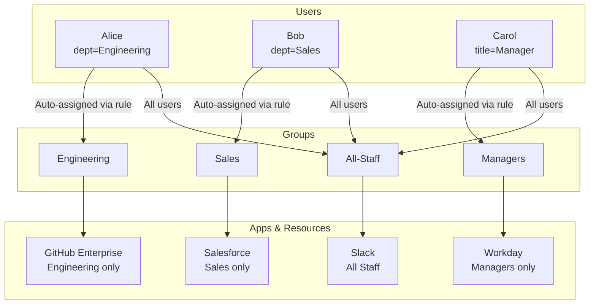
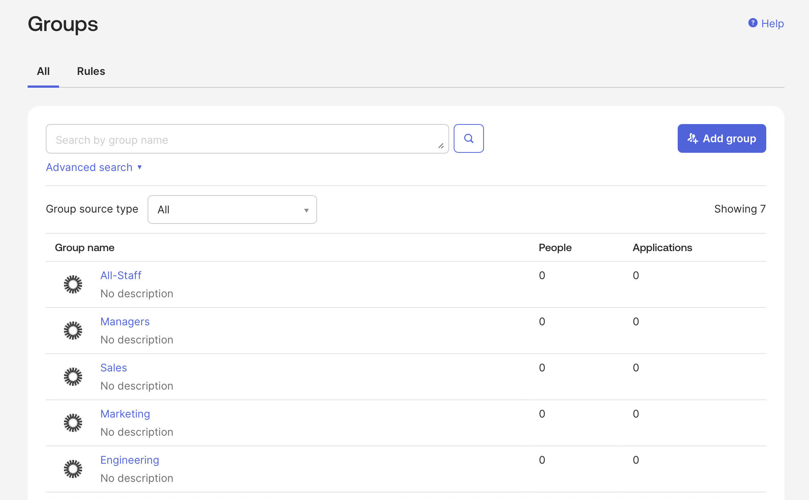
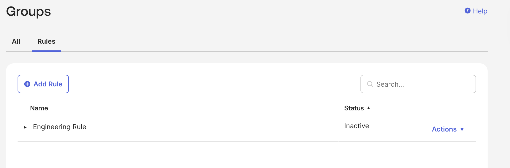
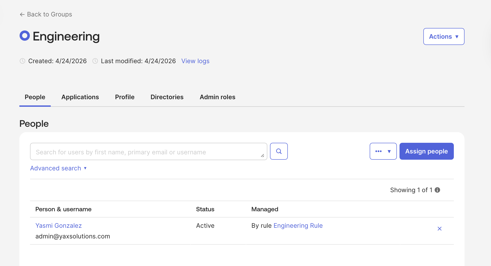
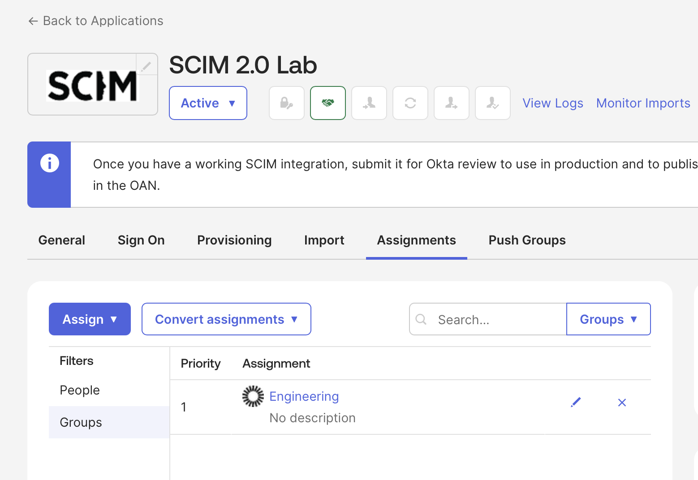
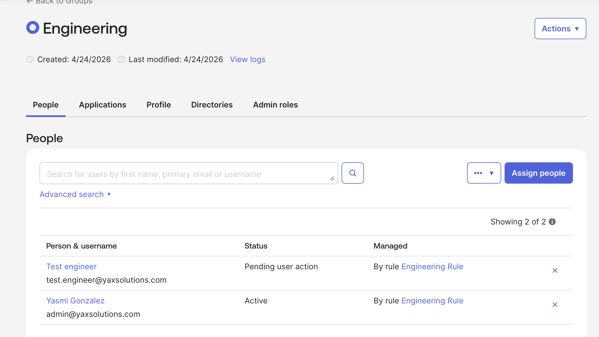
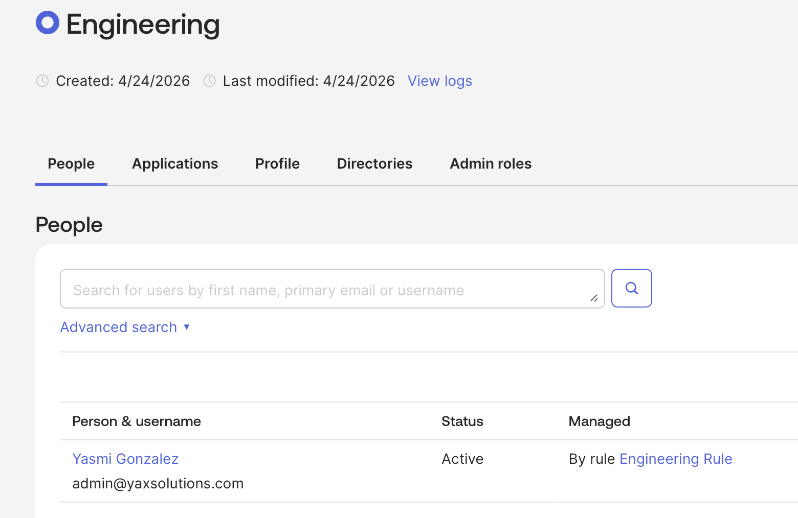
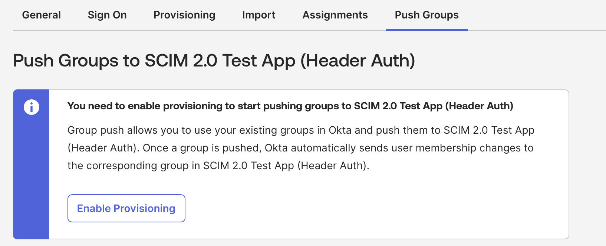
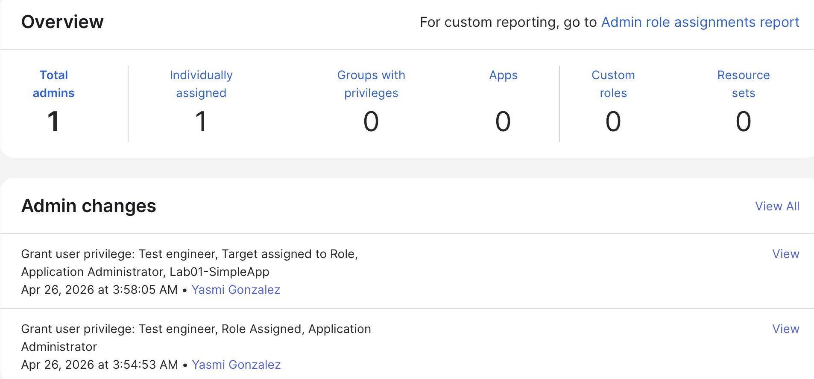

# 08 · Groups & Role-Based Access Control (RBAC)

---

## Why this matters

Access control is the beating heart of any identity program. Who can see what, and who decides? Without a structured approach, you end up with ad-hoc permissions granted by managers via email, service desk tickets, and tribal knowledge. Security audits become nightmares. New starters wait days for access. When someone leaves, access lingers.

RBAC with Okta Groups brings structure: roles are modeled as groups, groups are assigned to apps and resources, and users get the right access simply by being in the right groups. This lab builds a real RBAC model defining roles, creating group rules that auto-assign users based on attributes, and verifying that access follows the model consistently.

---

## Architecture

---

## Prerequisites

- Okta org with multiple test users
- Test users with different `department` and `title` profile attributes
- At least two app integrations from previous labs

---

## Lab Walkthrough

### Step 1 · Create the base group structure

Navigate to **Directory → Groups** and create the groups that represent your RBAC roles: `Engineering`, `Sales`, `Managers`, `All-Staff`.

*Keep group names clear and consistent a naming convention like `APP-ROLE` (e.g., `GitHub-ReadOnly`) scales better than generic names as the org grows.*

---

### Step 2 · Create group rules for automatic assignment

Go to **Directory → Groups → Rules** and create a rule: *If user's `department` equals `Engineering`, add to group `Engineering`.*

*Group rules run on a schedule and evaluate when users are created or updated attributes from Okta's Universal Directory drive automatic group membership.*

---

### Step 3 · Verify rule evaluation and membership

After activating the rule, click **Preview** to see which existing users would be added. Then activate and let Okta evaluate.

*The preview mode is invaluable always preview before activating a rule that could affect thousands of users.*

---

### Step 4 · Assign apps to groups

Open each app's **Assignments** tab and assign the corresponding group. The Engineering group gets GitHub; Sales gets Salesforce; Managers get Workday; All-Staff gets Slack.

*Group-based app assignment means adding a new employee to the right group is all it takes app provisioning cascades from that single action.*

---

### Step 5 · Test with a newly-created user

Create a test user with `department = Engineering`. Confirm they are automatically added to the Engineering group (via rule) and provisioned in GitHub.

*This is the payoff no manual action from IT, no service desk ticket. The user has exactly the right access based on their profile.*

---

### Step 6 · Test access revocation

Change the test user's `department` to `Sales`. Within the rule evaluation window, confirm they are removed from Engineering and added to Sales, with app assignments updating accordingly.

*Access updates trigger automatically on attribute change this is how RBAC prevents stale permissions when people change roles.*

---

### Step 7 · Configure group push to downstream apps

For apps that support group push (e.g., Salesforce via SCIM), configure **Push Groups** to sync Okta groups to the app's internal group/role system.

*Group push extends RBAC into the apps themselves a Salesforce user's profile and role in Salesforce can be controlled entirely from Okta.*

---

### Step 8 · Review admin roles and separation of duties

Under **Security → Administrators**, review Okta's built-in admin roles (Super Admin, App Admin, Read-Only Admin). Assign the App Admin role to a test admin scoped to specific apps only.

*Least-privilege applies to admins too an app owner shouldn't need Super Admin rights just to manage their own app's assignments.*

---

## What I Learned

**RBAC en Okta no es solo organización es automatización.** Sin group rules, añadir un nuevo empleado requiere asignarlo manualmente a cada app. Con group rules basadas en atributos de perfil, el proceso es: HR crea al empleado con el `department` correcto → Okta lo añade al grupo → el grupo tiene las apps asignadas → el empleado tiene acceso. Cero intervención de IT.

**Los group rules evalúan atributos, no identidades individuales.** Una regla que dice "si `department` = Engineering → añadir a grupo Engineering" se evalúa para todos los usuarios existentes y futuros. Cambiar el departamento de un usuario en Okta dispara una re-evaluación automática esto es lo que hace que RBAC sea dinámico en vez de estático.

**La preview antes de activar una rule es crítica en producción.** Una rule mal configurada puede añadir o quitar acceso a miles de usuarios en segundos. El modo Preview muestra exactamente qué usuarios serían afectados antes de activar en un entorno de producción con 10,000 empleados, nunca actives una rule sin revisar el preview primero.

**La asignación de apps a grupos es más escalable que la asignación individual.** Asignar apps usuario por usuario no escala con 500 empleados nuevos al mes es inviable. Asignar la app al grupo significa que el acceso de todos los miembros actuales y futuros está controlado por una sola configuración. Añadir un empleado al grupo correcto es todo lo que se necesita.

**Group Push requiere una conexión SCIM activa en la app destino.** No basta con que la app soporte SCIM el provisioning tiene que estar configurado y conectado. Sin eso, el tab Push Groups muestra el mensaje "You need to enable provisioning to start pushing groups". Esta es una limitación real del plan Integrator free que se resuelve con una conexión SCIM activa.

**Least-privilege se aplica también a los admins de Okta.** Un App Admin con scope limitado a una app específica no puede ver ni modificar otras apps, usuarios, o políticas. En entornos regulados, los auditores verifican que los administradores tienen solo los permisos que necesitan Super Admin para todo el mundo es una red flag en cualquier auditoría de SOC 2.

---

## Troubleshooting

| Error | Causa | Fix |
|---|---|---|
| Group rule activada pero usuarios no asignados | La rule evalúa en el siguiente ciclo no es inmediata | Esperar hasta 1 hora o forzar la evaluación desde la rule con "Run Rule Now" si está disponible |
| Usuario en el grupo correcto pero sin acceso a la app | La app no está asignada al grupo | Admin Console → app → Assignments → verificar que el grupo aparece en la lista |
| "This app is implicitly assigned to users" en Assignments | La app tiene Federation Broker Mode activado,los assignments se gestionan por Sign-On Policy | Usar una app diferente que soporte assignments manuales (como la SCIM 2.0 Lab) |
| Group Push muestra "Enable provisioning first" | La app no tiene una conexión SCIM activa | Configurar la conexión SCIM completa antes de intentar Group Push, requiere un servidor SCIM funcional |
| Rule preview no muestra usuarios esperados | El atributo en la condición no coincide exactamente con el valor en el perfil | El matching es case-sensitive, `engineering` y `Engineering` son valores distintos |
| Cambio de departamento no mueve al usuario al nuevo grupo | La rule anterior no tiene condición de exclusión automática | Crear una rule separada para cada departamento o usar la condición "Except" para excluir usuarios del grupo anterior |
| Admin App scope no aparece en el formulario | La UI de scoped admin assignments muestra "Edit resources" en vez del scope directo | Click en el campo de Applications en la card y buscar la app por nombre para añadirla al scope |

---

## Real-World Applications

- Automatically provisioning new engineers into GitHub and Jira on their first day, just by setting their department in the HRIS
- Granting time-limited elevated group membership for a contractor project, then having it expire automatically via a Workflow
- Auditing who has access to sensitive apps by exporting group membership reports a clean RBAC model makes audits fast

---

## Resources

- [Okta Groups overview](https://help.okta.com/en-us/content/topics/users-and-groups.htm)
- [Group rules](https://help.okta.com/en-us/content/topics/users-and-groups/group-rules.htm)
- [Role-Based Access Control best practices](https://developer.okta.com/blog/2021/09/08/secure-api-access-control)

