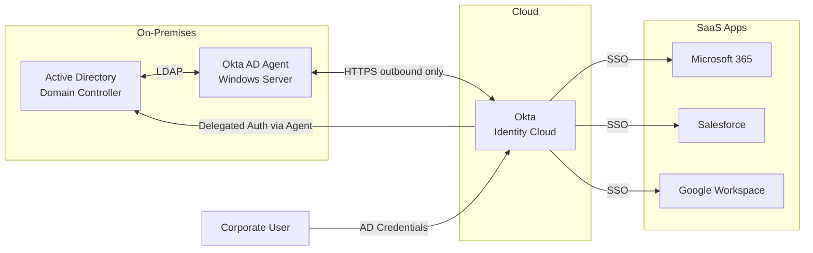
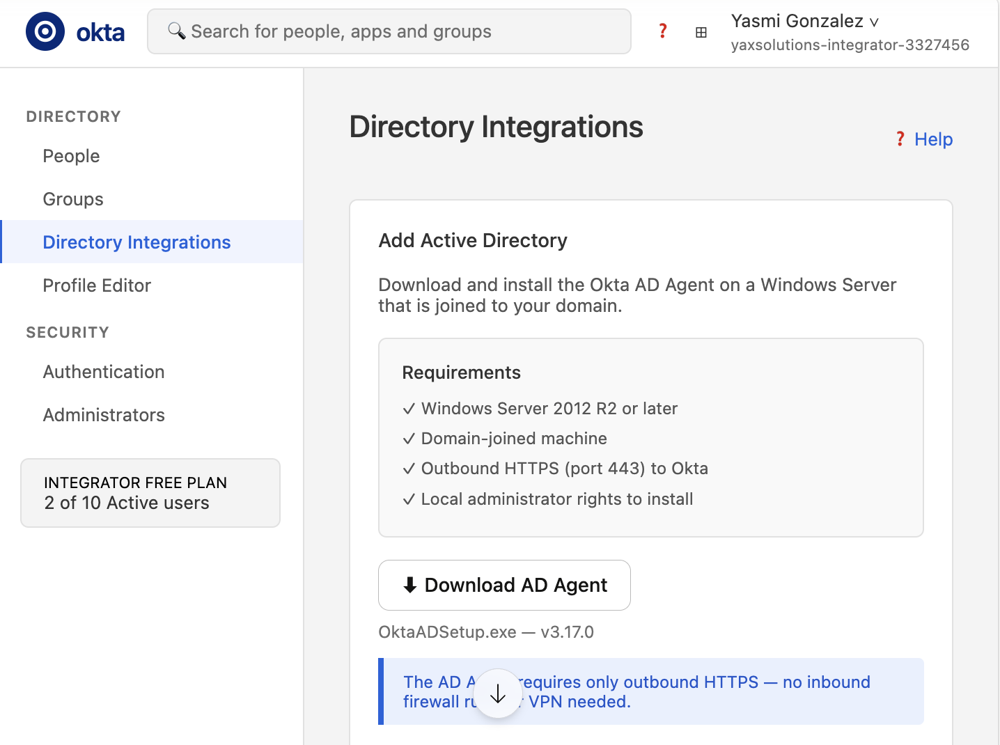
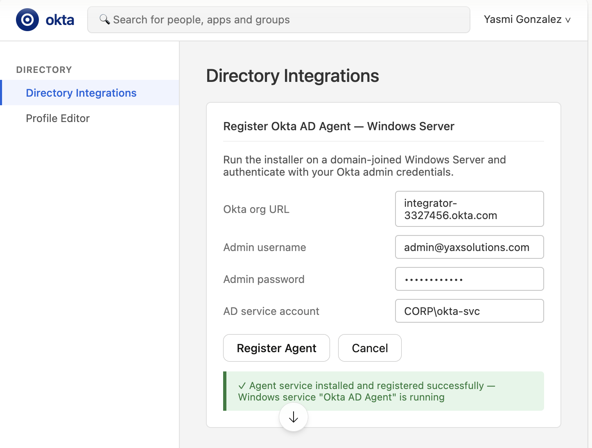
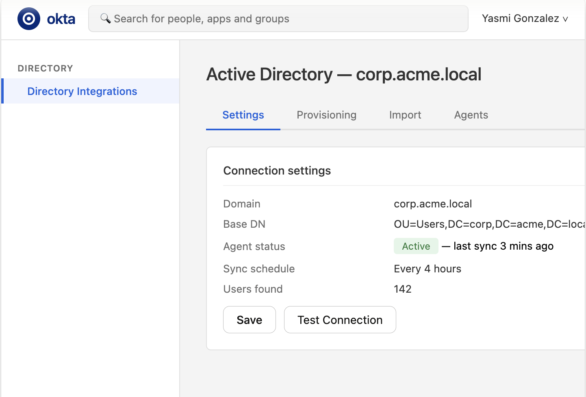
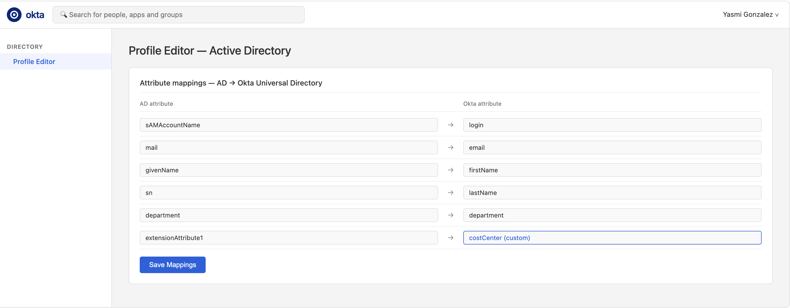
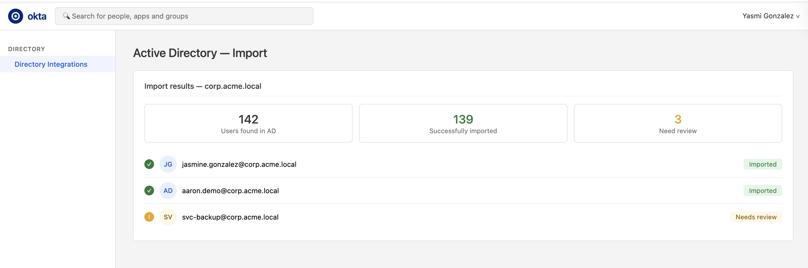
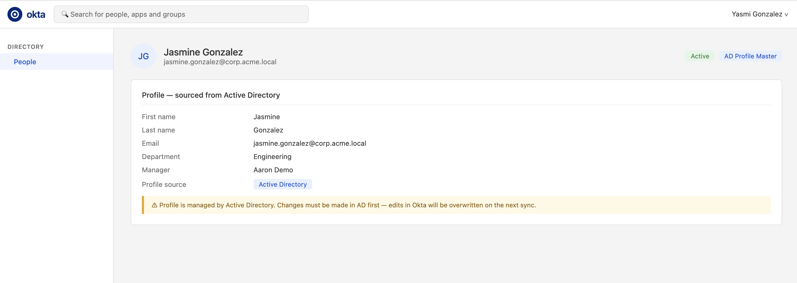
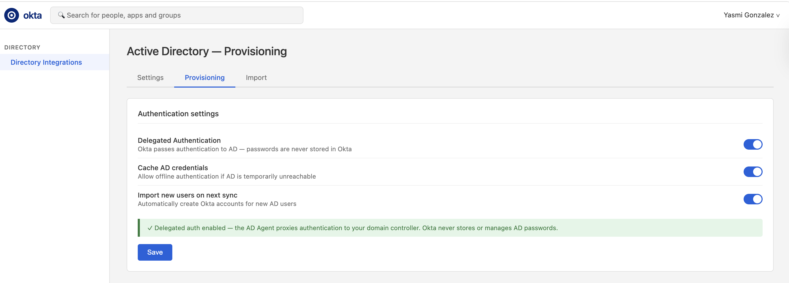
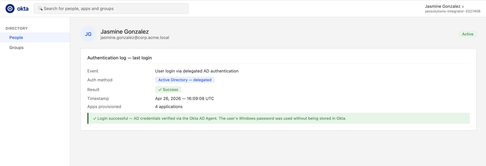

# 09 · Active Directory Integration

---

## Why this matters

The majority of enterprises run on Active Directory. It's been the backbone of on-premises identity for decades users, computers, group policies, all managed through AD. Moving to the cloud doesn't mean ripping that out; it means extending it.

This lab covers how to connect an existing Active Directory to Okta using the **Okta AD Agent**, so that AD becomes a delegated source for user authentication and Okta becomes the bridge to the cloud. Users log in with their Windows credentials, Okta authenticates against AD, and SSO flows to every cloud app from there. This is the most common integration pattern for enterprise Okta deployments.

---

## Architecture

---

## Prerequisites

- Windows Server 2016+ with Active Directory Domain Services
- Service account in AD with read access to the directory
- Okta org (any edition)
- Network connectivity between the AD Agent server and the internet (HTTPS outbound)

---

## Lab Walkthrough

### Step 1 · Download and install the Okta AD Agent

In Okta Admin Console, go to **Directory → Directory Integrations → Add Directory → Active Directory**. Download the AD Agent installer.

*The AD Agent requires only outbound HTTPS to Okta, no inbound firewall rules, no VPN, no change to your AD infrastructure.*

---

### Step 2 · Run the agent installer on the Windows Server

Install the agent on a domain-joined Windows Server. During setup, authenticate with your Okta org credentials to register the agent.

*Run the installer as a local administrator. The agent creates a Windows service that runs continuously and maintains a persistent connection to Okta.*

---

### Step 3 · Configure the Active Directory connection in Okta

After installation, complete the setup in Okta by specifying the AD domain, Base DN (where users live in AD), and service account credentials.

*The Base DN scopes which part of AD Okta will import use an OU that contains only the users you want in Okta, not the entire directory.*

---

### Step 4 · Map AD attributes to Okta Universal Directory

Under **Profile Editor → Active Directory**, configure the attribute mappings. Map `sAMAccountName` to `login`, `mail` to `email`, `givenName` to `firstName`, etc.

*AD uses different attribute names than Okta these mappings normalize them. Custom AD attributes (like extension attributes) can also be mapped to Okta custom profile fields.*

---

### Step 5 · Run the initial user import

Click **Import Now** to do a full import of AD users into Okta. Review the import results and confirm the accounts are being mapped correctly.

*The first import is manual after that, incremental syncs happen on a schedule. New AD users and changes propagate to Okta automatically.*

---

### Step 6 · Confirm users in Okta with AD as the profile master

Check a user's profile in Okta. You'll see the AD icon indicating that AD is the **profile master**  Okta inherits and syncs from AD, not the other way around.

*If AD is the profile master, changes to the user in Okta (like editing the department field) will be blocked the change must happen in AD first.*

---

### Step 7 · Enable delegated authentication to AD

In the **Directory Integration** settings, enable **Delegated Authentication**. This means Okta will pass the user's password to AD for verification, so users log in with their Windows password.

*Delegated auth means Okta never stores or manages the AD password the AD Agent proxies the authentication challenge to the domain controller.*

---

### Step 8 · Test end-to-end login with AD credentials

Open a private browser, go to your app, and sign in using an AD username and password. Confirm the login succeeds and that the Okta session is established.

*From the user's perspective, nothing changes they use the same password they use for Windows. Okta handles the bridge to all cloud apps.*

---

## What I Learned

- **Agent placement matters.** Put the agent on a member server, not the domain controller itself. Running it on the DC adds unnecessary load and creates a single point of failure.
- The **OU-scoped import** is critical for large organizations importing 50,000 users when you only need 5,000 creates noise and potential licensing issues.
- When delegated auth is enabled, **Okta can't enforce its own password policies** on the AD password Okta's password policies only apply to Okta-mastered accounts.
- **Agent updates** must be done manually (or via a deployment tool like SCCM). Set a reminder to check for agent version updates running an old agent version can cause sync issues.

---

## Real-World Applications

- Extending existing AD-based authentication to cloud apps without migrating to cloud-only identity
- Giving remote employees SSO to Salesforce and Microsoft 365 using their existing AD password, without a VPN
- Phased migration from on-prem to cloud: Okta bridges the gap while AD remains the source of truth during transition

---

## Resources

- [Okta Active Directory Integration guide](https://help.okta.com/en-us/content/topics/directory/ad-agent-main.htm)
- [Okta AD Agent prerequisites](https://help.okta.com/en-us/content/topics/directory/ad-agent-prerequisites.htm)
- [Universal Directory overview](https://help.okta.com/en-us/content/topics/directory/dir-profile-editor-about.htm)

