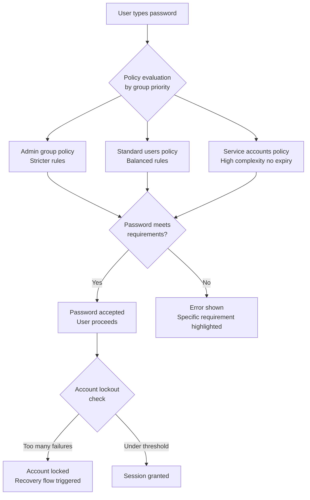
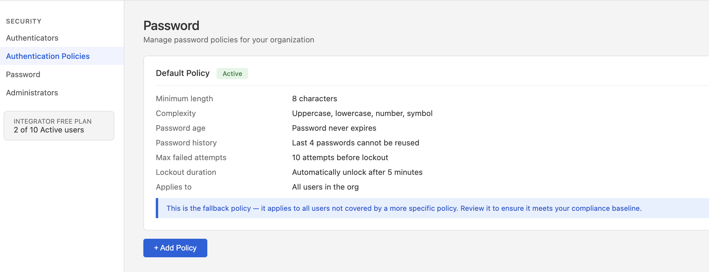
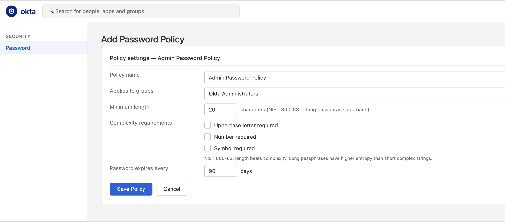
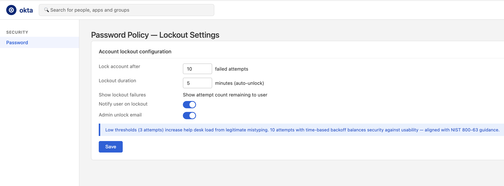
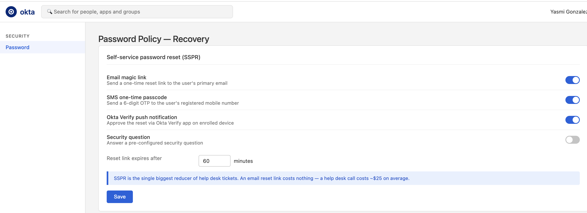
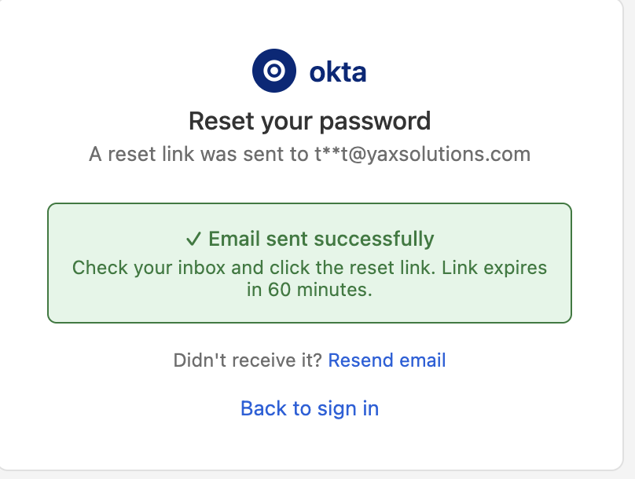
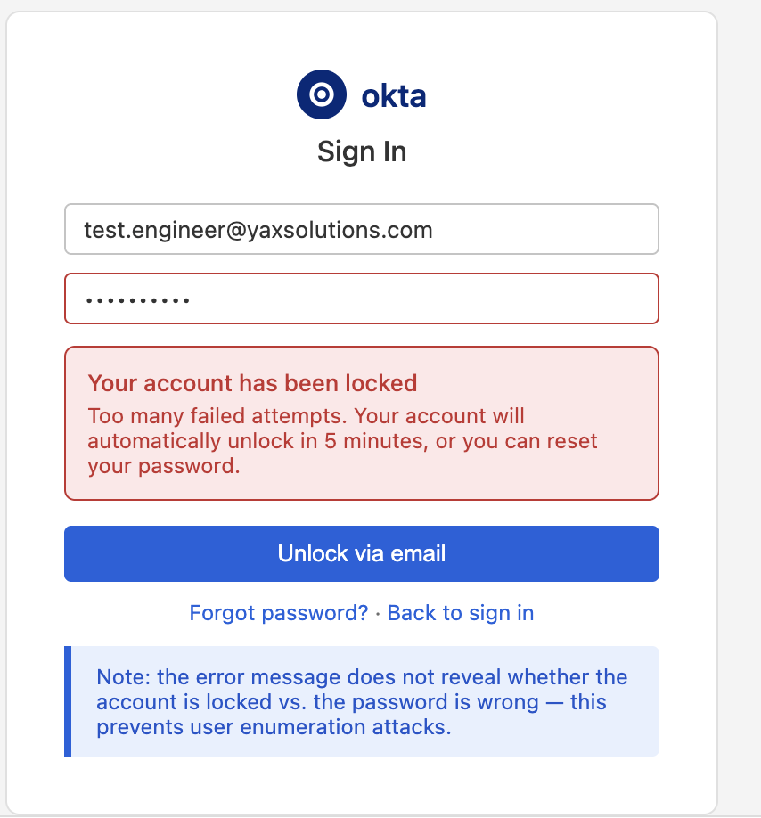
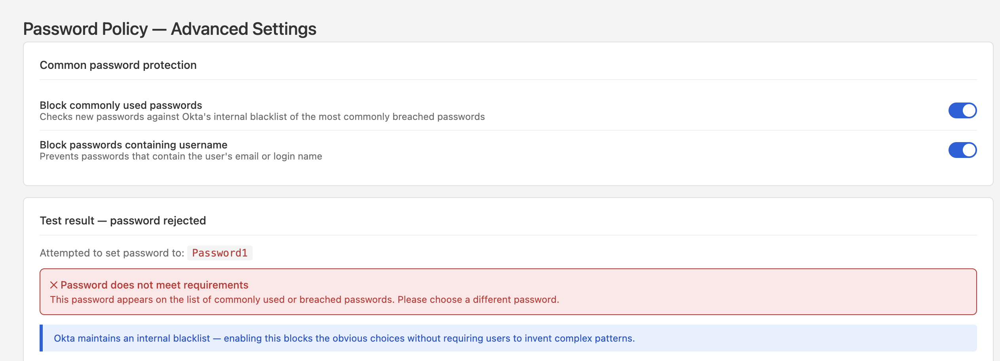
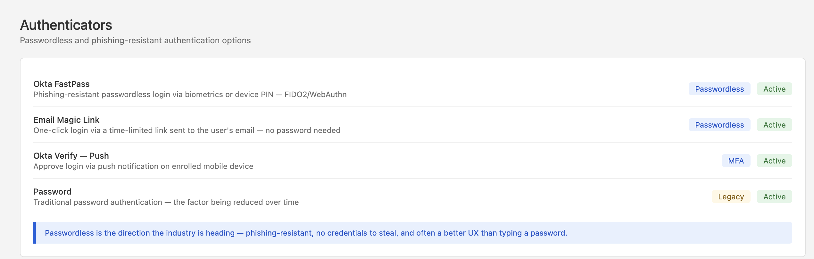

# 10 · Password Policies

---

## Why this matters

Password policies are one of those things that everyone assumes is working correctly until it isn't. Too strict and users get locked out constantly, writing passwords on sticky notes. Too loose and a credential stuffing attack succeeds. The goal is a policy that's actually secure, not just security theater that annoys users without stopping attackers.

This lab goes beyond checking boxes in a policy form. It covers how to design a layered password policy strategy in Okta: different rules for different user groups, NIST 2.0-aligned configuration (longer passphrases over complexity rules), self-service recovery flows, and account lockout settings that balance security with UX. The lab also covers the path toward passwordless how to configure Okta to gradually reduce reliance on passwords altogether.

---

## Architecture

---

## Prerequisites

- Okta org with at least three test users in different groups (Admin, Standard, Service Account)
- Email access for testing self-service password reset flows

---

## Lab Walkthrough

### Step 1 · Review the default password policy

Navigate to **Security → Authentication → Password** and review the default policy. Note the complexity requirements, minimum length, and lockout settings.

*Okta ships with sensible defaults, but "sensible" for a generic org may not match your organization's risk profile or compliance requirements.*

---

### Step 2 · Create a stricter policy for administrators

Click **Add Policy** and name it **Admin Password Policy**. Apply it to the Okta Administrators group. Set a minimum length of 20 characters, no complexity requirements (NIST 800-63 approach), and require a password change every 90 days.

*NIST 800-63 guidance says long passphrases are more secure than short complex passwords "CorrectHorseBatteryStaple" beats "P@ssw0rd!" in both memorability and entropy.*

---

### Step 3 · Configure lockout settings per policy

Under each policy's advanced settings, configure maximum failed attempts before lockout and the cooldown window.

*Low lockout thresholds (3 attempts) are annoying for legitimate users who mistype 10 attempts with exponential backoff is a better balance against brute force.*

---

### Step 4 · Configure self-service password reset (SSPR)

Under **Security → Authentication → Password → Recovery**, configure which factors users can use to reset their own password (email link, SMS OTP, Okta Verify push).

*SSPR is the single biggest reducer of help desk tickets an email reset link costs nothing; a help desk call costs ~$25 on average.*

---

### Step 5 · Test the password reset flow as a user

Open an incognito window, go to the Okta sign-in page, and click **Forgot password**. Walk through the recovery flow using your test user's email.

*The reset link expires after a configurable time (default 60 minutes) a short expiry is more secure; a longer one is more convenient. Choose based on your user population.*

---

### Step 6 · Test account lockout behavior

Intentionally fail login 10+ times as a test user. Confirm the account is locked, and test the unlock process (admin manual unlock vs. time-based unlock vs. self-service recovery).

*Note the exact error message Okta shows it shouldn't reveal whether the account is locked vs. the password is wrong, to prevent user enumeration attacks.*

---

### Step 7 · Enable the "common password" blacklist

Under policy settings, enable the option to check new passwords against the most commonly used password list. Test by trying to set the password to `Password1`.

*Okta maintains an internal blacklist of the most commonly breached passwords enabling this catches the obvious ones without making users invent complex nonsense.*

---

### Step 8 · Explore passwordless login options

Navigate to **Security → Authenticators** and review the **Okta FastPass** and **Email Magic Link** options the path toward reducing password dependence.

*Passwordless is the direction the industry is heading phishing-resistant, no credentials to steal, and often a better UX than typing a password.*

---

## What I Learned

**NIST 800-63 cambió completamente la forma de pensar sobre contraseñas.** La guía tradicional mayúsculas, números, símbolos, cambio cada 90 días genera contraseñas débiles como `P@ssw0rd1!` que los atacantes ya tienen en sus diccionarios. NIST 800-63 dice lo contrario: longitud mínima alta (15-20 caracteres), sin requisitos de complejidad, sin expiración periódica a menos que haya evidencia de compromiso. Una frase como `correct-horse-battery-staple` es más fuerte y más memorable.

**Las políticas de contraseña en Okta se asignan por grupo, no por usuario.** Esto permite aplicar políticas diferentes a segmentos distintos, los administradores tienen la política más estricta, los empleados regulares tienen la política estándar, y los usuarios de aplicaciones externas pueden tener otra. La policy con mayor prioridad en la lista se aplica primero.

**El SSPR (Self-Service Password Reset) es el ROI más alto en IAM.** Cada llamada al help desk para resetear una contraseña cuesta entre $15 y $25. Una org con 1,000 empleados puede tener 50-100 resets al mes. SSPR elimina ese costo completamente y el usuario no tiene que esperar. El email magic link es el método más efectivo un clic, sin necesidad de recordar respuestas de seguridad.

**El error de lockout no debe revelar si la cuenta está bloqueada.** Si Okta muestra "Tu cuenta está bloqueada" como mensaje diferente al de "Contraseña incorrecta", un atacante puede usar esto para enumerar qué cuentas existen y cuáles están activas; un ataque de user enumeration. El mensaje correcto es genérico para ambos casos.

**El blacklist de contraseñas comunes bloquea los ataques más simples.** `Password1`, `Qwerty123`, `Welcome1`, estos aparecen en los primeros 1,000 resultados de cualquier diccionario de ataques. Activar el check de contraseñas comunes en Okta los bloquea sin requerir ninguna complejidad adicional de los usuarios.

**Passwordless es la dirección real de la industria.** Okta FastPass usa WebAuthn/FIDO2, biometría o PIN del dispositivo, sin credenciales que puedan ser phisheadas o robadas. El usuario no teclea nada, no hay contraseña que interceptar, y la experiencia es más rápida que escribir una contraseña. Las grandes empresas están migrando activamente a este modelo.

---

## Troubleshooting

| Error | Causa | Fix |
|---|---|---|
| La política más estricta no se aplica al usuario esperado | El usuario no pertenece al grupo asignado a esa política | Verificar la membresía del usuario en Directory → People → Groups |
| SSPR falla el usuario no recibe el email de reset | El email del usuario no está verificado en Okta o el campo está vacío | Verificar el atributo `email` en el perfil del usuario y que está correctamente mapeado |
| Cuenta bloqueada el usuario no puede desbloquearse por email | El email de desbloqueo va a spam o la dirección es incorrecta | Verificar en System Log el evento de lockout y confirmar la dirección de email del usuario |
| La política de expiración de 90 días no fuerza el cambio | El usuario ya cambió la contraseña recientemente el contador empezó desde ese momento | La expiración se cuenta desde el último cambio de contraseña, no desde que se activó la política |
| El blacklist de contraseñas comunes no bloquea `Password1` | La opción no está habilitada en la política correcta | Security → Password → editar la política → Advanced settings → activar "Block commonly used passwords" |
| Okta FastPass no aparece en la lista de authenticators | El plan no incluye FastPass o no está habilitado en la org | Verificar en Security → Authenticators en el plan Integrator free FastPass puede no estar disponible |
| La política del grupo de admins no tiene prioridad sobre la default | El orden de prioridad en la lista de políticas no es correcto | Security → Password → arrastrar la política de admins al tope de la lista Okta evalúa de arriba a abajo |

---
## Real-World Applications

- Implementing NIST-compliant password policies for a company passing a SOC 2 or ISO 27001 audit
- Reducing help desk load by rolling out self-service password reset to 5,000 employees
- Designing a differentiated policy stack: employees get SSPR; service accounts get long passwords, no expiry, and admin-only resets

---

## Resources

- [NIST 800-63B password guidelines](https://pages.nist.gov/800-63-3/sp800-63b.html)
- [Okta password policies](https://help.okta.com/en-us/content/topics/security/healthinsight/improve-password-policy.htm)
- [Okta FastPass (passwordless)](https://help.okta.com/en-us/content/topics/identity-engine/authenticators/okta-verify-fastpass.htm)

