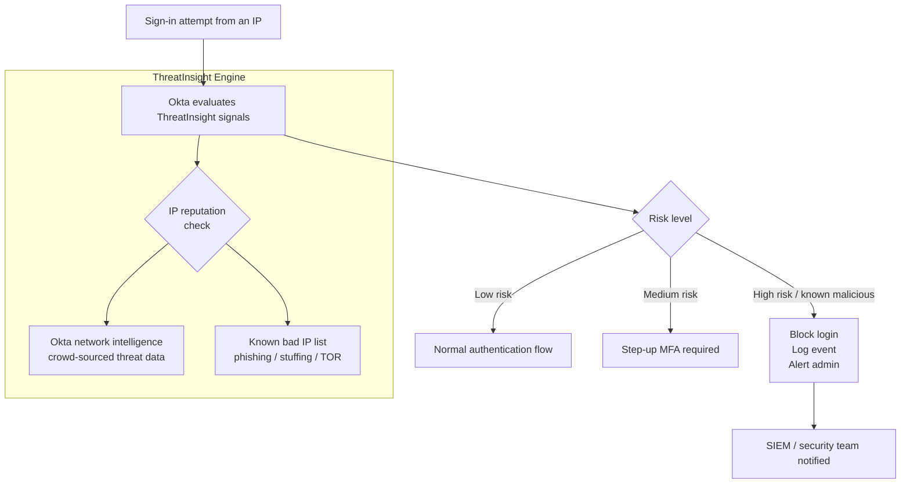
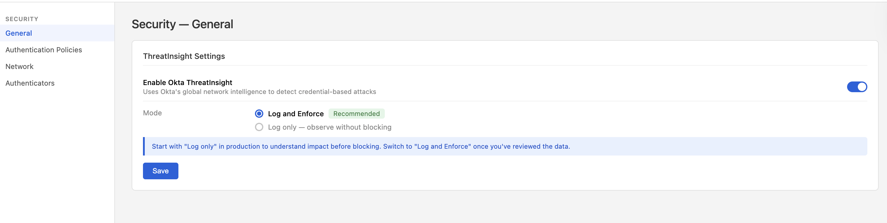
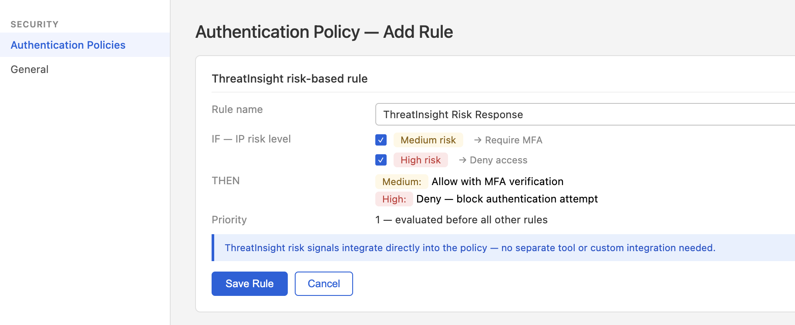
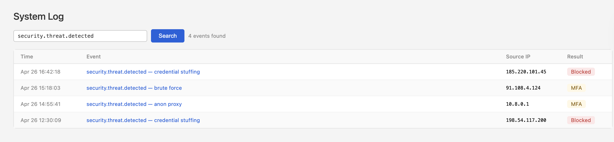
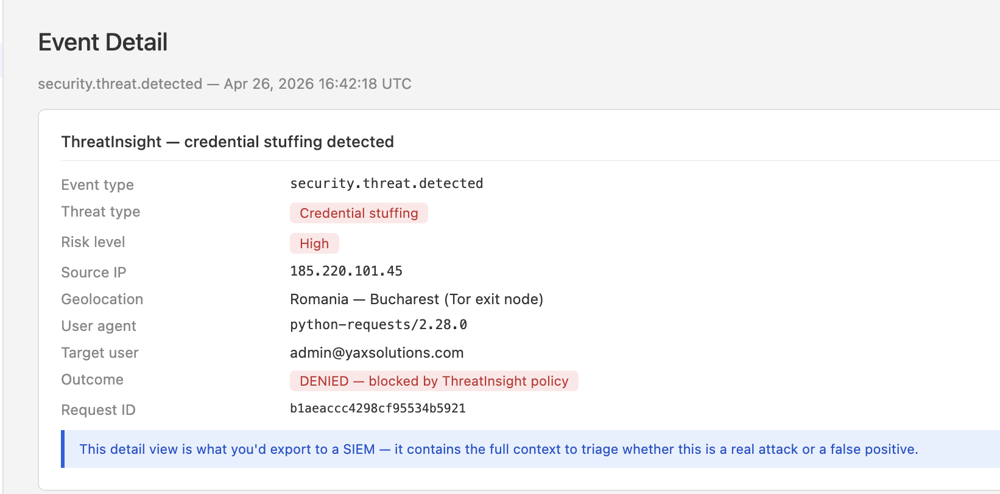
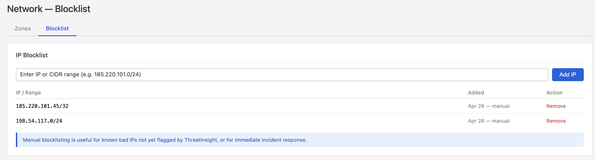
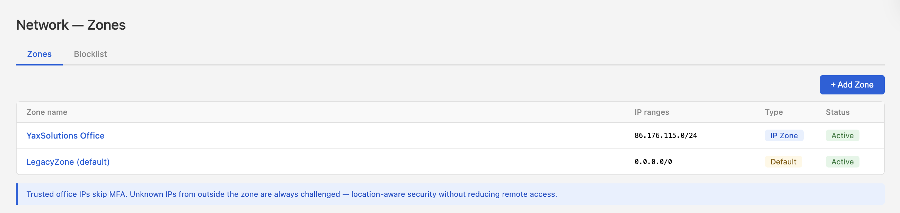
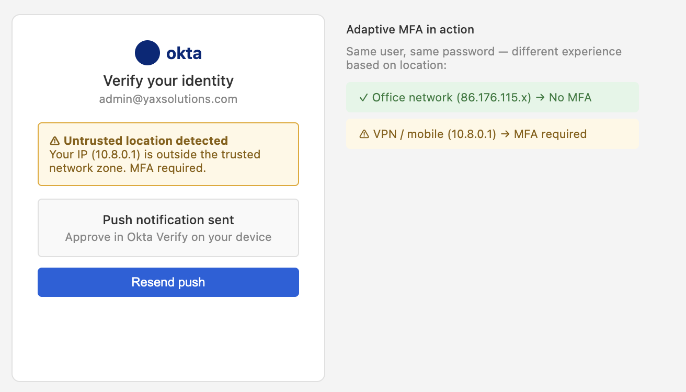
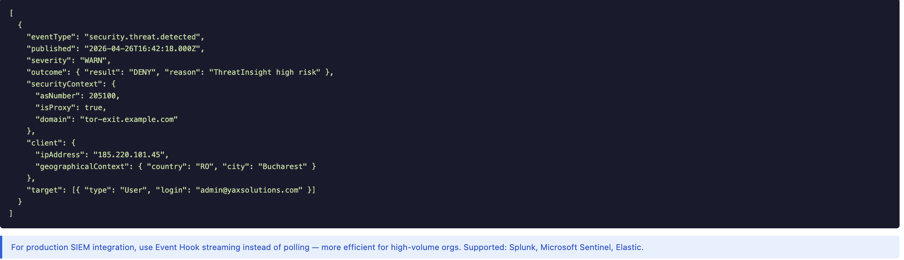

# 11 · ThreatInsight

---

## Why this matters

Credentials get stolen. That's a fact in 2024. The question isn't whether attackers have valid usernames and passwords it's whether your identity layer can detect and block malicious use of those credentials before damage is done.

Okta ThreatInsight is a network-level threat intelligence feed built into Okta. It evaluates the **IP address** of every sign-in attempt against data from across the entire Okta network millions of tenants and flags IPs known for credential stuffing, phishing infrastructure, or anomalous behavior. This lab configures ThreatInsight, integrates it with sign-on policies, reviews the threat data in the system log, and simulates responses to suspicious activity.

---

## Architecture

---

## What ThreatInsight Evaluates

| Signal | What it detects |
|---|---|
| **IP reputation** | Known credential stuffing sources, botnets, proxy services |
| **Velocity** | Unusual number of authentication attempts from one IP in a time window |
| **Geography** | Impossible travel (login from London then Singapore 5 min later) |
| **Device fingerprint** | New device, new browser, headless browser flags |
| **Behavior anomaly** | Login at 3am for a user who always logs in at 9am |

---

## Prerequisites

- Okta org with System Log access
- At least one test user with an active account
- Access to a VPN or proxy service for simulating location changes (optional)

---

## Lab Walkthrough

### Step 1 · Enable Okta ThreatInsight

Navigate to **Security → General** and scroll to **ThreatInsight Settings**. Enable it and choose the mode: **Log and Enforce** (recommended) or **Log only** (for initial observation without blocking).

*Start with "Log only" if you're in a production org and want to understand the impact before blocking. Switch to "Log and Enforce" once you've reviewed the data.*

---

### Step 2 · Configure sign-on policy to respond to ThreatInsight signals

Go to **Security → Authentication Policies** and edit your main policy. Add a rule that steps up to MFA when ThreatInsight evaluates the IP as medium risk, and blocks when it's high risk.

*The risk level condition integrates ThreatInsight signals directly into your authentication policy no separate tool, no custom integration needed.*

---

### Step 3 · Review the System Log for ThreatInsight events

Go to **Reports → System Log** and filter by event type `security.threat.detected`. Review any ThreatInsight-triggered events and their associated IP data.

*The system log entry includes the IP, the threat classification, the user targeted, and whether the authentication was blocked or allowed.*

---

### Step 4 · Explore the threat context of a log entry

Click into a specific ThreatInsight log event to see the full detail: threat type, IP geolocation, user agent, and the authentication outcome.

*The detail view is what you'd export to a SIEM it contains all the context needed to triage whether the event is a real attack or a false positive.*

---

### Step 5 · Manually add an IP to the blocklist

Under **Security → Network → Blocklist**, add a specific IP (use your testing machine's IP as a simulation). Attempt a sign-in from that IP and confirm it's blocked.

*Manual blocklisting is useful for known bad IPs that ThreatInsight hasn't flagged yet, or for incident response when you need to block an attacker IP immediately.*

---

### Step 6 · Configure network zones for trusted locations

Create a **Network Zone** for your office IP range(s) under **Security → Network → Zones**. Configure your sign-on policy to skip MFA for logins from trusted zones.

*Network zones are how you implement location-aware security trusting office IPs reduces MFA friction for on-site employees without reducing security for remote access.*

---

### Step 7 · Simulate a login from an untrusted location

Use a VPN or mobile data connection to sign in from outside the trusted network zone. Confirm that MFA is challenged, while a browser on the trusted network skips the MFA challenge.

*This is adaptive MFA in practice same user, same password, different experience based on where they're connecting from.*

---

### Step 8 · Export threat data to a SIEM (overview)

Review the **System Log API** endpoint and configure a sample export of ThreatInsight events to a SIEM (Splunk, Microsoft Sentinel, or Elastic). In this step, view the API response structure.

*Okta's System Log API supports polling and event hook-based streaming for a production SIEM integration, streaming hooks are more efficient than polling.*

---
## What I Learned

**ThreatInsight no es una herramienta separada, está integrada directamente en las Authentication Policies.** No necesitas una integración custom ni un producto adicional. La condición de "IP risk level" en una regla de política consume automáticamente las señales de ThreatInsight. Esto significa que la respuesta a una amenaza es parte del mismo flujo de autenticación, no un sistema paralelo.

**La diferencia entre "Log only" y "Log and Enforce" es crítica en producción.** Activar directamente "Log and Enforce" en una org con miles de usuarios puede bloquear accesos legítimos si hay falsos positivos, VPNs corporativas, proxies de oficina, o IPs compartidas pueden aparecer como riesgo medio. Empezar con "Log only" durante 1-2 semanas permite entender el baseline antes de bloquear.

**ThreatInsight usa inteligencia colectiva de toda la red de Okta.** Cuando un atacante intenta credential stuffing contra cualquier org de Okta en el mundo, esa IP queda marcada. Si luego intenta acceder a tu org, ThreatInsight ya la conoce como maliciosa. Este efecto de red es lo que hace que ThreatInsight sea más efectivo que un simple rate limiter local.

**El System Log es la fuente de verdad para auditoría.** Cada evento de ThreatInsight queda registrado con el evento type `security.threat.detected`, incluyendo el IP, geolocalización, user agent, usuario objetivo, y outcome. Este log es lo que exportas a un SIEM y lo que presentas en una auditoría de SOC 2 para demostrar que estás detectando y respondiendo a amenazas activamente.

**Las Network Zones son el complemento natural de ThreatInsight.** ThreatInsight maneja IPs maliciosas conocidas. Las Network Zones manejan la confianza basada en ubicación, IPs de oficina conocidas que no necesitan MFA. Juntos cubren los dos extremos: bloquear lo malo conocido y confiar en lo bueno conocido.

**El System Log API permite streaming a SIEMs en tiempo real.** Hacer polling al endpoint `/api/v1/logs` funciona pero es ineficiente. Para producción, Okta recomienda Event Hooks, cuando ocurre un evento de amenaza, Okta hace un POST inmediato a tu SIEM sin esperar al siguiente ciclo de polling.

**Un user agent como `python-requests/2.28.0` es una señal clara de automatización.** Los browsers reales envían user agents con versión del navegador, OS, y motores de rendering. Cuando ves `python-requests` o `curl` en el contexto de un intento de login, es casi siempre un script de ataque automatizado — no un usuario humano.

---

## Troubleshooting

| Error | Causa | Fix |
|---|---|---|
| ThreatInsight no aparece en Security → General | La feature no está habilitada en el plan Integrator | Verificar en Security → General scrolleando hacia abajo — en algunos planes está oculta. Si no aparece, es una limitación del plan |
| Eventos `security.threat.detected` no aparecen en el System Log | ThreatInsight está en modo "Log only" pero no hay amenazas activas en el entorno de lab | Usar una IP de Tor o proxy conocido para generar un evento de prueba, o esperar actividad orgánica |
| La regla de ThreatInsight en la policy no se dispara | La regla no es la primera en la lista de prioridades — otra regla más permisiva la precede | Mover la regla de ThreatInsight al tope de la lista — Okta evalúa reglas en orden y aplica la primera que coincide |
| IPs de oficina bloqueadas por ThreatInsight | La IP corporativa comparte un rango con IPs marcadas como maliciosas (ISP compartido) | Crear una Network Zone con el rango de IPs de la oficina y añadir una regla de excepción en la policy para esa zona |
| System Log API devuelve 401 | El API token no tiene los permisos correctos | El token necesita el scope `okta.logs.read` — verificar en Security → API → Tokens |
| Evento marcado como "threat" pero es un usuario legítimo | Falso positivo — VPN, Tor browser legítimo, o IP de proxy corporativo | Añadir la IP a una Network Zone de confianza o crear una regla de excepción en la policy para ese usuario/grupo |
| No se puede añadir IP al blocklist manual | Formato de IP incorrecto | Usar notación CIDR correcta: `185.220.101.45/32` para una IP individual, o `185.220.101.0/24` para un rango |

---

## Real-World Applications

**Protección automática contra credential stuffing a escala.** En un ataque de credential stuffing, los atacantes usan listas de millones de usuarios/contraseñas filtradas de otras brechas. Sin ThreatInsight, cada intento fallido genera un log pero no hay respuesta automática. Con ThreatInsight en "Log and Enforce", las IPs identificadas como atacantes son bloqueadas antes de que puedan hacer el primer intento el ataque muere antes de empezar.

**Respuesta a incidentes en tiempo real.** El equipo de seguridad detecta un ataque activo contra la org. El analista añade el rango de IPs del atacante al blocklist manual en Okta el bloqueo es inmediato y no requiere tocar el firewall, contactar al ISP, ni esperar un ciclo de despliegue. En un incidente real, la velocidad de respuesta es todo.

**SIEM integration para visibilidad centralizada.** Una empresa con Splunk como SIEM configura un Event Hook para que cada evento `security.threat.detected` de Okta dispare automáticamente un POST a Splunk. El equipo SOC tiene una dashboard en tiempo real con todos los intentos de acceso malicioso, correlacionados con eventos de otros sistemas (firewall, endpoint, email). Okta se convierte en una fuente de signal, no solo de logs.

**Adaptive MFA basado en riesgo para empleados remotos.** Una empresa con empleados en 20 países no puede bloquear todas las IPs fuera de la oficina la mayoría del trabajo es remoto. Con ThreatInsight + Network Zones, la lógica es: IPs de oficina → sin MFA, IPs desconocidas limpias → MFA, IPs de riesgo medio → MFA reforzado, IPs de alto riesgo → bloqueo total. Los empleados legítimos en remoto tienen MFA normal. Los atacantes son bloqueados automáticamente.

**Evidencia de detección para auditorías de SOC 2 e ISO 27001.** Los auditores preguntan "¿cómo detectas y respondes a intentos de acceso no autorizado?" Con ThreatInsight, la respuesta es un export del System Log mostrando eventos `security.threat.detected` con outcomes `DENY`, timestamps, y IPs bloqueadas. Esto es evidencia auditable de que el control está activo y funcionando — no solo configurado.

----

## Resources

- [Okta ThreatInsight overview](https://help.okta.com/en-us/content/topics/security/threat-insight/ti-main.htm)
- [Okta System Log API](https://developer.okta.com/docs/reference/api/system-log/)
- [Okta Behavior Detection](https://help.okta.com/en-us/content/topics/security/behavior-detection.htm)

