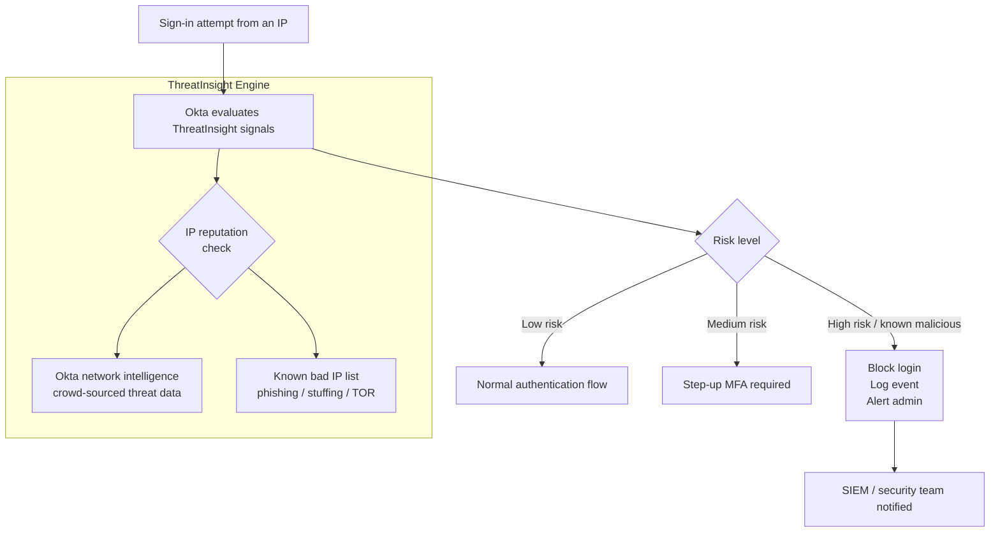

# 11 · ThreatInsight

---

## Why this matters

Credentials get stolen. That's a fact in 2024. The question isn't whether attackers have valid usernames and passwords it's whether your identity layer can detect and block malicious use of those credentials before damage is done.

Okta ThreatInsight is a network-level threat intelligence feed built into Okta. It evaluates the **IP address** of every sign-in attempt against data from across the entire Okta network millions of tenants and flags IPs known for credential stuffing, phishing infrastructure, or anomalous behavior. This lab configures ThreatInsight, integrates it with sign-on policies, reviews the threat data in the system log, and simulates responses to suspicious activity.

---

## Architecture

---

## What ThreatInsight Evaluates

| Signal | What it detects |
|---|---|
| **IP reputation** | Known credential stuffing sources, botnets, proxy services |
| **Velocity** | Unusual number of authentication attempts from one IP in a time window |
| **Geography** | Impossible travel (login from London then Singapore 5 min later) |
| **Device fingerprint** | New device, new browser, headless browser flags |
| **Behavior anomaly** | Login at 3am for a user who always logs in at 9am |

---

## Prerequisites

- Okta org with System Log access
- At least one test user with an active account
- Access to a VPN or proxy service for simulating location changes (optional)

---

## Lab Walkthrough

### Step 1 · Enable Okta ThreatInsight

Navigate to **Security → General** and scroll to **ThreatInsight Settings**. Enable it and choose the mode: **Log and Enforce** (recommended) or **Log only** (for initial observation without blocking).

*Start with "Log only" if you're in a production org and want to understand the impact before blocking. Switch to "Log and Enforce" once you've reviewed the data.*

---

### Step 2 · Configure sign-on policy to respond to ThreatInsight signals

Go to **Security → Authentication Policies** and edit your main policy. Add a rule that steps up to MFA when ThreatInsight evaluates the IP as medium risk, and blocks when it's high risk.

*The risk level condition integrates ThreatInsight signals directly into your authentication policy no separate tool, no custom integration needed.*

---

### Step 3 · Review the System Log for ThreatInsight events

Go to **Reports → System Log** and filter by event type `security.threat.detected`. Review any ThreatInsight-triggered events and their associated IP data.

*The system log entry includes the IP, the threat classification, the user targeted, and whether the authentication was blocked or allowed.*

---

### Step 4 · Explore the threat context of a log entry

Click into a specific ThreatInsight log event to see the full detail: threat type, IP geolocation, user agent, and the authentication outcome.

*The detail view is what you'd export to a SIEM it contains all the context needed to triage whether the event is a real attack or a false positive.*

---

### Step 5 · Manually add an IP to the blocklist

Under **Security → Network → Blocklist**, add a specific IP (use your testing machine's IP as a simulation). Attempt a sign-in from that IP and confirm it's blocked.

*Manual blocklisting is useful for known bad IPs that ThreatInsight hasn't flagged yet, or for incident response when you need to block an attacker IP immediately.*

---

### Step 6 · Configure network zones for trusted locations

Create a **Network Zone** for your office IP range(s) under **Security → Network → Zones**. Configure your sign-on policy to skip MFA for logins from trusted zones.

*Network zones are how you implement location-aware security trusting office IPs reduces MFA friction for on-site employees without reducing security for remote access.*

---

### Step 7 · Simulate a login from an untrusted location

Use a VPN or mobile data connection to sign in from outside the trusted network zone. Confirm that MFA is challenged, while a browser on the trusted network skips the MFA challenge.

*This is adaptive MFA in practice same user, same password, different experience based on where they're connecting from.*

---

### Step 8 · Export threat data to a SIEM (overview)

Review the **System Log API** endpoint and configure a sample export of ThreatInsight events to a SIEM (Splunk, Microsoft Sentinel, or Elastic). In this step, view the API response structure.

*Okta's System Log API supports polling and event hook-based streaming for a production SIEM integration, streaming hooks are more efficient than polling.*

---

## What I Learned

- **ThreatInsight is crowd-sourced.** Because it draws on signals from across all Okta tenants, it can detect threats that no individual organization would see on their own a new phishing campaign that hits 10 other Okta customers before reaching yours is already flagged.
- **False positives happen.** A user on a corporate VPN exit node shared with thousands of other companies might get flagged as suspicious. Have a process for users to report being blocked so you can investigate and whitelist if needed.
- The **behavior detection** feature (separate from ThreatInsight) uses user-specific baselines it learns that Alice always logs in from London at 9am and flags it if she suddenly logs in from Brazil at 3am. Very powerful, but takes time to build baselines.
- **ThreatInsight doesn't replace a SIEM.** It's great for runtime blocking, but the security team still needs a SIEM to investigate incidents, correlate events, and do forensics.

---

## Real-World Applications

- Automatically blocking credential stuffing attacks during a breach where attacker lists are being actively tested against your Okta tenant
- Triggering a Slack alert to the security team and requiring admin approval before allowing a login from a new country for privileged users
- Feeding Okta threat events into Microsoft Sentinel for correlation with endpoint telemetry and email security signals

---

## Resources

- [Okta ThreatInsight overview](https://help.okta.com/en-us/content/topics/security/threat-insight/ti-main.htm)
- [Okta System Log API](https://developer.okta.com/docs/reference/api/system-log/)
- [Okta Behavior Detection](https://help.okta.com/en-us/content/topics/security/behavior-detection.htm)

