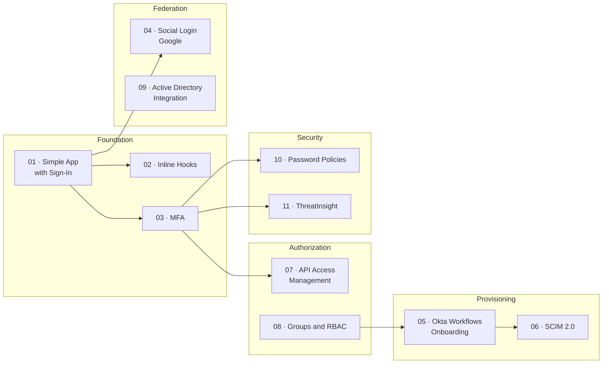

# Okta Hands-On Labs — Identity & Access Management

---

## About this repository

This repository documents a hands-on Okta Workforce Identity lab series covering the full identity lifecycle from building a basic authenticated application to configuring enterprise-grade threat detection. Each lab was built from scratch in a live Okta Developer org, with real configurations, real errors, and real learnings.

The goal is not to follow a checklist. It is to understand *why* each capability exists, when you would reach for it in a real deployment, and what catches people out when they configure it for the first time.

This series complements the [SC-300 labs](../sc-300-labs/) (Microsoft Entra ID) and the [SailPoint labs](../SailPoint/) (IGA), forming a complete Identity Security portfolio across the three most deployed platforms in the enterprise market.

---

## Lab Map

---

## Lab Index

| # | Lab | Key Concepts | Level | Protocol / Feature |
|---|---|---|---|---|
| 01 | [Build a Simple App with Sign-In](./01-Build-a-Simple-App-with-Sign-In/) | OIDC, Authorization Code Flow, ID tokens | 🟢 Beginner | OIDC |
| 02 | [Add Inline Hooks](./02-Add-Inline-Hooks/) | Token enrichment, hook middleware, custom claims | 🟡 Intermediate | Event Hooks |
| 03 | [Secure with MFA](./03-Secure-with-MFA/) | Okta Verify, adaptive MFA, enrollment policies | 🟢 Beginner | Adaptive MFA |
| 04 | [Social Login (Google)](./04-Social-Login-Google/) | IdP federation, OAuth 2.0, JIT provisioning | 🟡 Intermediate | OAuth 2.0 |
| 05 | [Okta Workflows — Onboarding](./05-Okta-Workflows-Onboarding/) | No-code automation, event triggers, app provisioning | 🟡 Intermediate | Workflows |
| 06 | [SCIM 2.0 Provisioning](./06-SCIM-2.0-Provisioning/) | SCIM protocol, lifecycle management, deprovisioning | 🔴 Advanced | SCIM 2.0 |
| 07 | [API Access Management](./07-API-Access-Management/) | OAuth 2.0 scopes, JWT validation, custom auth server | 🔴 Advanced | OAuth 2.0 / JWT |
| 08 | [Groups & RBAC](./08-Groups-RBAC/) | Role-based access, group rules, dynamic assignment | 🟡 Intermediate | RBAC |
| 09 | [Active Directory Integration](./09-Active-Directory-Integration/) | AD Agent, delegated auth, attribute mapping | 🔴 Advanced | AD Agent |
| 10 | [Password Policies](./10-Password-Policies/) | NIST guidance, SSPR, lockout, passwordless | 🟢 Beginner | Password Mgmt |
| 11 | [ThreatInsight](./11-ThreatInsight/) | IP reputation, adaptive policies, SIEM integration | 🟡 Intermediate | ThreatInsight |

---

## How each lab is structured

Every lab README follows the same format, designed to show understanding, not just execution:

**Why this matters** a real-world scenario explaining the business problem, not just the Okta feature being configured.

**Architecture diagram** a Mermaid diagram showing how the pieces connect before touching any configuration screen.

**Step-by-step walkthrough**  each step explains *why*, not just *what*, followed by an annotated screenshot that serves as a visual checkpoint.

**What I learned** honest reflection: what confused me, what surprised me, what errors I hit and how I resolved them, and what mental models clicked during the lab.

**Real-world applications** concrete scenarios where this capability is used in a production deployment.

---

## Screenshots

Screenshots in each lab are annotated with arrows or highlights to call out the specific element being configured. They are named semantically (`01-create-app-integration.png`, not `screenshot1.png`) and stored in a `/screenshots` subfolder within each lab directory.

If you are replicating a lab, the screenshots serve as a visual checkpoint they show what a correctly configured screen looks like, not just a recording of someone clicking through steps.

---

## Environment used

- **Okta Developer Org** free tier at [developer.okta.com](https://developer.okta.com)
- **ngrok** for exposing local endpoints to Okta webhooks during inline hook and SCIM labs
- **Postman** for testing OAuth 2.0 token flows and SCIM API calls
- **jwt.io** for decoding and inspecting JWTs during the API Access Management lab
- **Node.js + Express** for the protected API in Lab 07 and the SCIM server in Lab 06
- **Windows Server 2019 (VM)** for the Active Directory integration in Lab 09

---

## Target certification

These labs cover the core content of the **Okta Certified Administrator** exam the most widely recognized Okta certification for IAM Engineers, Identity Admins, and Security Analysts working with Workforce Identity.

| Lab coverage | Exam domain |
|---|---|
| Labs 01, 04, 09 | Authentication and federation |
| Labs 03, 10, 11 | Security policies and threat protection |
| Labs 05, 06, 08 | Lifecycle management and provisioning |
| Labs 02, 07 | Extensibility and API access |

The exam costs $125 USD and is available online through Okta's training portal at [okta.com/training](https://www.okta.com/training/).

---

## Identity Security portfolio

This repository is part of a broader hands-on identity security portfolio:

| Repository | Platform | Focus | Status |
|---|---|---|---|
| [`sc-300-labs`](../sc-300-labs/) | Microsoft Entra ID | Conditional Access, PIM, Identity Protection | ✅ Completed |
| [`Okta-Hands-On-Labs-IAM`](.) | Okta Workforce Identity | SSO, MFA, SCIM, API Access | 🔄 In Progress |
| [`SailPoint`](../SailPoint/) | SailPoint IdentityNow | IGA, Certifications, SoD, Governance | 🔄 In Progress |

With all three platforms covered, the profile targets **IAM Engineer**, **Identity Security Analyst**, and **Access Management Specialist** roles the most in-demand positions in cybersecurity today across both the UK and European markets.

---

## Key concepts covered

By completing all 11 labs, you will have hands-on experience with the following concepts and protocols:

**Protocols and standards:** OpenID Connect (OIDC), OAuth 2.0, SAML 2.0, SCIM 2.0, JWT, PKCE, WebAuthn / FIDO2

**Identity capabilities:** Single Sign-On, Multi-Factor Authentication, Adaptive Access, Lifecycle Management, Just-in-Time Provisioning, Directory Integration, Passwordless Authentication

**Security controls:** Risk-based authentication, ThreatInsight IP reputation, Token validation, API scope enforcement, Inline Hooks for custom logic

**Okta platform:** Admin Console, Universal Directory, Authorization Server, Okta Workflows, Okta Verify, Integration Network (OIN)

