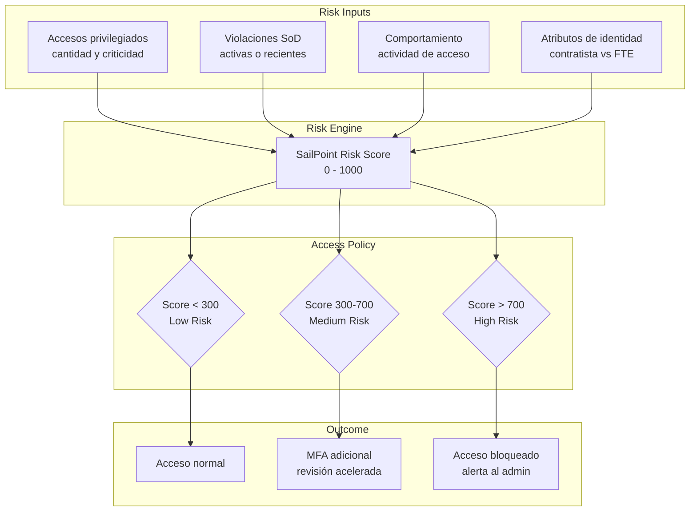
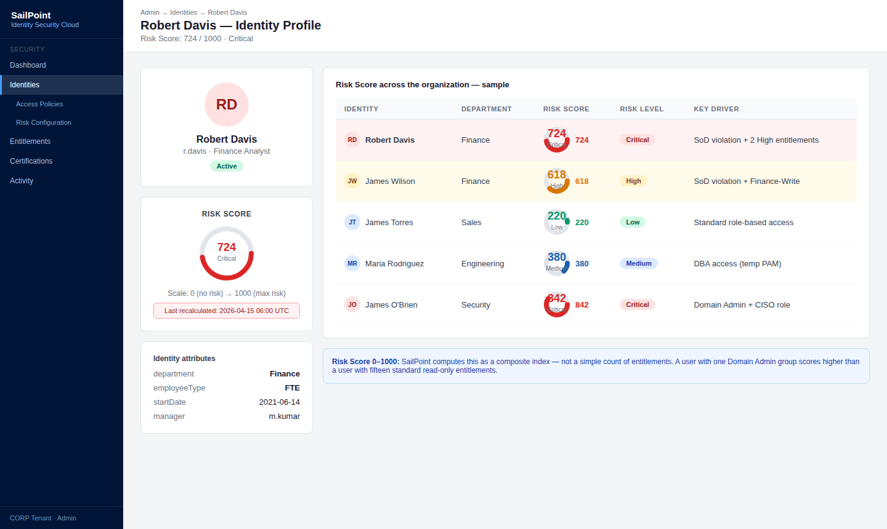
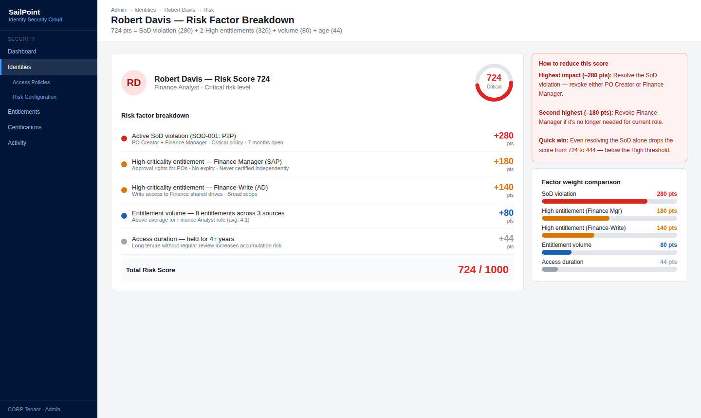
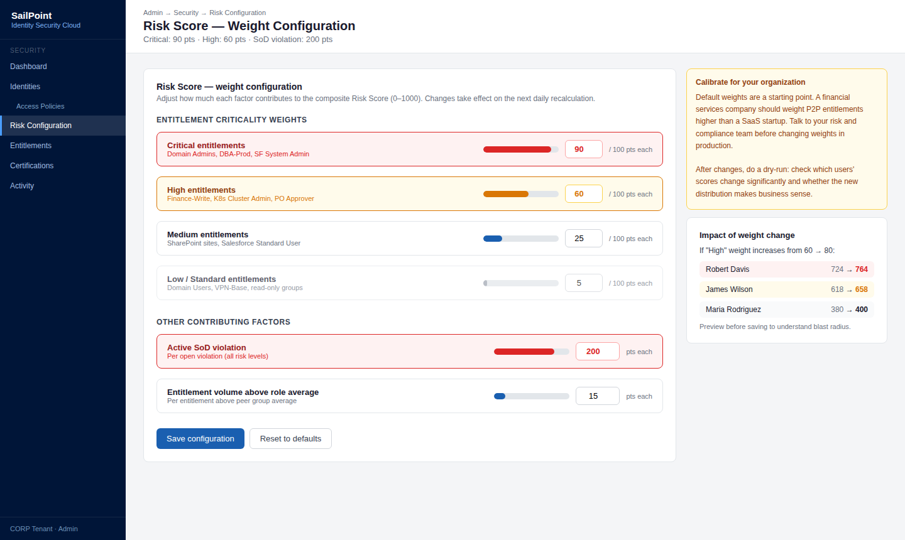
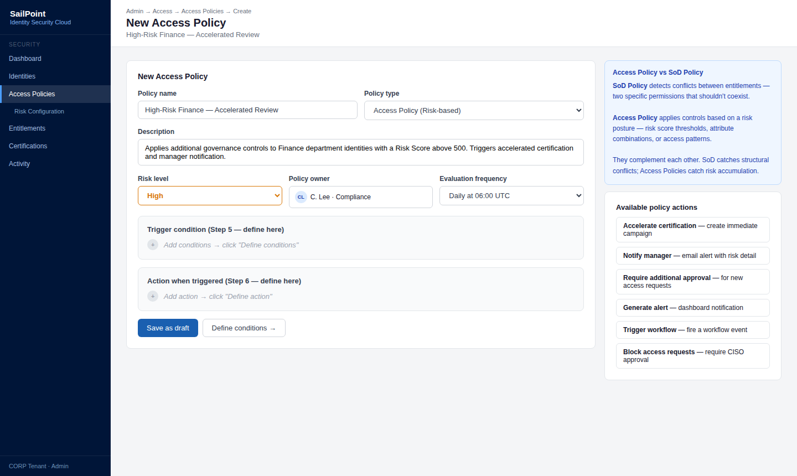
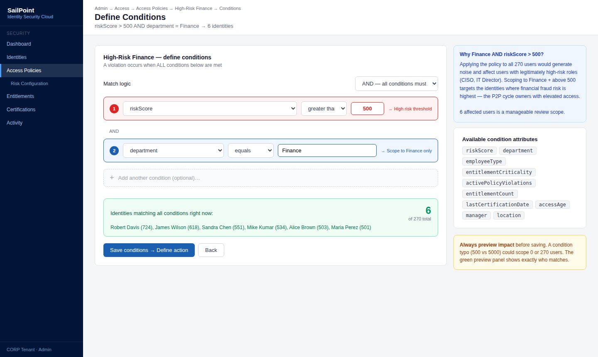
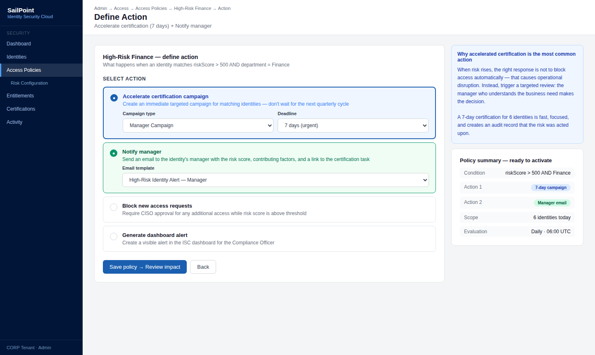
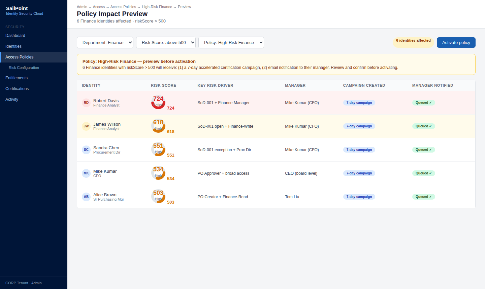
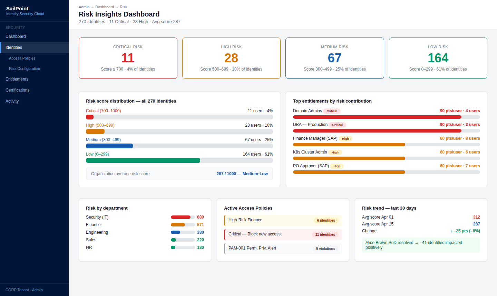

# 01 · Access Policies & Risk-based Access

---

## Why this matters

Zero Trust no es un producto es un principio: nunca confíes, siempre verifica. Pero para aplicarlo en la práctica necesitas un sistema que calcule el riesgo de cada identidad y adapte el nivel de acceso en función de ese riesgo. Eso es exactamente lo que hacen las Access Policies con risk scoring en SailPoint.

En una empresa sin risk-based access, todos los usuarios tienen el mismo nivel de confianza si tienen credenciales válidas. En una empresa con risk-based access bien configurado, un usuario con score de riesgo alto (muchos accesos privilegiados, poca actividad, violaciones de política) tiene restricciones adicionales automáticamente. Este lab construye ese sistema desde cero.

---

## Architecture

---

## Prerequisites

- Tenant de SailPoint ISC activo
- Al menos un Source configurado con usuarios importados
- Familiaridad básica con el concepto de Zero Trust

---

## Lab Walkthrough

### Step 1 · Explorar el Risk Score de las identidades

Ve a **Identities** y abre el perfil de varios usuarios. Busca el campo **Risk Score** SailPoint lo calcula automáticamente basándose en los accesos y atributos de cada identidad.

*El Risk Score va de 0 (sin riesgo) a 1000 (riesgo máximo). SailPoint lo calcula como un índice compuesto de múltiples señales — no es solo el número de accesos.*

---

### Step 2 · Explorar los factores que contribuyen al Risk Score

En el perfil de una identidad de alto riesgo, revisa qué factores están elevando el score: número de entitlements, entitlements de alta criticidad, violaciones de política activas.

*Entender qué factores mueven el score es clave para diseñar controles efectivos puedes reducir el riesgo revocando entitlements innecesarios o resolviendo violaciones activas.*

---

### Step 3 · Configurar el peso de los entitlements en el risk score

Ve a **Admin → Security → Risk Configuration** y ajusta el peso que tienen los entitlements de alta criticidad en el cálculo del score. Los entitlements marcados como "High" contribuyen más al riesgo.

*Ajustar los pesos permite calibrar el modelo de riesgo a la realidad de tu organización un entitlement de admin de AD merece más peso que uno de acceso de lectura a un repositorio.*

---

### Step 4 · Crear una Access Policy

Ve a **Admin → Access → Access Policies → Create Policy**. Define una política que aplique controles adicionales a usuarios con Risk Score superior a 500.

*Las Access Policies son reglas que conectan el nivel de riesgo con una acción desde simplemente registrar el evento hasta bloquear acceso o escalar para revisión.*

---

### Step 5 · Configurar las condiciones de la política

Define las condiciones: `riskScore > 500` AND `department = "Finance"`. Esto asegura que la política aplica solo al segmento de mayor impacto.

*Las condiciones pueden combinar Risk Score con atributos de identidad, tipo de entitlement y otros factores — el modelo es flexible para adaptarse a distintos perfiles de riesgo.*

---

### Step 6 · Definir la acción de la política

Configura qué ocurre cuando se cumple la condición: acelerar la siguiente certification campaign para esas identidades, notificar al manager, o requerir aprobación adicional para nuevas access requests.

*La acción más común es trigger de una certification inmediata cuando el riesgo sube, se revisan los accesos en lugar de esperar al ciclo trimestral normal.*

---

### Step 7 · Verificar el impacto de la política en identidades reales

Filtra las identidades por Risk Score > 500 y verifica que la política está aplicando las restricciones configuradas correctamente.

*Revisar el impacto antes de activar una política en producción evita sorpresas si afecta a más usuarios de los esperados, ajusta los umbrales.*

---

### Step 8 · Revisar el dashboard de Risk Insights

Ve a **Dashboard → Risk** y analiza la distribución de risk scores en la organización: cuántos usuarios están en cada rango, qué entitlements contribuyen más al riesgo global.

*El Risk Dashboard es la vista ejecutiva del posture de seguridad de identidades en una sola pantalla, el CISO puede ver si el riesgo está concentrado o distribuido.*

---

## What I Learned

- El **Risk Score es un indicador, no una sentencia**. Un score alto no significa que el usuario sea malicioso puede significar que tiene muchos accesos legítimos por su rol. El contexto siempre importa.
- Los **entitlements sin descripción ni nivel de criticidad no contribuyen correctamente al score** SailPoint los trata como low risk por defecto. Invertir tiempo en etiquetar entitlements críticos es fundamental para que el risk scoring sea útil.
- **Risk-based Access es Zero Trust aplicado a identidades**  el principio es el mismo: no asumir confianza, evaluarla dinámicamente en función del contexto y el comportamiento.
- Descubrí que las **Access Policies se pueden encadenar** una política detecta riesgo alto, otra programa la certification, otra notifica al manager. Juntas forman un workflow automático de respuesta a riesgo.

---

## Real-World Applications

- Identificar automáticamente a los usuarios con mayor riesgo de insider threat basándose en combinaciones de acceso privilegiado y comportamiento anómalo
- Acelerar las certification campaigns solo para identidades de alto riesgo, en lugar de hacer una revisión masiva de todos los usuarios
- Demostrar en una auditoría de ISO 27001 que la organización tiene controles basados en riesgo, no solo controles fijos e iguales para todos

---

## Resources

- [Risk scoring in SailPoint ISC](https://documentation.sailpoint.com/saas/help/access/risk.html)
- [Access Policies overview](https://documentation.sailpoint.com/saas/help/access/access_policies.html)
- [Zero Trust with SailPoint](https://www.sailpoint.com/solutions/zero-trust/)

