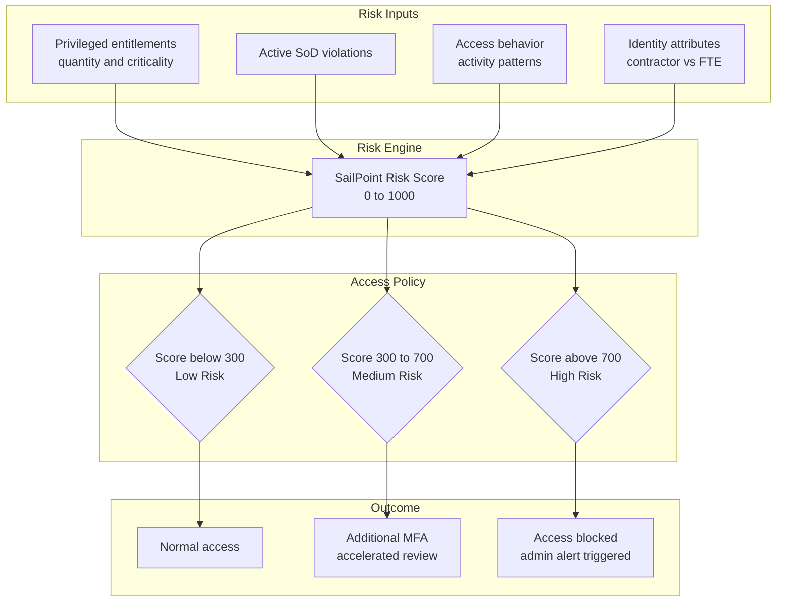

# 01 · Access Policies & Risk-based Access

---

## Why this matters

Zero Trust is not a product it is a principle: never trust, always verify. Applying it in practice requires a system that calculates the risk of each identity and adapts its access level based on that risk. That is exactly what Access Policies with risk scoring do in SailPoint.

In an organization without risk-based access, every user with valid credentials is treated with the same level of trust. In one with risk-based access configured properly, a high-risk user too many privileged entitlements, low activity, active policy violations automatically faces additional restrictions. This lab builds that system from the ground up.

---

## Architecture

---

## Prerequisites

- Active SailPoint ISC tenant
- At least one Source configured with imported users
- Basic familiarity with Zero Trust concepts

---

## Lab Walkthrough

### Step 1 · Explore the Risk Score on identities

Go to **Identities** and open the profile of several users. Look for the **Risk Score** field SailPoint calculates it automatically based on each identity's access and attributes.

*The Risk Score ranges from 0 (no risk) to 1000 (maximum risk). SailPoint calculates it as a composite index of multiple signals it is not simply a count of entitlements.*

---

### Step 2 · Explore the factors contributing to the Risk Score

On the profile of a high-risk identity, review what factors are elevating the score: number of entitlements, high-criticality entitlements, active policy violations.

*Understanding what drives the score is key to designing effective controls  you can reduce risk by revoking unnecessary entitlements or resolving active violations.*

---

### Step 3 · Configure entitlement weights in the risk score calculation

Go to **Admin → Security → Risk Configuration** and adjust the weight that high-criticality entitlements carry in the score. Entitlements marked as "High" contribute more to the overall risk.

*Adjusting weights lets you calibrate the risk model to your organization's reality an AD admin entitlement deserves more weight than read-only access to a repository.*

---

### Step 4 · Create an Access Policy

Go to **Admin → Access → Access Policies → Create Policy**. Define a policy that applies additional controls to users with a Risk Score above 500.

*Access Policies are rules connecting risk level to an action from simply logging the event, to blocking access or escalating for review.*

---

### Step 5 · Configure the policy conditions

Define the conditions: `riskScore > 500` AND `department = "Finance"`. This scopes the policy to the highest-impact segment only.

*Conditions can combine Risk Score with identity attributes, entitlement type, and other factors the model is flexible to accommodate different risk profiles.*

---

### Step 6 · Define the policy action

Configure what happens when the condition is met: accelerate the next certification campaign for those identities, notify the manager, or require additional approval for new access requests.

*The most common action is triggering an immediate certification when risk rises, access gets reviewed rather than waiting for the normal quarterly cycle.*

---

### Step 7 · Verify policy impact on real identities

Filter identities by Risk Score above 500 and verify that the policy is correctly applying the configured restrictions.

*Always review impact before activating a policy in production if it affects more users than expected, adjust the thresholds first.*

---

### Step 8 · Review the Risk Insights dashboard

Go to **Dashboard → Risk** and analyze the distribution of risk scores across the organization: how many users fall in each range, which entitlements contribute most to overall risk.

*The Risk Dashboard is the executive view of identity security posture on a single screen, the CISO can see whether risk is concentrated or broadly distributed.*

---

## What I Learned

- The **Risk Score is an indicator, not a verdict**. A high score does not mean the user is malicious they may simply hold many legitimate entitlements for their role. Context always matters.
- **Entitlements without a description or criticality tag do not contribute correctly to the score** SailPoint treats them as low risk by default. Investing time in tagging critical entitlements is essential for meaningful risk scoring.
- **Risk-based Access is Zero Trust applied to identities** the principle is the same: do not assume trust, evaluate it dynamically based on context and behavior.
- I discovered that **Access Policies can be chained** one policy detects high risk, another schedules a certification, another notifies the manager. Together they form an automatic risk response workflow.

---

## Real-World Applications

- Automatically identifying users with the highest insider threat risk based on combinations of privileged access and anomalous behavior patterns
- Accelerating certification campaigns only for high-risk identities, rather than running a massive review of all users every quarter
- Demonstrating to an ISO 27001 auditor that the organization has risk-based controls, not just fixed controls applied equally to everyone

---

## Resources

- [Risk scoring in SailPoint ISC](https://documentation.sailpoint.com/saas/help/access/risk.html)
- [Access Policies overview](https://documentation.sailpoint.com/saas/help/access/access_policies.html)
- [Zero Trust with SailPoint](https://www.sailpoint.com/solutions/zero-trust/)

