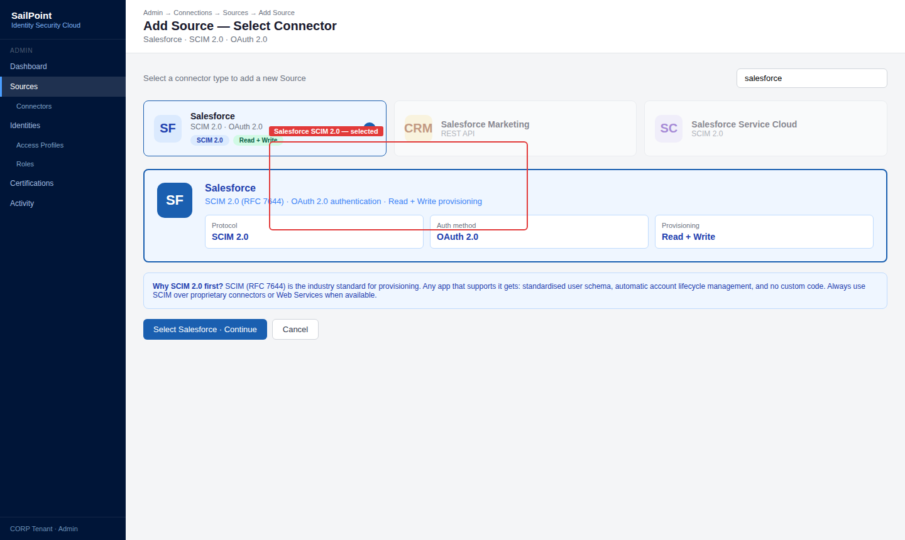
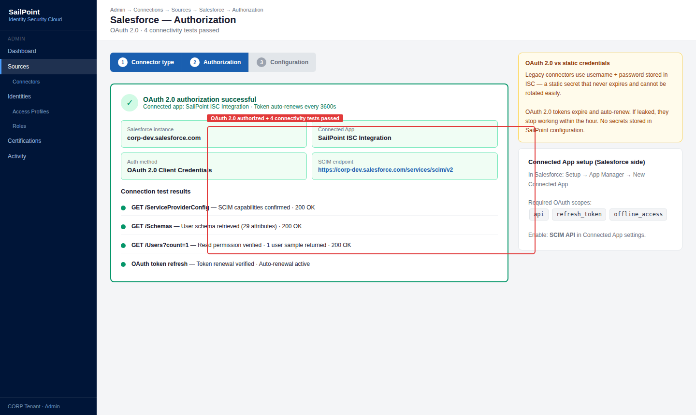
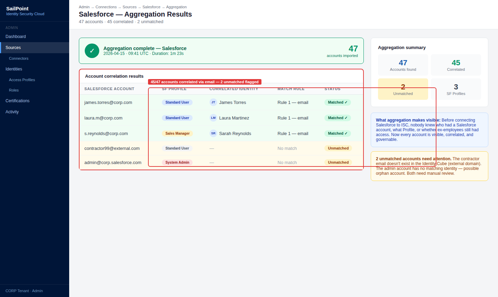
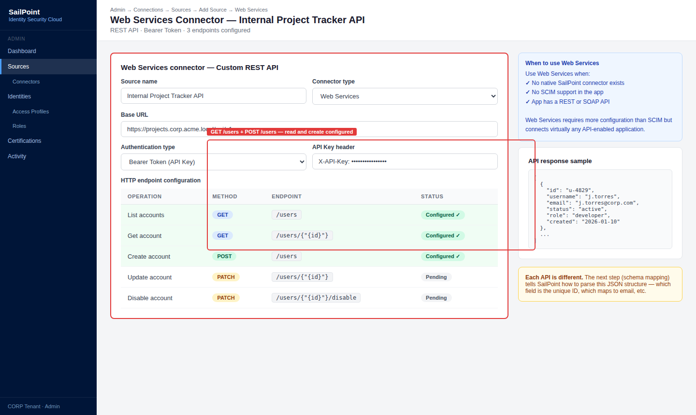
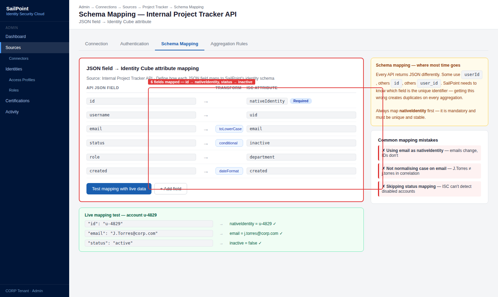
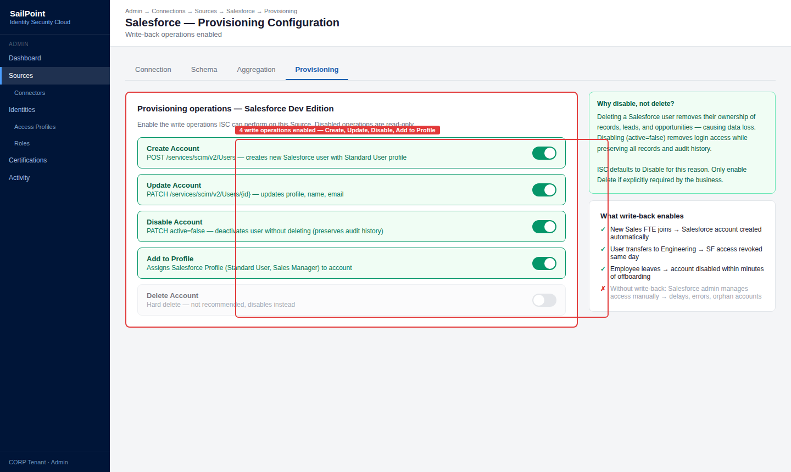
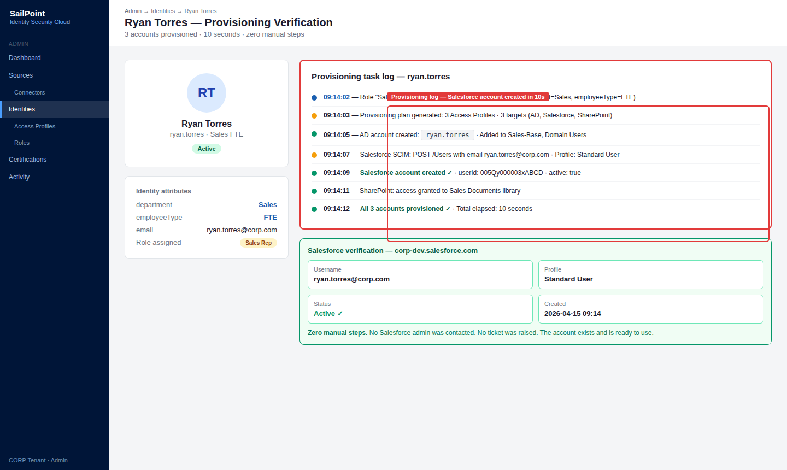
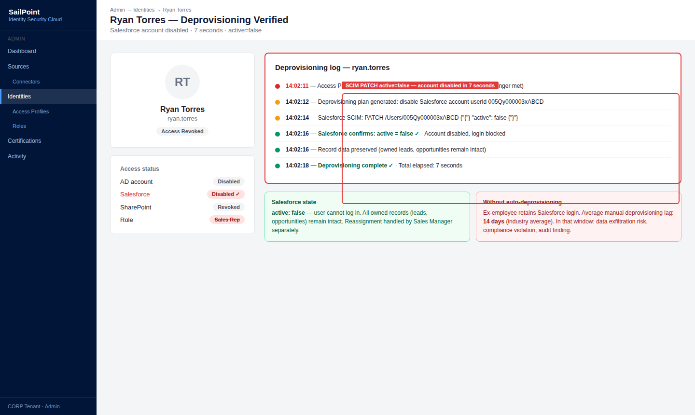

# 02 · Application Onboarding & Provisioning

---

## Why this matters

Cada nueva aplicación que entra en la empresa sin pasar por SailPoint es un punto ciego de governance. Los usuarios tienen accesos que nadie revisa, los leaver no se deprovisioned correctamente y los auditores encuentran cuentas activas de personas que se fueron hace meses.

Onboarding de una aplicación a SailPoint significa traerla bajo el paraguas de governance: sus cuentas son visibles, sus entitlements son gobernables, su provisioning es automatizable. Este lab conecta una aplicación usando tres métodos distintos SCIM (el estándar moderno), Web Services (APIs REST/SOAP) y un conector nativo porque en el mundo real te encontrarás los tres.

---

## Architecture

---

## Prerequisites

- Tenant de SailPoint ISC activo
- Una cuenta de Salesforce Developer Edition (gratis) para el conector SCIM
- Acceso a una API REST simple para Web Services (puedes usar una API pública de prueba)

---

## Lab Walkthrough

### Step 1 · Onboarding via SCIM — configurar Salesforce

Ve a **Admin → Connections → Sources → Add Source** y selecciona **Salesforce**. El conector de Salesforce usa SCIM 2.0 el estándar más limpio para integración.

*SCIM 2.0 (RFC 7644) es el protocolo estándar para provisioning si una aplicación lo soporta, siempre es la primera opción. Simplifica enormemente la integración.*

---

### Step 2 · Autorizar la conexión con Salesforce

Introduce las credenciales de tu Salesforce Developer Edition o genera un Connected App con OAuth 2.0. Testea la conexión.

*SCIM usa OAuth 2.0 para autenticación el token se renueva automáticamente. No necesitas gestionar credenciales estáticas como en conectores legacy.*

---

### Step 3 · Ejecutar la primera agregación de Salesforce

Agrega las cuentas de Salesforce. Verifica que los usuarios importados se correlacionan con identidades existentes en SailPoint usando el email como campo de unión.

*Una vez agregada, SailPoint sabe quién tiene cuenta en Salesforce, qué Profile tiene asignado y cuándo fue creada información que antes era invisible para governance.*

---

### Step 4 · Onboarding via Web Services — conectar una API REST custom

Añade un nuevo Source usando el conector **Web Services**. Configura el endpoint base, los headers de autenticación y los métodos HTTP para listar usuarios (GET /users) y crear cuentas (POST /users).

*Web Services es el conector más flexible si la aplicación tiene una API REST o SOAP, puedes conectarla aunque no tenga conector nativo en el catálogo de SailPoint.*

---

### Step 5 · Mapear el schema del conector Web Services

Define qué campos del JSON response de la API corresponden a qué atributos del Identity Cube en SailPoint (id, username, email, status).

*El schema mapping es donde más tiempo se invierte con Web Services cada API devuelve JSON con estructura diferente y hay que enseñarle a SailPoint cómo leerla.*

---

### Step 6 · Configurar el provisioning write-back en Salesforce

Activa las operaciones de escritura en el Source de Salesforce: Create Account, Update Account, Disable Account, Add to Profile, Remove from Profile.

*Con write-back activo, SailPoint puede crear una cuenta en Salesforce automáticamente cuando un usuario se une al equipo de ventas sin intervención de ningún admin de Salesforce.*

---

### Step 7 · Probar el provisioning end-to-end

Asigna un Access Profile que incluya acceso a Salesforce a un usuario de prueba. Verifica en Salesforce que la cuenta fue creada con el Profile correcto.

*El aprovisionamiento end-to-end es el momento donde todo el trabajo de configuración se convierte en valor real un usuario recibe acceso sin que ningún humano haya tenido que hacer nada manualmente.*

---

### Step 8 · Verificar el deprovisioning al revocar el acceso

Revoca el Access Profile del usuario. Confirma que SailPoint desactivó la cuenta en Salesforce automáticamente.

*El deprovisioning automático es el segundo valor más importante después del provisioning elimina el riesgo de ex-empleados con acceso activo en aplicaciones externas.*

---

## What I Learned

- **SCIM vs. Web Services vs. conector nativo** no es una elección arbitraria depende de lo que soporte la aplicación. SCIM primero, conector nativo si existe, Web Services como último recurso. Cada nivel añade complejidad de configuración.
- El **conector Web Services es muy poderoso pero muy sensible** a cambios en la API del sistema destino si la app actualiza su API y cambia los nombres de los campos, el conector se rompe. Documenta bien los mappings.
- Descubrí que **algunas aplicaciones SaaS tienen limitaciones en su API SCIM** implementan el estándar parcialmente. Por ejemplo, algunos sistemas no soportan la operación PATCH, solo PUT. SailPoint tiene workarounds pero hay que conocerlos.
- El **tiempo de onboarding de una aplicación** en un proyecto real depende más de los permisos y burocracia para obtener credenciales de API que de la configuración técnica en SailPoint. A veces la parte técnica toma un día; los permisos, semanas.

---

## Real-World Applications

- Incorporar una nueva aplicación SaaS comprada por la empresa al programa de governance en 1-2 días usando el conector SCIM, en lugar de meses de integración ad hoc
- Conectar un sistema legacy interno sin API estándar usando Web Services sobre el endpoint SOAP existente
- Asegurar que cuando un nuevo Sales Rep empiece, su cuenta en Salesforce, Slack y HubSpot esté lista automáticamente el primer día

---

## Resources

- [Source configuration overview](https://documentation.sailpoint.com/saas/help/sources/configure_source.html)
- [SCIM connector guide](https://documentation.sailpoint.com/connectors/scim/help/scim_overview.html)
- [Web Services connector](https://documentation.sailpoint.com/connectors/webservices/help/webservices_overview.html)

