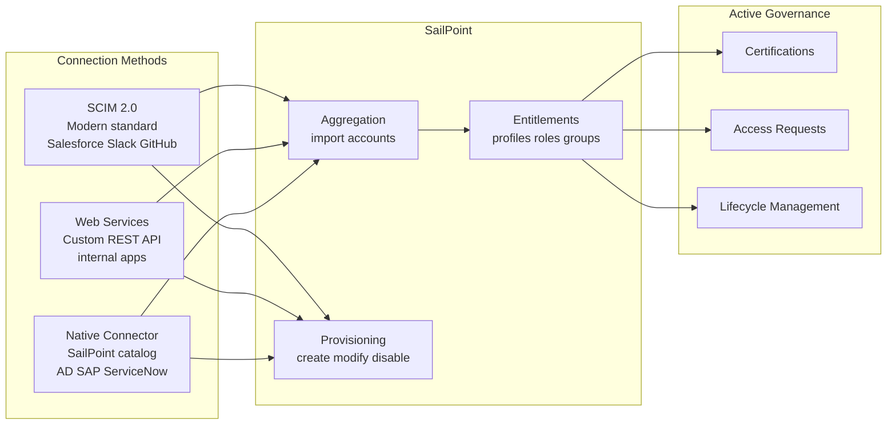

# 02 · Application Onboarding & Provisioning

---

## Why this matters

Every application that enters the organization without being onboarded to SailPoint is a governance blind spot. Users have access that nobody reviews, leavers are not deprovisioned correctly, and auditors find active accounts belonging to people who left months ago.

Onboarding an application to SailPoint means bringing it under the governance umbrella: its accounts become visible, its entitlements become governable, and its provisioning becomes automatable. This lab connects an application using three different methods SCIM (the modern standard), Web Services (REST/SOAP APIs), and a native connector, because in the real world you will encounter all three.

---

## Architecture

---

## Prerequisites

- Active SailPoint ISC tenant
- A Salesforce Developer Edition account (free) for the SCIM connector
- Access to a simple REST API for the Web Services connector (any public test API works)

---

## Lab Walkthrough

### Step 1 · Onboarding via SCIM — configure Salesforce

Go to **Admin → Connections → Sources → Add Source** and select **Salesforce**. The Salesforce connector uses SCIM 2.0, the cleanest standard for integration.

*SCIM 2.0 (RFC 7644) is the standard provisioning protocol if an application supports it, it is always the first choice. It simplifies integration significantly.*

---

### Step 2 · Authorize the connection with Salesforce

Enter your Salesforce Developer Edition credentials or generate a Connected App with OAuth 2.0. Test the connection to confirm connectivity.

*SCIM uses OAuth 2.0 for authentication the token renews automatically. No need to manage static credentials like legacy connectors.*

---

### Step 3 · Run the first Salesforce aggregation

Aggregate Salesforce accounts. Verify that imported users correlate with existing identities in SailPoint using email as the matching field.

*Once aggregated, SailPoint knows who has a Salesforce account, what Profile they have assigned, and when it was created information that was previously invisible to governance.*

---

### Step 4 · Onboarding via Web Services — connect a custom REST API

Add a new Source using the **Web Services** connector. Configure the base endpoint, authentication headers, and HTTP methods to list users (GET /users) and create accounts (POST /users).

*Web Services is the most flexible connector if an application has a REST or SOAP API, you can connect it even without a native connector in the SailPoint catalog.*

---

### Step 5 · Map the Web Services connector schema

Define which fields in the API JSON response map to which Identity Cube attributes in SailPoint (id, username, email, status).

*Schema mapping is where most time is spent with Web Services every API returns JSON with a different structure and SailPoint needs to be taught how to read it.*

---

### Step 6 · Enable write-back provisioning on Salesforce

Activate write operations on the Salesforce Source: Create Account, Update Account, Disable Account, Add to Profile, Remove from Profile.

*With write-back active, SailPoint can automatically create a Salesforce account when a user joins the sales team without any Salesforce admin having to do anything.*

---

### Step 7 · Test end-to-end provisioning

Assign an Access Profile that includes Salesforce access to a test user. Verify in Salesforce that the account was created with the correct Profile assigned.

*End-to-end provisioning is where all the configuration work converts into real value a user gets access without any human having to do anything manually.*

---

### Step 8 · Verify deprovisioning on access revocation

Revoke the Access Profile from the user. Confirm that SailPoint automatically disabled the Salesforce account.

*Automatic deprovisioning is the second most important value after provisioning it eliminates the risk of ex-employees with active access in external applications.*

---

## What I Learned

- **SCIM vs. Web Services vs. native connector** is not an arbitrary choice it depends on what the application supports. SCIM first, native connector if available, Web Services as a last resort. Each level adds configuration complexity.
- The **Web Services connector is powerful but sensitive to API changes** if the target app updates its API and renames fields, the connector breaks. Document the mappings thoroughly.
- I discovered that **some SaaS applications only partially implement SCIM** for example, some systems do not support the PATCH operation, only PUT. SailPoint has workarounds but you need to know about them.
- The **application onboarding timeline** in a real project depends more on the time it takes to get API credentials approved than on the technical configuration in SailPoint. The technical part might take a day; the permissions process, weeks.

---

## Real-World Applications

- Onboarding a newly purchased SaaS application to the governance program in 1-2 days using the SCIM connector, instead of months of ad hoc integration
- Connecting a legacy internal system without a standard API using Web Services over its existing SOAP endpoint
- Ensuring that when a new Sales Rep starts, their Salesforce, Slack, and HubSpot accounts are ready automatically on day one

---

## Resources

- [Source configuration overview](https://documentation.sailpoint.com/saas/help/sources/configure_source.html)
- [SCIM connector guide](https://documentation.sailpoint.com/connectors/scim/help/scim_overview.html)
- [Web Services connector](https://documentation.sailpoint.com/connectors/webservices/help/webservices_overview.html)

