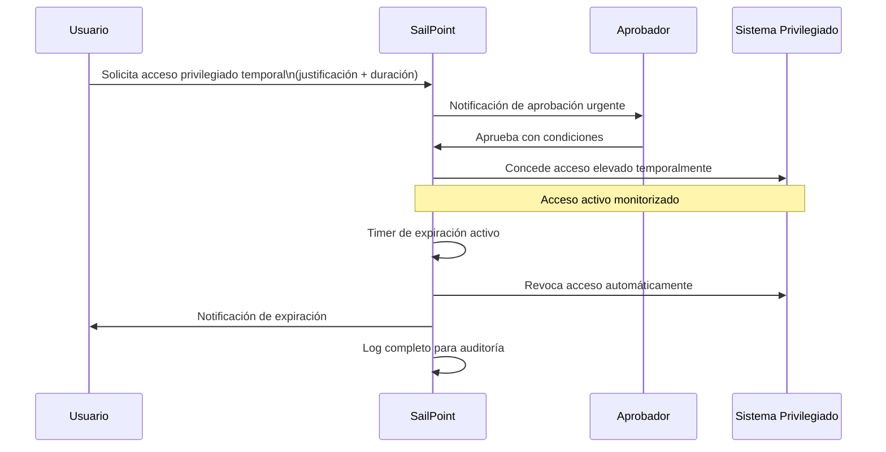
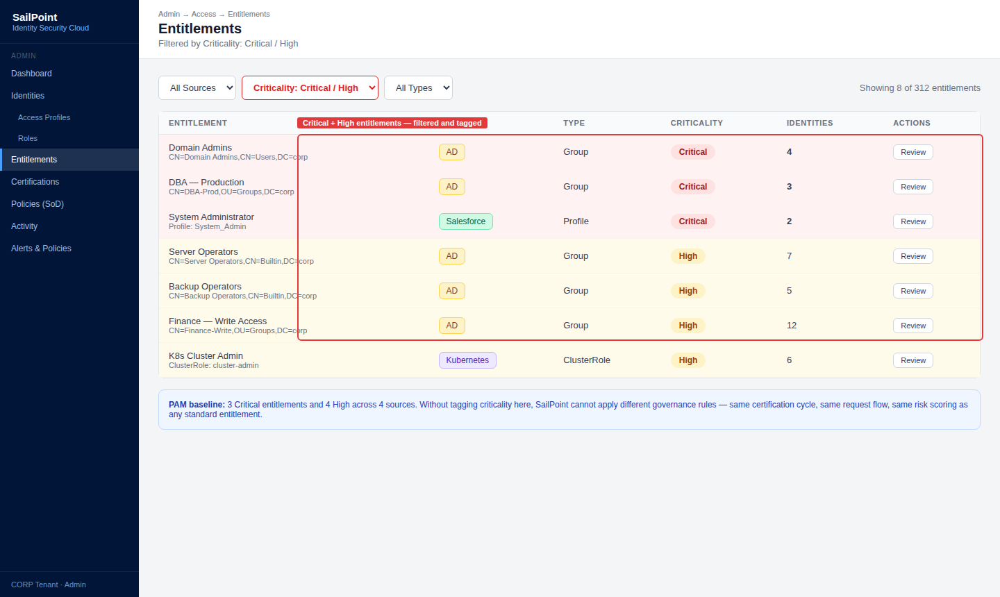
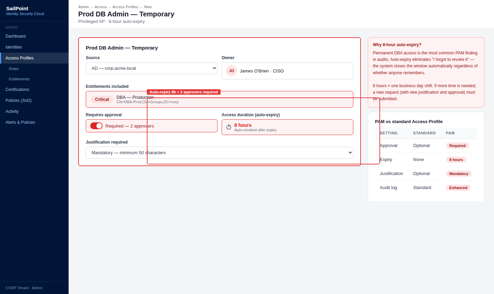
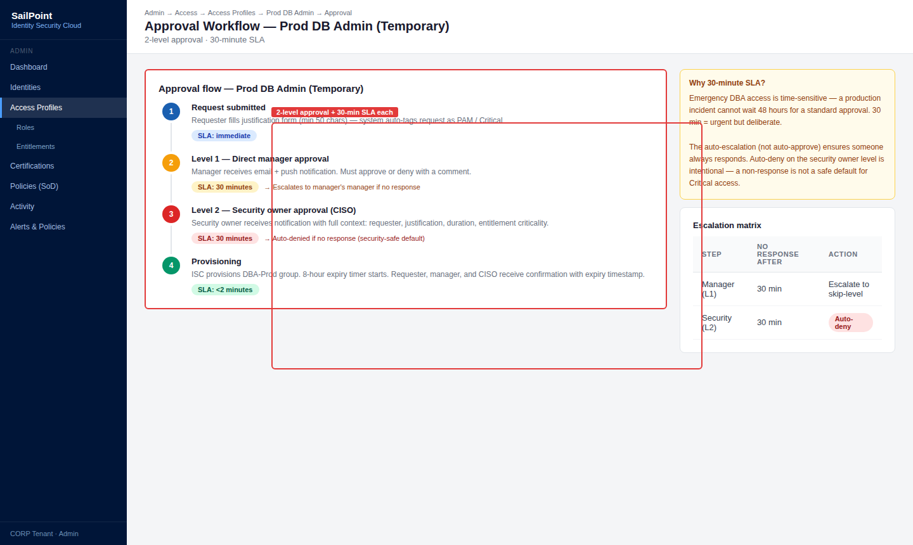
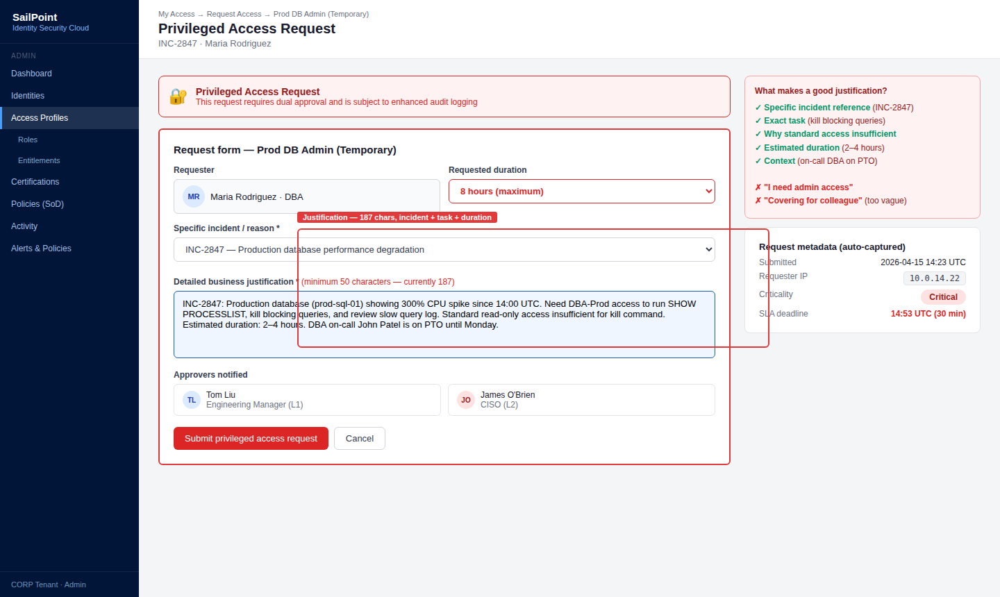
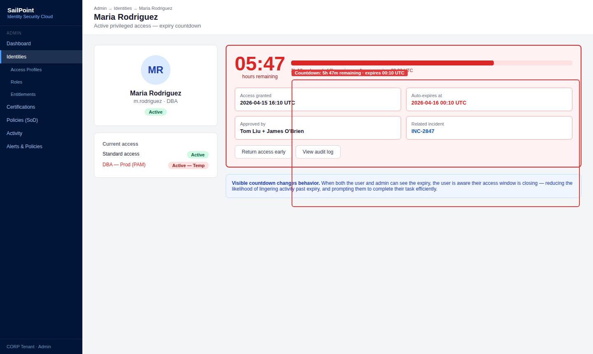
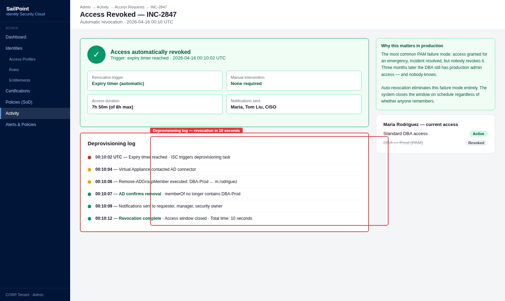
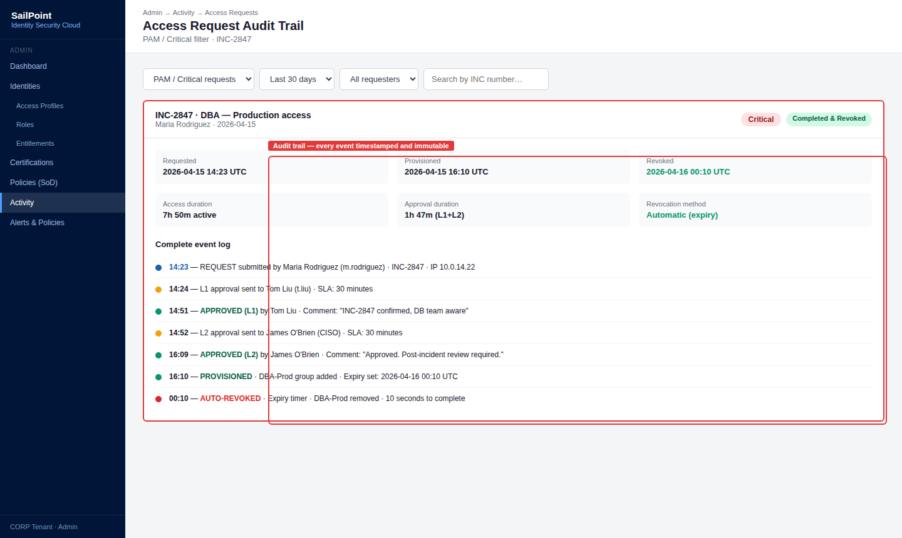
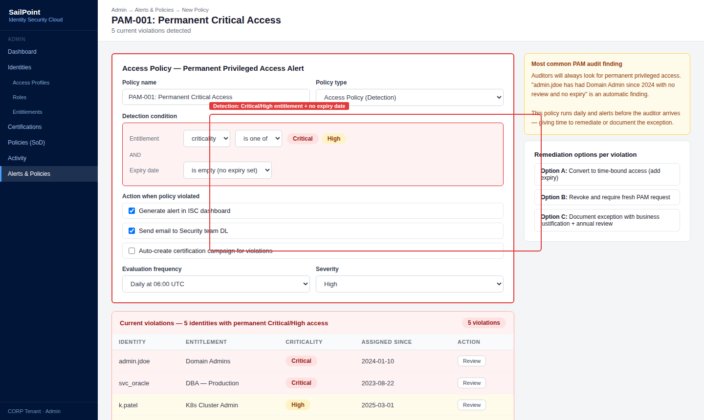

# 03 · Privileged Access Management (PAM)

---

## Why this matters

El 80% de las brechas de seguridad involucran credenciales privilegiadas. Las cuentas de admin, las cuentas de servicio, los accesos a producción son el objetivo número uno de cualquier atacante porque con una sola cuenta privilegiada comprometida se puede mover lateralmente por toda la organización.

El problema tradicional con el acceso privilegiado es que se concede de forma permanente y rara vez se revisa. Un desarrollador recibe acceso de admin a un servidor de producción para resolver un incidente y ese acceso sigue ahí tres años después. PAM en SailPoint cierra ese ciclo: el acceso privilegiado se concede temporalmente, se revisa continuamente y se revoca automáticamente cuando ya no es necesario.

---

## Architecture

---

## Prerequisites

- Tenant de SailPoint ISC activo con Sources configurados
- Entitlements de alta criticidad identificados y etiquetados en el Source
- Usuarios con roles de aprobador configurados

---

## Lab Walkthrough

### Step 1 · Identificar y etiquetar entitlements privilegiados

Ve a **Admin → Access → Entitlements** y filtra los entitlements de mayor riesgo cuentas de admin, accesos a producción, permisos de DBA. Etiquétalos con criticidad **High** o **Critical**.

*El etiquetado de criticidad es el primer paso del PAM sin saber qué es privilegiado, no puedes gobernarlo de forma diferenciada.*

---

### Step 2 · Crear un Access Profile para acceso privilegiado temporal

Crea un Access Profile específico para el acceso privilegiado (ejemplo: "Prod DB Admin Temporal"). Configúralo con aprobación requerida y expiración automática de 8 horas.

*La expiración automática es el control más importante del PAM elimina el riesgo de acceso permanente innecesario sin depender de que alguien recuerde revocar manualmente.*

---

### Step 3 · Configurar el flujo de aprobación acelerado

Define un flujo de aprobación express para accesos privilegiados: aprobación del manager directo Y del responsable de seguridad, con SLA de 30 minutos antes de escalado automático.

*El SLA de 30 minutos refleja la urgencia típica de accesos privilegiados si alguien necesita acceso admin de emergencia, no puede esperar 48 horas.*

---

### Step 4 · Solicitar acceso privilegiado como usuario

Inicia sesión como usuario de prueba y solicita el Access Profile de acceso privilegiado. Incluye una justificación detallada: incidente, tarea específica, duración estimada.

*La justificación en accesos privilegiados es obligatoria en cualquier auditoría "necesito acceso admin" no es suficiente. La justificación debe ser específica y verificable.*

---

### Step 5 · Aprobar y monitorizar el acceso concedido

Como aprobador, revisa y aprueba la solicitud. Ve al perfil del usuario y confirma que el acceso está activo con una fecha de expiración visible.

*El contador de expiración visible tanto para el usuario como para el admin crea conciencia de que el acceso es temporal — cambia el comportamiento respecto al acceso permanente.*

---

### Step 6 · Verificar la revocación automática al expirar

Espera a que expire el acceso (o ajusta el timer para la demostración). Confirma que SailPoint revocó el acceso automáticamente sin intervención manual.

*La revocación automática es la garantía de que PAM funciona incluso cuando nadie está prestando atención el sistema se encarga de cerrar el acceso.*

---

### Step 7 · Revisar el audit trail del acceso privilegiado

Ve a **Activity → Access Requests** y busca la solicitud procesada. Revisa el log completo: solicitud, justificación, aprobación, concesión, tiempo activo y revocación.

*Este log es la evidencia de control PAM para auditores demuestra que el acceso privilegiado estuvo controlado, justificado, aprobado y revocado en el tiempo definido.*

---

### Step 8 · Configurar alertas para accesos privilegiados sin expiración

Crea una Access Policy que detecte identidades con entitlements de criticidad High asignados de forma permanente (sin expiración) y genere una alerta para revisión.

*Los accesos privilegiados permanentes son el hallazgo más común en auditorías PAM detectarlos automáticamente permite remediarlos antes de que llegue el auditor.*

---

## What I Learned

- **Just-in-Time (JIT) access es el modelo ideal para PAM** conceder acceso solo cuando se necesita, por el tiempo que se necesita, con justificación. SailPoint no tiene JIT nativo completo pero se puede aproximar con Access Profiles con expiración.
- La diferencia entre **PAM en SailPoint** y herramientas dedicadas como CyberArk o BeyondTrust: SailPoint gestiona el ciclo de vida y la revisión del acceso privilegiado; las herramientas PAM dedicadas también gestionan la rotación automática de credenciales y sesiones grabadas. En proyectos enterprise, se usan juntas.
- **Las cuentas de servicio son el punto ciego del PAM** nadie las revisa porque "son técnicas" y no tienen dueño humano claro. Identificarlas y asignarles propietario es una de las tareas más urgentes en cualquier proyecto.
- Aprendí que **el número de accesos privilegiados activos es un KPI de madurez de seguridad** reducirlo progresivamente mes a mes demuestra mejora continua en el posture de identidad.

---

## Real-World Applications

- Eliminar el acceso permanente de admin de producción a los desarrolladores, reemplazándolo por solicitudes JIT aprobadas por el equipo de ops
- Detectar y revocar cuentas de admin "de emergencia" que se crearon hace años y nadie recuerda que existen
- Cumplir con el control A.9.2.3 de ISO 27001 (gestión de acceso privilegiado) con evidencia automatizada de SailPoint

---

## Resources

- [Privileged Access in SailPoint ISC](https://documentation.sailpoint.com/saas/help/access/privileged_access.html)
- [Time-limited access requests](https://documentation.sailpoint.com/saas/help/access/access_request_expiration.html)
- [SailPoint PAM integration overview](https://www.sailpoint.com/solutions/privileged-access/)

