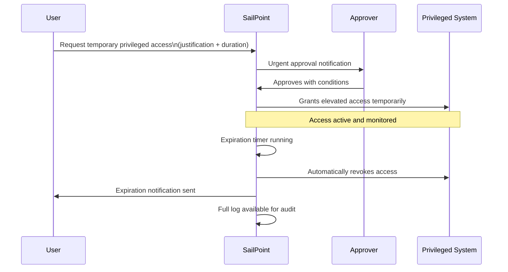

# 03 · Privileged Access Management (PAM)

---

## Why this matters

80% of security breaches involve privileged credentials. Admin accounts, service accounts, production access these are the primary targets of any attacker, because a single compromised privileged account can allow lateral movement across the entire organization.

The traditional problem with privileged access is that it gets granted permanently and rarely reviewed. A developer receives admin access to a production server to resolve an incident, and that access remains three years later. PAM in SailPoint closes that loop: privileged access is granted temporarily, reviewed continuously, and automatically revoked when no longer needed.

---

## Architecture

---

## Prerequisites

- Active SailPoint ISC tenant with Sources configured
- High-criticality entitlements identified and tagged in at least one Source
- Users with approver roles configured in the Identity Cube

---

## Lab Walkthrough

### Step 1 · Identify and tag privileged entitlements

Go to **Admin → Access → Entitlements** and filter for the highest-risk entitlements admin accounts, production access, DBA permissions. Tag them with criticality **High** or **Critical**.

*Tagging criticality is the first step in PAM without knowing what is privileged, you cannot govern it differently from standard access.*

---

### Step 2 · Create an Access Profile for temporary privileged access

Create an Access Profile specifically for privileged access (e.g., "Prod DB Admin — Temporary"). Configure it with required approval and automatic expiration after 8 hours.

*Automatic expiration is the most important PAM control — it eliminates the risk of permanent unnecessary access without relying on someone remembering to revoke it manually.*

---

### Step 3 · Configure an accelerated approval workflow

Define an express approval flow for privileged access: approval from the direct manager AND the security owner, with a 30-minute SLA before automatic escalation.

*The 30-minute SLA reflects the typical urgency of privileged access if someone needs emergency admin access, they cannot wait 48 hours for a response.*

---

### Step 4 · Request privileged access as a test user

Log in as a test user and request the privileged Access Profile. Include a detailed business justification: the specific incident, the task to be performed, and the estimated duration needed.

*Business justification for privileged access is mandatory in any audit "I need admin access" is not sufficient. "Covering colleague X during their leave until June 30" is.*

---

### Step 5 · Approve and monitor the granted access

As the approver, review and approve the request. Go to the user's profile and confirm that the access is active with a visible expiration timestamp.

*The visible expiration counter, shown to both the user and the admin, creates awareness that the access is temporary it changes behavior compared to permanent access.*

---

### Step 6 · Verify automatic revocation on expiration

Wait for the access to expire (or reduce the timer for the demo). Confirm that SailPoint automatically revoked the access without any manual intervention.

*Automatic revocation is the guarantee that PAM works even when nobody is paying attention the system closes the access window on schedule.*

---

### Step 7 · Review the privileged access audit trail

Go to **Activity → Access Requests** and find the processed request. Review the complete log: who requested it, when, who approved it, when it was provisioned, how long it was active, and when it was revoked.

*This log is the PAM control evidence for auditors it proves that privileged access was controlled, justified, approved, and revoked within the defined time window.*

---

### Step 8 · Configure alerts for permanent privileged access

Create an Access Policy that detects identities with High-criticality entitlements assigned permanently (without expiration) and generates an alert for review.

*Permanent privileged access is the most common finding in PAM audits  detecting it automatically allows remediation before the auditor arrives.*

---

## What I Learned

- **Just-in-Time (JIT) access is the ideal PAM model** grant access only when needed, for as long as needed, with justification. SailPoint does not have fully native JIT but it can be closely approximated with expiring Access Profiles.
- The difference between **PAM in SailPoint** and dedicated tools like CyberArk or BeyondTrust: SailPoint manages the lifecycle and review of privileged access; dedicated PAM tools also handle automatic credential rotation and recorded sessions. In enterprise projects, both are used together.
- **Service accounts are the PAM blind spot** nobody reviews them because "they are technical" and have no clear human owner. Identifying them and assigning an owner is one of the most urgent tasks in any IGA project.
- I learned that **the number of active privileged accesses is a security maturity KPI** progressively reducing it month over month demonstrates continuous improvement in identity posture.

---

## Real-World Applications

- Eliminating permanent production admin access for developers, replacing it with JIT requests approved by the ops team
- Detecting and revoking "emergency" admin accounts created years ago that nobody remembers still exist
- Meeting ISO 27001 control A.9.2.3 (privileged access management) with automated evidence from SailPoint

---

## Resources

- [Privileged Access in SailPoint ISC](https://documentation.sailpoint.com/saas/help/access/privileged_access.html)
- [Time-limited access requests](https://documentation.sailpoint.com/saas/help/access/access_request_expiration.html)
- [SailPoint PAM integration overview](https://www.sailpoint.com/solutions/privileged-access/)
