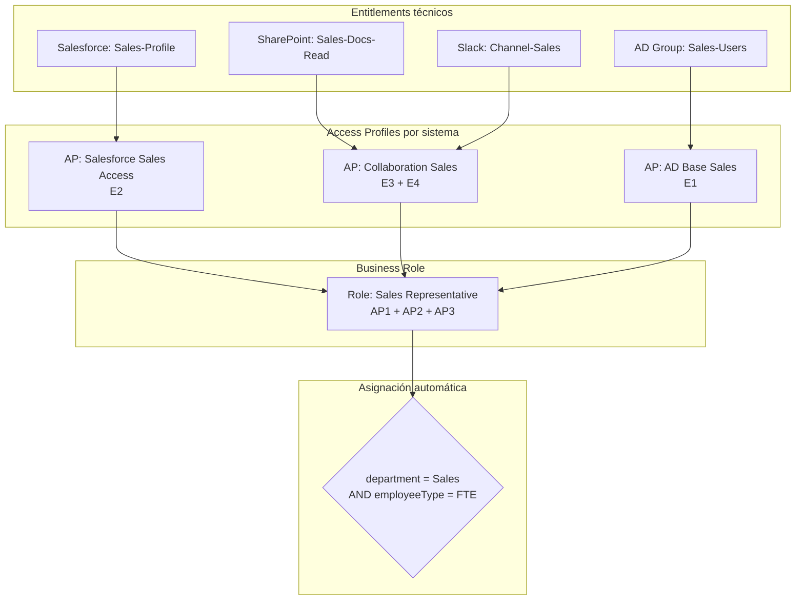

# 04 · Roles & Access Profiles

---

## Why this matters

Sin un modelo de roles claro, el acceso en una empresa crece de forma orgánica y caótica: cada persona tiene una combinación única de permisos acumulados con el tiempo, y nadie sabe exactamente qué acceso tiene quién ni por qué. Los auditores lo llaman "access sprawl" y es uno de los hallazgos más frecuentes en auditorías de seguridad.

Roles y Access Profiles son la arquitectura del acceso la forma en que SailPoint organiza los permisos en paquetes coherentes con el negocio. Un Access Profile agrupa entitlements técnicos de un sistema. Un Role agrupa Access Profiles de múltiples sistemas y representa un puesto de trabajo real. Este lab diseña ese modelo desde cero, con asignación automática basada en atributos de identidad.

---

## Architecture

---

## Prerequisites

- Labs 01-03 completados Sources configurados con entitlements importados
- Usuarios con atributos de department y employeeType disponibles en el Identity Cube

---

## Lab Walkthrough

### Step 1 · Crear el primer Access Profile

Ve a **Admin → Access → Access Profiles → Create**. Crea un Access Profile llamado "Salesforce — Sales Access" que incluya el entitlement de Salesforce Sales Profile.

*Los Access Profiles son la unidad básica del acceso agrupan entitlements del mismo Source. Un Access Profile bien definido tiene un propósito claro y un propietario identificado.*

---

### Step 2 · Configurar el propietario y la descripción del Access Profile

Asigna un propietario (el responsable de la aplicación, no IT) y añade una descripción en lenguaje de negocio que explique para qué sirve este acceso.

*El propietario del Access Profile es quien aprueba las solicitudes de acceso y quien revisa en las certification campaigns asignar a alguien con autoridad real sobre el recurso.*

---

### Step 3 · Crear Access Profiles para cada sistema

Repite el proceso para cada Source: uno para AD, uno para SharePoint, uno para Slack. Cada Access Profile representa el acceso en ese sistema específico.

*La granularidad de los Access Profiles es una decisión de diseño demasiado granulares y el modelo se vuelve inmanejable; demasiado amplios y pierdes control sobre qué acceso se da.*

---

### Step 4 · Crear el Business Role

Ve a **Admin → Access → Roles → Create Role**. Crea el Role "Sales Representative" de tipo Business Role y añade los tres Access Profiles creados anteriormente.

*Un Business Role representa un puesto de trabajo real "Sales Representative" tiene sentido para un manager de ventas. "CN=GG_AD_SALES_USERS" no lo tiene.*

---

### Step 5 · Configurar la asignación automática del Role

En la pestaña Assignment del Role, define la regla: si `department = "Sales"` AND `employeeType = "FTE"`, asignar automáticamente este Role.

*La asignación automática transforma el onboarding un nuevo Sales FTE recibe todos sus accesos en la siguiente agregación, sin tickets de IT.*

---

### Step 6 · Configurar el Role como requestable

Activa la opción **Requestable** en el Role para que usuarios de otros departamentos puedan solicitarlo temporalmente si necesitan colaborar con el equipo de ventas.

*No todos los Roles deberían ser requestables los Roles con accesos muy sensibles (admin, finanzas) deberían ser solo-asignación. Los Roles de colaboración pueden ser requestables.*

---

### Step 7 · Verificar la asignación automática con un usuario nuevo

Crea un usuario de prueba con `department = Sales` y `employeeType = FTE`. En la próxima agregación, confirma que el Role se asignó automáticamente y los Access Profiles fueron aprovisionados.

*Este momento ver cómo el sistema aprovisiona todo el acceso necesario sin intervención humana es cuando el modelo de roles demuestra su valor real.*

---

### Step 8 · Analizar el Role en el Role Overview

Revisa el Role Overview: cuántos usuarios lo tienen, qué Access Profiles incluye, si hay usuarios con el Role pero sin todos los Access Profiles aprovisionados (inconsistencias).

*Las inconsistencias en el Role Overview (usuario tiene el Role pero le falta un Access Profile) indican errores de aprovisionamiento que hay que investigar.*

---

## What I Learned

- La jerarquía **Entitlement → Access Profile → Role** tiene una lógica clara una vez que la ves aplicada: Entitlement es el permiso técnico; Access Profile es el acceso en un sistema; Role es el puesto de trabajo. Cada capa añade contexto de negocio.
- **El naming convention de los Access Profiles importa más de lo que parece** en proyectos grandes. Usar el formato `[Sistema] [Función] [Nivel]` (ejemplo: "Salesforce — Sales — Standard") hace el modelo mantenible a largo plazo.
- Descubrí que los **Roles anidados** (un Role que incluye otros Roles) son posibles en SailPoint pero añaden complejidad. Para empezar, mantén la jerarquía plana.
- **Access Profile sin propietario = nadie lo revisa en las certifications**. Asignar propietario es obligatorio, no opcional, si quieres que la governance funcione en la práctica.

---

## Real-World Applications

- Reducir el tiempo de onboarding de un Sales Rep de 2 semanas (esperando tickets de IT) a menos de 1 hora mediante asignación automática de Role
- Dar acceso de colaboración temporal a un consultor externo asignándole un Role requestable con expiración de 30 días
- Detectar en una auditoría que el 40% de los usuarios del departamento de ventas tienen accesos que no corresponden a ningún Role definidopunto de partida para un proyecto de role mining

---

## Resources

- [Roles in SailPoint ISC](https://documentation.sailpoint.com/saas/help/access/roles.html)
- [Access Profiles](https://documentation.sailpoint.com/saas/help/access/access_profiles.html)
- [Role assignment rules](https://documentation.sailpoint.com/saas/help/access/role_assignment.html)

