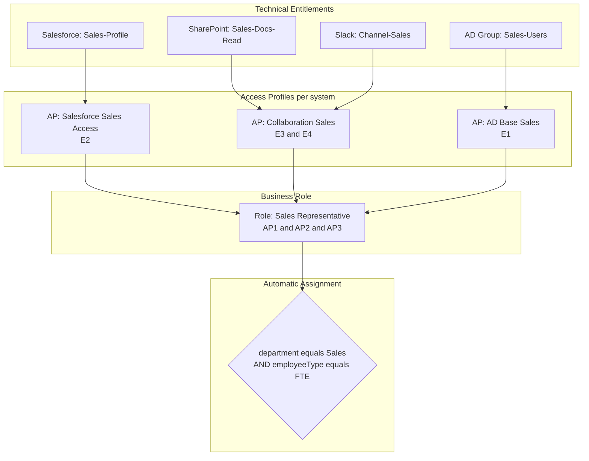
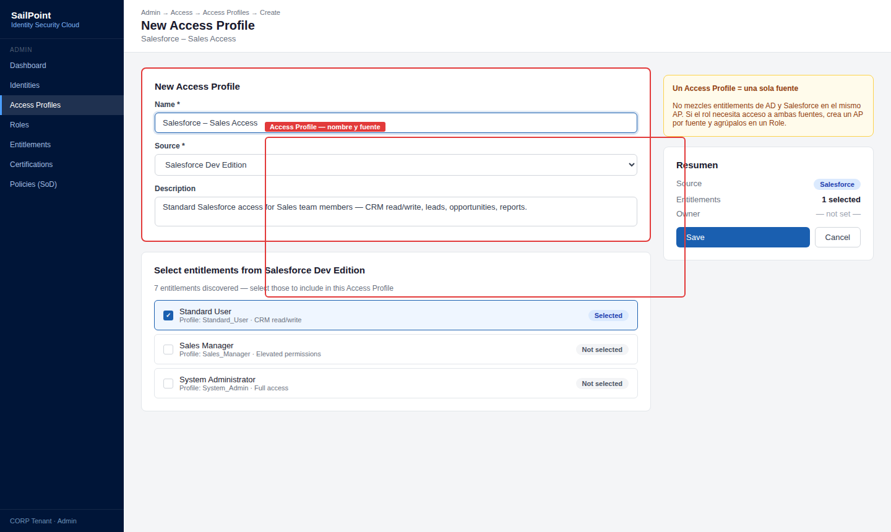
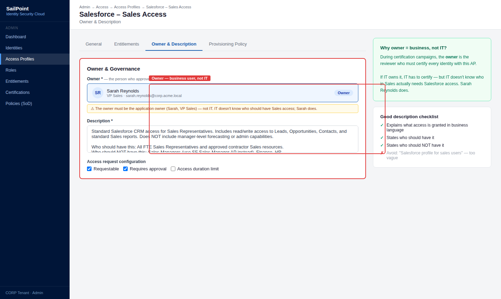
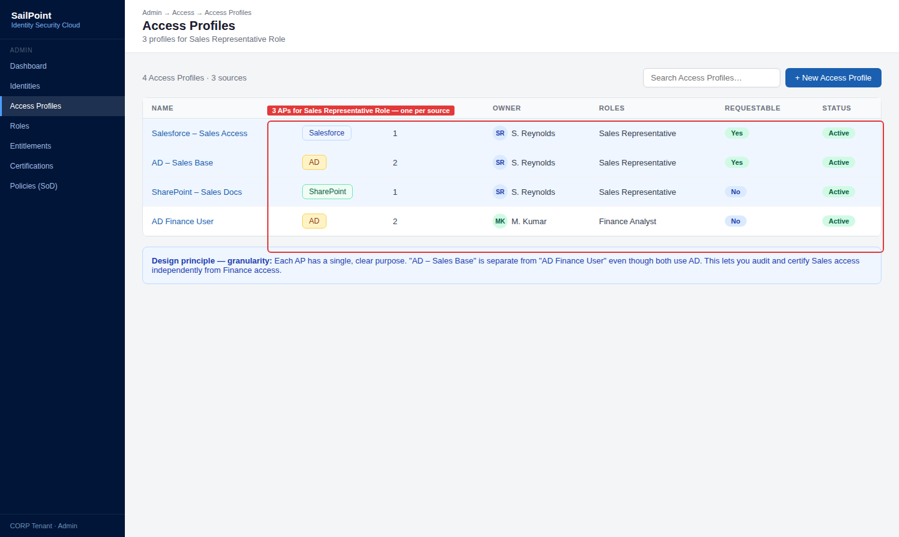
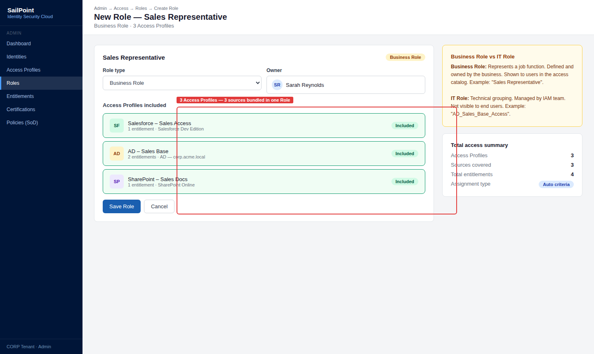
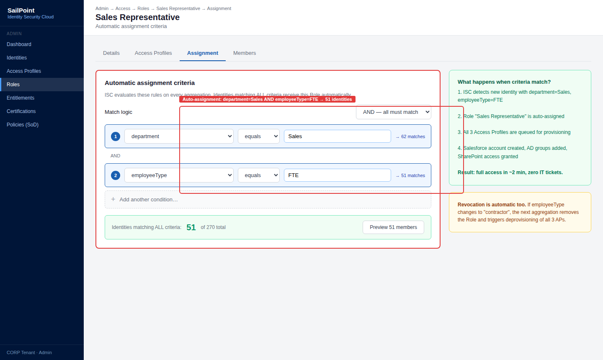
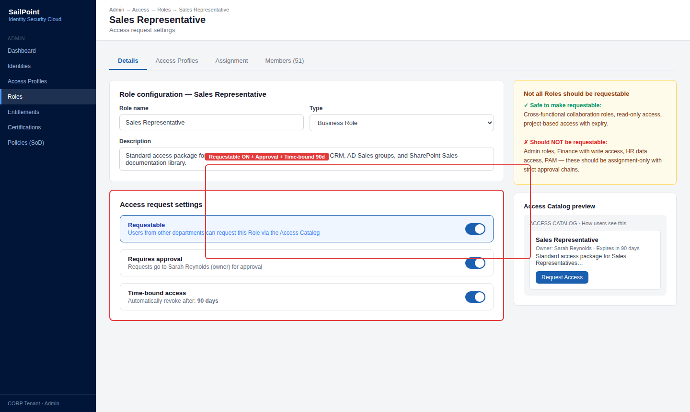
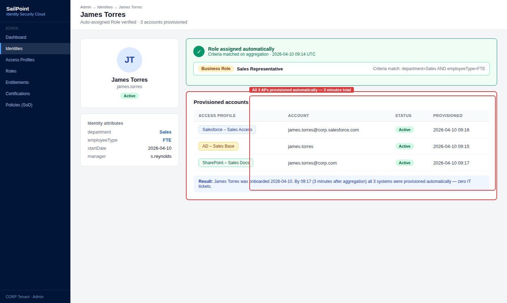
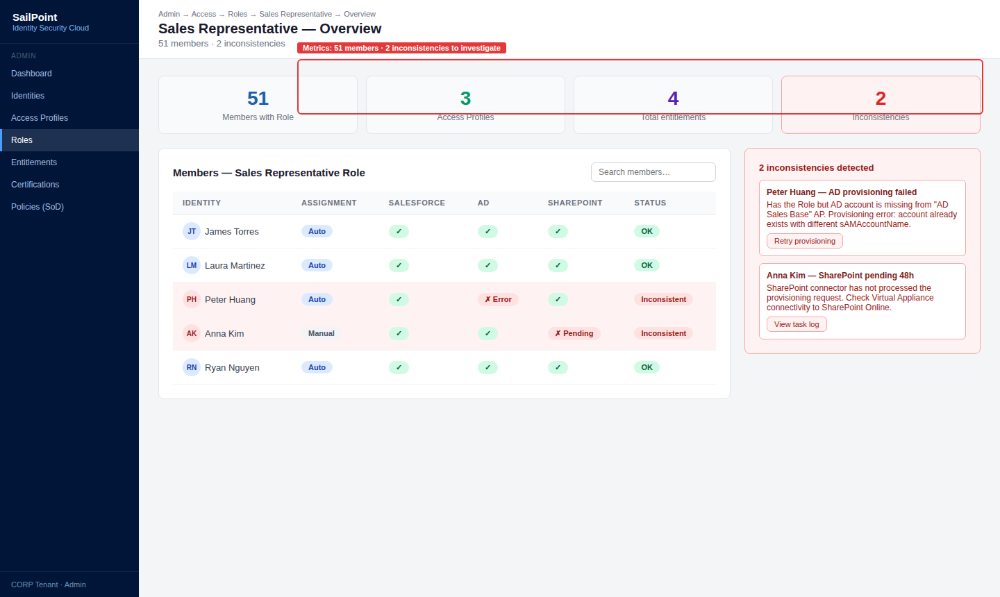

# 04 · Roles & Access Profiles

---

## Why this matters

Without a clear role model, access in an organization grows organically and chaotically each person accumulates a unique combination of permissions over time, and nobody knows exactly who has what or why. Auditors call this "access sprawl" and it is one of the most frequent findings in security audits.

Roles and Access Profiles are the architecture of access the way SailPoint organizes permissions into packages that make sense to the business. An Access Profile groups technical entitlements from one system. A Role groups Access Profiles from multiple systems and represents a real job function. This lab designs that model from scratch, with automatic assignment driven by identity attributes.

---

## Architecture

---

## Prerequisites

- Labs 01-03 completed Sources configured with imported entitlements
- Users with department and employeeType attributes available in the Identity Cube

---

## Lab Walkthrough

### Step 1 · Create the first Access Profile

Go to **Admin → Access → Access Profiles → Create**. Create an Access Profile called "Salesforce – Sales Access" that includes the Salesforce Sales Profile entitlement.

*Access Profiles are the basic unit of access they group entitlements from the same Source. A well-defined Access Profile has a clear purpose and an identified owner.*

---

### Step 2 · Configure the owner and description

Assign an owner (the application owner, not IT) and add a business-language description explaining what this access is for and who should have it.

*The Access Profile owner is the person who approves access requests and who reviews during certification campaigns assign someone with real authority over the resource.*

---

### Step 3 · Create Access Profiles for each system

Repeat the process for each Source: one for AD, one for SharePoint, one for Slack. Each Access Profile represents the access package for that specific system.

*The granularity of Access Profiles is a design decision too granular and the model becomes unmanageable; too broad and you lose control over what access is being granted.*

---

### Step 4 · Create the Business Role

Go to **Admin → Access → Roles → Create Role**. Create the "Sales Representative" Role of type Business Role and add the three Access Profiles created previously.

*A Business Role represents a real job function "Sales Representative" makes sense to a sales manager. "CN=GG_AD_SALES_USERS" does not.*

---

### Step 5 · Configure automatic Role assignment

In the Role's Assignment tab, define the rule: if `department = "Sales"` AND `employeeType = "FTE"`, automatically assign this Role.

*Automatic assignment is what makes the onboarding process work a new Sales FTE receives all their access in the next aggregation cycle, without any IT tickets.*

---

### Step 6 · Make the Role requestable

Enable the **Requestable** option on the Role so that users from other departments can request it temporarily if they need to collaborate with the sales team on a project.

*Not all Roles should be requestable those with highly sensitive access (admin, finance) should be assignment-only. Collaboration Roles can safely be requestable.*

---

### Step 7 · Verify automatic assignment with a new user

Create a test user with `department = Sales` and `employeeType = FTE`. After the next aggregation, confirm the Role was assigned automatically and all Access Profiles were provisioned.

*This moment watching the system provision all the right access without any human intervention is when the role model proves its real value.*

---

### Step 8 · Analyze the Role in the Role Overview

Review the Role Overview: how many users have it assigned, what Access Profiles it includes, and whether there are any users with the Role but missing provisioned Access Profiles (inconsistencies).

*Inconsistencies in the Role Overview indicate provisioning errors that need investigation a user with the Role but missing an Access Profile is not getting the expected access.*

---

## What I Learned

- The **Entitlement → Access Profile → Role** hierarchy has a clear logic once you see it applied: Entitlement is the technical permission; Access Profile is the access package for one system; Role is the job function. Each layer adds business context.
- **Access Profile naming matters more than it seems** in large projects. Using a format like `[System] , [Function] , [Level]` (e.g., "Salesforce — Sales — Standard") keeps the model maintainable long-term.
- I discovered that **nested Roles** (a Role including other Roles) are possible in SailPoint but add complexity. For beginners, keep the hierarchy flat.
- **Access Profiles without an owner will not be reviewed in certifications**. Assigning an owner is mandatory, not optional, if you want governance to work in practice.

---

## Real-World Applications

- Reducing onboarding time for a Sales Rep from 2 weeks (waiting for IT tickets) to under 1 hour through automatic Role assignment
- Granting a consultant temporary collaboration access by assigning them a requestable Role with a 30-day expiration
- Discovering during an audit that 40% of sales department users have access that does not belong to any defined Role the starting point for a role mining project

---

## Resources

- [Roles in SailPoint ISC](https://documentation.sailpoint.com/saas/help/access/roles.html)
- [Access Profiles](https://documentation.sailpoint.com/saas/help/access/access_profiles.html)
- [Role assignment rules](https://documentation.sailpoint.com/saas/help/access/role_assignment.html)
