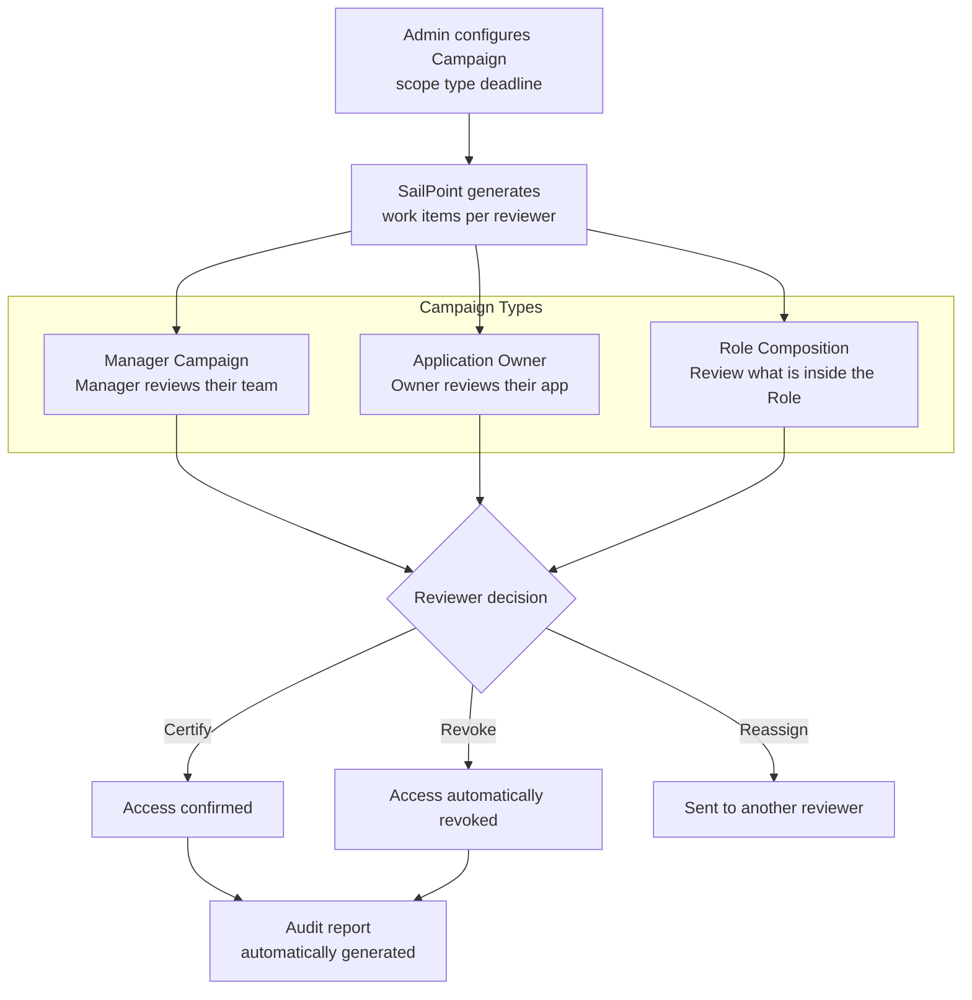
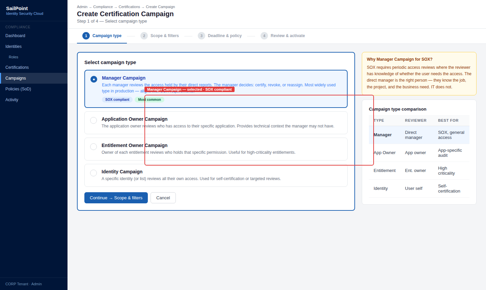
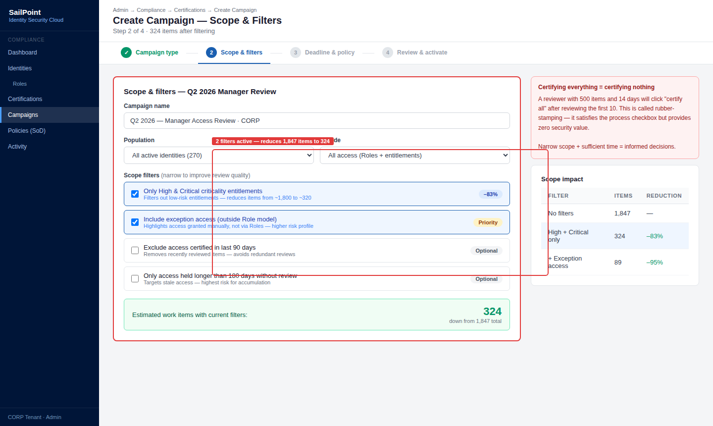
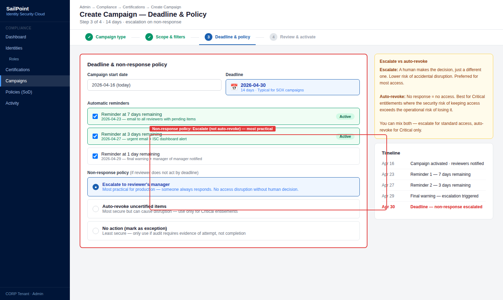
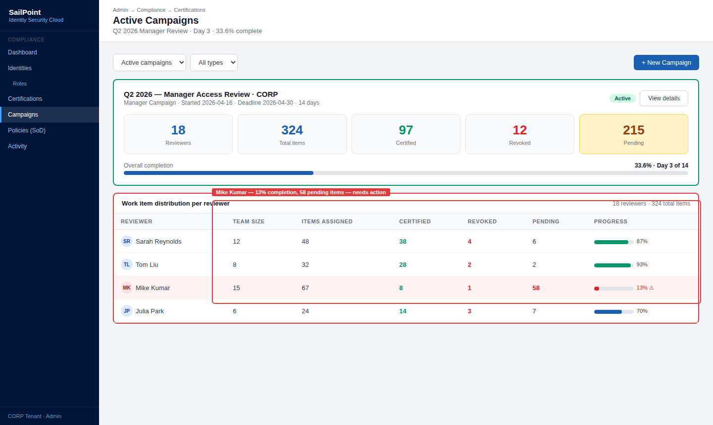
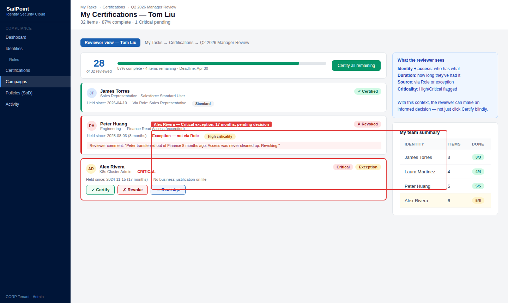
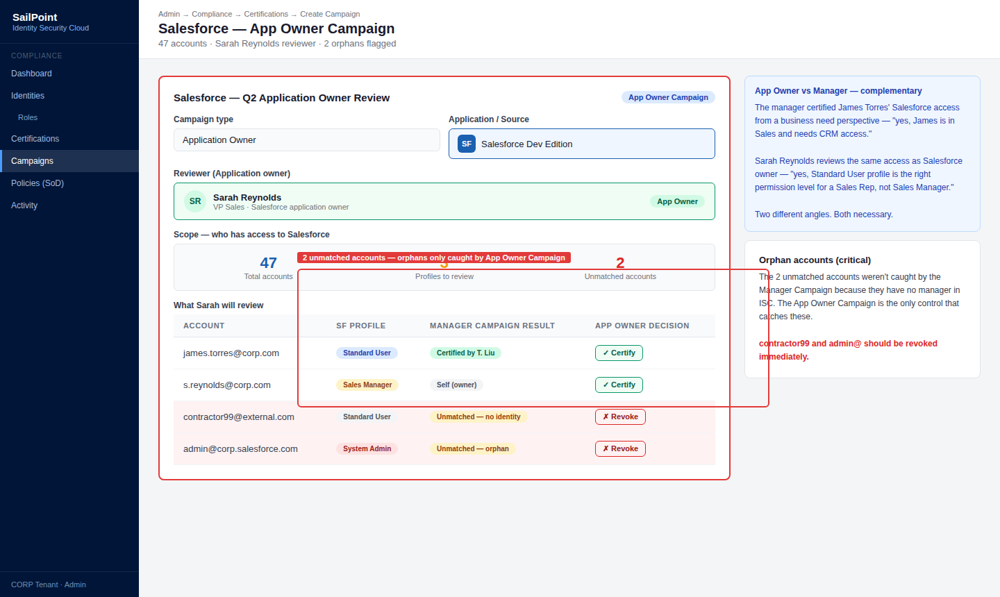
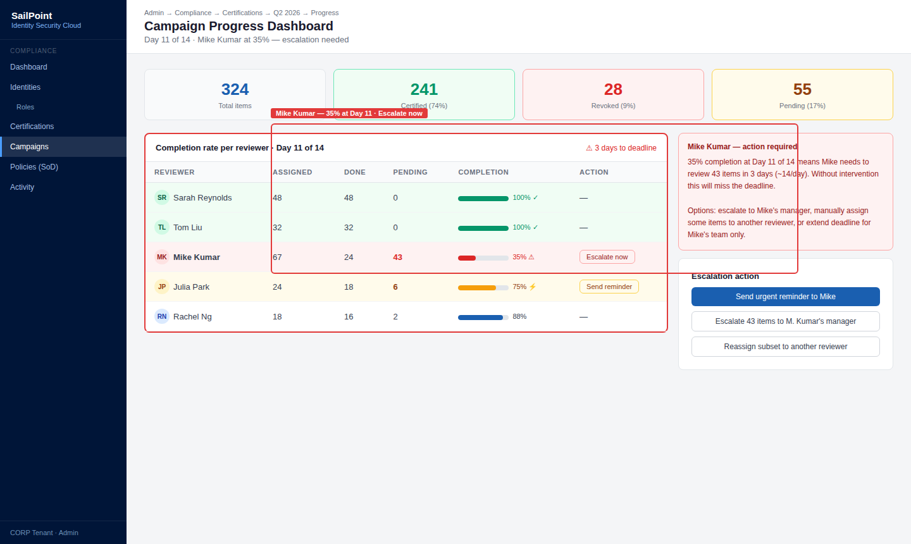
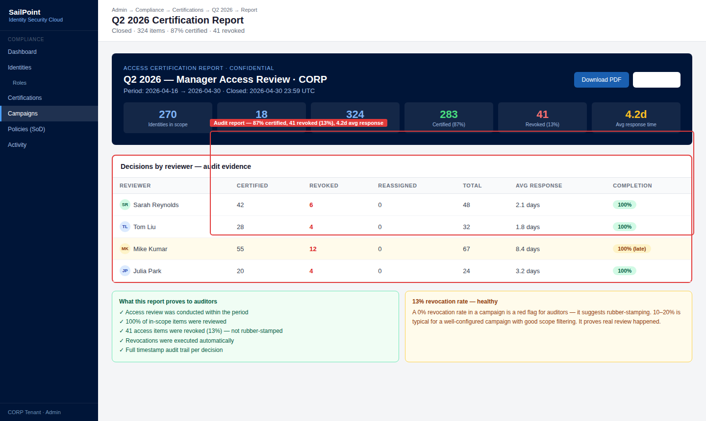

# 05 · Certification Campaigns

---

## Why this matters

Granting access is easy. The problem is that access is rarely revoked. People change roles, take on temporary projects, cover for colleagues and permissions accumulate without anyone cleaning them up. Over time, an employee can hold access from five different roles they have occupied over the years.

Certification Campaigns are the systematic answer to that accumulation: a periodic, formalized review where managers, application owners, and directors confirm whether each piece of access their users hold is still needed and appropriate. This lab builds three distinct campaign types Manager, Application Owner, and Role Composition because each one answers a different audit question.

---

## Architecture

---

## Prerequisites

- Labs 01-04 completed users with Role and Access Profile assignments
- Users configured with a manager in the Identity Cube
- At least one application or Access Profile owner defined

---

## Lab Walkthrough

### Step 1 · Create a Manager Certification Campaign

Go to **Admin → Compliance → Certifications → Create Campaign**. Select **Manager** type and define the scope: all access held by all direct reports of each manager.

*The Manager Campaign is the most widely used type it delegates the access decision to the person who best knows the user and their job. It is the control SOX auditors value most.*

---

### Step 2 · Configure scope and filters

Adjust the scope to include only high-criticality entitlements or only access held outside of standard Roles (exception access). Narrowing the scope increases the quality of the review.

*Certifying everything is inefficient and creates rubber-stamping reviewing 500 items in 3 days leads to approving without looking. Narrow scope and sufficient time equals quality review.*

---

### Step 3 · Set the deadline and non-response policy

Define the deadline (14 days is typical), automatic reminders at 7 and 3 days, and what happens if the reviewer does not respond: escalate to their manager or auto-revoke.

*The non-response policy defines the default security posture "no response equals revoke" is more secure but can cause disruptions; "escalate" is the most practical balance in production.*

---

### Step 4 · Activate the campaign and review generated work items

Activate the campaign. Go to **Admin → Compliance → Certifications** and review how many work items were generated and how they are distributed across reviewers.

*A reviewer with more than 200 items in a single campaign needs support consider splitting the scope or extending the deadline. Overload is the main enemy of review quality.*

---

### Step 5 · Review from the manager perspective

Log in as a manager. Go to **My Tasks → Certifications** and review the work items. For each access item, decide: Certify, Revoke, or Reassign.

*The reviewer sees who has the access, when it was obtained, whether it is part of a Role or an exception, and the criticality level. With that information, the decision should be informed.*

---

### Step 6 · Create an Application Owner Campaign

Return as admin and create a second campaign of type **Application Owner**. In this one, the Salesforce owner reviews who has access to their application, independent of the manager hierarchy.

*The Application Owner Campaign complements the Manager Campaign the app owner has technical context that the manager does not have about whether a specific access is appropriate.*

---

### Step 7 · Monitor progress and send reminders

As admin, review the campaign progress dashboard. Identify reviewers with a low completion rate and send manual reminders or trigger escalation.

*The compliance team monitors this dashboard daily during an active campaign a low completion rate three days before the deadline is a warning signal that needs immediate action.*

---

### Step 8 · Close the campaign and download the audit report

Once the campaign completes, close it and download the report as a PDF. Review the metrics: percentage certified, percentage revoked, decisions per reviewer, average response time.

*This PDF is the document you hand to the auditor as access control evidence it includes the timestamp, reviewed scope, decisions taken, and actions executed.*

---

## What I Learned

- **Three campaign types answer three different audit questions.** Manager: "Does the manager know what access their team has?" Application Owner: "Does the app owner know who accesses their resource?" Role Composition: "Do the Roles contain the correct access?" Each has its place.
- **Rubber-stamping** (approving everything without reviewing) is the biggest risk of certifications it makes the control exist on paper but not in reality. Narrow scope, sufficient time, and reviewer training are the countermeasures.
- I learned that **access without an assigned Role** (exceptions) are the most important items to review they are precisely the ones most likely to be inappropriate. Filtering campaigns to prioritize those is a good practice.
- The difference between **campaign closed** (deadline reached) and **campaign signed off** (all items reviewed) matters for audit — a closed campaign with pending items has a record of what was left unreviewed.

---

## Real-World Applications

- Meeting the SOX requirement to quarterly review access to financial systems, with automated evidence of who reviewed what and when
- Detecting and revoking access creep accumulated by employees who have changed roles three times over the past two years
- Reducing the attack surface by eliminating high-criticality access that nobody uses, identified during the campaign using activity data

---

## Resources

- [Certification Campaigns overview](https://documentation.sailpoint.com/saas/help/certifications/certifications.html)
- [Campaign types](https://documentation.sailpoint.com/saas/help/certifications/campaign_types.html)
- [Certification best practices](https://community.sailpoint.com/t5/IdentityNow-Articles/Best-Practices-for-Certification-Campaigns/ta-p/76863)
