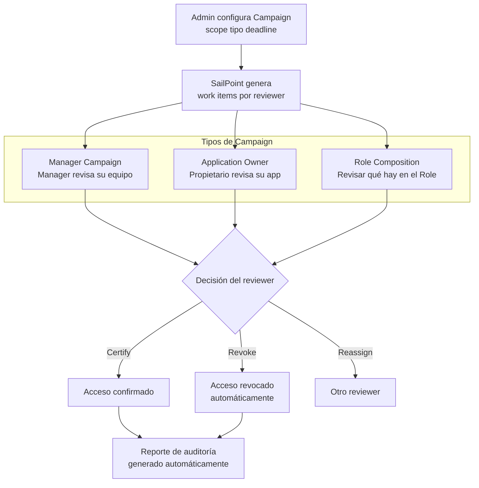

# 05 · Certification Campaigns

---

## Why this matters

Conceder acceso es fácil. El problema es que el acceso raramente se revoca. Las personas cambian de rol, asumen proyectos temporales, cubren a compañeros y los permisos se acumulan sin que nadie los limpie. Con el tiempo, un empleado puede tener accesos de cinco roles distintos que ha ocupado en los últimos años.

Las Certification Campaigns son la respuesta sistemática a esa acumulación: una revisión periódica y formalizada donde los managers, propietarios de aplicaciones y directores confirman si cada acceso de sus usuarios sigue siendo necesario. Este lab construye tres tipos distintos de campaign. Manager, Application Owner y Role porque cada una responde a una pregunta de auditoría diferente.

---

## Architecture

---

## Prerequisites

- Labs 01-04 completados usuarios con accesos asignados (Roles y Access Profiles)
- Usuarios configurados con manager en el Identity Cube
- Al menos un propietario de aplicación o Access Profile definido

---

## Lab Walkthrough

### Step 1 · Crear una Manager Certification Campaign

Ve a **Admin → Compliance → Certifications → Create Campaign**. Selecciona el tipo **Manager** y define el scope: todos los accesos de todos los reportes directos de cada manager.

*La Manager Campaign es la más usada delega la decisión de acceso a quien mejor conoce al usuario y su trabajo. Es el control que más valoran los auditores de SOX.*

---

### Step 2 · Configurar el scope y filtros de la campaign

Ajusta el scope para incluir solo entitlements de alta criticidad o solo accesos fuera de los Roles estándar (accesos excepcionales). Reducir el scope aumenta la calidad de la revisión.

*Certificar todo es ineficiente y genera "rubber stamping" revisar 500 items en 3 días lleva a aprobar sin mirar. Scope acotado y tiempo suficiente = revisión de calidad.*

---

### Step 3 · Configurar deadline y política de no-respuesta

Define el deadline (14 días es habitual), recordatorios automáticos a los 7 y 3 días, y qué pasa si el reviewer no responde: escalado al manager del reviewer o auto-revocación.

*La política de no-respuesta define el posture por defecto "sin respuesta = revocar" es más seguro pero puede generar disrupciones; "escalar" es el equilibrio más práctico en producción.*

---

### Step 4 · Activar la campaign y revisar los work items generados

Activa la campaign. Ve a **Admin → Compliance → Certifications** y revisa cuántos work items se generaron y cómo están distribuidos entre los reviewers.

*Un reviewer con más de 200 items en una campaign necesita soporte considera dividir el scope o ampliar el plazo. La sobrecarga es el principal enemigo de la calidad de revisión.*

---

### Step 5 · Revisar desde la perspectiva del manager/reviewer

Inicia sesión como manager. Ve a **My Tasks → Certifications** y revisa los work items. Para cada acceso, decide: Certify, Revoke o Reassign.

*El reviewer ve quién tiene el acceso, cuándo lo obtuvo, si es parte de un Role o una excepción, y el nivel de criticidad. Con esa información, la decisión debería ser informada.*

---

### Step 6 · Crear una Application Owner Campaign

Vuelve como admin y crea una segunda campaign de tipo **Application Owner**. En esta, el propietario de Salesforce revisa quién tiene acceso a su aplicación, independientemente del manager.

*La Application Owner Campaign es complementaria a la Manager Campaign el propietario de la app tiene contexto técnico que el manager no tiene sobre si un acceso es apropiado.*

---

### Step 7 · Monitorizar el progreso y enviar recordatorios

Como admin, revisa el dashboard de progreso de la campaign. Identifica reviewers con baja tasa de completión y envía recordatorios manuales o activa el escalado.

*El compliance team monitoriza este dashboard diariamente durante una campaign activa una tasa de completión baja a 3 días del deadline es una señal de alarma.*

---

### Step 8 · Cerrar la campaign y descargar el reporte de auditoría

Al completarse la campaign, ciérrala y descarga el reporte en PDF. Revisa las métricas: % certificado, % revocado, decisiones por reviewer, tiempo medio de respuesta.

*Este PDF es el documento que entregas al auditor como evidencia de control de acceso incluye timestamp, scope revisado, decisiones tomadas y acciones ejecutadas.*

---

## What I Learned

- **Tres tipos de campaign responden a tres preguntas distintas de auditoría.** Manager: "¿El manager sabe qué acceso tiene su equipo?" Application Owner: "¿El dueño de la app sabe quién accede a ella?" Role Composition: "¿Los Roles contienen los accesos correctos?" Cada una tiene su lugar.
- El **rubber stamping** (aprobar todo sin revisar) es el mayor riesgo de las certifications hace que el control exista en papel pero no en la realidad. Scope acotado, tiempo suficiente y formación de los reviewers son las contramedidas.
- Aprendí que los **accesos sin Role asignado** (excepciones) son los más importantes de revisar son precisamente los que más probabilidad tienen de ser inapropiados. Filtrar las campaigns para priorizar esos accesos es una buena práctica.
- La diferencia entre **campaign closed** (fecha límite alcanzada) y **campaign signed off** (todos los items revisados) importa para auditoría — una campaign cerrada con items pendientes tiene un registro de qué quedó sin revisar.

---

## Real-World Applications

- Cumplir el requisito de SOX de revisar trimestralmente los accesos a sistemas financieros, con evidencia automatizada de quién revisó qué y cuándo
- Detectar y revocar access creep acumulado por employees que han cambiado de rol tres veces en los últimos dos años
- Reducir la superficie de ataque eliminando accesos de alta criticidad que nadie usa, identificados durante la campaign con datos de actividad

---

## Resources

- [Certification Campaigns overview](https://documentation.sailpoint.com/saas/help/certifications/certifications.html)
- [Campaign types](https://documentation.sailpoint.com/saas/help/certifications/campaign_types.html)
- [Certification best practices](https://community.sailpoint.com/t5/IdentityNow-Articles/Best-Practices-for-Certification-Campaigns/ta-p/76863)

