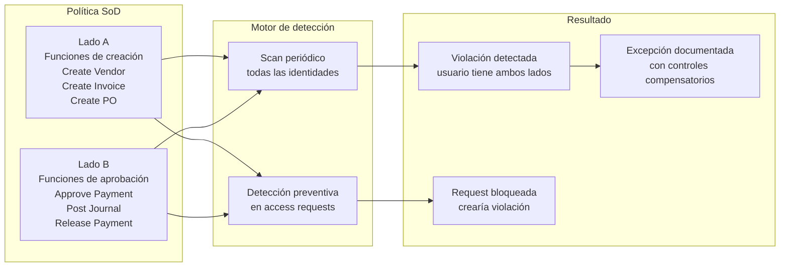

# 06 · Segregation of Duties (SoD)

---

## Why this matters

La Separación de Funciones existe desde que existen los controles contables  ninguna persona debería poder ejecutar una transacción completa de principio a fin sin que alguien más intervenga. En sistemas modernos, ese principio se traduce en que ningún usuario debería tener la combinación de accesos que le permita cometer fraude sin detección.

Los conflictos SoD son el hallazgo más serio en auditorías financieras. Un auditor de SOX que encuentra que alguien puede crear proveedores Y aprobar pagos sin supervisión está viendo un control failure que puede escalar a material weakness. Este lab implementa políticas SoD, detecta violaciones activas y configura la prevención de nuevas violaciones en tiempo real.

---

## Architecture

---

## Prerequisites

- Labs 01-05 completados entitlements representativos de funciones financieras configurados
- Al menos algunos usuarios con múltiples entitlements asignados para tener violaciones detectables

---

## Lab Walkthrough

### Step 1 · Analizar los conflictos potenciales antes de crear políticas

Antes de crear políticas SoD, identifica qué pares de entitlements representan los conflictos más críticos para tu organización. Habla con el equipo de finanzas o revisa los controles SOX existentes.

*Empezar con los conflictos más críticos (ciclo procure-to-pay, order-to-cash) en lugar de intentar modelar todo a la vez. Menos políticas bien definidas > muchas políticas mal definidas.*

---

### Step 2 · Crear la primera política SoD

Ve a **Admin → Compliance → Policies → Create Policy → SoD Policy**. Nombra la política con lenguaje de negocio y añade una descripción del riesgo que previene.

*El nombre y la descripción los verán auditores, managers y el compliance officer usa lenguaje que entienda negocio, no códigos técnicos internos.*

---

### Step 3 · Definir los dos lados del conflicto

En la política, define el **Lado A** con los entitlements de funciones de creación y el **Lado B** con los de aprobación. Si un usuario tiene al menos uno de cada lado → violación.

*La lógica es OR dentro de cada lado y AND entre los dos lados. Cualquier combinación de un entitlement del Lado A con uno del Lado B constituye violación.*

---

### Step 4 · Ejecutar el primer Policy Scan

Con la política activa, ejecuta **Run Scan**. SailPoint evalúa todas las identidades y genera la lista de violaciones actuales.

*El primer scan en una organización nueva casi siempre encuentra violaciones que nadie sabía que existían. Es normal el objetivo es detectarlas y gestionarlas.*

---

### Step 5 · Revisar las violaciones en detalle

Abre cada violación y analiza: quién la tiene, qué entitlements crean el conflicto, desde cuándo existe y cuál es el riesgo asociado.

*La antigüedad de la violación es un dato crítico para auditoría, una violación de 3 años indica que el control ha estado fallando durante ese período.*

---

### Step 6 · Gestionar violaciones — remediar o eximir

Para cada violación, decide: **Remediate** (revocar uno de los accesos conflictivos) o **Mitigate** (documentar excepción con controles compensatorios y fecha de revisión).

*Las excepciones son legítimas un CFO puede necesitar ambos accesos. Pero deben tener fecha de revisión, controles compensatorios documentados y aprobación formal.*

---

### Step 7 · Activar detección preventiva

En la configuración de la política, activa **Preventive Detection**. Ahora, cuando alguien solicite un acceso que crearía una violación SoD, SailPoint bloquea o escala la request.

*La detección preventiva es el salto de "detectar después" a "prevenir antes"  es la diferencia entre un control reactivo y uno proactivo en términos de madurez de seguridad.*

---

### Step 8 · Crear un reporte de SoD para auditoría

Genera el **Policy Violations Report** con el estado completo de violaciones, excepciones y remediaciones. Este es el documento principal de evidencia SoD para auditorías.

*Los auditores quieren ver tres cosas en el reporte SoD: violaciones conocidas, plan de remediación o excepción documentada para cada una, y que ninguna lleva meses sin gestión.*

---

## What I Learned

- **Empezar con pocas políticas bien definidas** es mucho mejor que crear 50 políticas. Con demasiadas políticas hay miles de violaciones que nadie puede gestionar y el sistema pierde credibilidad.
- La diferencia entre **mitigate** y **remediate** es importante para auditoría: remediar elimina el conflicto; mitigar lo documenta con controles compensatorios. Ambas opciones son válidas para auditoría si están bien documentadas.
- Las **excepciones sin fecha de expiración** son un hallazgo recurrente en auditorías. En producción, toda excepción debe tener fecha de revisión SailPoint puede automatizar la revocación de excepciones vencidas.
- Descubrí que la **detección preventiva a veces da falsos positivos** bloquea requests legítimas porque el modelo de roles no está bien definido. Afinar el modelo de roles (Lab 04) antes de activar la detección preventiva reduce ese problema.

---

## Real-World Applications

- Eliminar el hallazgo de "access control deficiency" en una auditoría SOX implementando detección SoD automatizada con evidencia de gestión de todas las violaciones
- Prevenir fraude en el ciclo de compras bloqueando en tiempo real cualquier solicitud de acceso que crearía un conflicto procure-to-pay
- Reducir el número de excepciones SoD activas mes a mes como KPI de mejora de governance reportado al Audit Committee

---

## Resources

- [SoD Policies in SailPoint ISC](https://documentation.sailpoint.com/saas/help/compliance/sod_policies.html)
- [Policy violations management](https://documentation.sailpoint.com/saas/help/compliance/policy_violations.html)
- [SOX compliance with SailPoint](https://www.sailpoint.com/solutions/compliance/sox/)

