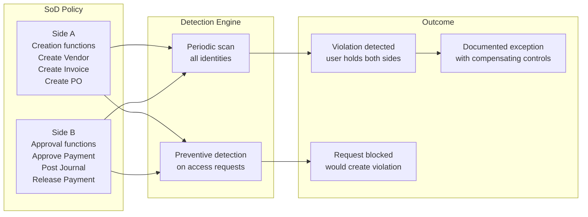
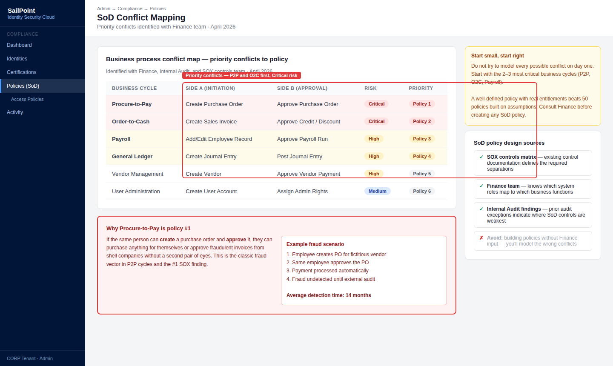
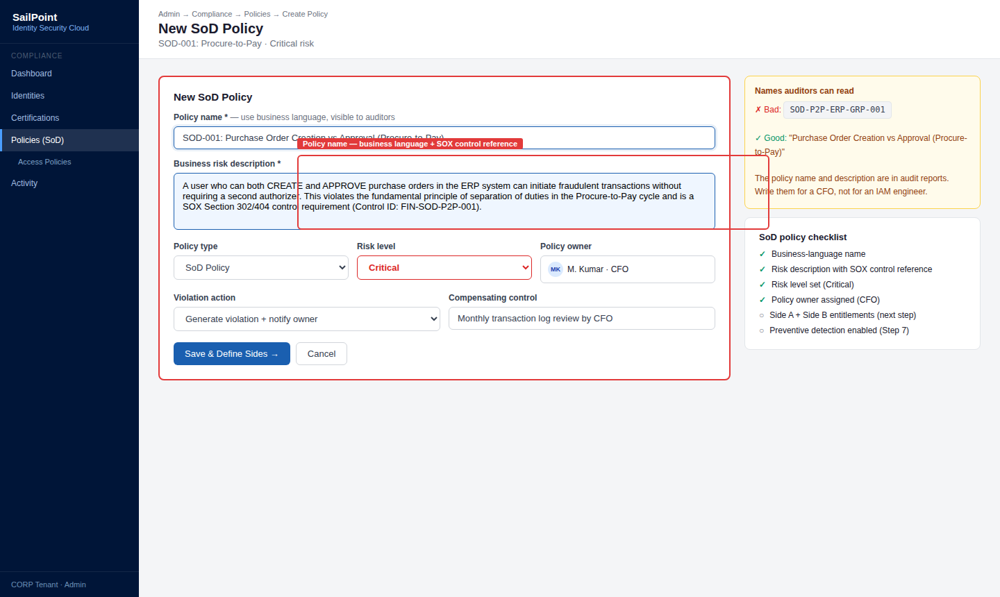
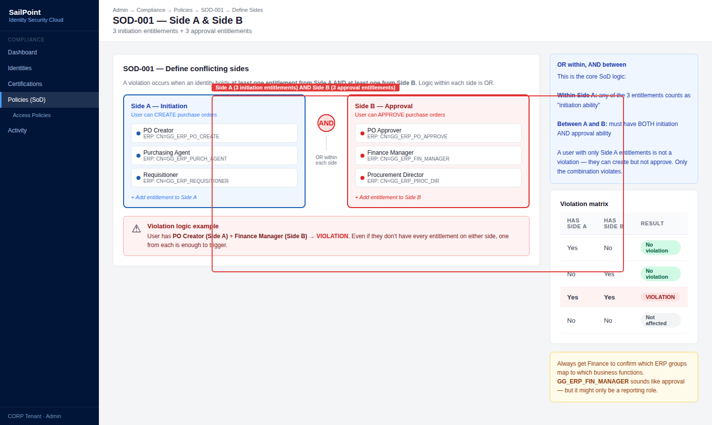
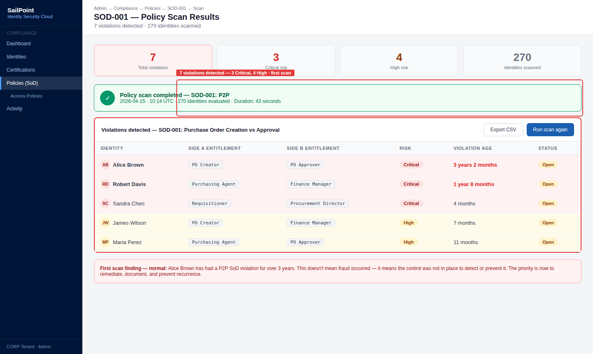
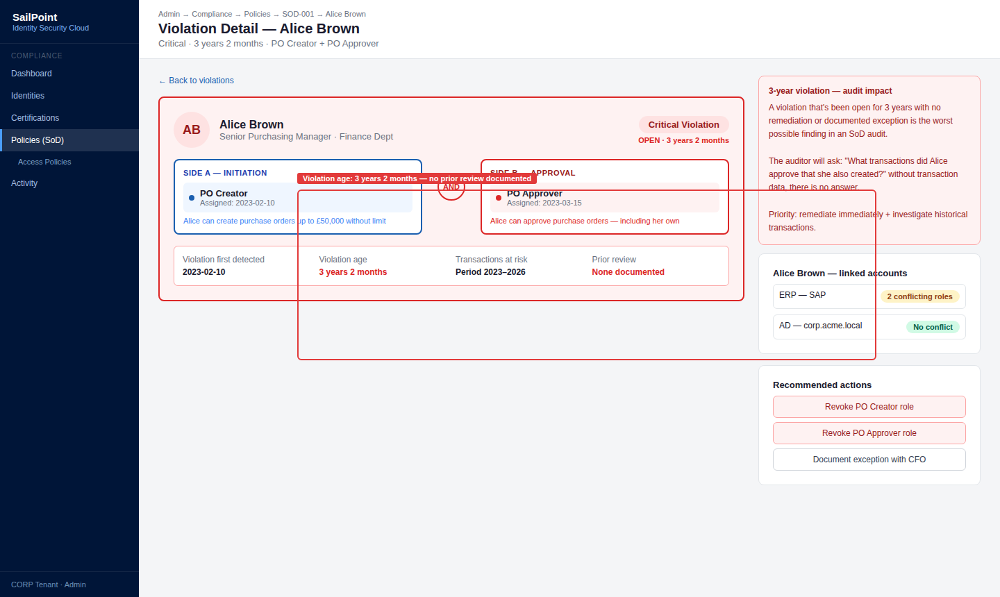
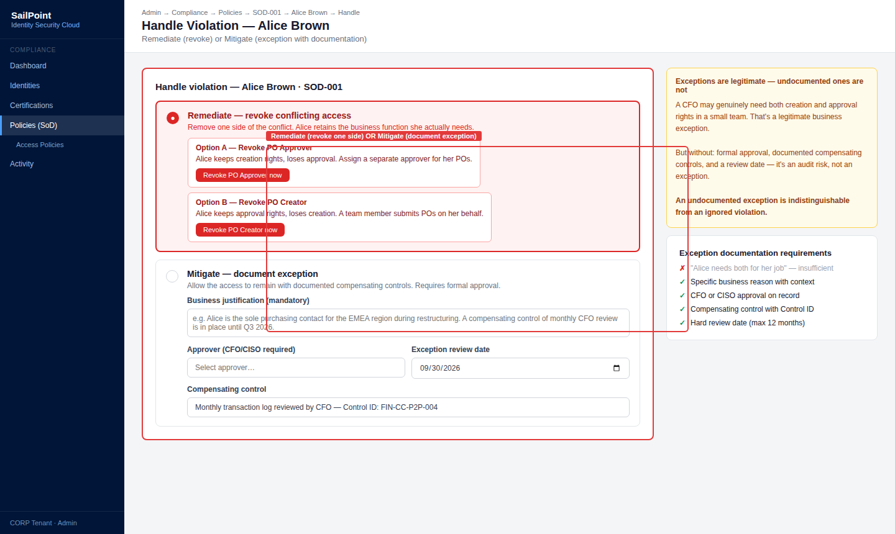
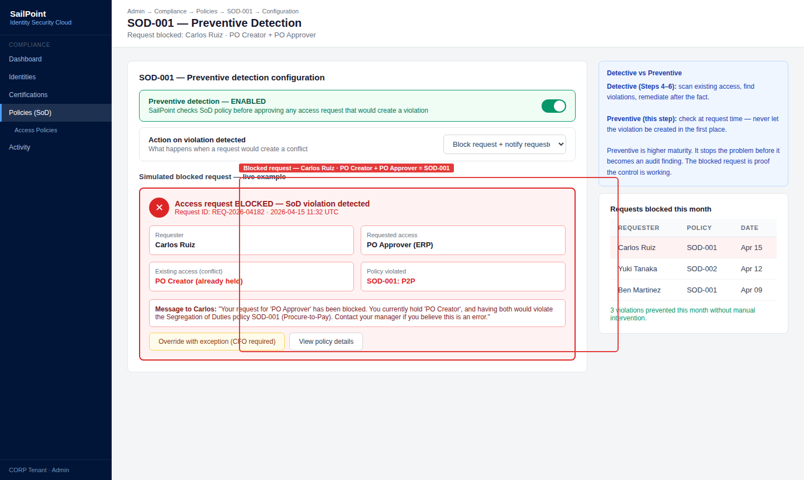
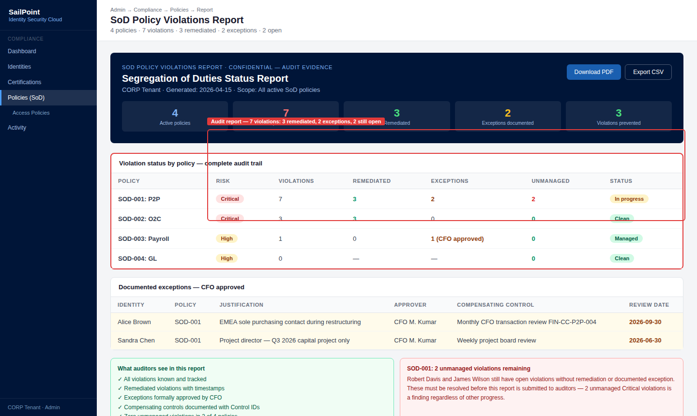

# 06 · Segregation of Duties (SoD)

---

## Why this matters

Segregation of Duties has existed as long as financial controls have no single person should be able to execute a complete transaction from start to finish without another party involved. In modern systems, that principle translates to ensuring no user holds the combination of access that would allow them to commit fraud undetected.

SoD conflicts are the most serious finding in financial audits. A SOX auditor who discovers that someone can both create vendors AND approve payments without oversight is looking at a control failure that can escalate to a material weakness. This lab implements SoD policies, detects existing violations, and configures real-time prevention of new violations.

---

## Architecture

---

## Prerequisites

- Labs 01-05 completed entitlements representing financial functions configured
- At least some users with multiple entitlements assigned to generate detectable violations

---

## Lab Walkthrough

### Step 1 · Map potential conflicts before creating policies

Before creating SoD policies, identify which pairs of entitlements represent the most critical conflicts for your organization. Review existing SOX controls or consult with the finance team.

*Start with the most critical conflicts (procure-to-pay, order-to-cash cycles) rather than trying to model everything at once. Fewer well-defined policies beat many poorly defined ones.*

---

### Step 2 · Create the first SoD policy

Go to **Admin → Compliance → Policies → Create Policy → SoD Policy**. Name the policy in business language and add a description of the risk it prevents.

*The name and description will be seen by auditors, managers, and the compliance officer use language that business stakeholders understand, not internal technical codes.*

---

### Step 3 · Define the two sides of the conflict

In the policy, define **Side A** with the creation function entitlements and **Side B** with the approval function entitlements. If a user holds at least one from each side, that is a violation.

*The logic is OR within each side and AND between the two sides. Any combination of one entitlement from Side A with one from Side B constitutes a violation.*

---

### Step 4 · Run the first Policy Scan

With the policy active, run **Run Scan**. SailPoint evaluates all identities and generates the list of current violations.

*The first scan in a new organization almost always uncovers violations nobody knew existed. That is normal the goal is to detect them and manage them proactively.*

---

### Step 5 · Review violations in detail

Open each violation and analyze: who holds it, which entitlements create the conflict, how long it has existed, and what the associated risk is.

*The age of the violation is critical for audit a three-year-old violation indicates the control has been failing for that entire period. Document it clearly.*

---

### Step 6 · Handle violations — remediate or mitigate

For each violation, decide: **Remediate** (revoke one of the conflicting access items) or **Mitigate** (document an exception with compensating controls and a review date).

*Exceptions are legitimate a CFO may need both access items. But they must have a review date, documented compensating controls, and formal approval. Without documentation, it is an audit risk.*

---

### Step 7 · Enable preventive detection

In the policy configuration, enable **Preventive Detection**. Now, when someone requests access that would create an SoD violation, SailPoint blocks or escalates the request.

*Preventive detection is the shift from "detect afterward" to "prevent beforehand" the difference between a reactive and a proactive control in terms of security maturity.*

---

### Step 8 · Generate an SoD report for audit

Generate the **Policy Violations Report** with the complete status of violations, exceptions, and remediations. This is the primary SoD evidence document for audits.

*Auditors want to see three things in the SoD report: known violations, a remediation plan or documented exception for each, and none left unmanaged for months.*

---

## What I Learned

- **Starting with a few well-defined policies is far better** than creating 50 policies. Too many policies generate thousands of violations nobody can manage and the system loses credibility.
- The difference between **mitigate** and **remediate** matters for audit: remediating eliminates the conflict; mitigating documents it with compensating controls. Both are valid for audit if properly documented.
- **Exceptions without expiration dates** are a recurring audit finding. In production, every exception must have a review date SailPoint can automate the revocation of expired exceptions.
- I discovered that **preventive detection can generate false positives** it may block legitimate requests if the role model is not well-defined. Refining the role model (Lab 04) before activating preventive detection reduces that problem significantly.

---

## Real-World Applications

- Eliminating "access control deficiency" findings in a SOX audit by implementing automated SoD detection with evidence of management for all violations
- Preventing fraud in the purchasing cycle by blocking in real time any access request that would create a procure-to-pay conflict
- Reducing the number of active SoD exceptions month over month as a governance improvement KPI reported to the Audit Committee

---

## Resources

- [SoD Policies in SailPoint ISC](https://documentation.sailpoint.com/saas/help/compliance/sod_policies.html)
- [Policy violations management](https://documentation.sailpoint.com/saas/help/compliance/policy_violations.html)
- [SOX compliance with SailPoint](https://www.sailpoint.com/solutions/compliance/sox/)
