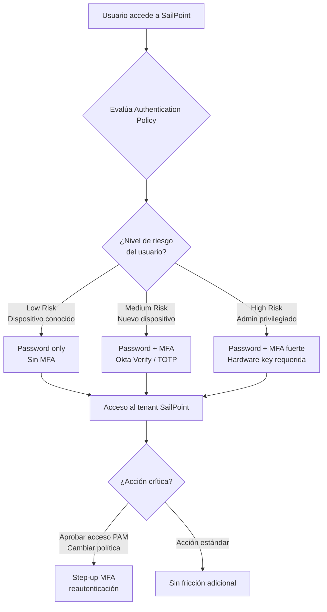
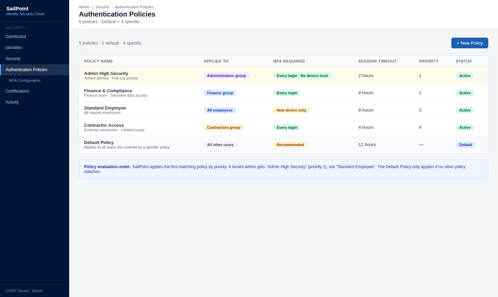
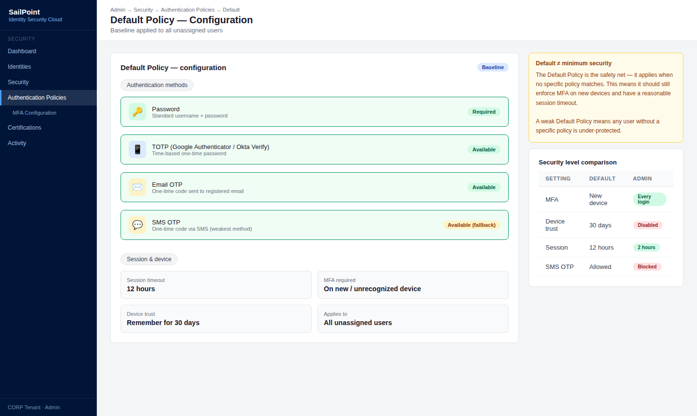
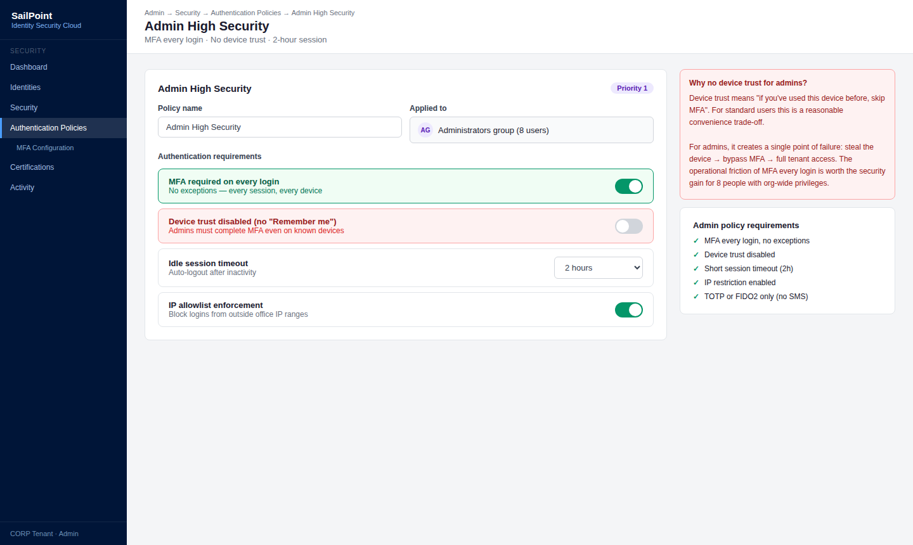
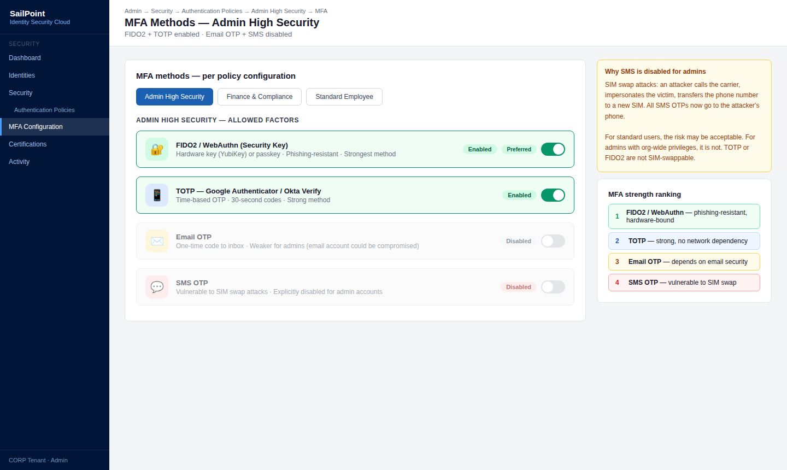
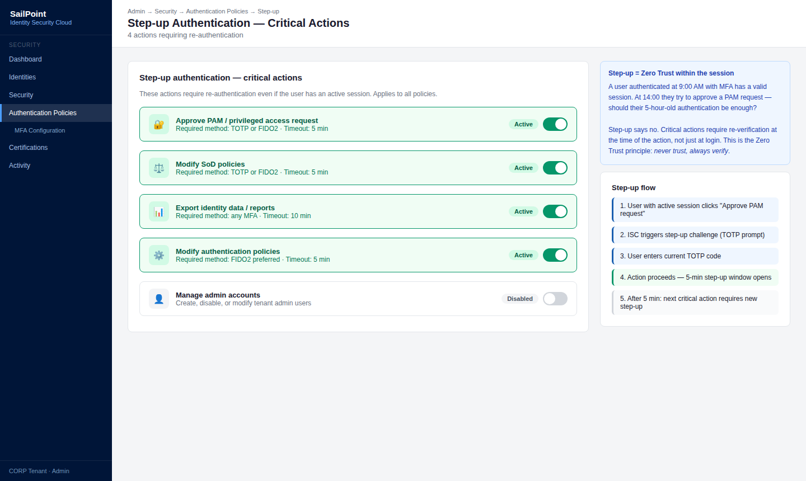
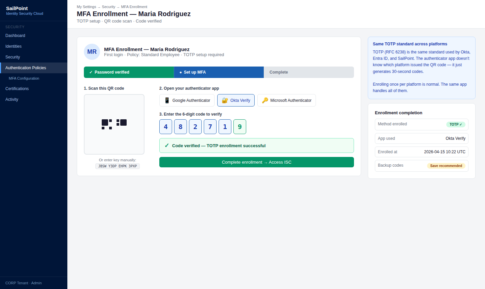
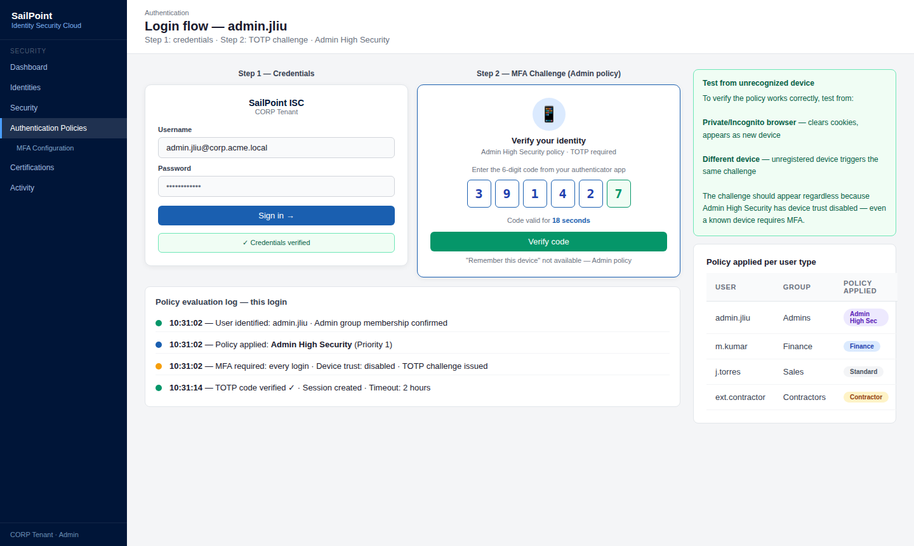
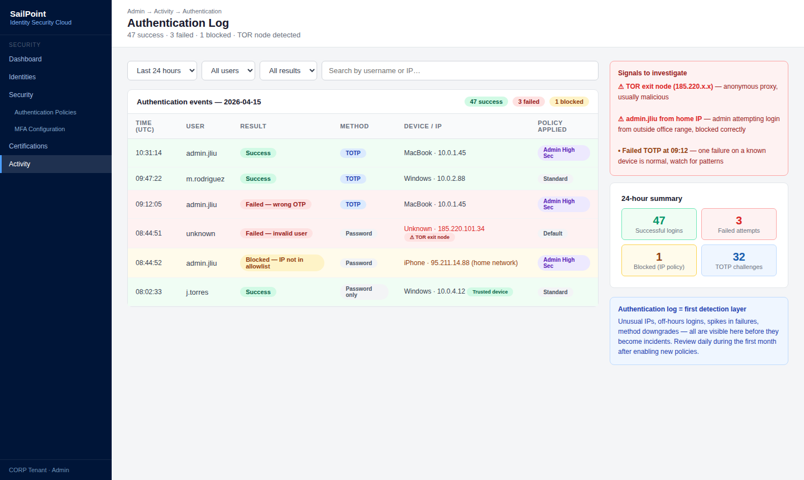

# 07 · Authentication Policies & MFA

---

## Why this matters

SailPoint gestiona quién tiene acceso a qué. Pero también necesita asegurarse de que quien inicia sesión en SailPoint es realmente quien dice ser especialmente porque a través del portal de SailPoint se puede solicitar acceso, aprobar permisos críticos y revisar datos sensibles.

Las Authentication Policies de SailPoint definen cómo se verifica la identidad de los usuarios que acceden al tenant: qué factores MFA se requieren, cuándo se pueden saltear y qué pasa con usuarios de alto riesgo. Este lab complementa lo que sabes de Okta y Entra ID aplicando los mismos principios de autenticación adaptativa dentro del ecosistema SailPoint.

---

## Architecture

---

## Prerequisites

- Tenant de SailPoint ISC activo
- Smartphone con una app de autenticación (Okta Verify, Google Authenticator, o Microsoft Authenticator)
- Al menos dos cuentas de usuario de prueba con distintos niveles de acceso

---

## Lab Walkthrough

### Step 1 · Explorar las Authentication Policies existentes

Ve a **Admin → Security → Authentication Policies**. Revisa las políticas predefinidas del tenant y entiende la política por defecto que aplica a todos los usuarios.

*SailPoint tiene una política por defecto que aplica a todos los usuarios sin política específica es el baseline de seguridad mínimo del tenant.*

---

### Step 2 · Analizar la política por defecto

Abre la política por defecto y revisa sus componentes: métodos de autenticación permitidos, requisitos de MFA, configuración de sesión y comportamiento en dispositivos no reconocidos.

*La política por defecto define el nivel mínimo de seguridad. Todo lo que configures en políticas específicas añade restricciones sobre este baseline.*

---

### Step 3 · Crear una Authentication Policy para administradores

Crea una nueva política llamada "Admin High Security" y aplícala al grupo de administradores del tenant. Requiere MFA en cada login sin opción de recordar dispositivo.

*Los administradores del tenant tienen acceso a configuraciones críticas y datos sensibles de toda la organización requieren el nivel de autenticación más alto sin excepciones.*

---

### Step 4 · Configurar los métodos MFA permitidos

En la política, define qué factores MFA están disponibles: TOTP (Google Authenticator / Okta Verify), Email OTP, o Security Key (FIDO2/WebAuthn). Desactiva SMS para la política de admin.

*SMS OTP es el método más débil (vulnerable a SIM swap) para cuentas privilegiadas, exige TOTP o hardware key. Reserva SMS solo para usuarios estándar como fallback.*

---

### Step 5 · Configurar step-up authentication para acciones críticas

Define qué acciones dentro de SailPoint requieren re-autenticación incluso si la sesión está activa: aprobar accesos PAM, cambiar políticas de SoD, exportar reportes de identidad.

*Step-up authentication aplica el principio de Zero Trust dentro de la propia sesión el hecho de estar autenticado no garantiza automáticamente autorización para acciones críticas.*

---

### Step 6 · Enrollar MFA como usuario de prueba

Inicia sesión como usuario de prueba y completa el enrollment de MFA. Escanea el QR code con tu app de autenticación y verifica el código TOTP.

*El enrollment de MFA en SailPoint es el mismo proceso que en Okta o Entra ID los principios que aprendiste en esos labs aplican directamente aquí.*

---

### Step 7 · Probar el flujo de autenticación con MFA

Cierra sesión e inicia de nuevo. Confirma que la política exige MFA correctamente según el usuario y dispositivo utilizado.

*Prueba desde un dispositivo no reconocido (modo privado o dispositivo diferente) para verificar que la política aplica correctamente en todos los contextos.*

---

### Step 8 · Revisar los logs de autenticación

Ve a **Admin → Activity → Authentication** y revisa el historial de logins: éxitos, fallos, dispositivos usados y métodos de autenticación utilizados.

*El log de autenticación es tu primera línea de detección de intentos de acceso no autorizados al tenant picos de fallos, logins desde IPs inusuales o intentos fuera de horario son señales de alerta.*

---

## What I Learned

- **SailPoint Authentication Policies son menos granulares que las de Okta o Entra ID**  no tienen el mismo nivel de Conditional Access basado en IP, dispositivo o riesgo. Para organizaciones que necesitan ese nivel de sofisticación, SailPoint se integra con Okta o Entra como IdP externo.
- El **step-up authentication** es el control más valioso para un tenant de SailPoint el portal es un sistema de alta criticidad y las acciones dentro de él (aprobar accesos, cambiar políticas) merecen verificación adicional.
- Aprendí que la **gestión de sesiones** (duración, cierre automático por inactividad) en SailPoint es un control frecuentemente ignorado una sesión de admin que no cierra automáticamente es un riesgo real en entornos compartidos.
- Los **logs de autenticación de SailPoint** son menos ricos que los de Okta (que tiene ThreatInsight y behavior detection nativo). Para detección avanzada, es recomendable exportar los logs a un SIEM.

---

## Real-World Applications

- Requerir hardware security key (YubiKey) para todos los administradores del tenant SailPoint, eliminando el riesgo de phishing de credenciales admin
- Implementar step-up MFA para la aprobación de accesos PAM, añadiendo una capa de verificación antes de conceder privilegios elevados
- Detectar intentos de login fallidos masivos al tenant SailPoint correlacionando los logs de autenticación con alertas del SIEM

---

## Resources

- [Authentication Policies in SailPoint ISC](https://documentation.sailpoint.com/saas/help/security/authentication_policies.html)
- [MFA configuration](https://documentation.sailpoint.com/saas/help/security/mfa.html)
- [SailPoint identity security](https://documentation.sailpoint.com/saas/help/security/security_overview.html)

