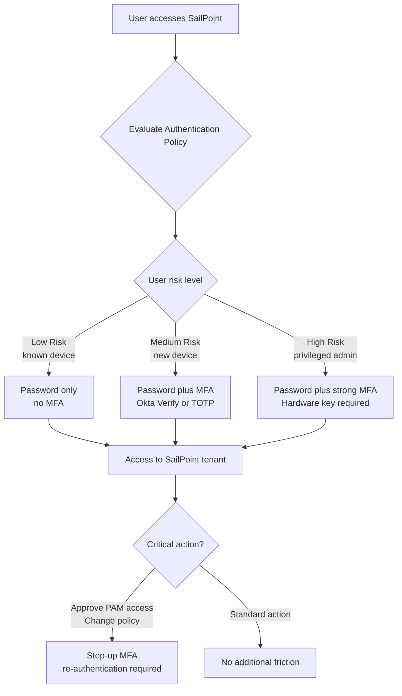

# 07 · Authentication Policies & MFA

---

## Why this matters

SailPoint governs who has access to what. But it also needs to verify that the person signing into SailPoint actually is who they claim to be especially because through the SailPoint portal users can request access, approve critical permissions, and review sensitive data.

Authentication Policies in SailPoint define how the identity of users accessing the tenant is verified: which MFA factors are required, when they can be skipped, and what happens with high-risk users. This lab builds on what you already know about Okta and Entra ID, applying the same adaptive authentication principles within the SailPoint ecosystem.

---

## Architecture

---

## Prerequisites

- Active SailPoint ISC tenant
- A smartphone with an authenticator app (Okta Verify, Google Authenticator, or Microsoft Authenticator)
- At least two test user accounts with different access levels

---

## Lab Walkthrough

### Step 1 · Explore existing Authentication Policies

Go to **Admin → Security → Authentication Policies**. Review the predefined policies in the tenant and understand the default policy that applies to all users without a specific policy assigned.

*SailPoint has a default policy that applies to all users not covered by a specific policy it is the minimum security baseline for the entire tenant.*

---

### Step 2 · Analyze the default policy

Open the default policy and review its components: allowed authentication methods, MFA requirements, session configuration, and behavior on unrecognized devices.

*The default policy defines the minimum security level. Everything you configure in specific policies adds restrictions on top of this baseline.*

---

### Step 3 · Create an Authentication Policy for administrators

Create a new policy called "Admin High Security" and apply it to the tenant administrators group. Require MFA on every login with no option to remember the device.

*Tenant administrators have access to critical configurations and sensitive data for the entire organization they require the highest level of authentication with no exceptions.*

---

### Step 4 · Configure allowed MFA methods

In the policy, define which MFA factors are available: TOTP (Google Authenticator or Okta Verify), Email OTP, or Security Key (FIDO2/WebAuthn). Disable SMS for the admin policy.

*SMS OTP is the weakest method (vulnerable to SIM swap attacks) for privileged accounts, require TOTP or a hardware key. Reserve SMS only as a fallback for standard users.*

---

### Step 5 · Configure step-up authentication for critical actions

Define which actions within SailPoint require re-authentication even with an active session: approving PAM access, changing SoD policies, exporting identity reports.

*Step-up authentication applies the Zero Trust principle within the session itself being authenticated does not automatically guarantee authorization for critical actions.*

---

### Step 6 · Enroll MFA as a test user

Log in as a test user and complete the MFA enrollment. Scan the QR code with your authenticator app and verify the TOTP code to confirm enrollment.

*The MFA enrollment process in SailPoint is the same as in Okta or Entra ID the principles you learned in those labs apply directly here.*

---

### Step 7 · Test the full authentication flow with MFA

Log out and log back in. Confirm that the policy correctly challenges for MFA based on the user type and device being used.

*Test from an unrecognized device (private browser or different device) to verify the policy applies correctly across all access contexts.*

---

### Step 8 · Review authentication logs

Go to **Admin → Activity → Authentication** and review the login history: successes, failures, devices used, and authentication methods applied.

*The authentication log is your first line of detection for unauthorized access attempts to the tenant spikes in failures, logins from unusual IPs, or off-hours attempts are all warning signals.*

---

## What I Learned

- **SailPoint Authentication Policies are less granular than Okta or Entra ID** they do not have the same level of Conditional Access based on IP, device compliance, or risk score. For organizations that need that sophistication, SailPoint integrates with Okta or Entra as an external IdP.
- **Step-up authentication is the most valuable control for a SailPoint tenant** the portal is a high-criticality system and actions within it (approving access, changing policies) deserve additional verification.
- I learned that **session management** (duration, automatic timeout on inactivity) in SailPoint is a frequently overlooked control an admin session that does not automatically close is a real risk in shared environments.
- **SailPoint authentication logs are less rich than Okta's** (which has ThreatInsight and native behavior detection). For advanced detection, export the logs to a SIEM for correlation.

---

## Real-World Applications

- Requiring hardware security keys (YubiKey) for all SailPoint tenant administrators, eliminating the risk of credential phishing for admin accounts
- Implementing step-up MFA for PAM access approvals, adding a verification layer before granting elevated privileges
- Detecting mass failed login attempts against the SailPoint tenant by correlating authentication logs with SIEM alerts

---

## Resources

- [Authentication Policies in SailPoint ISC](https://documentation.sailpoint.com/saas/help/security/authentication_policies.html)
- [MFA configuration](https://documentation.sailpoint.com/saas/help/security/mfa.html)
- [SailPoint identity security](https://documentation.sailpoint.com/saas/help/security/security_overview.html)
