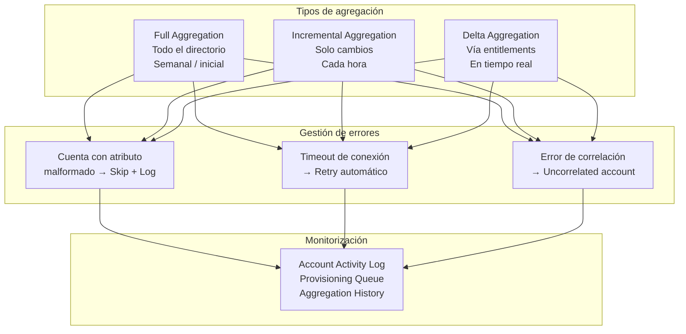

# 08 · Source Configuration & Connectors

---

## Why this matters

SailPoint es tan bueno como los datos que recibe. Si los Sources están mal configurados agregaciones incompletas, correlaciones rotas, atributos mal mapeados todo lo que construyes encima (certifications, SoD, lifecycle) opera sobre información incorrecta. Un modelo de governance sobre datos malos no protege nada, solo da una falsa sensación de control.

Este lab va más allá de la configuración básica del Lab 03 y profundiza en los aspectos que diferencian una implementación básica de una robusta: configuración de agregaciones incrementales, gestión de errores, múltiples fuentes del mismo tipo y troubleshooting de conectores en producción.

---

## Architecture

---

## Prerequisites

- Tenant de SailPoint ISC activo con Virtual Appliance instalado
- Active Directory accesible desde el VA
- Un segundo Source disponible (Salesforce, LDAP o CSV) para comparar configuraciones

---

## Lab Walkthrough

### Step 1 · Revisar la configuración avanzada de un Source existente

Abre el Source de AD configurado anteriormente y explora las opciones avanzadas: timeout de conexión, número máximo de reintentos, tamaño del page de resultados LDAP.

*Los valores por defecto funcionan para tenants pequeños en AD con 50.000+ usuarios, aumentar el page size y el timeout evita agregaciones truncadas o fallidas.*

---

### Step 2 · Configurar agregación incremental

Ve a la pestaña **Import Settings** del Source y activa la agregación incremental. Define la frecuencia (cada hora) y el tipo: delta basado en el atributo `whenChanged` de AD.

*La agregación incremental es crítica para el Leaver process si agrega cada 24h, un ex-empleado puede tener acceso activo durante un día entero. Cada hora reduce ese riesgo a 60 minutos.*

---

### Step 3 · Configurar el manejo de errores de agregación

Define qué hace SailPoint cuando encuentra una cuenta con datos malformados: ignorar y continuar (skip), parar la agregación, o notificar. Para producción, skip + notificación es lo más robusto.

*Una sola cuenta con un atributo malformado no debería parar la agregación de 50.000 usuarios configura skip y revisa el log de errores después para remediar los casos individuales.*

---

### Step 4 · Conectar un Source CSV para datos de HRIS

Crea un nuevo Source de tipo **Delimited File (CSV)**. Este tipo se usa para sistemas HRIS sin API (Workday legacy, SAP HR) que exportan archivos periódicamente.

*El conector CSV es el más básico pero uno de los más utilizados en proyectos reales muchos sistemas HR exportan archivos diarios y ese archivo es la fuente autoritativa de identidades.*

---

### Step 5 · Configurar el schema del CSV Source

Mapea las columnas del CSV a los atributos del Identity Cube: employee_id → uid, first_name → firstName, department → department, manager_id → manager.

*El CSV tiene headers que pueden variar entre versiones del export del HRIS documenta el schema y ten un proceso de validación antes de que el archivo entre en SailPoint.*

---

### Step 6 · Comparar la calidad de datos entre Sources

Con AD y CSV importados, compara los datos de los mismos usuarios entre ambos Sources. Busca inconsistencias: distintos nombres, departamentos que no coinciden, managers diferentes.

*Las inconsistencias entre Sources revelan problemas de calidad de datos en los sistemas fuente SailPoint los hace visibles, pero la solución es upstream, en el HRIS o el AD.*

---

### Step 7 · Revisar el historial de agregaciones y detectar anomalías

Ve a **Admin → Connections → Sources → [Source] → Import History**. Revisa el historial de agregaciones: duración, número de cuentas procesadas, errores encontrados.

*Un cambio brusco en el número de cuentas entre agregaciones es una señal de alerta 50.000 usuarios en la agregación anterior y 45.000 en la siguiente puede indicar una OPU que se excluyó accidentalmente.*

---

### Step 8 · Crear un proceso de monitorización de Sources

Configura alertas para que SailPoint notifique cuando una agregación falla, cuando el número de cuentas cae más de un 5% respecto a la anterior, o cuando el tiempo de agregación supera el umbral esperado.

*En producción, las agregaciones fallidas son silenciosas si no hay alertas SailPoint opera sobre datos del último ciclo exitoso sin avisar que lleva 48h sin actualizar. Las alertas son obligatorias.*

---

## What I Learned

- **La calidad de los datos en los Sources es el factor más crítico de una implementación de SailPoint** y también el más difícil de controlar porque está en sistemas que no son SailPoint. El mejor modelo de governance falla si el HRIS tiene datos incorrectos.
- El **conector CSV es infravalorado** es simple pero se usa en el 60% de los proyectos para algún sistema. Conocer sus limitaciones (no soporta delta, no tiene writeback nativo) permite planificar workarounds.
- Aprendí que las **agregaciones largas** (más de 2-3 horas para AD en producción) suelen indicar un page size demasiado pequeño o timeouts de red no un problema de SailPoint sino de configuración de conectividad.
- Los **uncorrelated accounts** que aparecen después de cada agregación son el mejor indicador de la salud de tu modelo de correlación si sube el número, algo cambió en los datos fuente o en la regla de correlación.

---

## Real-World Applications

- Configurar agregaciones horarias del AD como prerequisito para un Leaver process que garantice revocación de acceso en menos de 2 horas tras la baja del empleado
- Conectar un sistema HRIS legacy que solo exporta CSV diario como fuente autoritativa de empleados, mapeando los campos al schema de identidad de SailPoint
- Detectar provisoriamente un incident de deprovisionig masivo accidental monitorizando el número de cuentas entre agregaciones  una caída del 10% activa una alerta antes de que el daño sea irrecuperable

---

## Resources

- [Source configuration](https://documentation.sailpoint.com/saas/help/sources/configure_source.html)
- [Connector catalog](https://documentation.sailpoint.com/connectors/)
- [Aggregation troubleshooting](https://documentation.sailpoint.com/saas/help/sources/aggregation_troubleshooting.html)

