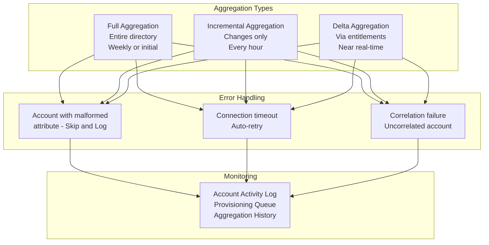

# 08 · Source Configuration & Connectors

---

## Why this matters

SailPoint is only as good as the data it receives. If Sources are misconfigured  incomplete aggregations, broken correlations, badly mapped attributes everything built on top of them (certifications, SoD, lifecycle) operates on incorrect information. A governance model built on bad data does not protect anything; it only provides a false sense of control.

This lab goes beyond the basic configuration covered in Lab 03 and digs into what separates a basic implementation from a robust one: incremental aggregation setup, error handling, managing multiple Sources of the same type, and troubleshooting connectors in production environments.

---

## Architecture

---

## Prerequisites

- Active SailPoint ISC tenant with Virtual Appliance installed
- Active Directory accessible from the VA
- A second Source available (Salesforce, LDAP, or CSV) to compare configurations

---

## Lab Walkthrough

### Step 1 · Review the advanced configuration of an existing Source

Open the AD Source configured previously and explore the advanced options: connection timeout, maximum retry count, LDAP results page size.

*Default values work fine for small tenants in AD with 50,000+ users, increasing the page size and timeout prevents truncated or failed aggregations.*

---

### Step 2 · Configure incremental aggregation

Go to the **Import Settings** tab of the Source and enable incremental aggregation. Define the frequency (every hour) and the type: delta based on the AD `whenChanged` attribute.

*Incremental aggregation is critical for the Leaver process if it only runs every 24 hours, an ex-employee can have active access for an entire day. Hourly reduces that window to 60 minutes.*

---

### Step 3 · Configure aggregation error handling

Define what SailPoint does when it encounters an account with malformed data: ignore and continue (skip), stop the aggregation, or notify. For production, skip plus notification is the most robust approach.

*A single account with a malformed attribute should not stop the aggregation of 50,000 users configure skip and review the error log afterward to remediate individual cases.*

---

### Step 4 · Connect a CSV Source for HRIS data

Create a new Source of type **Delimited File (CSV)**. This type is used for HRIS systems without an API (legacy Workday, SAP HR) that export files periodically.

*The CSV connector is the most basic but one of the most used in real projects many HR systems export daily files and that file is the authoritative source of identity data.*

---

### Step 5 · Configure the CSV Source schema

Map CSV columns to Identity Cube attributes: employee_id → uid, first_name → firstName, department → department, manager_id → manager.

*CSV headers can vary between versions of the HRIS export document the schema and have a validation step before the file enters SailPoint.*

---

### Step 6 · Compare data quality between Sources

With both AD and CSV imported, compare data for the same users across Sources. Look for inconsistencies: different name formats, non-matching departments, different managers.

*Inconsistencies between Sources reveal data quality problems in the source systems SailPoint makes them visible, but the fix is upstream in the HRIS or AD.*

---

### Step 7 · Review aggregation history and detect anomalies

Go to **Admin → Connections → Sources → [Source] → Import History**. Review the aggregation history: duration, number of accounts processed, errors encountered.

*A sudden change in account count between aggregations is a warning signal 50,000 users in the previous run and 45,000 in the next might indicate an OU was accidentally excluded.*

---

### Step 8 · Set up Source monitoring alerts

Configure alerts so SailPoint notifies when an aggregation fails, when the account count drops more than 5% from the previous run, or when aggregation time exceeds the expected threshold.

*In production, failed aggregations are silent if there are no alerts SailPoint operates on the last successful run's data without warning that it has been 48 hours without an update. Alerts are mandatory.*

---

## What I Learned

- **Data quality in Sources is the most critical factor in a SailPoint implementation** and also the hardest to control because it lives in systems outside SailPoint. The best governance model fails if the HRIS has incorrect data.
- The **CSV connector is underestimated** it is simple but used in 60% of real projects for some system. Knowing its limitations (no native delta support, no writeback) allows you to plan workarounds in advance.
- I learned that **long aggregations** (more than 2-3 hours for AD in production) usually indicate a page size that is too small or network timeouts not a SailPoint problem, but a connectivity configuration issue.
- **Uncorrelated accounts appearing after each aggregation** are the best indicator of the health of your correlation model if the number rises, something changed in the source data or the correlation rule.

---

## Real-World Applications

- Configuring hourly AD aggregations as a prerequisite for a Leaver process that guarantees access revocation within 2 hours of an employee's offboarding record in HR
- Connecting a legacy HRIS that only exports daily CSV files as the authoritative source of employee identities, mapping fields to the SailPoint identity schema
- Detecting a mass accidental deprovisioning incident by monitoring account counts between aggregations a 10% drop triggers an alert before the damage becomes irreversible

---

## Resources

- [Source configuration](https://documentation.sailpoint.com/saas/help/sources/configure_source.html)
- [Connector catalog](https://documentation.sailpoint.com/connectors/)
- [Aggregation troubleshooting](https://documentation.sailpoint.com/saas/help/sources/aggregation_troubleshooting.html)
