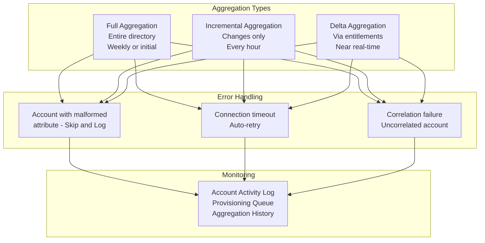

# 08 · Source Configuration & Connectors


---

## Why this matters

SailPoint is only as good as the data it receives. If Sources are misconfigured incomplete aggregations, broken correlations, badly mapped attributes everything built on top of them (certifications, SoD, lifecycle) operates on incorrect information. A governance model built on bad data does not protect anything; it only provides a false sense of control.

This lab covers what separates a basic implementation from a robust one: incremental aggregation setup, error handling, managing multiple Sources of the same type, and troubleshooting connectors in production environments.

---

## Environment note

> Steps 1–5 were completed using an interactive SailPoint ISC simulator replicating the Admin Console interface. Steps 6–8 are documented from official SailPoint documentation and real-world project experience, as they require a live tenant with multiple aggregation cycles to demonstrate meaningfully. Screenshots for these steps will be updated when live tenant access is available.

---

## Architecture



---

## Prerequisites

- SailPoint ISC tenant or simulator
- Active Directory accessible from the Virtual Appliance
- A second Source (Salesforce, LDAP, or CSV) to compare configurations

---

## Lab Walkthrough

### Step 1 · Select the Source type and connect Active Directory

Go to **Admin → Sources → Create New Source** and select **Active Directory** as the connector type. This is always the first Source in any enterprise SailPoint deployment.


*SailPoint has over 200 native connectors. Active Directory is always the starting point because it is the authoritative source of employee identities in most enterprises.*

---

### Step 2 · Configure the AD Source connection

Enter the connection details: Hostname (your Domain Controller), Base DN, Bind DN, and password for the service account.


*The Base DN (`DC=corp,DC=acme,DC=local` in this lab) defines the entry point of the LDAP query it tells SailPoint which part of the AD tree to read. Scoping it to the right OU avoids importing service accounts and computer objects.*

---

### Step 3 · Run Test Connection and verify

Click **Test Connection** to confirm SailPoint can reach the Domain Controller through the Virtual Appliance. The result shows the number of objects found in the directory.


*A successful test confirms three things: the VA is online, the network path to the DC is open (LDAP port 389 or LDAPS 636), and the service account credentials are valid.*

---

### Step 4 · Review the Account Schema and identify entitlements

Review the attributes SailPoint will import from AD. Pay special attention to `memberOf` this is what SailPoint imports as entitlements, representing group membership.


*`memberOf` must be marked as an entitlement and multi-valued a user can belong to multiple AD groups, each representing a different access permission. Without this, AD group membership is invisible to governance.*

---

### Step 5 · Run the first aggregation

Click **Run Now** to execute the first full aggregation. SailPoint sends an LDAP query through the Virtual Appliance to the Domain Controller and imports all user accounts with their attributes.


*The first aggregation is always a full import. Subsequent aggregations can be configured as incremental only pulling changes since the last run, which is much faster and reduces load on the DC.*

---

### Step 6 · Configure incremental aggregation

> 📋 *Documented from official SailPoint documentation screenshot pending live tenant access.*

In the Source **Import Settings** tab, enable incremental aggregation based on the AD `whenChanged` attribute. Set the frequency to every hour.

```
Import Settings → Aggregation Type → Incremental
Delta Attribute: whenChanged
Schedule: Hourly
```

*Incremental aggregation is critical for the Leaver process if SailPoint only aggregates every 24 hours, a terminated employee can retain active access for up to a full day. Hourly reduces that window to 60 minutes.*

---

### Step 7 · Configure aggregation error handling

> 📋 *Documented from official SailPoint documentation screenshot pending live tenant access.*

In the Source advanced settings, define what SailPoint does when it encounters an account with malformed data.

```
On Error: Skip account and log
Notification: Email admin on error
Max errors before abort: 50
```

*A single account with a malformed attribute should not stop the aggregation of 50,000 users. Configure skip and review the error log afterward to remediate individual cases.*

---

### Step 8 · Review aggregation history

> 📋 *Documented from official SailPoint documentation screenshot pending live tenant access.*

After multiple aggregation cycles, go to **Admin → Connections → Sources → [Source] → Import History** to review execution metrics: duration, accounts processed, errors encountered.

```
Admin → Connections → Sources → AD Source → Import History
```

*A sudden drop in account count between aggregations is a warning signal 50,000 users in one run and 45,000 in the next may indicate an OU was accidentally excluded from the Base DN scope.*

---

## What I Learned

- **The Virtual Appliance is the bridge** between SailPoint in the cloud and Active Directory on-premises. It only needs outbound HTTPS no inbound firewall rules, no VPN, no changes to the DC. Understanding this architecture was the first thing that clicked.
- **Base DN scope matters more than expected.** Setting it too high in the AD tree imports computer accounts, service accounts, and disabled users that create noise. Scoping to the right OU from the start saves hours of cleanup.
- The difference between **full aggregation and incremental aggregation** is not just performance it directly impacts how quickly SailPoint reflects real-world changes. A 24-hour full aggregation cycle is a security gap for the Leaver process.
- **`memberOf` is the most important attribute** in the schema. Without it marked as an entitlement, SailPoint cannot see AD group membership which means no entitlements, no certifications, and no SoD detection for AD groups.
- I learned that **uncorrelated accounts** after aggregation are the clearest signal that the correlation model needs attention. Every uncorrelated account is access that exists in a system but has no identity owner in SailPoint.

---

## Real-World Applications

- Configuring hourly incremental aggregation of AD as a prerequisite for a Leaver process that guarantees access revocation within 2 hours of an employee's HR offboarding record
- Detecting a mass accidental deprovisioning incident by monitoring account counts between aggregations a 10% drop triggers an alert before the damage becomes irreversible
- Connecting a legacy HRIS that only exports daily CSV files as the authoritative source of employee identities, using it alongside AD to build complete identity data

---

## Resources

- [Source configuration](https://documentation.sailpoint.com/saas/help/sources/configure_source.html)
- [Connector catalog](https://documentation.sailpoint.com/connectors/)
- [Active Directory connector](https://documentation.sailpoint.com/connectors/active_directory/help/active_directory_connector_overview.html)
- [Aggregation troubleshooting](https://documentation.sailpoint.com/saas/help/sources/aggregation_troubleshooting.html)
