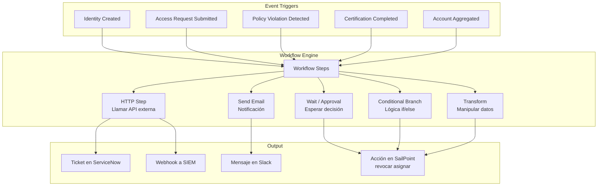
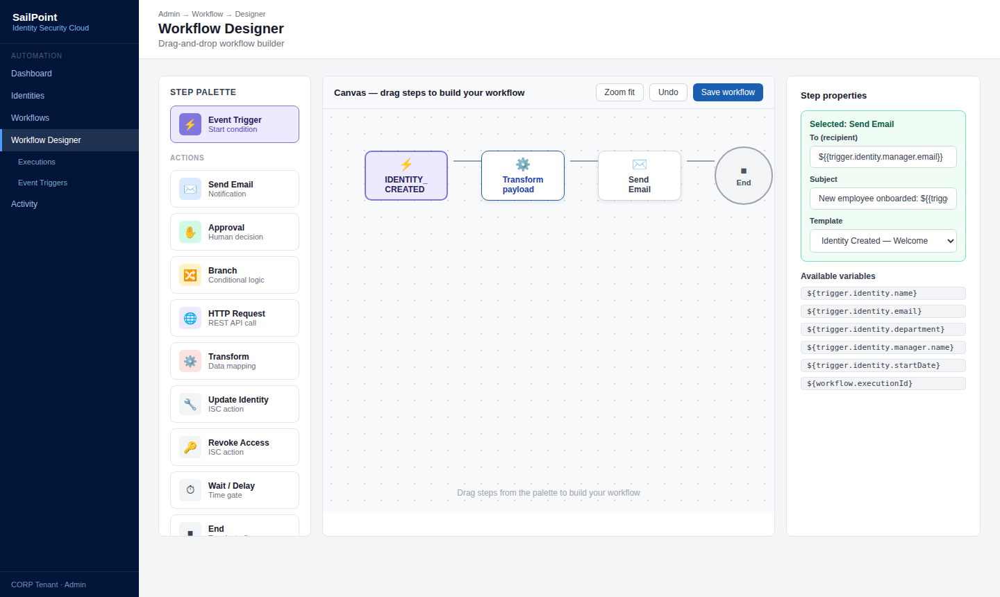
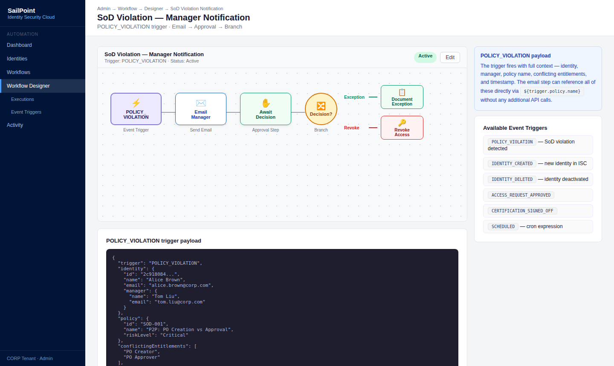
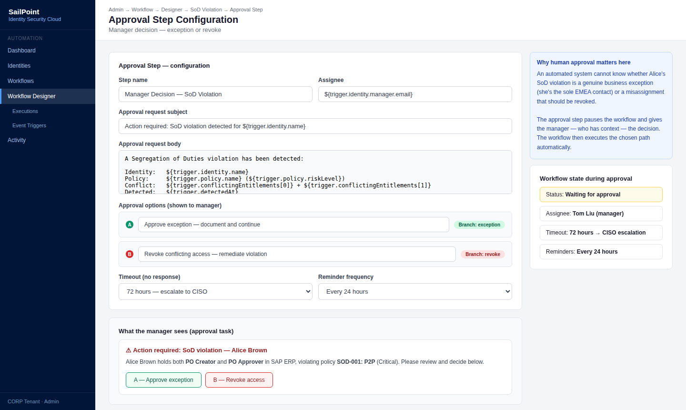
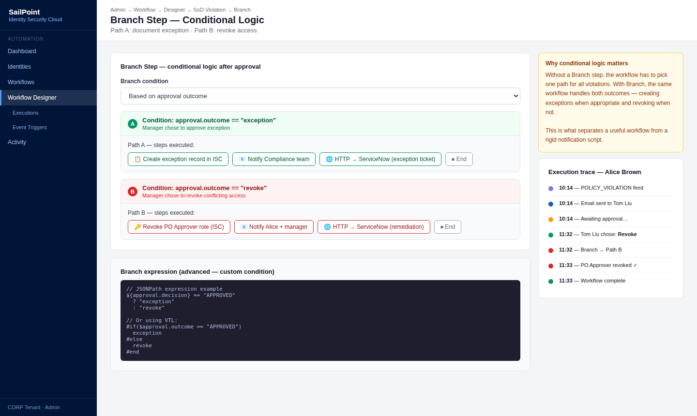
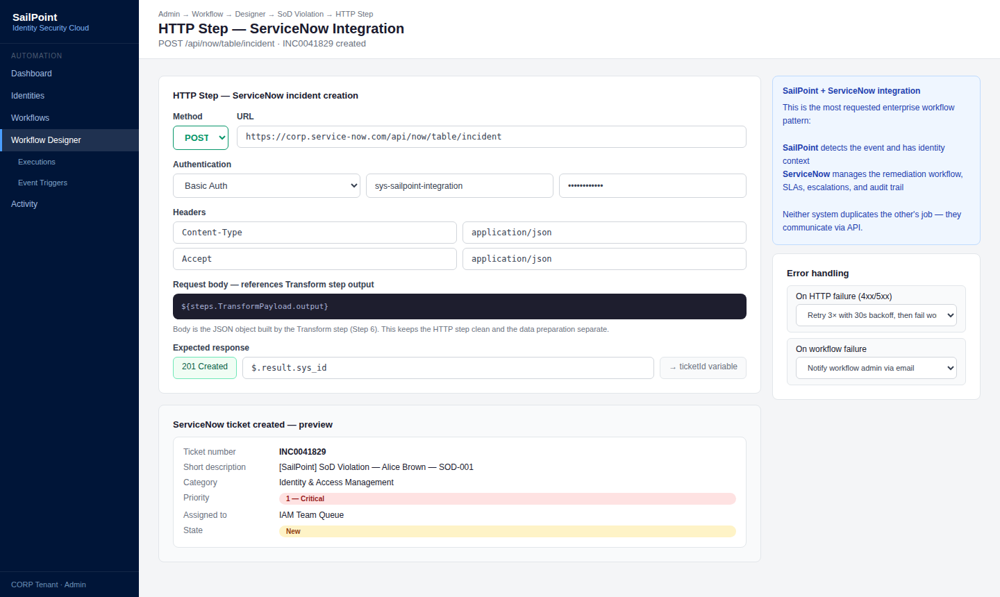
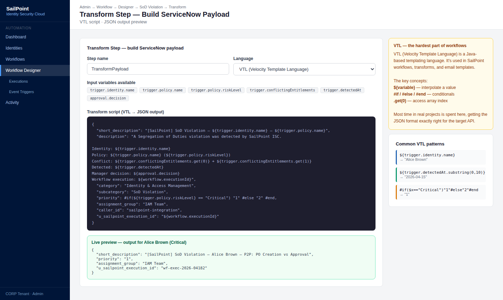
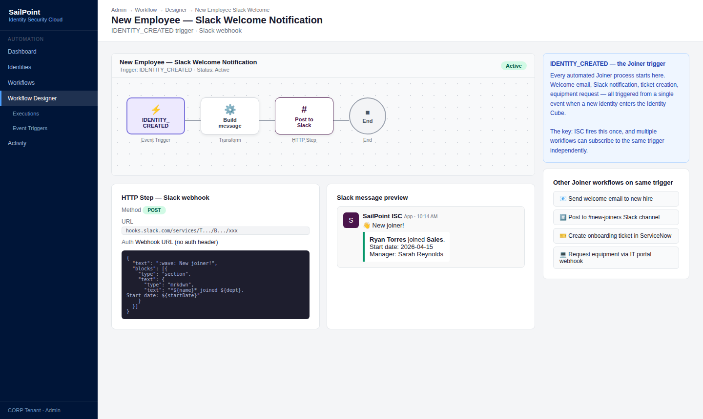
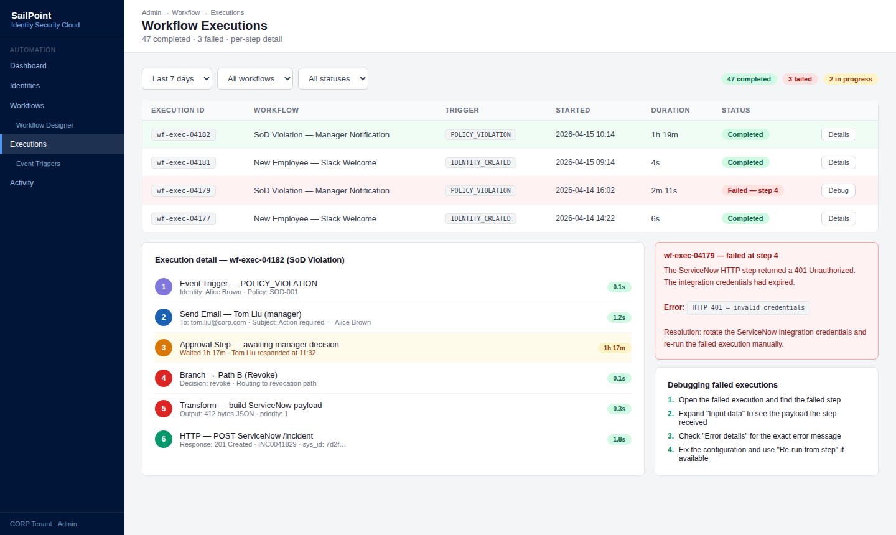

# 09 · Advanced Workflows & Event Triggers

---

## Why this matters

Los workflows básicos de SailPoint (aprobar una request, enviar una notificación) cubren el 80% de los casos. El 20% restante procesos multi-paso con lógica condicional, integraciones con sistemas externos, respuestas automáticas a eventos de seguridad requiere la capa avanzada de automatización.

Event Triggers y Workflows avanzados son lo que convierte SailPoint de una herramienta de governance pasiva en un motor de orquestación activo. Cuando un usuario viola una política SoD, el workflow puede notificar al manager, crear un ticket en ServiceNow, pedir aprobación y revocar el acceso todo automáticamente. Este lab es el más técnico de la serie y el que más diferencia un perfil junior de uno senior.

---

## Architecture

---

## Prerequisites

- Labs 01-09 completados datos y configuraciones previas disponibles para conectar al workflow
- Cuenta en Make (anteriormente Integromat) o Zapier para simular webhooks externos (gratis)
- Familiaridad básica con JSON y APIs REST

---

## Lab Walkthrough

### Step 1 · Explorar el Workflow Designer

Ve a **Admin → Workflow** y abre el Workflow Designer. Explora los tipos de pasos disponibles: Start/End, HTTP Request, Approval, Email, Branch, Transform.

*El Workflow Designer es visual y basado en bloques similar a Okta Workflows o Power Automate. Sin embargo, para lógica compleja, los pasos de Transform requieren conocimiento básico de JSON.*

---

### Step 2 · Crear un workflow de notificación de Policy Violation

Crea un workflow que se dispara cuando se detecta una violación SoD (Event Trigger: `POLICY_VIOLATION`) y envía una notificación por email al manager del usuario con el detalle de la violación.

*El trigger `POLICY_VIOLATION` incluye en el payload el usuario afectado, los entitlements en conflicto y la política violada — toda la información necesaria para el email de notificación.*

---

### Step 3 · Añadir un paso de aprobación al workflow

Después de la notificación, añade un paso de Approval: el manager debe decidir si revoca el acceso o solicita una excepción. El workflow espera la respuesta antes de continuar.

*El paso de aprobación convierte el workflow en un proceso interactivo el sistema no actúa automáticamente sino que espera la decisión de un humano con contexto.*

---

### Step 4 · Añadir lógica condicional con Branch

Añade un paso Branch después de la aprobación: si el manager aprueba la excepción → documentar y continuar; si decide revocar → proceder a la revocación automática.

*La lógica condicional es lo que hace que un workflow sea verdaderamente útil respuestas distintas a decisiones distintas, sin intervención manual adicional.*

---

### Step 5 · Configurar un HTTP Step para integración con ServiceNow

Añade un paso HTTP que llama a la API de ServiceNow (o tu webhook de prueba) para crear un incident ticket con el detalle de la violación SoD.

*La integración con ITSM via HTTP Step es el caso de uso más demandado en proyectos enterprise SailPoint detecta el evento, ServiceNow gestiona el proceso de remediación.*

---

### Step 6 · Usar un Transform Step para preparar el payload

Antes del HTTP Step, añade un Transform Step que formatea los datos del trigger en el JSON que espera la API de ServiceNow: mapea campos, concatena strings, formatea fechas.

*El Transform Step usa VTL (Velocity Template Language) o JSONPath para manipular datos es la parte más técnica de los workflows y donde más tiempo se invierte en proyectos reales.*

---

### Step 7 · Crear un Event Trigger para Identity Created

Crea un segundo workflow que se dispara con el trigger `IDENTITY_CREATED`. Cuando se crea una nueva identidad, envía un webhook a Slack con los datos básicos del nuevo empleado.

*El trigger `IDENTITY_CREATED` es el corazón del Joiner process automatizado cualquier acción de bienvenida, notificación o proceso adicional arranca aquí.*

---

### Step 8 · Monitorizar ejecuciones de workflow

Ve a **Admin → Workflow → Executions** y revisa el historial de ejecuciones de tus workflows: éxitos, fallos, duración de cada paso y payload procesado.

*El historial de ejecuciones es esencial para debugging cuando un workflow falla, la vista de ejecución muestra exactamente en qué paso falló y qué datos tenía en ese momento.*

---

## What I Learned

- **VTL (Velocity Template Language)** en los Transform Steps es la curva de aprendizaje más empinada del Workflow Designer. Hay que invertir tiempo en aprenderlo sin él, los workflows más complejos son imposibles.
- Los **Event Triggers tienen payloads distintos** según el tipo de evento el payload de `POLICY_VIOLATION` tiene campos diferentes al de `ACCESS_REQUEST_SUBMITTED`. Siempre revisar la documentación del trigger específico antes de diseñar el workflow.
- Aprendí que los **timeouts en los pasos de Approval** deben configurarse explícitamente un workflow esperando aprobación indefinidamente bloquea el proceso. Define siempre un timeout y una acción de escalado.
- La **integración con ServiceNow via HTTP** funciona bien para crear tickets, pero gestionar el ciclo de vida del ticket (actualizaciones, cierre) requiere un webhook inverso desde ServiceNow hacia SailPoint más complejo pero totalmente implementable.

---

## Real-World Applications

- Automatizar la respuesta a violaciones SoD: detectar → notificar al manager → esperar decisión → ejecutar acción → cerrar ticket en ServiceNow, todo sin intervención manual de IT
- Crear un proceso de offboarding express que, ante el trigger de cambio de estado a Terminated, notifica a RRHH, IT y Seguridad simultáneamente y revoca accesos en el orden correcto
- Enviar alertas en tiempo real a Slack cuando se concede acceso privilegiado a un sistema crítico, permitiendo al equipo de seguridad reaccionar en minutos

---

## Resources

- [Workflows in SailPoint ISC](https://documentation.sailpoint.com/saas/help/workflows/workflow_overview.html)
- [Event Triggers](https://documentation.sailpoint.com/saas/help/workflows/event_triggers.html)
- [Workflow steps reference](https://documentation.sailpoint.com/saas/help/workflows/workflow_steps.html)

