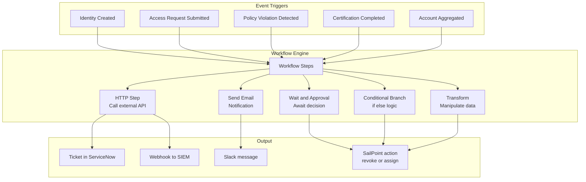

# 09 · Advanced Workflows & Event Triggers

---

## Why this matters

Basic SailPoint workflows approving a request, sending a notification cover 80% of use cases. The remaining 20% multi-step processes with conditional logic, integrations with external systems, automatic responses to security events require the advanced automation layer.

Event Triggers and advanced Workflows are what transform SailPoint from a passive governance tool into an active orchestration engine. When a user violates an SoD policy, the workflow can notify the manager, create a ticket in ServiceNow, request approval, and revoke the access all automatically. This lab is the most technical in the series and the one that most differentiates a junior profile from a senior one.

---

## Architecture

---

## Prerequisites

- Labs 01-09 completed data and configurations from previous labs available to connect in workflows
- A Make (formerly Integromat) or Zapier account to simulate external webhooks (free tier)
- Basic familiarity with JSON and REST APIs

---

## Lab Walkthrough

### Step 1 · Explore the Workflow Designer

Go to **Admin → Workflow** and open the Workflow Designer. Explore the available step types: Start/End, HTTP Request, Approval, Email, Branch, Transform.

*The Workflow Designer is visual and block-based similar to Okta Workflows or Power Automate. However, for complex logic, the Transform steps require basic JSON knowledge.*

---

### Step 2 · Create a Policy Violation notification workflow

Create a workflow triggered when an SoD violation is detected (Event Trigger: `POLICY_VIOLATION`) that sends an email notification to the user's manager with the violation details.

*The `POLICY_VIOLATION` trigger includes in its payload the affected user, the conflicting entitlements, and the violated policy all the information needed for a meaningful notification email.*

---

### Step 3 · Add an approval step to the workflow

After the notification, add an Approval step: the manager must decide whether to revoke the access or request an exception. The workflow waits for the response before continuing.

*The approval step makes the workflow interactive the system does not act automatically but waits for a decision from a human with context.*

---

### Step 4 · Add conditional logic with a Branch step

Add a Branch step after the approval: if the manager approves the exception → document and continue; if they decide to revoke → proceed to automatic revocation.

*Conditional logic is what makes a workflow genuinely useful different responses to different decisions, without additional manual intervention.*

---

### Step 5 · Configure an HTTP Step to integrate with ServiceNow

Add an HTTP step that calls the ServiceNow API (or your test webhook) to create an incident ticket with the SoD violation details.

*ITSM integration via HTTP Step is the most requested use case in enterprise projects SailPoint detects the event, ServiceNow manages the remediation workflow.*

---

### Step 6 · Use a Transform Step to prepare the payload

Before the HTTP Step, add a Transform Step that formats the trigger data into the JSON the ServiceNow API expects: map fields, concatenate strings, format dates.

*The Transform Step uses VTL (Velocity Template Language) or JSONPath to manipulate data this is the most technical part of workflows and where most time is spent in real projects.*

---

### Step 7 · Create an Event Trigger for Identity Created

Create a second workflow triggered by the `IDENTITY_CREATED` event. When a new identity is created, send a webhook to Slack with the new employee's basic details.

*The `IDENTITY_CREATED` trigger is at the heart of any automated Joiner process any welcome action, notification, or additional onboarding step starts here.*

---

### Step 8 · Monitor workflow executions

Go to **Admin → Workflow → Executions** and review the execution history of your workflows: successes, failures, duration per step, and the payload processed at each step.

*The execution history is essential for debugging when a workflow fails, the execution view shows exactly which step failed and what data it held at that moment.*

---

## What I Learned

- **VTL (Velocity Template Language)** in Transform Steps is the steepest learning curve in the Workflow Designer. It is worth investing time to learn it without it, the most complex workflows are simply not possible.
- **Event Triggers have different payloads** depending on the event type the `POLICY_VIOLATION` payload has different fields than `ACCESS_REQUEST_SUBMITTED`. Always check the documentation for the specific trigger before designing the workflow.
- I learned that **approval step timeouts must be configured explicitly** a workflow waiting indefinitely for an approval blocks the entire process. Always define a timeout and an escalation action.
- The **ServiceNow integration via HTTP** works well for creating tickets, but managing the ticket lifecycle (updates, closure) requires a reverse webhook from ServiceNow back to SailPoint more complex but fully implementable.

---

## Real-World Applications

- Automating SoD violation response: detect → notify manager → wait for decision → execute action → close ticket in ServiceNow, all without any manual IT intervention
- Building an express offboarding process that, on a Terminated status trigger, simultaneously notifies HR, IT, and Security and revokes access in the correct order
- Sending real-time alerts to Slack whenever privileged access to a critical system is granted, allowing the security team to react within minutes

---

## Resources

- [Workflows in SailPoint ISC](https://documentation.sailpoint.com/saas/help/workflows/workflow_overview.html)
- [Event Triggers](https://documentation.sailpoint.com/saas/help/workflows/event_triggers.html)
- [Workflow steps reference](https://documentation.sailpoint.com/saas/help/workflows/workflow_steps.html)
