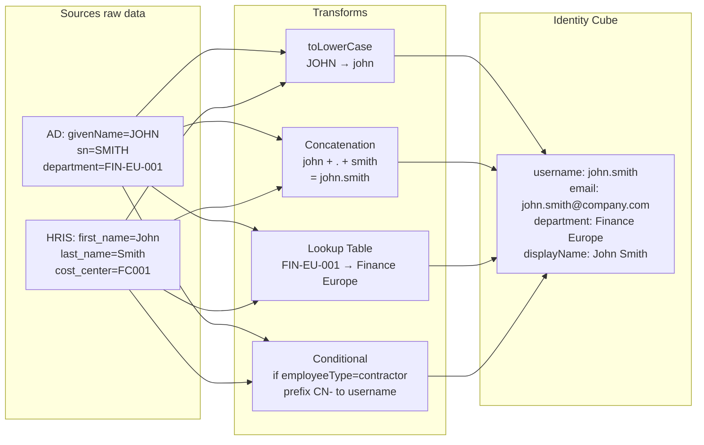

# 10 · Identity Profiles & Transforms

---

## Why this matters

Los datos que entran en SailPoint desde los Sources raramente vienen exactos y completos. El nombre está en mayúsculas en AD pero en minúsculas en el HRIS. El username en Salesforce se genera concatenando firstName + "." + lastName pero el email usa un formato distinto. El department code en SAP es "FIN-EU-001" pero en el portal de acceso debe aparecer como "Finance — Europe".

Los Transforms son el motor de transformación de SailPoint permiten manipular, concatenar, calcular y normalizar los atributos de los Sources antes de que lleguen al Identity Cube. Los Identity Profiles definen cómo usar esos atributos transformados para construir el perfil completo de cada identidad. Este lab es el más técnico de la serie y el que más se agradece en el día a día de un proyecto.

---

## Architecture

---

## Prerequisites

- Labs 01-10 completados Sources configurados con datos reales importados
- Algunos atributos con inconsistencias entre Sources para practicar normalización
- Familiaridad básica con JSON

---

## Lab Walkthrough

### Step 1 · Explorar el Transform Editor

Ve a **Admin → Identities → Transforms** y revisa los Transforms predefinidos que SailPoint incluye: toLowerCase, toUpperCase, concat, trim, split, dateFormat, lookup, conditional.

*SailPoint incluye ~30 tipos de Transforms out-of-the-box. Para transformaciones muy específicas, puedes crear Transforms custom usando JSONPath o Velocity Template Language.*

---

### Step 2 · Crear un Transform de concatenación para el username

Crea un Transform que genera el username concatenando el firstName en minúsculas + "." + lastName en minúsculas. Ejemplo: "John" + "." + "Smith" → "john.smith".

*La generación consistente de usernames es crítica si el mismo usuario se crea con username distinto en diferentes sistemas, la correlación falla y se generan duplicados.*

---

### Step 3 · Añadir un Transform de unicidad al username

Añade una capa de unicidad al Transform de username: si "john.smith" ya existe, generar "john.smith2", luego "john.smith3", etc. SailPoint tiene un Transform de tipo `accountAttribute` para esto.

*La unicidad de username es uno de los problemas más comunes en implementaciones nuevas de SailPoint sin este Transform, dos empleados con el mismo nombre generan conflictos de correlación.*

---

### Step 4 · Crear un Transform Lookup para normalizar departamentos

Crea un Transform de tipo `lookup` que mapea los códigos de departamento del HRIS ("FIN-EU-001") a nombres legibles ("Finance — Europe"). Define el diccionario de mapeo.

*El Lookup Transform es esencial cuando diferentes sistemas usan códigos distintos para lo mismo normalizar en SailPoint en lugar de en cada sistema fuente simplifica el mantenimiento.*

---

### Step 5 · Configurar un Transform condicional

Crea un Transform que añade el prefijo "EXT-" al username cuando el atributo `employeeType = "contractor"`. Ejemplo: "john.smith" → "EXT-john.smith" para contratistas.

*Los Transforms condicionales permiten aplicar lógica de negocio en los atributos en este caso, hacer visualmente distinguibles las cuentas de contratistas de las de empleados.*

---

### Step 6 · Aplicar los Transforms al Identity Profile

Ve al Identity Profile y en el mapeo de atributos, asocia los Transforms creados a los campos correspondientes: el Transform de username al campo `uid`, el Lookup al campo `department`.

*El Identity Profile es donde los Transforms se activan el atributo del Source entra por la izquierda, pasa por el Transform, y el resultado sale al Identity Cube por la derecha.*

---

### Step 7 · Verificar los atributos transformados en las identidades

Después de re-agregar, revisa el perfil de un usuario y confirma que los atributos del Identity Cube muestran los valores transformados (minúsculas, nombres de departamento legibles, username con prefijo correcto).

*La verificación post-agregación es imprescindible un Transform con un error de lógica puede corromper los atributos de miles de usuarios sin avisar.*

---

### Step 8 · Crear un Transform de fecha para calcular tiempo en la empresa

Crea un Transform que calcula el número de años en la empresa restando la fecha de inicio (`startDate`) a la fecha actual. Mapea el resultado al atributo custom `yearsOfService`.

*Los atributos calculados como `yearsOfService` son útiles para certification campaigns (priorizar revisión de usuarios con muchos años y muchos accesos acumulados) y para reporting.*

---

## What I Learned

- **Los Transforms son más poderosos de lo que parecen** combinando múltiples Transforms en cadena se pueden implementar lógicas de negocio bastante complejas sin código custom.
- **El orden de las Transforms importa** si primero haces toLowerCase y luego concat, el resultado es diferente a si primero haces concat y luego toLowerCase. Diseña la cadena de transformación pensando en el orden de operaciones.
- Los **Transforms de tipo `accountAttribute`** (que leen un atributo de una cuenta existente en un Source) son los más complejos pero también los más útiles permiten construir atributos de identidad basados en lo que ya existe en los sistemas.
- Aprendí que **cambiar un Transform que ya está en producción** afecta a todas las identidades en la próxima agregación puede haber un período de transición donde los datos son inconsistentes. Planifica los cambios de Transform con cuidado y comunica el impacto.

---

## Real-World Applications

- Normalizar los nombres de todos los empleados a un formato consistente (Surname, FirstName) para todas las notificaciones y reportes, independientemente del formato en el Source
- Generar automáticamente la dirección de email corporativa (`firstname.lastname@company.com`) como atributo calculado en SailPoint, que luego se usa para provisionar cuentas en nuevas aplicaciones
- Calcular el "access risk score personalizado" combinando el número de entitlements, el tiempo en la empresa y el tipo de empleado usando un Transform compuesto

---

## Resources

- [Transforms overview](https://documentation.sailpoint.com/saas/help/transforms/transforms_overview.html)
- [Transform types reference](https://documentation.sailpoint.com/saas/help/transforms/operations/index.html)
- [Identity Profile configuration](https://documentation.sailpoint.com/saas/help/identities/identity_profiles.html)

