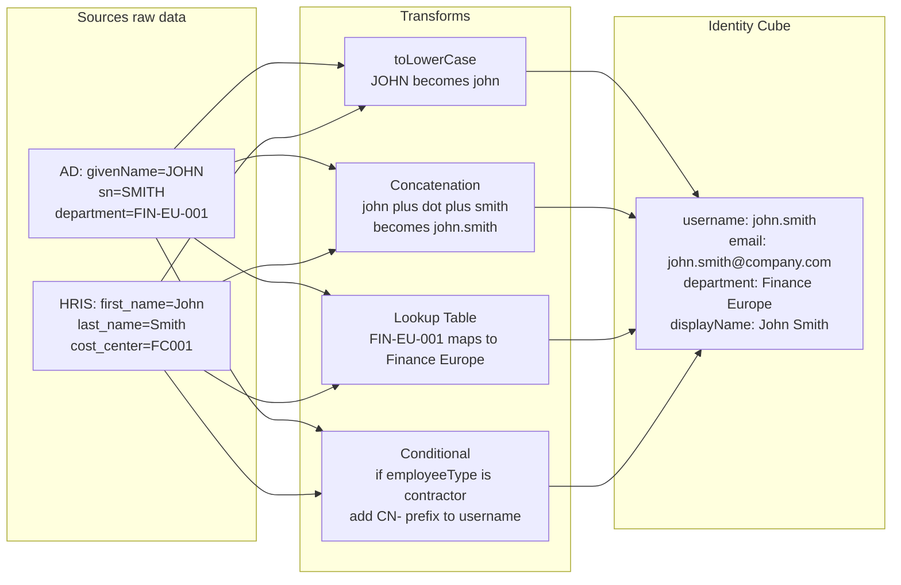

# 10 · Identity Profiles & Transforms

---

## Why this matters

Data coming into SailPoint from Sources is rarely clean and consistent. The name is in uppercase in AD but mixed case in the HRIS. The Salesforce username is generated by concatenating firstName + "." + lastName, but the email uses a different format. The department code in SAP is "FIN-EU-001" but in the access portal it should appear as "Finance — Europe."

Transforms are SailPoint's transformation engine they allow you to manipulate, concatenate, calculate, and normalize Source attributes before they reach the Identity Cube. Identity Profiles define how those transformed attributes are used to build the complete profile of each identity. This is the most technical lab in the series and the one most appreciated day to day in a real project.

---

## Architecture

---

## Prerequisites

- Labs 01-10 completed Sources configured with real imported data
- Some attributes with inconsistencies between Sources to practice normalization
- Basic familiarity with JSON

---

## Lab Walkthrough

### Step 1 · Explore the Transform Editor

Go to **Admin → Identities → Transforms** and review the predefined Transforms SailPoint includes: toLowerCase, toUpperCase, concat, trim, split, dateFormat, lookup, conditional.

*SailPoint includes around 30 built-in Transform types. For highly specific transformations, you can create custom Transforms using JSONPath or Velocity Template Language.*

---

### Step 2 · Create a concatenation Transform for the username

Create a Transform that generates the username by concatenating firstName in lowercase + "." + lastName in lowercase. Example: "John" + "." + "Smith" becomes "john.smith".

*Consistent username generation is critical if the same user gets a different username in different systems, correlation fails and duplicates are created.*

---

### Step 3 · Add a uniqueness layer to the username Transform

Add a uniqueness layer to the username Transform: if "john.smith" already exists, generate "john.smith2", then "john.smith3", and so on. SailPoint has an `accountAttribute` Transform type for this.

*Username uniqueness is one of the most common problems in new SailPoint implementations without this Transform, two employees with the same name generate correlation conflicts.*

---

### Step 4 · Create a Lookup Transform to normalize department names

Create a Transform of type `lookup` that maps HRIS department codes ("FIN-EU-001") to human-readable names ("Finance — Europe"). Define the mapping dictionary within the Transform.

*The Lookup Transform is essential when different systems use different codes for the same concept — normalizing in SailPoint rather than in each source system simplifies maintenance.*

---

### Step 5 · Configure a conditional Transform

Create a Transform that adds the prefix "EXT-" to the username when `employeeType = "contractor"`. Example: "john.smith" becomes "EXT-john.smith" for contractors.

*Conditional Transforms allow business logic to be applied to attributes in this case, making contractor accounts visually distinguishable from employee accounts.*

---

### Step 6 · Apply Transforms to the Identity Profile

Go to the Identity Profile and in the attribute mapping, associate the created Transforms with the corresponding fields: the username Transform to the `uid` field, the Lookup to the `department` field.

*The Identity Profile is where Transforms are activated the Source attribute enters on the left, passes through the Transform, and the result exits to the Identity Cube on the right.*

---

### Step 7 · Verify transformed attributes on identities

After re-aggregating, review a user's profile and confirm the Identity Cube shows the transformed values: lowercase username, readable department name, correct prefix for contractors.

*Post-aggregation verification is essential a Transform with a logic error can corrupt attributes for thousands of users silently. Always verify after applying new Transforms.*

---

### Step 8 · Create a date Transform to calculate tenure

Create a Transform that calculates the number of years at the company by subtracting the `startDate` attribute from the current date. Map the result to a custom attribute `yearsOfService`.

*Calculated attributes like `yearsOfService` are useful for certification campaigns (prioritize review of users with many years and accumulated access) and for compliance reporting.*

---

## What I Learned

- **Transforms are more powerful than they appear** combining multiple Transforms in a chain allows fairly complex business logic to be implemented without custom code.
- **The order of Transforms matters** if you do toLowerCase first and then concat, the result is different from concat first then toLowerCase. Design the transformation chain thinking about the order of operations.
- **`accountAttribute` Transform type** (reads an attribute from an existing account in a Source) is the most complex but also the most useful it allows Identity Cube attributes to be built based on what already exists in target systems.
- I learned that **changing a Transform that is already in production** affects all identities in the next aggregation there may be a transition period where data is inconsistent. Plan Transform changes carefully and communicate the impact.

---

## Real-World Applications

- Normalizing all employee names to a consistent format (Surname, FirstName) for all notifications and reports, regardless of the format stored in the Source
- Automatically generating the corporate email address (`firstname.lastname@company.com`) as a calculated attribute in SailPoint, then using it to provision accounts in new applications
- Calculating a personalized "access risk score" by combining the number of entitlements, tenure, and employee type through a composite Transform

---

## Resources

- [Transforms overview](https://documentation.sailpoint.com/saas/help/transforms/transforms_overview.html)
- [Transform types reference](https://documentation.sailpoint.com/saas/help/transforms/operations/index.html)
- [Identity Profile configuration](https://documentation.sailpoint.com/saas/help/identities/identity_profiles.html)
