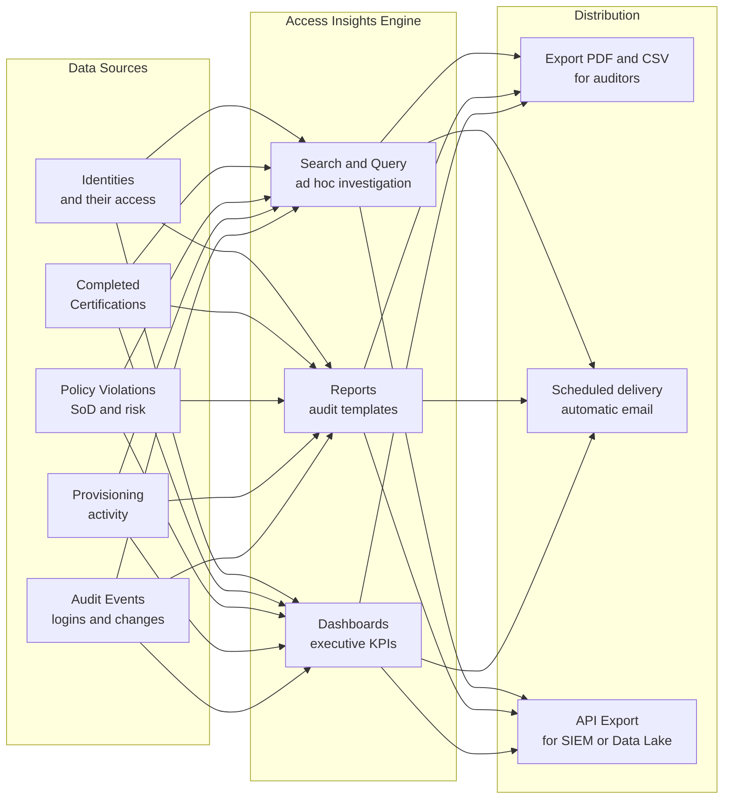
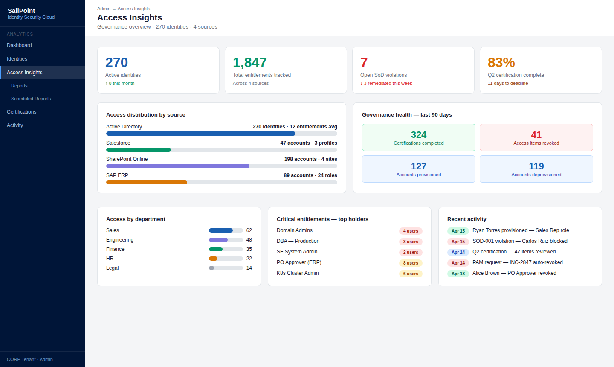
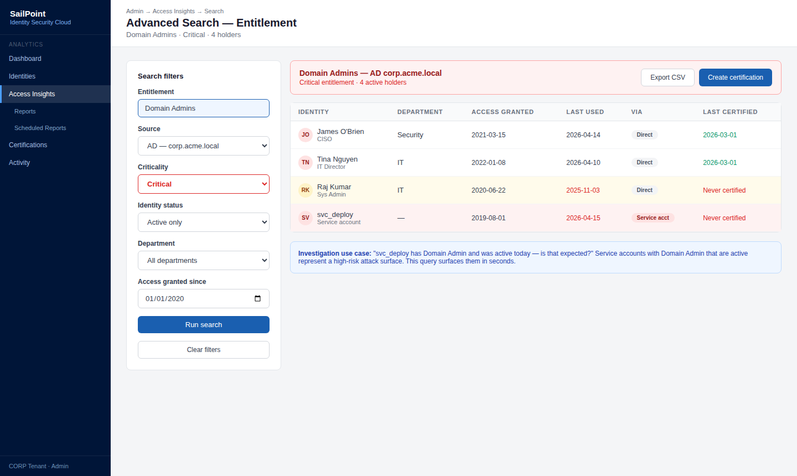
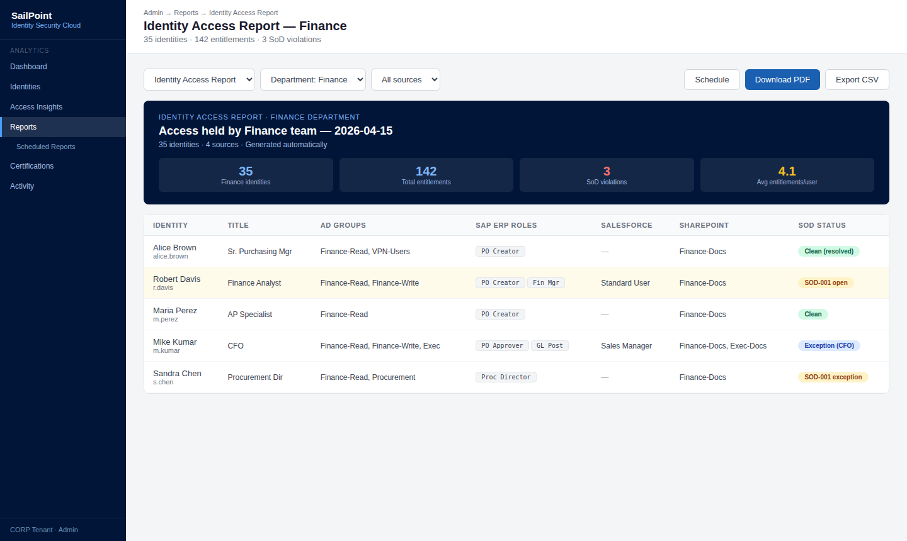
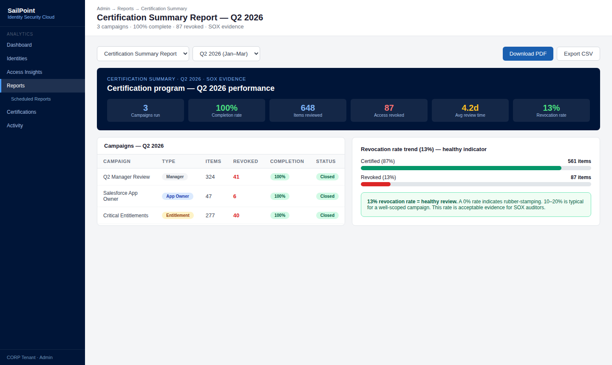
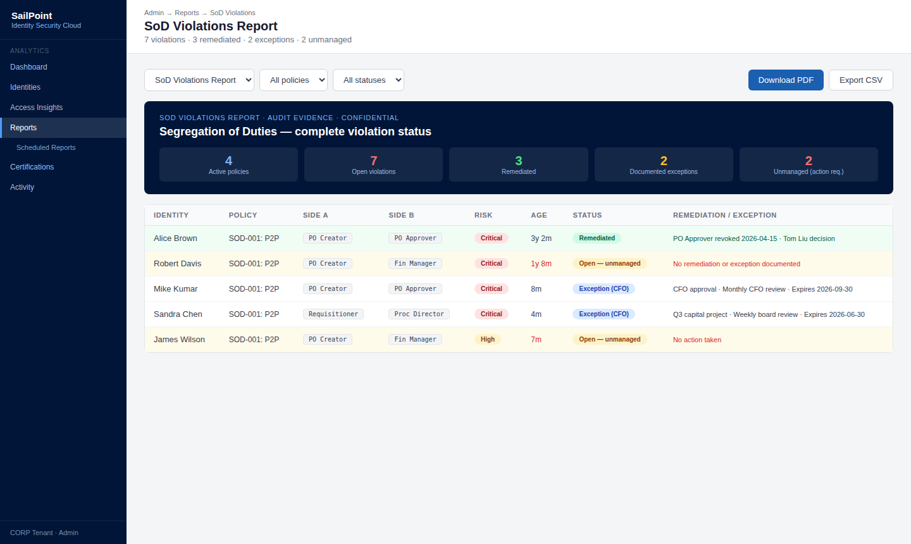
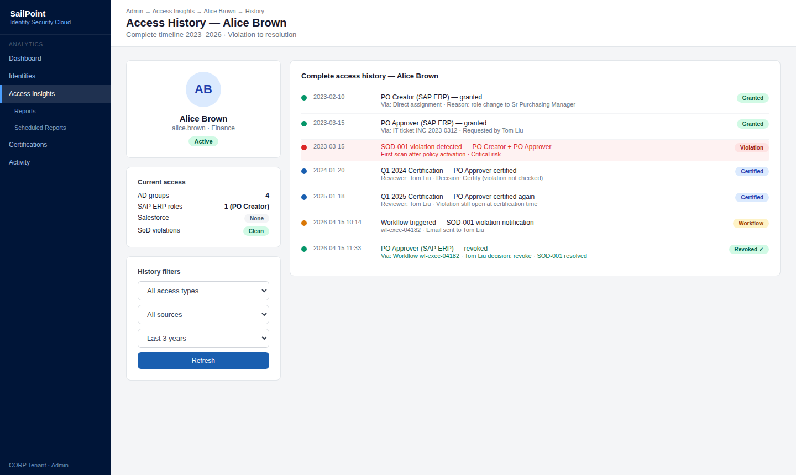
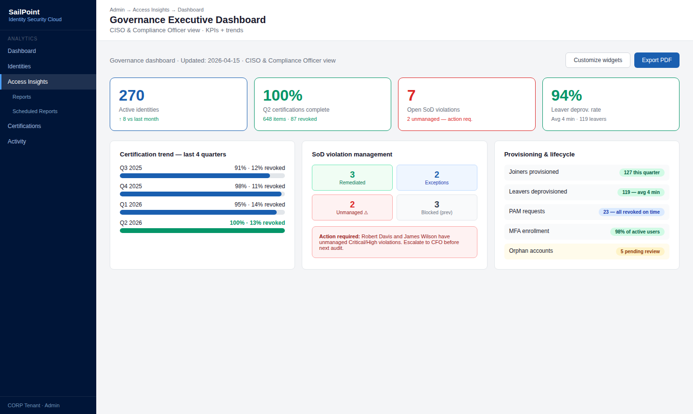
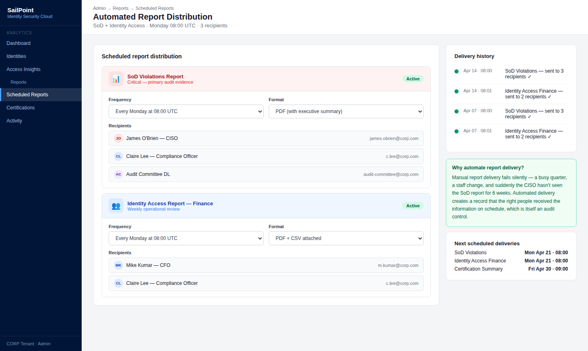

# 11 · Access Insights & Reporting

---

## Why this matters

Governance without visibility does not work. You can have every control correctly configured certifications, SoD, lifecycle and still fail an audit if you cannot answer in minutes "who has access to this system?", "how many active SoD violations do we have?", or "what access did this user hold on March 15th?"

Access Insights and SailPoint reports are the visibility layer that converts governance data into actionable information. This lab generates the reports most requested in SOX, ISO 27001, and SOC 2 audits, explores advanced search capabilities for security investigations, and configures automated distribution of key reports to the right stakeholders on a schedule.

---

## Architecture

---

## Prerequisites

- Labs 01-11 completed the more data in the tenant, the more useful the reports
- At least one completed certification campaign and some recorded policy violations

---

## Lab Walkthrough

### Step 1 · Explore Access Insights

Go to **Admin → Access Insights** and explore the main panel. Review the available sections: Identity Overview, Access Overview, Activity, and the search filters.

*Access Insights is SailPoint's analytical window it combines data from all previous labs into a unified view for analysis and reporting.*

---

### Step 2 · Advanced search — who has access to what

Use advanced search to answer: "Which users have access to the highest-criticality entitlement?" Apply filters by entitlement, Source, and criticality level.

*This search is what you run in the first minutes of a security investigation "someone accessed sensitive data, who else holds that same entitlement right now?"*

---

### Step 3 · Generate the Identity Access Report

Go to **Admin → Reports** and run the **Identity Access Report** for the Finance department. The report shows all access held by each user in the department.

*This is the most requested report in audits "show me all the access held by the Finance department." In SailPoint, it takes 30 seconds to generate.*

---

### Step 4 · Generate the Certification Summary Report

Run the certification summary report for the last period. It shows how many campaigns ran, completion rate, access revoked, and average review time.

*SOX auditors review this report to confirm that access reviews were performed at the established frequency and that results were documented.*

---

### Step 5 · Generate the SoD Violations Report

Generate the complete SoD violations report: active violations, remediated violations, and violations with approved exceptions. Include age, owner, and remediation plan for each.

*This report is the primary evidence document for financial audits auditors want to see zero unmanaged violations. Violations with documented exceptions are acceptable.*

---

### Step 6 · Query the access history of a specific user

Use the search to reconstruct a user's access history: what access they held, when it was granted, when it was revoked, and through which process (certification, request, lifecycle).

*This query is what you run during a security incident investigation reconstructing exactly what access the compromised user held and during which time period.*

---

### Step 7 · Configure the executive governance dashboard

Customize the dashboard with KPI widgets: number of active identities, access certified in the last quarter, active SoD violations, and Leaver process deprovisioning rate.

*The executive dashboard is what the CISO and Compliance Officer review weekly in one screen, the current state of the identity governance program.*

---

### Step 8 · Configure automated report distribution

For the most critical reports (Identity Access, SoD Violations), configure scheduled delivery: every Monday at 8am, export as PDF and send to the CISO, Compliance Officer, and Audit Committee.

*Automated distribution eliminates the risk of forgetting to send critical reports before an audit and creates a record that the information was regularly shared with the right stakeholders.*

---

## What I Learned

- **Access Insights is the most underutilized feature of SailPoint** most projects configure governance but do not leverage the analytical capabilities to improve the model over time.
- The **historical search** has a retention window limited by the tenant's retention policy. For long-term forensics, regularly exporting data to a SIEM or data lake is necessary.
- **SailPoint reports are sufficient for standard audits**, but the most demanding auditors (Big 4 at multinational companies) sometimes request data in specific formats requiring API export and external processing.
- I learned that **dashboards are more useful for detecting trends** than point-in-time states seeing that SoD violations grew 15% this month is more actionable than seeing there are 47 violations today.

---

## Real-World Applications

- Delivering access control evidence to external SOX auditors in 30 minutes instead of days, with pre-configured reports generated on demand
- Automatically sending the CISO a weekly summary every Monday of pending SoD violations, expired certifications, and detected orphan accounts
- Feeding a SIEM with periodic Access Insights exports to correlate identity access data with network and endpoint security events

---

## Resources

- [Access Insights overview](https://documentation.sailpoint.com/saas/help/access/access_insights.html)
- [Reports in SailPoint ISC](https://documentation.sailpoint.com/saas/help/reports/reports.html)
- [Search and query reference](https://documentation.sailpoint.com/saas/help/search/search.html)

