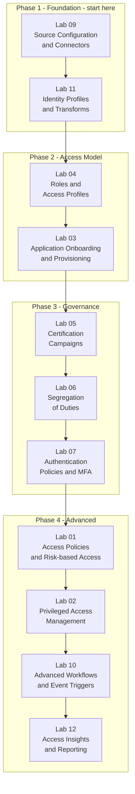

# SailPoint IdentityNow — Hands-On Labs

---

## About this repository

Hands-on SailPoint IdentityNow lab series covering the most relevant topics for IAM Engineer, IGA Analyst, and Identity Security Specialist roles. Each lab includes real business context, architecture diagrams, step-by-step walkthroughs with annotated screenshots, and honest reflections on what was learned.

The goal is not to follow a checklist without understanding it is to build the mental model of *why* each capability exists and when you would use it in a real project.

---

## ⚠️ Important — lab numbers do not reflect learning order

The lab numbers in this repository match the official SailPoint curriculum list. **They do not represent the order in which they should be completed.**

Starting with Lab 01 (Access Policies & Risk-based Access) without context will result in empty screens and no meaningful data to work with that lab requires identities, entitlements, roles, and access history to already exist in the tenant.

**Always follow the learning path below, not the lab numbers.**

---

## Learning Path

---

## Why this order matters

**Lab 09 must be first** without a connected Source (Active Directory, HRIS, or CSV), there are no identities in the tenant. Every other lab depends on identities existing with correct attributes.

**Lab 11 must be second** Identity Profiles and Transforms define how the raw data from Sources becomes clean, structured identity data. Roles, certifications, and SoD policies all depend on well-structured identity attributes.

**Labs 04 and 03 build the access model** Roles and Access Profiles define what access looks like. Provisioning makes that access real in target systems.

**Labs 05 and 06 are the governance core** Certifications and SoD are what auditors care about most. They only make sense once identities have access to review.

**Labs 01 and 02 are Phase 4** Risk-based Access and PAM require a mature data set. Risk scoring is meaningless without identities, entitlements, and access history already populated.

---

## Lab Index

| Lab | Title | Learning order | Level | Priority |
|---|---|---|---|---|
| 08 | [Source Configuration & Connectors](./09-Source-Configuration-Connectors/) | **1st** | 🟡 Intermediate | 🔴 Must Have |
| 10 | [Identity Profiles & Transforms](./11-Identity-Profiles-Transforms/) | **2nd** | 🔴 Advanced | 🟠 High |
| 04 | [Roles & Access Profiles](./04-Roles-Access-Profiles/) | **3rd** | 🟡 Intermediate | 🟠 High |
| 02 | [Application Onboarding & Provisioning](./03-Application-Onboarding-Provisioning/) | **4th** | 🟡 Intermediate | 🟠 High |
| 05 | [Certification Campaigns](./05-Certification-Campaigns/) | **5th** | 🟡 Intermediate | 🔴 Must Have |
| 06 | [Segregation of Duties (SoD)](./06-Segregation-of-Duties/) | **6th** | 🔴 Advanced | 🟠 High |
| 07 | [Authentication Policies & MFA](./07-Authentication-Policies-MFA/) | **7th** | 🟡 Intermediate | 🟠 High |
| 01 | [Access Policies & Risk-based Access](./01-Access-Policies-Risk/) | **8th** | 🟡 Intermediate | 🟠 High |
| 03 | [Privileged Access Management (PAM)](./02-Privileged-Access-Management/) | **9th** | 🔴 Advanced | 🟠 High |
| 09 | [Advanced Workflows & Event Triggers](./10-Advanced-Workflows-Event-Triggers/) | **10th** | 🔴 Advanced | 🟠 High |
| 11 | [Access Insights & Reporting](./12-Access-Insights-Reporting/) | **11th** | 🟡 Intermediate | 🟢 Recommended |

---

## How each lab is structured

Every lab README follows the same format, designed to show real understanding rather than step execution:

**Why this matters** the business or security problem the feature solves, in plain language.

**Architecture diagram** a Mermaid diagram showing how the pieces connect before touching any configuration screen.

**Step-by-step walkthrough** each step explains *why*, not just *what*, with annotated screenshots as visual checkpoints.

**What I learned** honest reflection: what confused me, what surprised me, errors hit and how they were resolved.

**Real-world applications** concrete scenarios where this capability is used in production deployments.

---

## Environment used

- **SailPoint Identity Security Cloud** 30-day free trial at [sailpoint.com](https://www.sailpoint.com)
- **Active Directory** Windows Server 2019 on a local VM (`DC=corp,DC=acme,DC=local`) as the primary Source
- **Virtual Appliance** OVA deployed in VMware Workstation, bridging the local AD to SailPoint ISC
- **Salesforce Developer Edition** free, used as a secondary Source with write-back provisioning
- **Postman** for exploring the SailPoint REST API during provisioning and workflow labs

---

## Target certification

These labs cover approximately 90% of the content for the **SailPoint Certified IdentityNow Engineer** exam.

---

## Identity Security portfolio

| Repository | Platform | Focus | Status |
|---|---|---|---|
| [`sc-300-labs`](../sc-300-labs/) | Microsoft Entra ID | Conditional Access, PIM, Identity Protection | ✅ Completed |
| [`Okta-Hands-On-Labs-IAM`](../Okta-Hands-On-Labs-IAM/) | Okta Workforce Identity | SSO, MFA, SCIM, API Access | 🔄 In Progress |
| [`SailPoint`](.) | SailPoint IdentityNow | IGA, Certifications, SoD, Governance | ✅ Completed |

With all three platforms covered, the profile targets **IAM Engineer**, **Identity Security Analyst**, and **IGA Specialist** roles the most in-demand positions in cybersecurity today.
