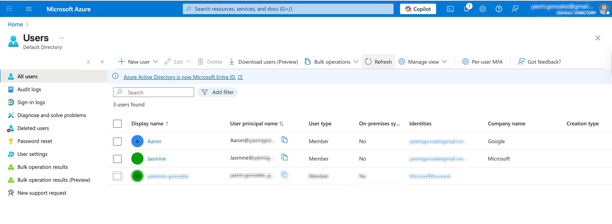
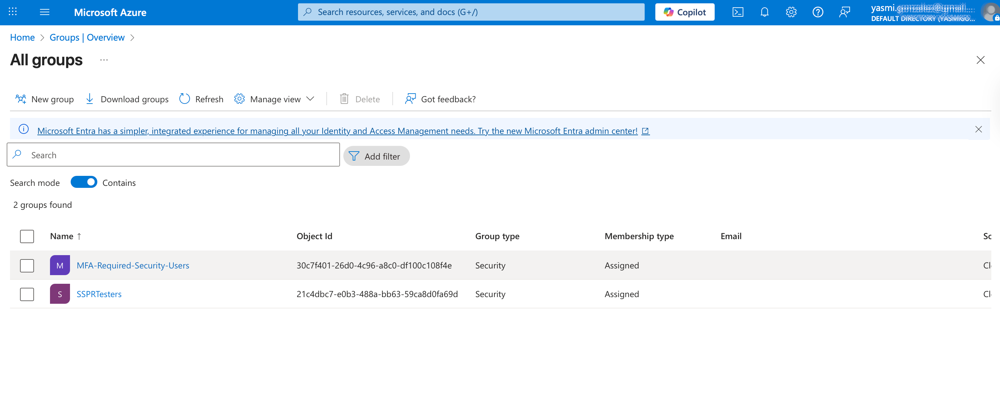
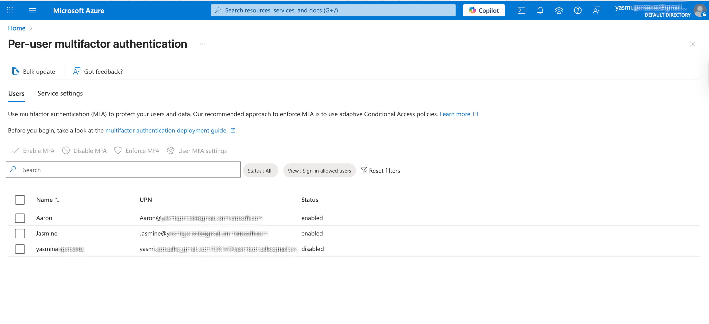
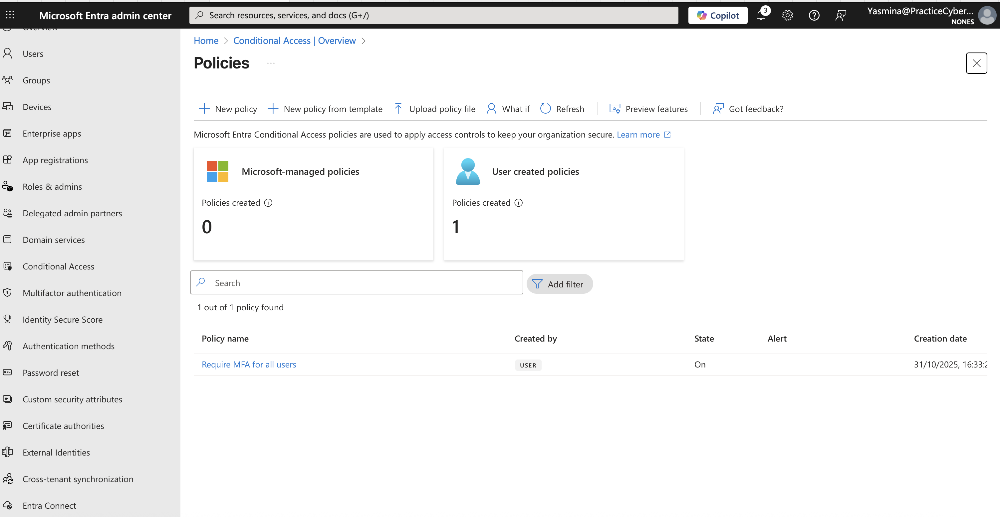
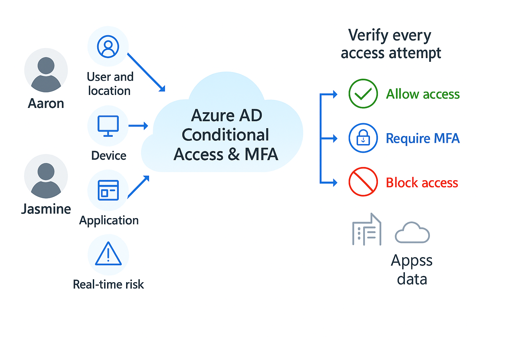
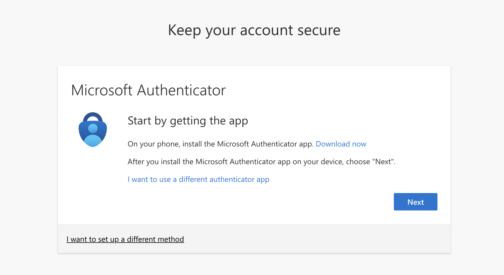
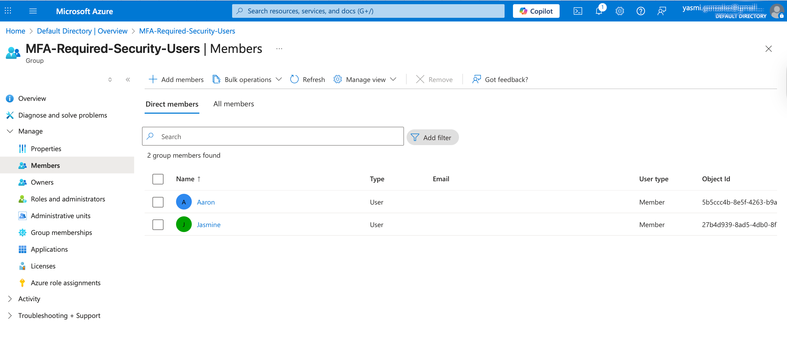

# Azure AD – Conditional Access & MFA

## 🧩 Overview
This lab demonstrates how to protect cloud identities in Microsoft Azure using Conditional Access and Multi-Factor Authentication (MFA).  
The configuration ensures that only authorized users belonging to a specific security group can access cloud resources, and only after successfully completing MFA verification.  

This setup reflects a real-world implementation of Zero Trust security, enforcing identity-based access control to defend against credential compromise and unauthorized access.  

## ⚠️ Real-World Risk 

> **88% of breaches involve stolen credentials** (Verizon DBIR 2025).<grok-card data-id="cf77d7" data-type="citation_card"></grok-card> Without MFA + CA, **1 leaked password = full access**.

Reduces:  
- Unauthorized access  
- Credential theft  
- Lateral movement  

Aligns with **NIST 800-63B** and **Zero Trust**.

By enforcing Conditional Access with MFA in Azure, organizations significantly reduce the risk of:  
- Unauthorized account access  
- Credential theft  
- Privilege escalation and lateral movement  

This approach aligns with Zero Trust principles verifying every access attempt before granting permissions.  

## 🛠 What I Built
- **2 cloud-only users** (Jasmine, Aaron)  
- **Security Group:** `MFA-Required-Users`  
- **Conditional Access Policy:** Requires MFA for all members of the group  
- **Full authentication flow tested:** Login → MFA prompt → Access granted  
- **100% cleanup:** No residual lab objects left in the environment  


### 🎥 Full Flow Demo (MFA Prompt → Access Granted)


📜 [View Real Conditional Access Policy (JSON)](./Screenshot/Policy.json)


- ## 🛠 Diagram


## 🛠  Conditional Access Decision Flow


## Conditional Access Policy (JSON exportable)

``` json
{
  "displayName": "Require MFA for all users",
  "state": "enabled",
  "conditions": {
    "clientAppTypes": ["all"],
    "applications": {
      "includeUserActions": ["urn:user:registerdevice"]
    },
    "users": {
      "includeGroups": ["<GROUP_GUID_MFA_REQUIRED_USERS>"],
      "includeUsers": ["<USER_GUID_OPTIONAL>"]
    }
  },
  "grantControls": { "operator": "OR", "builtInControls": ["mfa"] }
}


```
Step-by-Step Evidence

## Step-by-Step Evidence

| # | Action | Screenshot |
|---|---------|-------------|
| 1 | Create users |  |
| 2 | Create group + members |  |
| 3 | Enable per-user MFA (legacy) |  |
| 4 | Configure Conditional Access Policy |  |
| 5 | Verify Decision Flow |  |
| 6 | Test MFA Prompt |  |
| 7 | Confirm Enforcement |  |


### 1️⃣ Microsoft Entra ID User Creation  
Created two cloud-only test users in Azure AD for the lab environment:  
- `Jasmine Demo`  
- `Aaron Demo`  
📸 Screenshot: `Users.png`

### 2️⃣ Security Group Setup  
- Created a security group named MFA-Required-Users in Microsoft Entra ID.  
- Added Jasmine & Aaron as members of this group to target MFA enforcement.  
📸 Screenshot: `group-members.png`


### 3️⃣ Per-User MFA Enablement (Legacy)  
- Enabled per-user MFA for both users via the classic MFA settings in Microsoft Entra ID.  
- Verified the MFA status for each account.  
📸 Screenshot: `Per-User-MFA.png`


### 4️⃣ Conditional Access Policy Configuration  
1. Navigated to Microsoft Entra ID → Security → Conditional Access.  
2. Created a policy named Require MFA for MFA-Required-Users.  
3. Assigned the policy to the `MFA-Required-Users` group.  
4. Targeted All Cloud Apps.  
5. Set the access control to Require multi-factor authentication.  
6. Disabled Security Defaults to avoid conflicts.  
7. Enabled the new policy and confirmed it was active.  
📸 Screenshot: `Conditional-Access-Policy.png`

### 5️⃣ MFA Prompt Verification  
- Signed in as Jasmine to test policy enforcement.  
- Verified that an MFA registration prompt appeared before access to resources was granted.  
- Confirmed that the Conditional Access policy was actively enforcing MFA for group members.  
📸 Screenshot: `MFA-prompt.png`

### 🔐 License Assignment & Policy Validation

To enable Conditional Access and MFA testing, Microsoft Entra ID P2 licenses were assigned to the lab users.

**Steps performed:**
1. Accessed Microsoft 365 Admin Center → Billing → Licenses.
2. Located **Microsoft Entra ID P2** (25 total licenses).
3. Assigned the license to:
   - `Jasmine@PracticeCyber.onmicrosoft.com`
   - `Aaron@PracticeCyber.onmicrosoft.com`
4. Verified license propagation in **Microsoft Entra Admin Center → Licenses → License usage (Preview)**.

**Validation:**
- Both users now appear as *licensed* for Entra ID P2.
- Conditional Access policy “Require MFA for MFA-Required-Users” is successfully enforced.
- MFA prompt triggered upon Jasmine’s sign-in confirms the policy and license are active.

## ✅ Tools Result: 

MFA was successfully enforced via Conditional Access for all targeted users, validating the Zero Trust model implementation. 

## 🧰 Tools & Services Used
- Microsoft Azure Portal  
- Microsoft Entra ID (Azure AD)  
- Conditional Access Policies  
- Microsoft Authenticator App
- Microsoft  365 Admin Center
- Microsoft Graph Dev Center  


## 💡 Outcome
By implementing Azure AD Conditional Access with MFA, this lab demonstrates how to strengthen identity protection, enforce secure authentication, and reduce credential-based attack surfaces — providing a practical foundation for enterprise-level Identity & Access Management (IAM).  

> 🧩 **Troubleshooting:**  
> If license assignment fails with “invalid usage location,” set a Usage Location (e.g., United Kingdom) under **Licenses and apps → Select location**, then reassign the Entra ID P2 license.

