# 🔐 Lab 02 – Advanced Privileged Identity Management (PIM) & Identity Governance 

**Objective:**  
Implement Just-in-Time (JIT) access for Azure AD admin roles using approval workflows and MFA.

---
## 🧩 Overview  
This lab implements **Just-in-Time (JIT) privileged access** using **Privileged Identity Management (PIM)** in Microsoft Entra ID.  
Eligible roles are activated **only when needed**, with **MFA, justification, approval workflows, and time-bound access (max 4h)**.  
Access reviews run monthly to auto-remove stale privileges.  
This setup enforces **Zero Standing Access (ZSA)** — **no permanent admin rights** — aligning with **Zero Trust** and **NIST 800-207**.

## ⚠️ Real-World Risk  
> **74% of breaches involve over-privileged accounts** (Microsoft Security Report 2025).  
> Permanent Global Admin = **single point of failure**.  
PIM reduces:  
- Privilege abuse  
- Lateral movement  
- Insider threats  
- Compliance violations  

---

## 🛠 What I Built  
- **3 cloud-only users**: `admin-lab@`, `approver@`, `reviewer@`  
- **PIM enabled** for Azure AD roles & Azure resources  
- **Eligible roles**: Global Admin, User Admin, Billing Admin  
- **Activation controls**: MFA + Justification + Approval + 4h max  
- **Access Review**: Monthly, auto-apply results  
- **Audit trail**: Activation logs + CSV export  
- **Conditional Access**: Device compliance for PIM-activated sessions  
- **100% cleanup**: All lab objects removed post-demo  

### 🎥 Full Flow Demo (Activation → MFA → Approval → Access)  

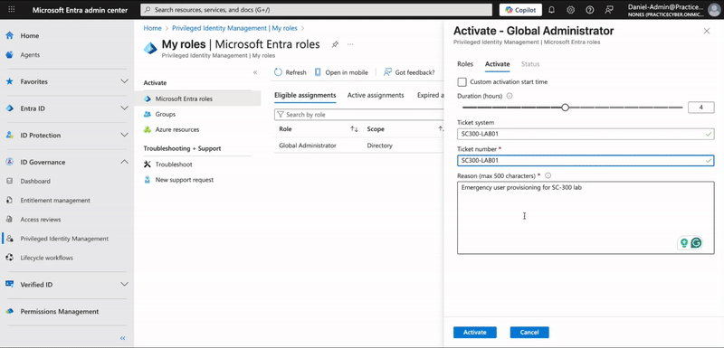  

📜 [View PIM Role Settings (JSON Export)](./Exports/PIM_Role_Settings.json)  
📊 [Activation History CSV](./Exports/PIM_Activation_History.csv)  

---

## 🛠 Architecture Diagram  
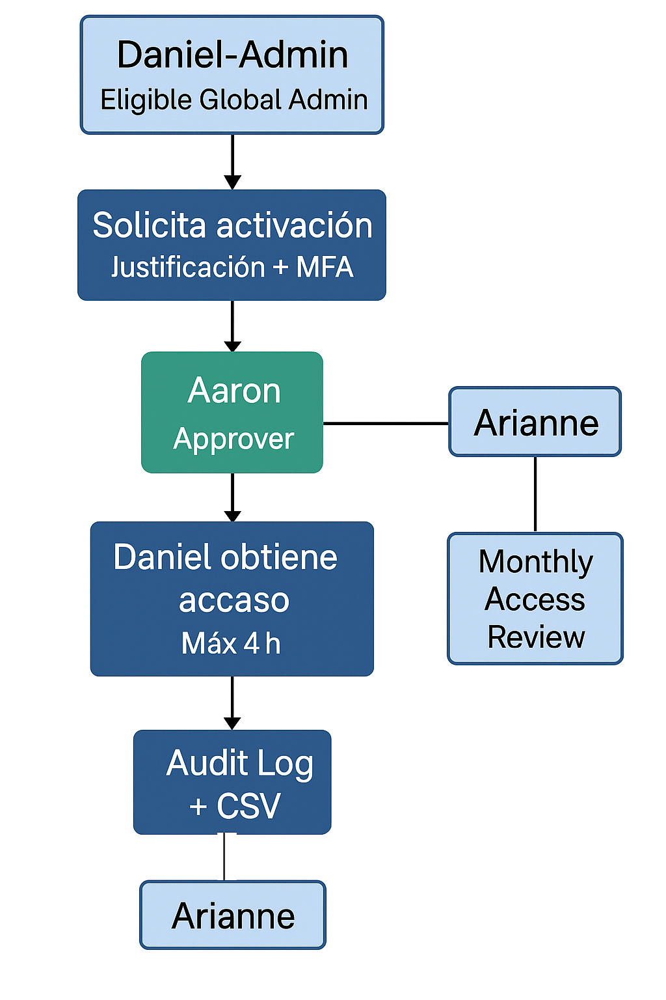


*Zero Standing Access (ZSA): No permanent privileges. JIT activation with MFA, approval, 4h limit, and monthly hygiene.*


---

## 🛠 PIM Activation Decision Flow  
  

---

## 🛠 PIM Role Settings (JSON Exportable)  
```json
{
  "roleDefinitionId": "62e90394-69f5-4237-9190-012177145e10",
  "displayName": "Global Administrator",
  "eligibleSettings": {
    "requireMfaOnActivation": true,
    "requireJustificationOnActivation": true,
    "requireApprovalToActivate": true,
    "maximumActivationDuration": "PT4H",
    "approvers": ["approver@contoso-lab.onmicrosoft.com"]
  },
  "accessReviews": {
    "frequency": "monthly",
    "autoApplyResults": true,
    "reviewerType": "self"
  }
}

```
----

## 🖼️  Evidence 

| # | Action | Screenshot |
|---|--------|------------|
| 1 | Create 3 test users | 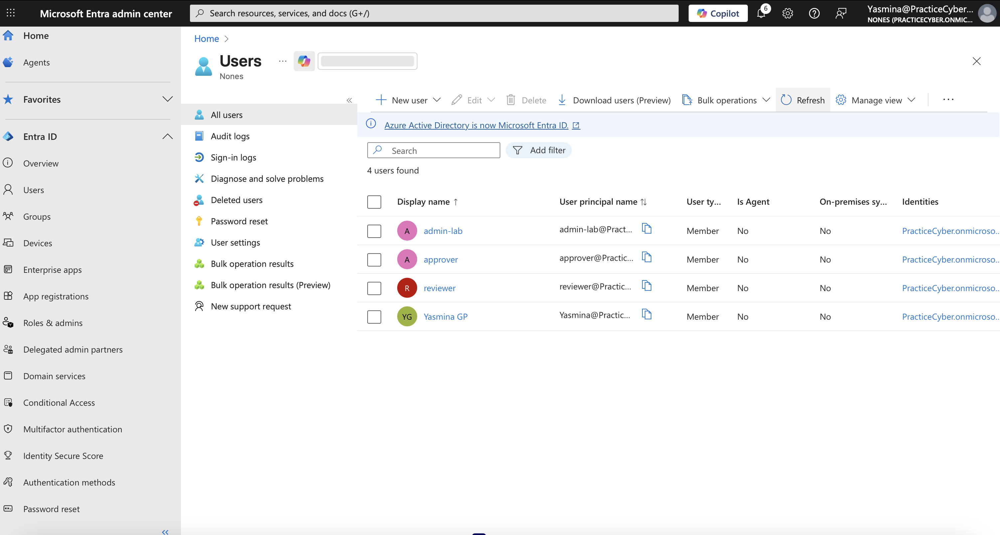 | 
| 2 | Enable PIM | 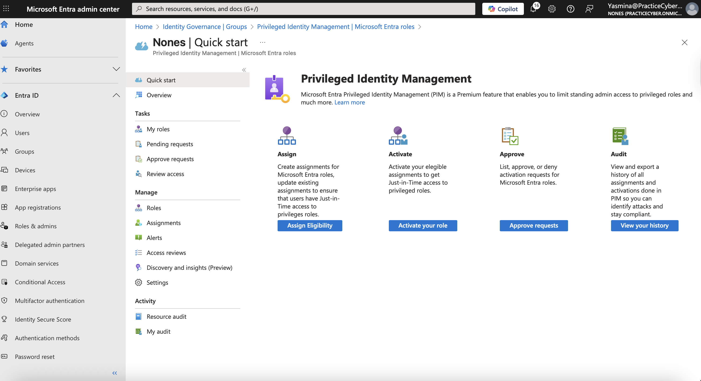, 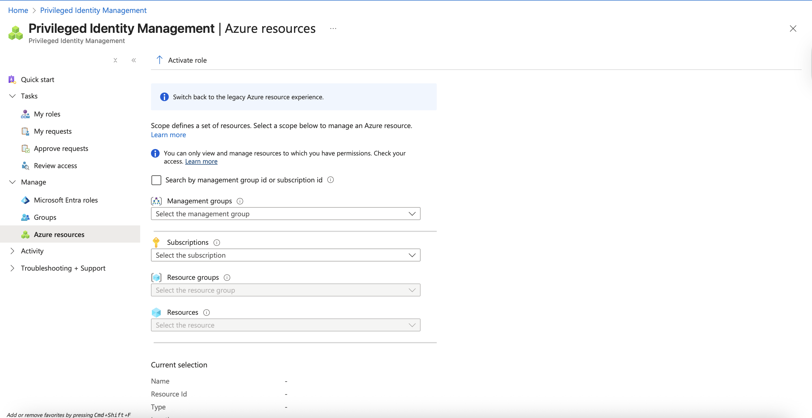 |
| 3 | Assign eligible role | 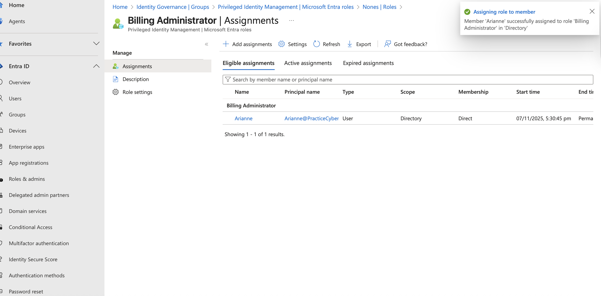 |
| 4 | Configure activation rules | 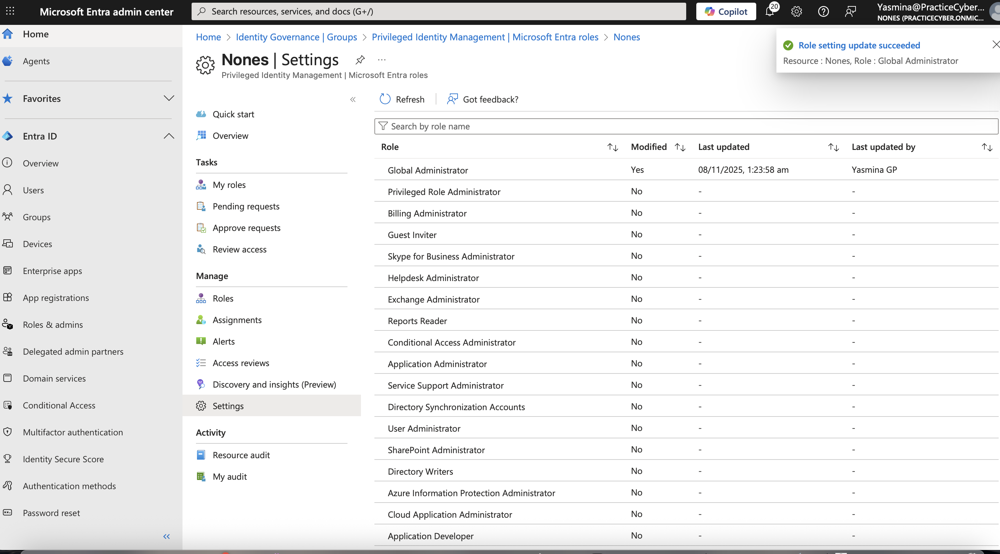 |
| 5 | Create access review | 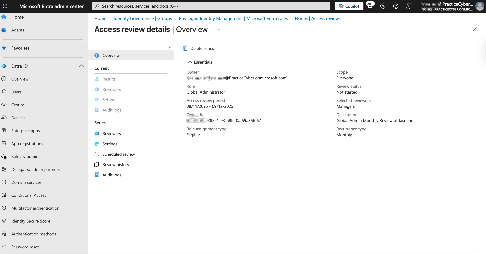 |
| 6 | Set approval workflow |  |
| 7 | Activate role (MFA) | 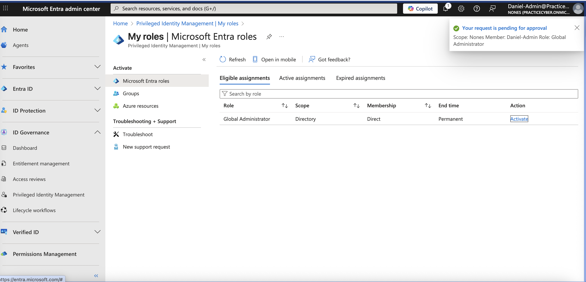 |
| 8 | Approve request | 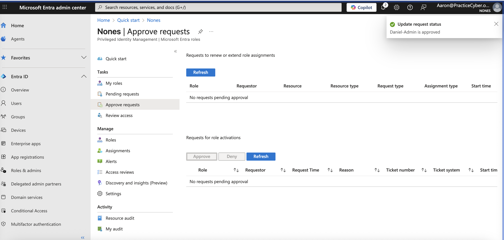 |
| 9 | Check audit logs | 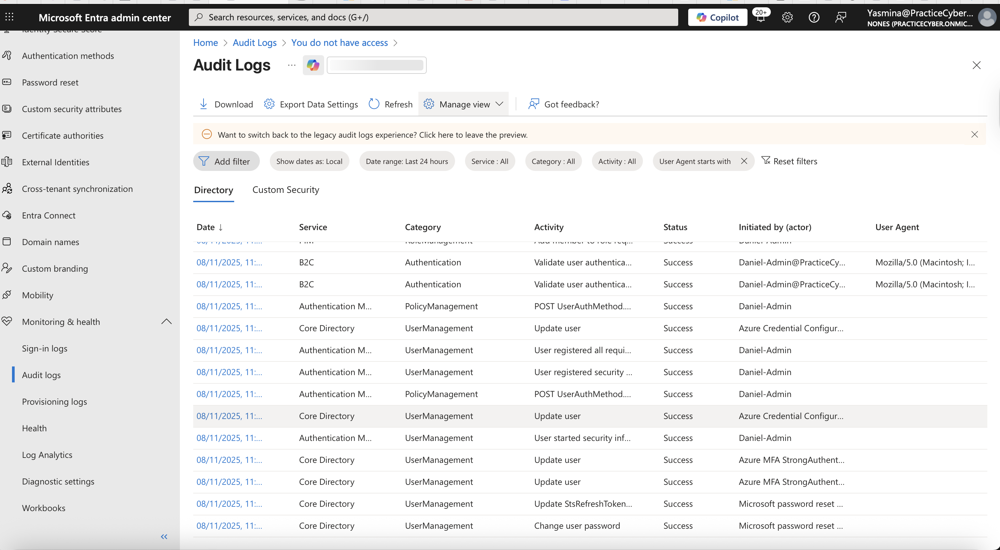 |
| 10 | Export history |  |

---
## 🧭 Step-by-Step 

## 1️⃣ Microsoft Entra ID User Creation
Created three cloud-only users in a Microsoft 365 Developer Tenant:

Jasmine@PracticeCyber.onmicrosoft.com → Eligible admin
Aaron@PracticeCyber.onmicrosoft.com → Approval authority
Arianne@PracticeCyber.onmicrosoft.com → Access review delegate
Daniel-Admin@PracticeCyber.onmicrosoft.com → Admin Request
📸 Screenshot: Users_Created.png


## 2️⃣ Enable PIM for Azure AD Roles

Navigated to Microsoft Entra Admin Center → Identity → Roles & admins → Privileged Identity Management
Enabled PIM for Azure AD roles
Discovered and enabled PIM for Azure subscription (optional)
📸 Screenshot: PIM_Enabled.png


## 3️⃣ Assign Eligible Global Administrator Role

In PIM → Azure AD roles → + Add assignments
Selected Eligible → User: Jasmine@PracticeCyber.onmicrosoft.com → Role: Global Administrator

📸 Screenshot: Eligible_Assignment.png


## 4️⃣ Configure Activation Controls

PIM → Role settings → Edit Global Administrator
Set:

Require MFA
Require justification
Maximum duration: 8 hours
Require approval → Approver: approver@...
📸 Screenshot: Role_Settings.png


## 5️⃣ Create Monthly Access Review

PIM → Access reviews → + Create review
Scope: Eligible members of Global Administrator
Frequency: Monthly
Auto-apply results: Remove access
📸 Screenshot: Access_Review.png


## 6️⃣ Role Activation (User Flow)

Signed in as Daniel-Admin@PracticeCyber.onmicrosoft.com → My roles → Activate
Entered justification: "Emergency user provisioning for SC-300 lab"
Completed MFA via Microsoft Authenticator
📸 Screenshot: Activation_MFA.png


## 7️⃣ Approval Workflow (Approver Flow)

Aaron@PracticeCyber.onmicrosoft.com received email + portal notification
Reviewed request → Approved with comment
📸 Screenshot: Approval_Granted.png


## 8️⃣ Audit Log Validation

Microsoft Entra Admin Center → Audit logs
Filtered: Activity: Manage PIM → Role activation
Confirmed event with IP, device, MFA status
📸 Screenshot: Audit_Log.png


## 9️⃣ Export Activation History

PIM → Role activation history → Export
Saved as PIM_Activation_History.csv
📊 File: ./Exports/PIM_Activation_History.csv

## 🔟 Bonus: Conditional Access for PIM Sessions
Policy Name: Require compliant device for PIM

Users: Include admin-lab@...
Cloud apps: Microsoft Azure Management
Grant: Require device to be marked as compliant
📸 Screenshot: CA_PIM_Policy.png

---
## ✅ Tools Result:
Zero Standing Access (ZSA) achieved

No permanent admin roles
JIT activation with full governance
Audit trail + exportable proof
Monthly access hygiene
Device compliance enforced


## 🧰 Tools & Services Used

Microsoft Entra Admin Center
Privileged Identity Management (PIM)
Microsoft Authenticator
Azure AD Audit Logs
Conditional Access
Microsoft 365 Developer Tenant (free)

---
## 💡 Outcome
This lab proves enterprise-grade privileged access control using PIM — a core SC-300 skill.
Demonstrates:

JIT access with MFA & approval
Access reviews & auto-remediation
Full auditability
Zero Trust alignment

---
## 🧩 Troubleshooting:
If PIM is grayed out → assign Microsoft Entra ID P2 license to the admin user.
Set Usage Location (e.g., US) in user profile → reassign license.

---

## 👩‍💻 *Author:* [Yazmina G.](https://www.linkedin.com/in/yasmina-g-p-227576a)

