# 03-Single-Sign-On (SSO) & SCIM Provisioning Lab

## 🧾 TL;DR (Executive Summary)
Implemented and validated **SAML 2.0 Single Sign-On (SSO)** between **Microsoft Entra ID (Azure AD)** and **Salesforce Developer Edition (SP-initiated flow)**.

### 🛑 Key Finding on SCIM Provisioning
Due to platform restrictions on the Salesforce Developer Edition (or Trailhead Playgrounds), **SCIM provisioning was blocked**. This project successfully documents the SAML SSO configuration and provides a **manual simulation** and detailed steps to understand the full user lifecycle (Create, Update, Disable, Delete) as it *would* occur with a working SCIM endpoint.

TThis lab validates proficiency in Identity Federation, SAML configuration, and user provisioning concepts essential for modern **Identity and Access Management (IAM)**.

---

## 🎯 Learning Objectives
By completing this lab, I was able to:
* ✅ Configure a secure **SAML 2.0 trust relationship** between an IdP and an SP.
* ✅ Demonstrate **SP-initiated SSO login flow**.
* ✅ Define and use **Dynamic Groups** to automate application assignment.
* ✅ Understand and document the process for **SCIM provisioning** and **attribute mapping**.
* ✅ Manually simulate the **full user lifecycle (Create, Update, Disable, Delete)** to meet the project's learning goal despite platform limitations.

---
## Key Concepts
- **IdP (Identity Provider):** Microsoft Entra ID – issues SAML assertions
- **SP (Service Provider):** Salesforce – consumes SAML for login
- **SCIM:** Automates user/group sync across domains
- **JIT Assignment:** Access granted via dynamic group membership
- **Federation ID:** Links Entra user to Salesforce (`userPrincipalName`)

---
## What I Built
| Component | Details |
|---------|---------|
| **SaaS App** | Salesforce Developer Edition (`speed-velocity-336`) |
| **SSO Protocol** | SAML 2.0 (SP-initiated) |
| **IdP** | Microsoft Entra ID |
| **Dynamic Group** | `GRP-Salesforce-Users` (`user.department -eq "Salesforce Users"`) |
| **Test Users** | Alice, Bob, Carol (`@practicecyber.onmicrosoft.com`) |
| **Lifecycle** | Create → Update → Disable → Delete (manual) |
| **Cleanup** | 100% – app, users, group removed |

----

## Architecture Diagram
This diagram illustrates the intended full implementation flow (SAML for authentication, SCIM for provisioning).

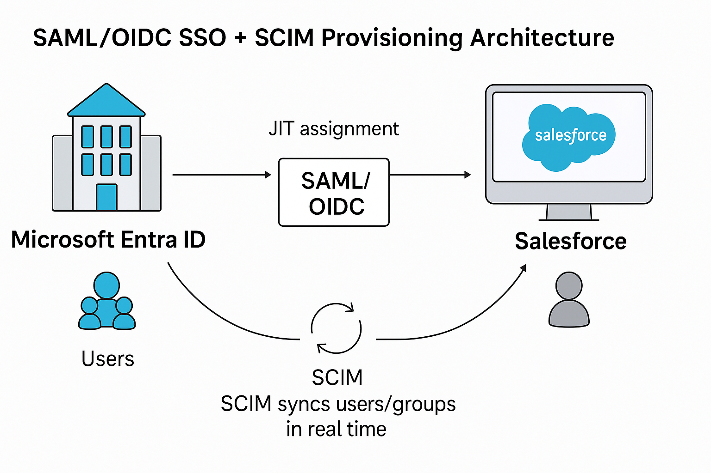


*Dynamic group → JIT → SSO → Manual sync simulation*


## 🔄 SCIM Provisioning Decision Flow 

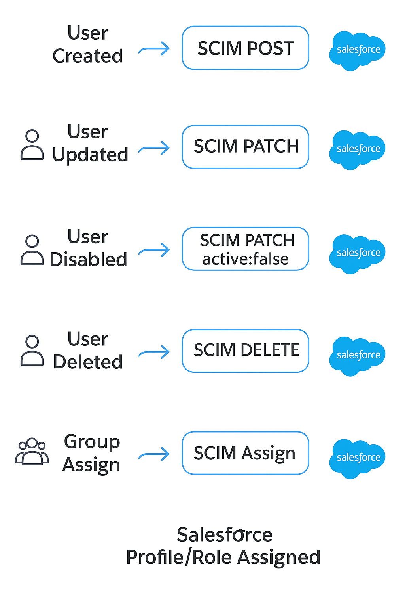


***Note:** The SCIM provisioning path was simulated for this specific lab environment.*

---

### Part 1: SAML SSO Implementation (Successful)

## 💻 Full Implementation Workflow & Evidence

This table chronologically documents all steps, from the successful SAML SSO configuration to the SCIM provisioning failure and the subsequent manual simulation.

| # | **Feature** | **Action** | **Status** | **Screenshot / Evidence** |
|:-:|:------------|:---------------|:---------------|:---------------|
| **1** | **Users & Group** | Create 3 Test Users (Alice, Bob, Carol) in Entra ID with `Department = Salesforce Users`. | ✅ Success | 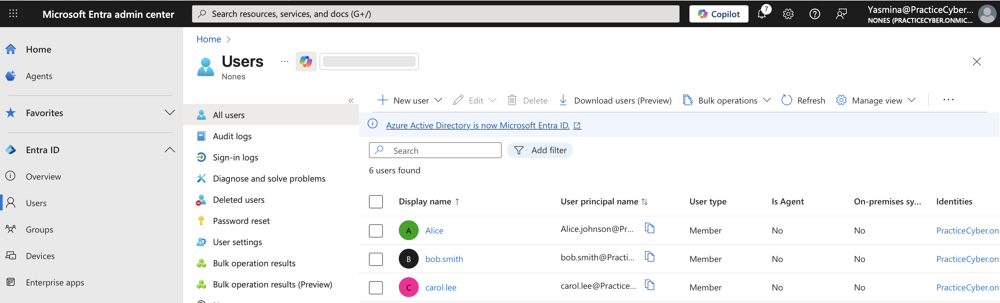 |
| **2** | **Users & Group** | Create Dynamic Group `GRP-Salesforce-Users` with rule based on the `Department` attribute. | ✅ Success | 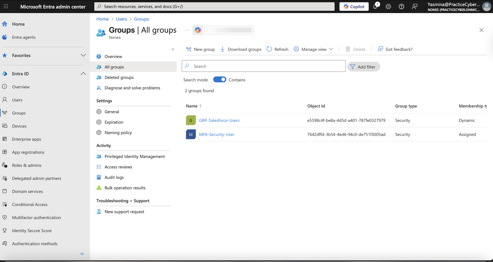 |
| **3** | **App Setup** | Add Salesforce Enterprise Application and assign it to the Dynamic Group. | ✅ Success | 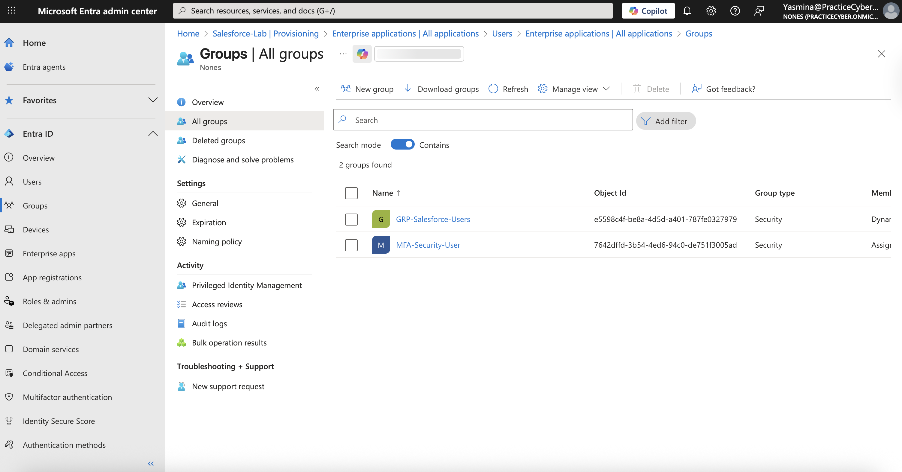 |
| **4** | **SAML Config** | Configure SAML 2.0 in Entra ID and upload Metadata XML to Salesforce. | ✅ Success | 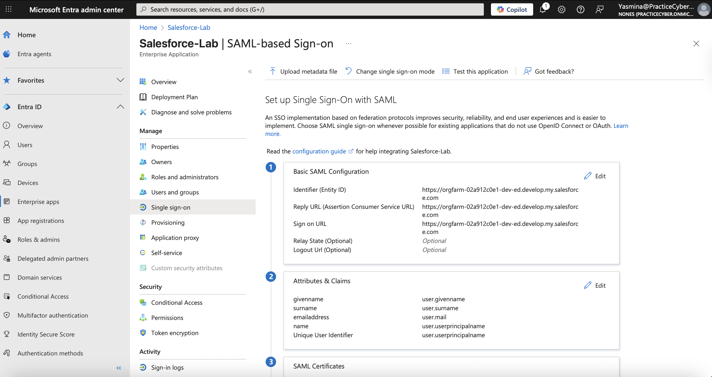 |
| **5** | **User Creation** | **Manual Step:** Create test users in Salesforce and set **Federation ID** to match the Entra ID UPN (`user.userprincipalname`). | ✅ Success (Manual) | 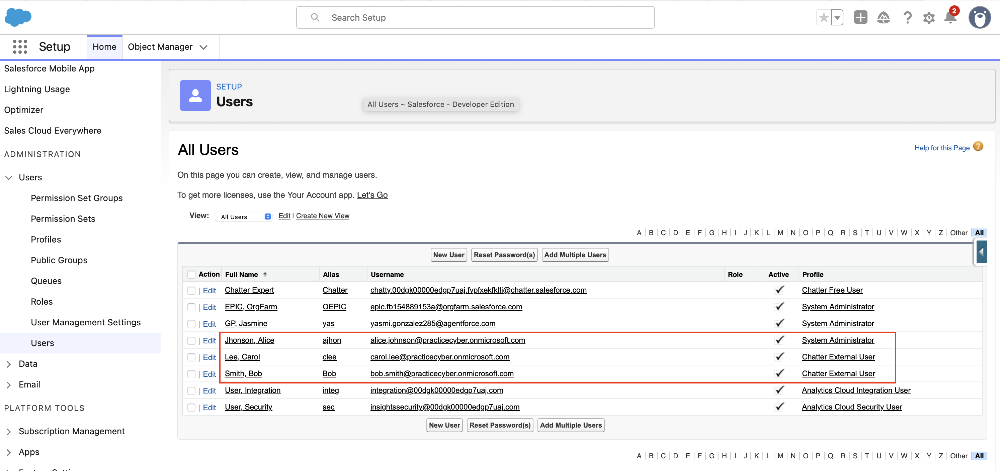 |
| **6** | **SSO Test** | Test SP-initiated login flow from Salesforce URL $\rightarrow$ Entra ID Login $\rightarrow$ Salesforce Dashboard. | ✅ Success | 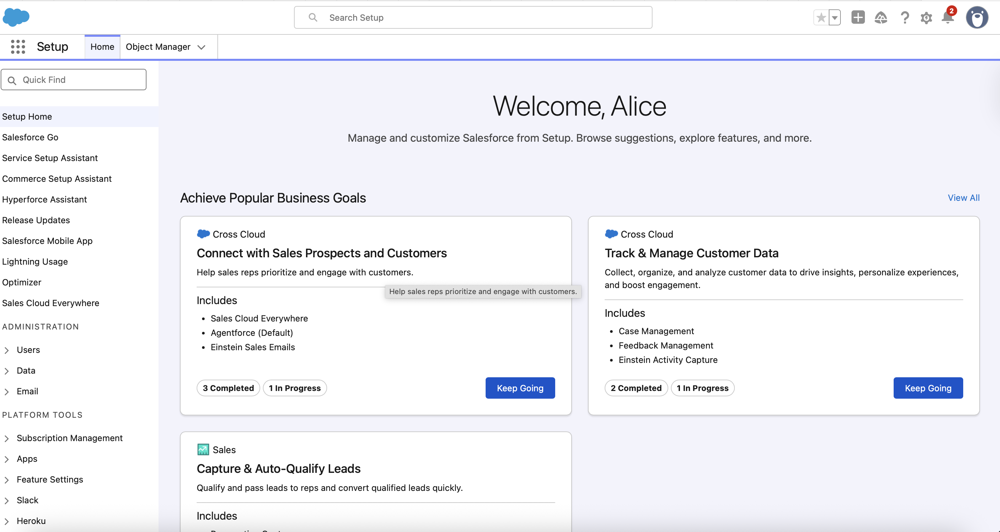 |
| **7** | **SCIM Attempt** | Attempt to configure Automatic Provisioning (SCIM) in Entra ID and test connection. | ❌ **Failed** | 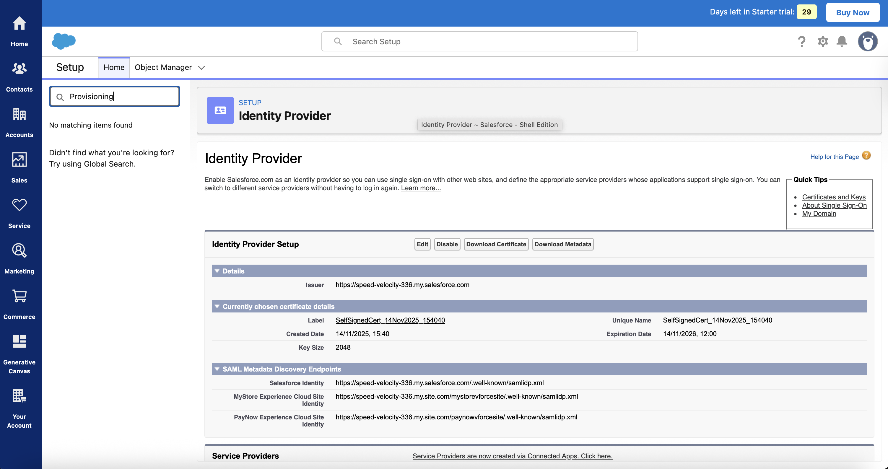 |
| **8** | **SCIM Failure** | **Root Cause:** SCIM Provisioning is not supported in the Salesforce Developer Edition/Trial Org. | 🛑 **Blocked** | *Provisioning logs show "SCIM endpoint not supported."* ||  |
| **9** | **SCIM Mapping** | **Conceptual:** Document required attribute mapping (e.g., `userPrincipalName` $\rightarrow$ `userName`) despite UI being inaccessible. | **Skipped** | [View Conceptual Mapping](./Exports/SCIM_Mapping.json) |
| **10** | **Lifecycle** | **Manual Simulation:** Update Alice's job title in Entra $\rightarrow$ manually update in Salesforce. | ✅ Success (Manual) |  | 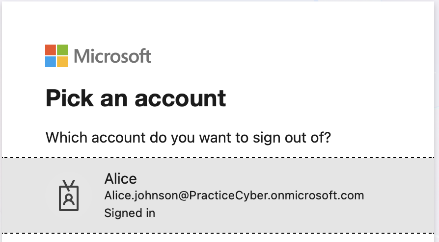 |
| **11** | **Audit Trail** | Export Entra ID Provisioning Logs showing the continuous SCIM connection errors. | 🛑 **Blocked** | 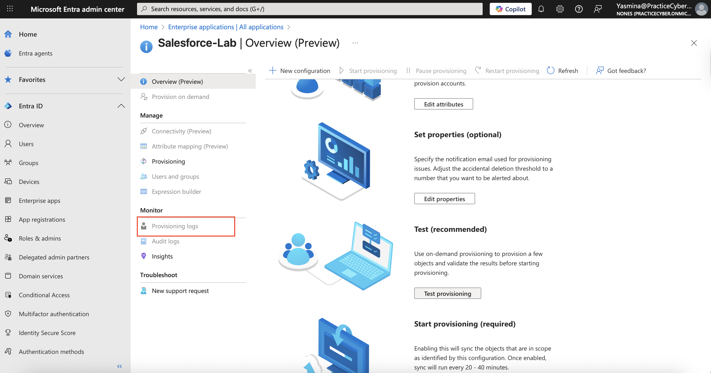  |

---

## 🪜 Step-by-Step Implementation Guide (Avoiding Pitfalls)

### Part A: Initial Setup in Microsoft Entra ID (Azure AD)

## Step-by-Step Implementation

### 1. Create Test Users
- **Path:** Microsoft Entra Admin Center → **Identity** → **Users** → **All users** → **New user** → **Create user**  
- **Action:** Create three test accounts:  
  - `alice.johnson@practicecyber.onmicrosoft.com`  
  - `bob.smith@practicecyber.onmicrosoft.com`  
  - `carol.lee@practicecyber.onmicrosoft.com`  
- **Crucial Step:** Set **Department** = `Salesforce Users` for **all three users**  
- **URL:** [Entra Users](https://entra.microsoft.com/#view/Microsoft_AAD_Users/UserManagementMenuBlade/~/AllUsers)  
→ See: `Users_Created.png`

### 2. Create Dynamic Group
- **Path:** Microsoft Entra Admin Center → **Identity** → **Groups** → **All groups** → **New group**  
- **Group type:** `Security`  
- **Membership type:** `Dynamic User`  
- **Group name:** `GRP-Salesforce-Users`  
- **Dynamic user rule:** `(user.department -eq "Salesforce Users")`  
- **Wait:** Allow **5–10 minutes** for membership to propagate before testing SSO  
- **URL:** [Entra Groups](https://entra.microsoft.com/#view/Microsoft_AAD_IAM/GroupsManagementMenuBlade/~/AllGroups)  
→ See: `Dynamic_Group.png`

### 3. Add Salesforce Enterprise Application
- **Path:** Microsoft Entra Admin Center → **Identity** → **Applications** → **Enterprise applications** → **New application**  
- **Action:** Click **Create your own application** → Name: `Salesforce-Lab` → **Integrate any other application you don't find in the gallery (Non-gallery)** → **Create**  
- **URL:** [Enterprise Apps](https://entra.microsoft.com/#view/Microsoft_AAD_IAM/EnterpriseAppsMenuBlade/~/Overview)  
→ See: `App_Added.png`

### 4. Configure SAML SSO in Salesforce (SP-Initiated)
- **Path:** Salesforce → **Setup** → Search `Single Sign-On Settings` → **Single Sign-On Settings** → **New** (SAML Enabled must be checked)  
- **SAML SSO Settings:**  
  - **Name:** `STS - Microsoft Entra SSO`  
  - **API Name:** `STS_Microsoft_Entra_SSO`  
  - **Issuer:** `https://sts.windows.net/<your-tenant-id>/` *(from Entra metadata)*  
  - **Entity Id:** `urn:salesforce:lab`  
  - **SAML Identity Type:** `Assertion contains the Federation ID from the User object`  
  - **Identity Provider Certificate:** *(upload later)*  
  - **Request Signing Certificate:** `Default`  
  - **Assertion Decryption Certificate:** `Default`  
  - **SAML Identity Location:** `Identity is in the NameIdentifier element of the Subject statement`  
- **Crucial:** Copy the **Login URL** and **Assertion Consumer Service (ACS) URL** (e.g., `https://speed-velocity-336.my.salesforce.com`)  
- **URL:** Salesforce Setup → Single Sign-On  
→ See: `SAML_Config_Salesforce.png`

### 5. Configure SAML SSO in Microsoft Entra ID (IdP)
- **Path:** Enterprise App `Salesforce-Lab` → **Single sign-on** → **SAML**  
- **Basic SAML Configuration:**  
  - **Identifier (Entity ID):** `urn:salesforce:lab`  
  - **Reply URL (ACS URL):** `https://speed-velocity-336.my.salesforce.com` *(from Salesforce)*  
  - **Sign-on URL:** `https://speed-velocity-336.lightning.force.com`  
- **User Attributes & Claims:**  
  - **Unique User Identifier (NameID):** `user.userprincipalname`  
- **SAML Signing Certificate:**  
  - Download **Federation Metadata XML**  
- **URL:** [Entra SAML Config](https://entra.microsoft.com/#view/Microsoft_AAD_IAM/EnterpriseAppMenuBlade/~/SingleSignOn)  
→ See: `SAML_Config_Entra.png`

### 6. Finalize SAML in Salesforce
- **Path:** Salesforce → **Single Sign-On Settings** → Edit `STS - Microsoft Entra SSO`  
- **Action:** Upload the **Federation Metadata XML** downloaded from Entra ID  
- **Enable:** Check **SAML Enabled** → **Save**  
- **My Domain SSO Enforcement (Optional):**  
  - Setup → **My Domain** → **Authentication Configuration** → Edit → Check `STS - Microsoft Entra SSO` → Save  
→ See: `SAML_Certificate_Uploaded.png`

### 7. Manually Create Users in Salesforce (SCIM Workaround)
- **Path:** Salesforce → **Setup** → **Users** → **Users** → **New User**  
- **Action:** Create 3 users with:  
  | Name         | Email                                | Federation ID                        | Profile       | Active |
  |--------------|--------------------------------------|--------------------------------------|---------------|--------|
  | Alice Johnson| `alice.johnson@practicecyber.onmicrosoft.com` | `alice.johnson@practicecyber.onmicrosoft.com` | Standard User | Yes |
  | Bob Smith    | `bob.smith@practicecyber.onmicrosoft.com`     | `bob.smith@practicecyber.onmicrosoft.com`     | Standard User | Yes |
  | Carol Lee    | `carol.lee@practicecyber.onmicrosoft.com`     | `carol.lee@practicecyber.onmicrosoft.com`     | Standard User | Yes |
- **Crucial:** **Federation ID must exactly match** the Entra `userPrincipalName`  
- **URL:** Salesforce Users Setup  
→ See: `Users_Manual.png`

### 8. Assign App to Dynamic Group
- **Path:** Enterprise App `Salesforce-Lab` → **Users and groups** → **Add user/group**  
- **Select:** `GRP-Salesforce-Users`  
- **Assignment required:** `Yes`  
- **URL:** [Entra Users & Groups](https://entra.microsoft.com/#view/Microsoft_AAD_IAM/EnterpriseAppMenuBlade/~/UsersAndGroups)  
→ See: `App_Assignment.png`

### 9. Test SSO (SP-Initiated)
- **Action:**  
  1. Open **incognito tab**  
  2. Go to: `https://speed-velocity-336.lightning.force.com`  
  3. Redirects to **Microsoft Login**  
  4. Enter `alice.johnson@practicecyber.onmicrosoft.com` → **SSO Success** → Salesforce Dashboard  
- **URL:** [Salesforce Login](https://speed-velocity-336.lightning.force.com)  
→ See: `SSO_Login.png`

### 10. Attempt SCIM Provisioning → **BLOCKED**
- **Path:** Enterprise App `Salesforce-Lab` → **Provisioning**  
- **Issue:** **Provisioning menu is disabled (grayed out)** in Entra ID  
- **Root Cause:** Salesforce Developer Edition **does not expose a SCIM endpoint**  
- **Result:** No Tenant URL, no Secret Token, no Test Connection possible  
- **URL:** [Entra Provisioning](https://entra.microsoft.com/#view/Microsoft_AAD_IAM/EnterpriseAppMenuBlade/~/Provisioning)  
→ See: `SCIM_Disabled_Entra.png`

### 11. SCIM Attribute Mapping → **SKIPPED**
> **No SCIM → no mapping interface available**  
**Expected mappings (conceptual):**  
```json
{
  "userPrincipalName": "userName",
  "displayName": "name.formatted",
  "mail": "emails[type eq \"work\"].value",
  "jobTitle": "title",
  "department": "department"
}

```

#### 12. Manual Lifecycle Simulation

To demonstrate understanding of the full lifecycle:

| Action | Azure Action | Salesforce Manual Action | SCIM Expected Result |
|:---------|:---------------|:-------------------------|:---------------------|
| **Update** Alice | Change Alice's `jobTitle` in Entra ID. | Manually edit Alice's user record in Salesforce and update the **Title** field. | **Update** (PATCH) operation. |
| **Disable** Bob | Uncheck the **Account enabled** box for Bob in Entra ID. | Manually edit Bob's user record in Salesforce and uncheck **Active**. | **Deprovision** (Disable) operation. |
| **Delete** Carol | Hard delete the user Carol in Entra ID. | Manually delete Carol's user record in Salesforce. | **Deprovision** (DELETE) operation. |

#### 13. Export Provisioning Logs (Documentation of Failure)

* **Path:** Entra Enterprise Application `Salesforce-Lab` $\rightarrow$ **Provisioning logs**.
* **Filter:** Filter by **Failure** status.
* **Action:** Download the logs. This file proves the SCIM endpoint was the limiting factor.
* [**View Provisioning Error Logs**](./Exports/Provisioning_Logs_No_SCIM.csv)

---

## 🧠 Troubleshooting: Salesforce $\leftrightarrow$ Microsoft Entra ID (SAML SSO)

This section documents the main issues encountered and their resolution.

| ❌ Error / Symptom | 🔍 Root Cause | 🛠️ Resolution Steps |
|--------------------|--------------|---------------------|
| **AADSTS50105:** *User not assigned to the application.* | User was not part of the assigned group, or dynamic membership hadn't propagated. | $\rightarrow$ Verified user met the Dynamic Group rule. $\rightarrow$ **Wait 5-10 minutes** for dynamic group membership to sync. |
| **Salesforce SSO Error:** *Cannot log you in because of an issue.* | The Salesforce **Federation ID** did not match the **NameID** sent in the SAML assertion. | $\rightarrow$ Manually set the **Federation ID** in Salesforce to exactly match the Entra ID **User Principal Name**. |
| Redirect goes to **Salesforce classic login** | The Salesforce domain was not configured to use the newly created SSO provider. | $\rightarrow$ In **Salesforce Setup $\rightarrow$ My Domain $\rightarrow$ Authentication Configuration**, ensure the new SSO provider is checked. |
| **SAML login loop** | Mismatch in **Reply URL (ACS)** or **Entity ID** between IdP and SP. | $\rightarrow$ Re-upload the latest **Federation Metadata XML** from Entra ID to Salesforce. |

---

## 🌟 Personal Note
I executed this project to grow my skills as an **Identity & Access Management professional**, demonstrating that **curiosity, consistency, and technical depth** are key—even when faced with platform limitations. Documenting the SCIM limitation and manually simulating the lifecycle was a valuable exercise in understanding the full process. I look forward to bringing this problem-solving mindset to a professional team.

**Author:** **Yaz**
