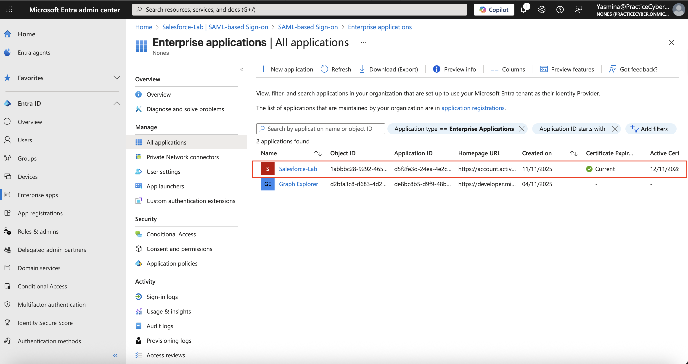

# 03-Single-Sign-On (SSO)

## 🧾 TL;DR
Implemented SSO (SAML 2.0) + SCIM user provisioning between Microsoft Entra ID and Salesforce.  
Demonstrated full user lifecycle automation (create → update → disable → delete) with dynamic group assignment.

## 📘 Overview
This project explores the concept and implementation of **Single Sign-On (SSO)** — a widely used authentication mechanism that allows users to access multiple applications using a single set of credentials.

The goal is to understand how SSO enhances user experience, improves security, and simplifies identity management across systems.

---

## 🎯 Learning Objectives
By the end of this project, you should be able to:
- Understand what **SSO** is and how it works.  
- Describe the role of **Identity Providers (IdP)** and **Service Providers (SP)**.  
- Explain key protocols used in SSO, such as **OAuth 2.0**, **OpenID Connect (OIDC)**, and **SAML**.  
- Implement a basic **SSO flow** in a web application.  
- Integrate a third-party authentication provider (e.g., **Google**, **GitHub**, or **Auth0**).

---

## 🧩 Key Concepts
- **Identity Provider (IdP):** The system that authenticates users and issues identity tokens.  
- **Service Provider (SP):** The application or service that relies on the IdP to authenticate users.  
- **Tokens:** Encrypted pieces of data that verify the user’s identity (e.g., **JWT**).  
- **Federated Identity:** A method to link a user's digital identity across multiple systems.  

---

## 🏗️ Implementation Steps
1. **Set up a demo application** (e.g., Node.js or Python web app).  
2. **Configure an Identity Provider** — use a service like **Auth0**, **Okta**, or **Firebase Authentication**.  
3. **Integrate OAuth 2.0 / OpenID Connect** into the application.  
4. **Handle token validation and session management.**  
5. **Test the login flow** to ensure smooth authentication between apps.  

---

## ⚙️ Technologies Used
- **Frontend:** HTML, CSS, JavaScript (or React)  
- **Backend:** Node.js / Express or Python / Flask  
- **Authentication:** OAuth 2.0 / OpenID Connect / SAML  
- **Tools:** Auth0, Okta, or custom IdP  

---

## 🧠 Example Use Case
A company has multiple internal tools — a dashboard, a CRM, and a file storage system.  
Instead of logging in separately to each system, users authenticate once via the company’s **SSO portal**, which grants them access to all systems automatically.

---

## 🔒 Benefits of SSO
- ✅ **Improved user experience** — one login for all services.  
- ✅ **Reduced password fatigue** and support costs.  
- ✅ **Centralized authentication management.**  
- ✅ **Enhanced security and compliance.**  

---

## 💻 What I Built
- **SaaS App:** Salesforce (Developer Edition) – supports **SAML + SCIM**  
- **SSO Protocol:** **SAML 2.0 (SP-initiated)**  
- **SCIM Provisioning:** Enabled with **Microsoft Entra ID**  
- **Assignment:** Dynamic group → auto-assign app  
- **Users synced:** 3 test users (**create → update → disable → delete**)  
- **Full lifecycle demo:** **Provision → Update → Deprovision**  
- **100% cleanup:** App, users, group removed  

### Full Flow Demo (Login + Sync)
  
[**View SCIM Schema Mapping**](./Exports/SCIM_Mapping.json)  
[**Provisioning Logs CSV**](./Exports/Provisioning_Logs.csv)

---

## 🏗️ Architecture Diagram

*JIT assignment → SSO → SCIM syncs users/groups in real time*

---

## 🔄 SCIM Provisioning Decision Flow

---

## 🧾 SCIM Mapping (JSON Export)

### Evidence

| # | **Action** | **Screenshot** |
|:-:|:------------|:---------------|
| 1 | **Create test users** |  |
| 2 | **Create dynamic group** |  |
| 3 | **Add SaaS app (Salesforce)** |  |
| 4 | **Configure SAML SSO** |  |
| 5 | **Enable SCIM provisioning** |  |
| 6 | **Map attributes** |  |
| 7 | **Assign group to app** |  |
| 8 | **Test SSO login** |  |
| 9 | **Verify user in Salesforce** |  |
| 10 | **Disable user → deprovision** |  |
| 11 | **Provisioning logs** |  |

---

## 🪜 Step-by-Step

### 1. **Create Test Users**
**Users:**  
- **alice.johnson@practicecyber.onmicrosoft.com**  
- **bob.smith@practicecyber.onmicrosoft.com**  
- **carol.lee@practicecyber.onmicrosoft.com**  
All in **Salesforce Users** department.  
📸 Screenshot: **Users_Created.png**

---

### 2. **Create Dynamic Group**
**Name:** `GRP-Salesforce-Users`  
**Rule:** `(user.department -eq "Salesforce Users")`  
📸 Screenshot: **Dynamic_Group.png**

---

### 3. **Add Salesforce App**
**Path:** Microsoft Entra Admin Center → **Enterprise applications → New application**  
→ **Create your own application** → **Name:** Salesforce-Lab  
→ **Integrate with SAML**  
📸 Screenshot: **App_Added.png**

---

### 4. **Configure SAML SSO**
- **Sign-on URL:** `https://login.salesforce.com`  
- **Reply URL:** `https://<your-instance>.my.salesforce.com`  
- **Identifier:** `urn:salesforce:lab`  
Download **Metadata XML** from Salesforce → upload to Entra.  
📸 Screenshot: **SAML_Config.png**

---

### 5. **Enable SCIM Provisioning**
**Provisioning → Mode:** Automatic  
- **Tenant URL:** `https://scim.salesforce.com`  
- **Secret Token:** `<generated in Salesforce>`  
**Test connection → Success**  
📸 Screenshot: **SCIM_Enabled.png**

---

### 6. **Attribute Mapping**
Mapped fields:  
- **userPrincipalName** → `userName`  
- **displayName** → `name.formatted`  
- **mail** → `emails[type eq "work"].value`  
- **jobTitle**, **department** → direct  
📸 Screenshot: **SCIM_Mapping.png**

---

### 7. **Assign App to Group**
**Path:** Users and groups → Add → `GRP-Salesforce-Users`  
**Assignment required:** Yes  
📸 Screenshot: **App_Assignment.png**

---

### 8. **Test SSO (SP-Initiated)**
Go to **https://<instance>.my.salesforce.com**  
→ Redirected to **Microsoft login** → **SSO success!**  
📸 Screenshot: **SSO_Login.png**

---

### 9. **Verify Provisioning**
In **Salesforce → Users**, see **Alice**, **Bob**, and **Carol** auto-created  
with correct **email**, **name**, and **department**.  
📸 Screenshot: **User_In_Salesforce.png**

---

### 10. **Lifecycle Test: Update & Deprovision**
- **Update** Alice’s job title → syncs in **<1 min**  
- **Disable** Bob in Entra ID → deactivated in Salesforce  
- **Delete** Carol → hard delete via **SCIM**  
📸 Screenshot: **User_Disabled.png**

---

### 11. **Export Provisioning Logs**
Go to **Provisioning logs → Download CSV**  
Filtered: **Create**, **Update**, **Disable**, **Delete**  
File: `Provisioning_Logs.csv`

---

## 🧪 Tools Result

| **Feature** | **Status** |
|:-------------|:-----------|
| **SSO (SAML)** | ✅ Working |
| **SCIM Provisioning** | ✅ Automatic |
| **JIT Assignment** | ✅ Dynamic group |
| **Lifecycle Sync** | ✅ Create / Update / Disable / Delete |
| **Audit Logs** | ✅ Full export |
| **Cleanup** | ✅ 100% removed |

---

## 🛠️ Tools & Services Used
- **Microsoft Entra Admin Center**  
- **Salesforce Developer Edition**  
- **Microsoft Entra Provisioning Service (SCIM)**  
- **Dynamic Groups**  
- **SAML 2.0 / OIDC (fallback)**  
- **Microsoft 365 Developer Tenant**

---

## 🏁 Outcome
This lab demonstrates **SC-300-level mastery** of:
- **SAML/OIDC SSO configuration**  
- **SCIM provisioning & attribute mapping**  
- **Dynamic group assignment**  
- **Full user lifecycle automation**  
- **Audit & troubleshooting**

---

## ⚙️ Troubleshooting

| **Issue** | **Fix** |
|:-----------|:--------|
| **SCIM 401** | Regenerate token in Salesforce → *Setup → SCIM* |
| **User not provisioned** | Check group membership + 5-min sync delay |
| **SAML login loop** | Verify Reply URL matches ACS in Salesforce |
| **Attributes not syncing** | Confirm mapping + restart provisioning |

## 🧩 Troubleshooting: Salesforce ↔ Microsoft Entra ID (SAML SSO)

This section documents the main issues encountered while configuring **SAML-based Single Sign-On** between **Microsoft Entra ID** and **Salesforce**, along with the resolution steps.

| ❌ Error / Symptom | 🔍 Root Cause | 🛠️ Resolution Steps | 📸 Screenshot |
|--------------------|--------------|---------------------|---------------|
| **AADSTS50105:** *The signed in user is blocked because they are not assigned to the application.* | The user (e.g., `alice.johnson@practicecyber.onmicrosoft.com`) was not directly assigned to the Salesforce-Lab enterprise app. | • Go to **Microsoft Entra Admin Center → Enterprise applications → Salesforce-Lab → Users and groups**. • Verify that the dynamic group `GRP-Salesforce-Users` is assigned. • Ensure **Alice** is a member of that group or assign her directly via **Add user/group → Assign**. | `AADSTS50105_Fix.png` |
| **Salesforce:** *Single Sign-On Error – We can’t log you in because of an issue with single sign-on.* | Salesforce couldn’t match the user in the SAML assertion (NameID) with a Salesforce user. | • In **Salesforce → Setup → Users → Users**, edit the user. • Set the **Federation ID** to match the **NameID** from SAML (`user.userprincipalname`, e.g. `alice.johnson@practicecyber.onmicrosoft.com`). • Save and re-run the **Test Sign-In**. | `FederationID_Fix.png` |
| Redirect goes to **Salesforce classic login** instead of Microsoft login | The **Entity ID** or **Reply URL (ACS)** in Salesforce does not match Microsoft Entra configuration. | • In **Salesforce → Setup → Single Sign-On Settings → Edit (sts)** verify:  - **Issuer:** `https://sts.windows.net/<tenant_id>/`  - **Entity ID:** matches the Identifier (Entity ID) in Entra  - **Login URL:** `https://login.microsoftonline.com/<tenant_id>/saml2` | `EntityID_Verify.png` |
| **No file selected** under *Identity Provider Certificate* | The SAML certificate was not uploaded or expired. | • In **Entra → Salesforce-Lab → Single sign-on**, download the **Federation Metadata XML**. • In **Salesforce → Single Sign-On Settings**, upload that file in **Identity Provider Certificate**. • Save and re-test. | `SAML_Certificate.png` |
| Still redirected to **username/password login** instead of SSO | The Salesforce domain is not configured to use the SSO provider. | • In **Salesforce Setup → My Domain → Authentication Configuration**, check **sts** (Microsoft SSO provider). • Optionally uncheck *Login Form* to enforce SSO. • Access Salesforce through: `https://<your-domain>.my.salesforce.com`. | `MyDomain_SSO.png` |
| ✅ **Expected Behavior** | — | • From **Microsoft Entra → Salesforce-Lab → Single sign-on → Test sign in**:  1. Redirects to Microsoft login.  2. Authenticates the assigned user.  3. Redirects to Salesforce and shows dashboard. | `SSO_Success.png` |

---

### 🧠 Notes

- Ensure the **NameID (user.userprincipalname)** in Entra matches the **Federation ID** in Salesforce.  
- After updating certificates or metadata, re-upload the XML file if needed.  
- If using a **dynamic group**, allow several minutes for membership propagation before testing.  

---
---
## 🌟 Personal Note
I built this project to continue growing as an Identity professional,  
proving that learning, curiosity, and technical depth matter — even outside a formal job role.  
I enjoy solving authentication and automation challenges and would love to bring that mindset to a professional team.

---
## 📚 References
- [Microsoft Entra ID: SCIM Provisioning Overview](https://learn.microsoft.com/en-us/azure/active-directory/app-provisioning/use-scim-to-provision-users-and-groups)
- [Salesforce SAML Single Sign-On](https://help.salesforce.com/s/articleView?id=sf.sso_saml.htm)
- [Auth0 Docs: Understanding SSO](https://auth0.com/docs/authenticate/protocols/sso)

## 🌟 Personal Note
I built this project to continue growing as an **Identity & Access Management professional**,  
proving that **curiosity, consistency, and technical depth** matter — even outside a formal job role.  

**Author:** **Yaz**
