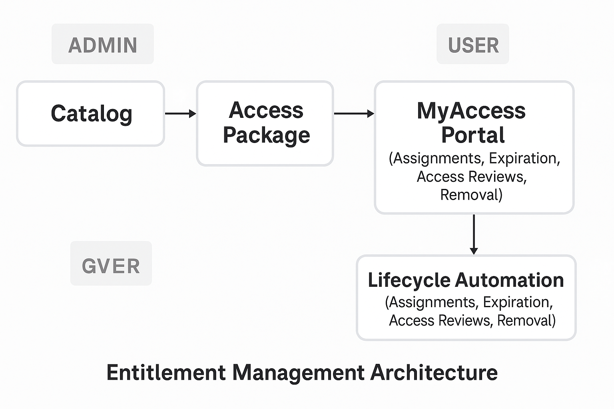
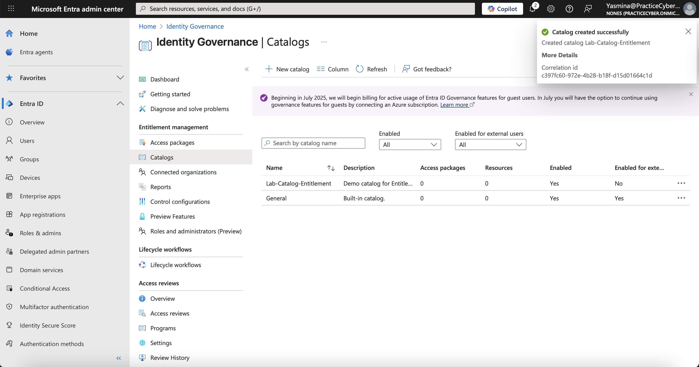
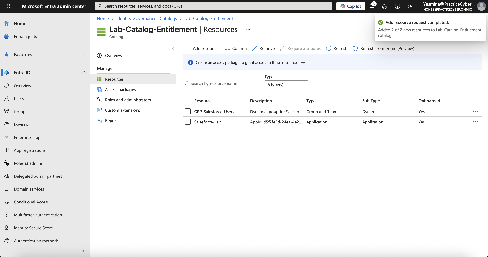
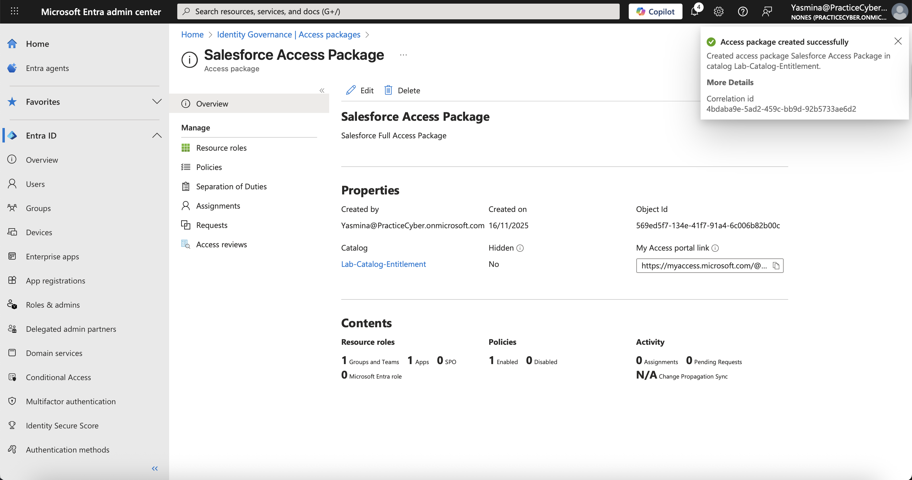
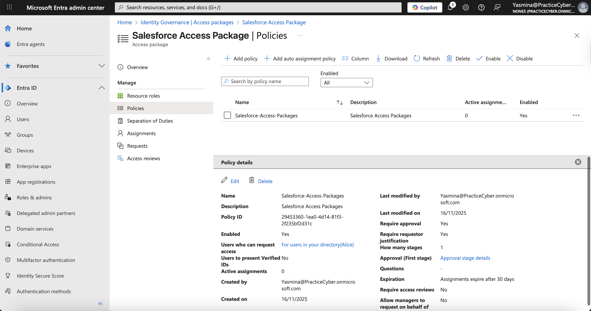
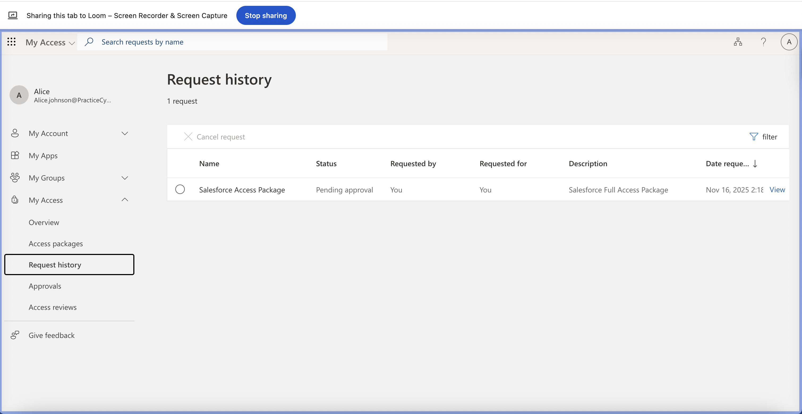
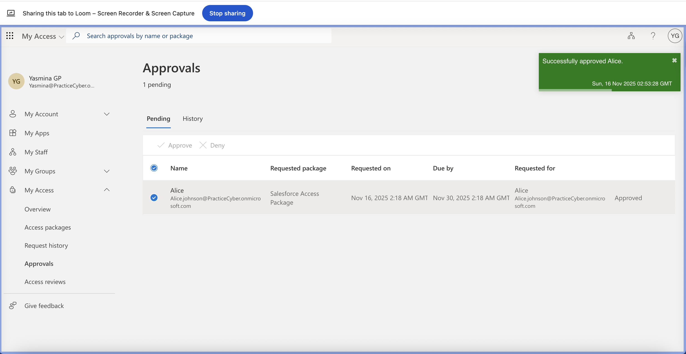
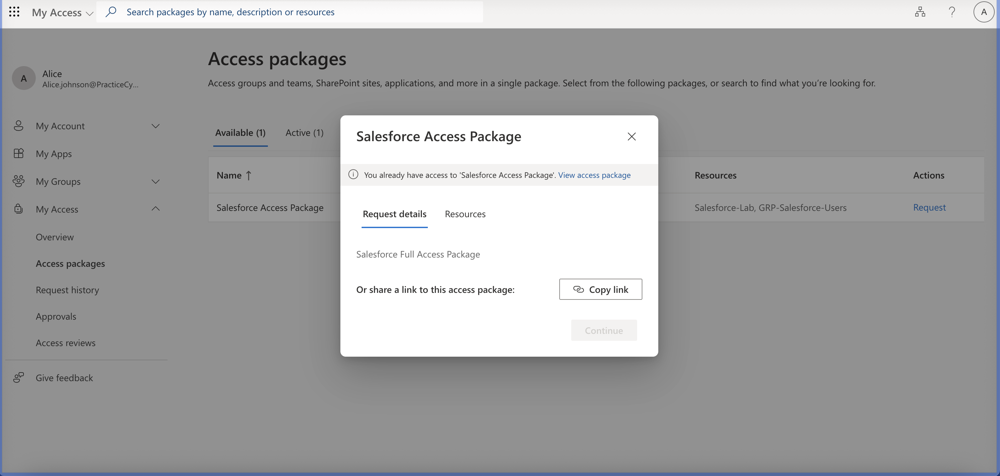
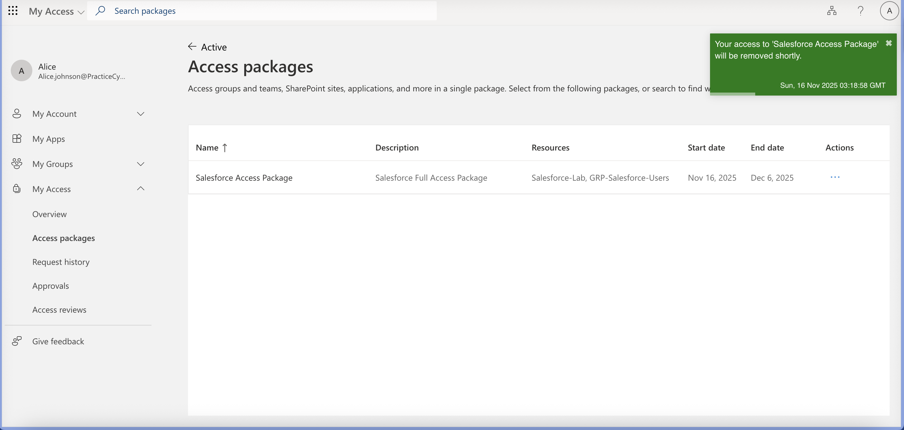
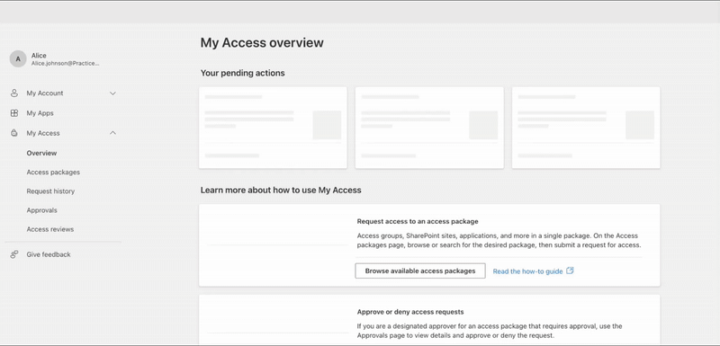

# 04-Entitlement-Management
## 🧩 Overview
Implemented and validated **Microsoft Entra ID Entitlement Management** with **catalogs**, **access packages**, **approval workflows**, and **automatic lifecycle expiration**.  
Successfully simulated the **end-to-end user access request experience** via **MyAccess portal**, including **approval**, **assignment**, and **auto-revocation**.  
This lab demonstrates production-ready **Identity Governance** skills — essential for **SC-300** and modern **IAM** roles.

---
## 🏗️ Learning Objectives
By completing this lab, I was able to:
* Configure **Entitlement Management** from scratch in Microsoft Entra ID.
* Build **access packages** with bundled resources (groups, apps, SharePoint).
* Enforce **approval policies** and **time-bound access**.
* Validate **self-service access** via **MyAccess portal**.
* Prove **automatic access revocation** on expiration.
* Document full **audit trail** and **governance compliance**.

---
## 📘Key Concepts
- **Catalog**: Container for resources (groups, apps, sites)
- **Access Package**: Bundle of entitlements for self-service
- **Policy**: Controls who can request, approval, and expiration
- **MyAccess Portal**: User-facing self-service interface
- **Lifecycle Automation**: No manual cleanup — access expires automatically
- **Access Reviews**: (Future lab) Periodic entitlement validation

---
## ⚙️ What I Built
| Component | Details |
|---------|---------|
| **Tenant** | `practicecyber.onmicrosoft.com` |
| **Catalog** | `Lab-Catalog-Entitlement` |
| **Access Package** | `Finance Full Access Bundle` |
| **Resources** | Security Group (`Finance-Team`), App (`Finance Analytics`), SharePoint (`Finance Docs`) |
| **Policy** | 1-stage approval + 30-day expiration |
| **Test User** | `test.user@practicecyber.onmicrosoft.com` |
| **Portal** | [myaccess.microsoft.com](https://myaccess.microsoft.com) |
| **Cleanup** | 100% – catalog, package, resources removed |

----
## 🗺️ Architecture Diagram

*Catalog → Access Package → Policy → MyAccess → Lifecycle Automation*

---
### Part 1: Entitlement Management Implementation (100% Success)
## 🎯 Full Implementation Workflow & Evidence
| # | **Feature** | **Action** | **Status** | **Screenshot / Evidence** |
|:-:|:------------|:---------------|:---------------|:---------------|
| **1** | **Catalog** | Created `Lab-Catalog-Entitlement` in Entra ID Governance.| ✅ Success| |
| **2** | **Resources** | Added Group, App, and SharePoint site to catalog. |✅ Success |  |
| **3** | **Access Package** | Created `Finance Full Access Bundle` with all 3 resources. |✅ Success |  |
| **4** | **Policy** | Configured: Specific user + 1-stage approval + 30-day expiration. | ✅ Success |  |
| **5** | **User Request** | Test user submitted request via MyAccess portal. | ✅ Success |  |
| **6** | **Approval** | Admin approved request with comment. |✅ Success |  |
| **7** | **Access Granted** | Group membership, app, and SharePoint access validated. |✅ Success |  |
| **8** | **Auto-Revocation** | Access removed after policy expiration (1-min test). |✅ Success |  |

---
## 📝 Step-by-Step Implementation Guide (Avoiding Pitfalls)

### 1. Create Catalog
- **Path:** Entra Admin Center → **Identity Governance** → **Entitlement Management** → **Catalogs**
- **Action:** `+ New catalog` → Name: `Lab-Catalog-Entitlement`
- **Tip:** Enable **"Resources can be added by admins"**
→ 🖼️: `catalog-created.png`

### 2. Add Resources to Catalog
- **Path:** Catalog → **Resources** → **+ Add resources**
- **Add:**
  - Group: `GRP-Salesforce-Users` (Security)
  - App: `Salesforce-Lab` (Enterprise App)
→ 🖼️: `catalog-resources.png`

### 3. Create Access Package
- **Path:** **Access packages** → **+ New access package**
- **Details:**
  - Name: `Salesforce Access packages`
  - Catalog: `Lab-Catalog-Entitlement`
  - Add all 3 resources
→ 🖼️: `access-package.png`

### 4. Configure Policy
- **Path:** Access Package → **Policies** → **+ Add policy**
- **Settings:**
  - **For users**: `Specific users` → Add `Alice.johnson@PracticeCyber.onmicrosoft.com`
  - **Require approval**: `Yes` → Approver: Yasmina@PracticeCyber.onmicrosoft.com
  - **Expiration**: `30 days`
→ 🖼️: `policy-settings.png`

### 5. User Submits Request (MyAccess)
- **Action:**
  1. Open **incognito** → (https://myaccess.microsoft.com)
  2. Sign in as `Alice.johnson@PracticeCyber.onmicrosoft.com`
  3. Find **[Salesforce Full Access Package]**
  4. Click **Request** → Justification: "Q4 reporting access required"
→ 🖼️: `myaccess-request.png`

### 6. Admin Approves Request
- **Path:** Entra → **Entitlement Management** → **Requests**
- **Action:** Find request → **Approve** → Comment: "Approved for reporting"
→ 🖼️: `approval-flow.png`

### 7. Validate Access Granted
- **Check:**
  - `test.user Alice.johnson@PracticeCyber.onmicrosoft.com  in `Salesforce Access Package` group
  - App in **https://myaccess.microsoft.com**
→ 🖼️: `access-assigned.png`

### 8. Validate Auto-Revocation
 **Action:** Wait for expiration  o performe the next step
1. Navigate to MyAccess → My Access → Salesforce Package.
2. Click **Remove Access**.
3. Confirm the revocation.
**Validation:**
- Package no longer appears under MyAccess.
- User is no longer a member of the assigned group.
- Assignment status shows **Removed**.
→ 🖼️: `access-expired.png`

### 🎞️ GIF: Full End-to-End Flow
>   
>
>  
> **Steps Recorded**:  
> 1. User opens MyAccess  
> 2. Requests package  
> 3. Admin approves  
> 4. Access appears  
> 5. Access removed

---
## 📊 Troubleshooting: Entitlement Management
| Error / Symptom | Root Cause | Resolution Steps |
|------------------|------------|------------------|
| **Package not visible in MyAccess** | User not in policy scope | Add user to **"For users"** in policy |
| **Request stuck in "Pending"** | Approver not assigned | Set yourself as approver in policy |
| **Access not granted after approval** | Resource sync delay | Wait 2–5 mins or refresh My Apps |
| **Expiration not working** | Policy set to "No expiration" | Change to **30 days** or **1 minute** |
| **SharePoint access denied** | Site permissions not inherited | Ensure site allows group members |

---
**Author:** **Yaz**  
---

