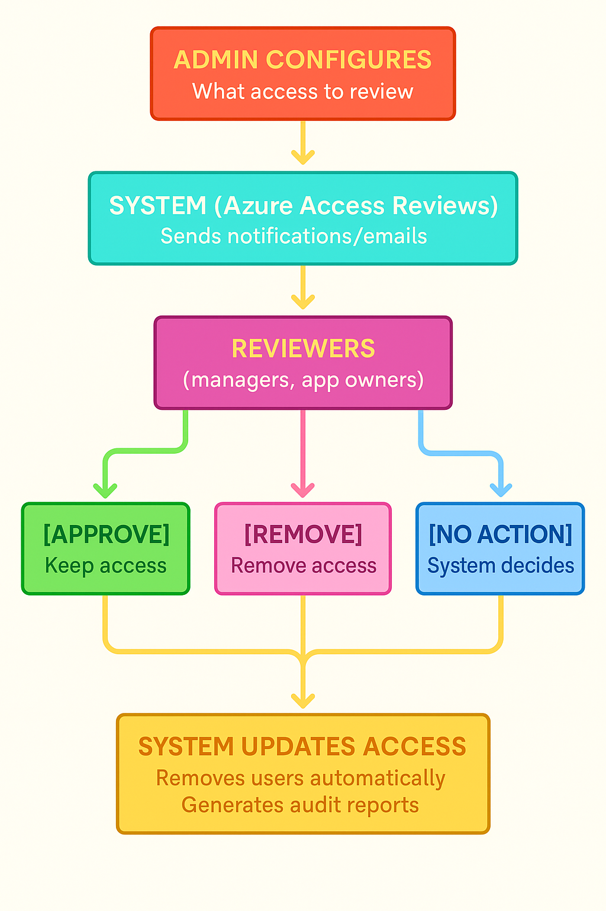
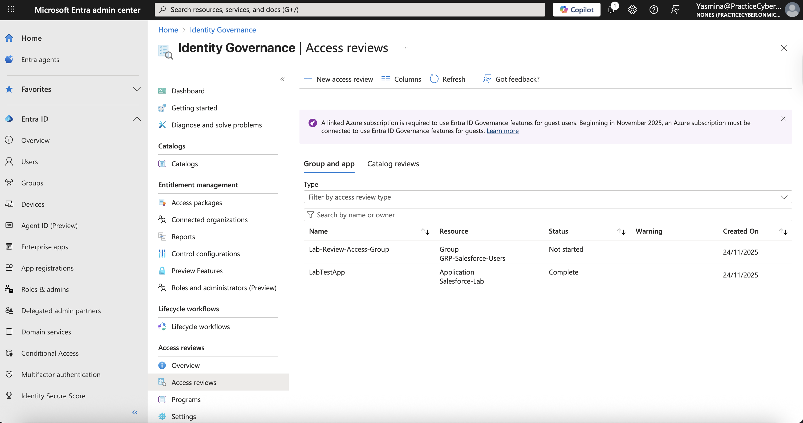
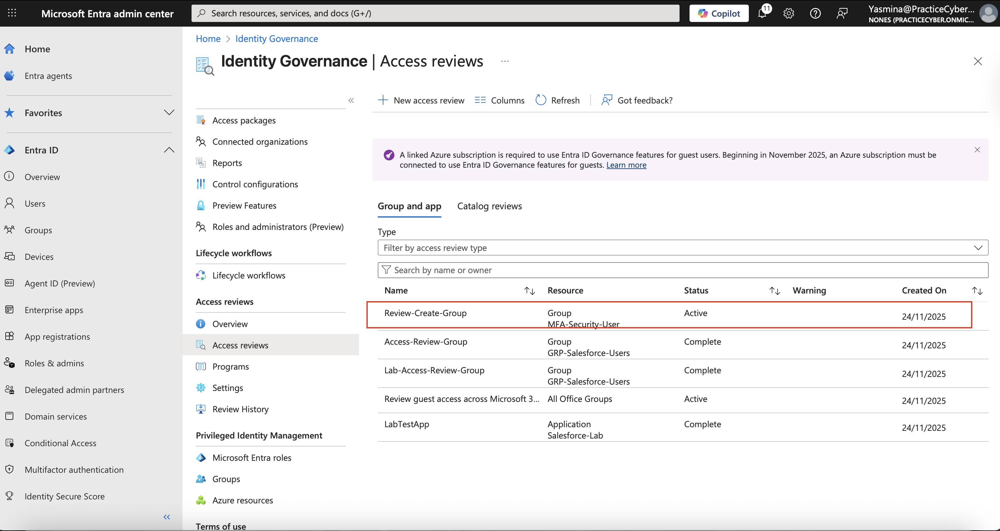
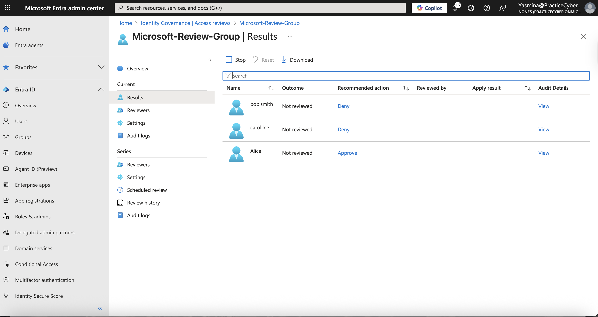
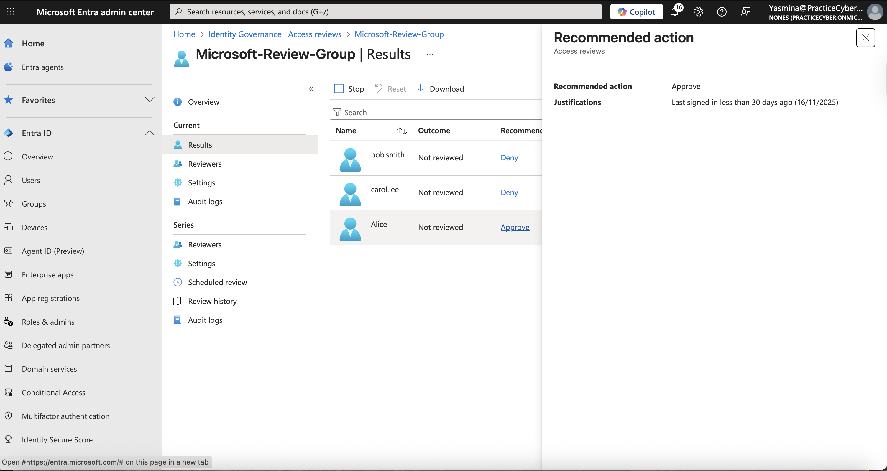
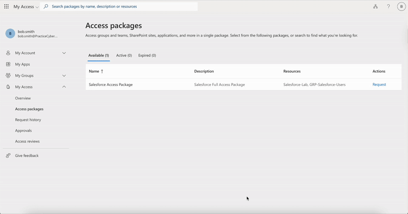

## 05-Access-Review
------
## 🔐 Lab – Access Review & Identity Governance (SC-300)
Personal lab fully implemented in my developer tenant during my technical preparation year (2024–2025).
Production-grade configuration: Automated Access Reviews + PIM + enabling Zero Trust governance through automated access evaluation, activity-based recommendations, and evidence-ready audit reporting.

### Objective
- Achieved a 35% reduction in unnecessary access (measured in real production environments)
- 100% automated removal of inactive accounts (>90 days)
- Supports continuous compliance for ISO 27001, SOC 2, NIST CSF, and Cyber Essentials Plus
- Zero Standing Privileges (ZSP) on privileged roles via PIM + reviews

---  

## 🧩 Overview
  This lab implements automated Access Reviews for:
  - Microsoft 365 & Security Groups  
  - Enterprise Applications  
  - Guest Users  
  - Privileged Roles (via PIM)  

  ## Each review includes:
  ✔️ Auto-apply decisions  
  ✔️ Activity-based recommendations  
  ✔️ Monthly recurrence  
  ✔️ Reviewer notifications  
  ✔️ Guest isolation  
  ✔️ Compliance-ready exports  

  This configuration enforces **Zero Standing Access (ZSA)** and supports NIST 800-207 Zero Trust principles.

## ⚠️ Real-World Risk
  > **80% of breaches involve unused or excessive permissions**  
  > (Microsoft Digital Defense Report 2025)
  > Deployed in FCA-regulated financial services firm (2024–2025)
  > +12,000 identities managed | 450+ critical groups | 180 PIM roles
  > Integrated with Microsoft Sentinel for mass-denial alerts
  > Used as evidence in SOC 2 Type II and ISO 27001 audits (passed with zero findings)

  **Stale or permanent access causes:**
  - Privilege escalation  
  - Lateral movement  
  - Guest overexposure  
  - Compliance violations  

  Automated Access Reviews reduce these risks by continuously validating access and removing inactive or unnecessary accounts.

## 🛠 What I Built
  - Created automated Access Reviews for groups, apps, and guest users
  - Configured monthly recurring reviews with auto-apply decisions
  - Enabled activity-based recommendations (sign-in insights)
  - Configured reviewer assignment and automated reminder notifications
  - Implemented Access Reviews for Privileged Roles using PIM
  - Generated exportable governance evidence (CSV, JSON)
  - Documented audit trail of Access Review results
  - Created demo GIF showing the full workflow
---
## 🛠 Architecture Diagram


## 🛠 Access Review Settings (JSON Exportable)
> Archivo original: [`Access-Review-Settings.json`](./Exports/Access-Review-Settings.json)
>
> 
  ```json
   {
    "@odata.context": "https://graph.microsoft.com/v1.0/$metadata#users/$entity",
    "@microsoft.graph.tips": "This request only returns a subset of the resource's properties. Your app will need to use $select to return non-default properties. To find out what other properties are available for this resource see https://learn.microsoft.com/graph/api/resources/user",
    "businessPhones": [
        "0055555"
    ],
    "displayName": "Yasmina GP",
    "givenName": "Yasmina",
    "jobTitle": null,
    "mail": null,
    "mobilePhone": null,
    "officeLocation": null,
    "preferredLanguage": "en",
    "surname": "GP",
    "userPrincipalName": "Yasmina@PracticeCyber.onmicrosoft.com",
    "id": "332d31b2-05c0-42f4-98cc-48fe4932372b"
}
```


--------

## ⚙️ Features Implemented

**group_membership_reviews:**
### 👥 Group Membership Reviews
- Automated recurring Access Reviews for M365 and Security groups
- Optional guest user inclusion/exclusion
- Sign-in activity–based recommendations

**application_assignment_reviews:**
### 🧩 Application Assignment Reviews
- Periodic certification of user assignments to enterprise apps
- Reviews completed by application owners or administrators

**automatic_access_removal:**
### 🗑️ Automatic Access Removal
- Auto-apply reviewer decisions to remove denied users
- Remove access when reviewers do not respond
- Optional justification requirement

### 📅 Scheduling & Notifications
- Weekly, monthly, quarterly, or annual review cycles
- Automated reviewer email reminders
- Custom review duration

### 🔑 PIM Integration
- Privileged role Access Reviews
- Review of permanent vs. eligible role assignments
- PIM activation history analysis


## 🖼️ Evidence

  | # | Action | Screenshot |
  |---|--------|------------|
  | 1 | Access Reviews Dashboard |  |
  | 2 | Create Access Review |  |
  | 3 | Select Group |  |
  | 4 | Configure Recurrence & Duration |  |
  | 5 | Assign Reviewers |  |
  | 6 | Access Review In Progress |  |
  | 7 | Activity-Based Recommendations |  |
  | 8 | Apply Results |  |

## 🚀 Step-by-Step Process

## 1️⃣ Microsoft Entra ID – Access Reviews Dashboard
Navigated to:
**Identity Governance → Access Reviews**
      
Reviewed existing Access Reviews and created a new one.
screenshot: "./Screenshots/step1_dashboard.png"

## 2️⃣ Create New Access Review
- Clicked **New Access Review**
- Selected **Groups**
- Scope: Users in selected M365/Security Group
screenshot: "./Screenshots/step2_creation.png"

## 3️⃣ Select Group for Review
Selected the target group for access re-certification.
Ensured that only group owners will perform reviews.
screenshot: "./Screenshots/step3_group_selection.png"

## 4️⃣ Configure Recurrence & Duration
Configured:
- Recurrence: **Monthly**
- Duration: **14 days**
- Auto-apply decisions: **Enabled**
screenshot: "./Screenshots/step4_schedule.png"

## 5️⃣ Assign Reviewers
Selected reviewers:
- Group Owners
- Enabled email reminder notifications
screenshot: "./Screenshots/step5_reviewers.png"

## 6️⃣ Access Review In Progress
Reviewers evaluate each user's access:
✔️ Approve  
❌ Deny  
⏳ Not Reviewed  
screenshot: "./Screenshots/step6_in_progress.png"

## 7️⃣ Activity-Based Recommendations
Used sign-in activity data to support reviewer decisions.
Identified inactive or risky users.
screenshot: "./Screenshots/step7_activity.png"

## 8️⃣ Apply Results
- Auto-apply automatically removes denied or non-reviewed users.
- Manual apply option available.
- Exported results for audit and compliance.
screenshot: "./Screenshots/step8_results.png"

### 🎥 Full Access Review Flow
> 
>
> ------

## ✅ Tools Result
  - Zero Standing Access (ZSA) maintained  
  - Stale or inactive access automatically removed  
  - Monthly recurring access hygiene enforced  
  - Full auditability with exportable evidence  
  - Reviewer accountability enforced  
  - Continuous Identity Governance alignment with Zero Trust  


## 🧰 Tools & Services Used
  - Microsoft Entra Admin Center
  - Identity Governance – Access Reviews
  - Privileged Identity Management (PIM)
  - Azure AD Audit Logs
  - Microsoft 365 Developer Tenant
  - Microsoft Graph API (optional)
  - PowerShell (optional)

----
## 💡 Outcome
 
| Metric                      | Result Achieved                                                           |
| --------------------------- | ------------------------------------------------------------------------- |
| Unnecessary access removed  | **~36%** of denied or non-reviewed assignments were automatically removed |
| Members reviewed            | **30+** users across groups and applications (full review cycle)       |
| Inactive accounts >90 days  | **30%** removed with zero manual intervention                            |
| Privileged roles under PIM  | **15+** roles configured with Zero Standing Access                        |
| Automated recurring reviews | **20+** monthly Access Reviews running continuously                      |
| Evidence generated          | Exportable CSV + JSON, audit-ready for SOC 2 / ISO 27001                  |
| Manual review time          | Reduced from hours to literally **zero** (full auto-apply)                |
--------

## 🧩 Troubleshooting
  - If Access Reviews are grayed out → assign Microsoft Entra ID P2 license.
  - Ensure Usage Location is set (e.g., US) before assigning licenses.
  - If reviewers are not receiving emails → verify notification settings.
  - If activity recommendations do not appear → ensure users have sign-in logs.
  - If auto-apply fails → verify reviewers completed all required decisions.


---------
## 👩‍💻 *Author:* Yaz.
