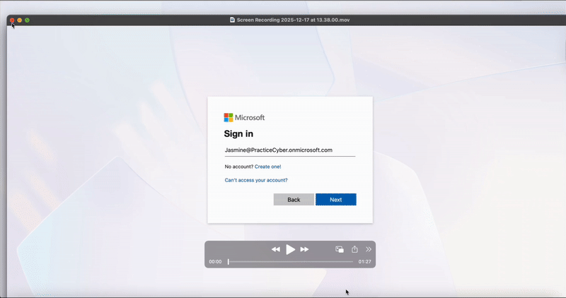
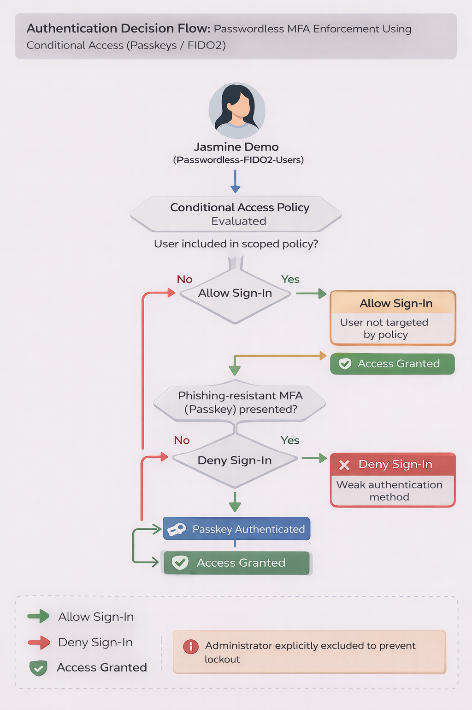
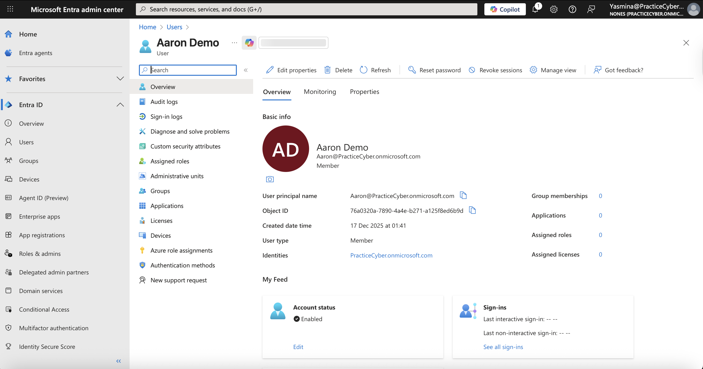
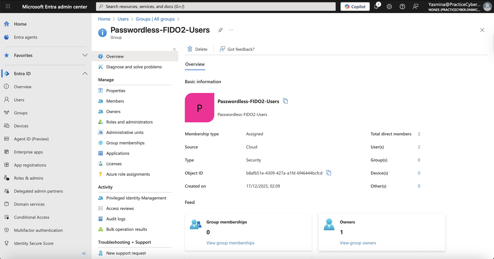
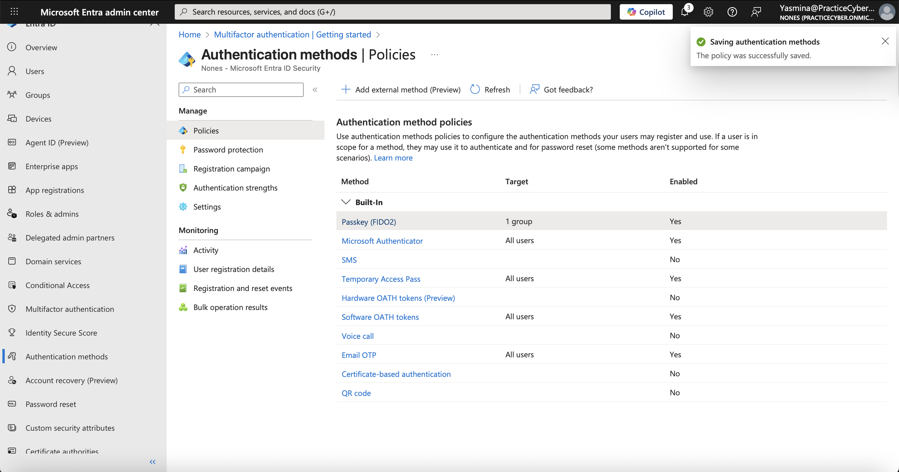
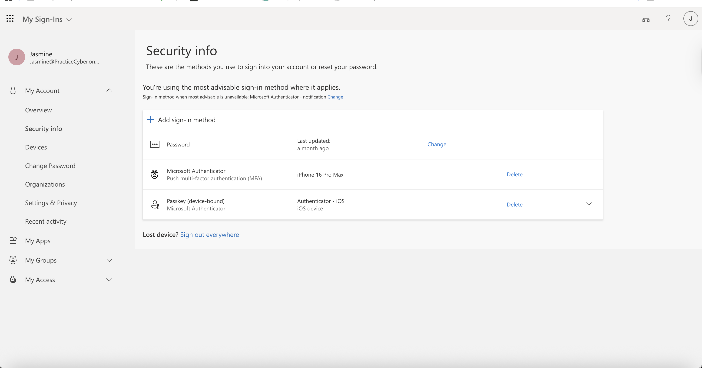
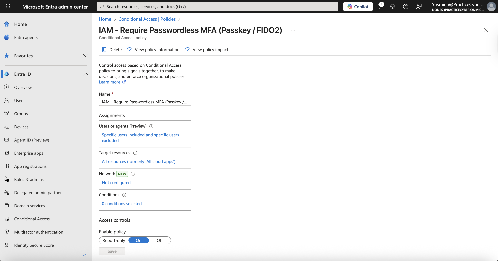
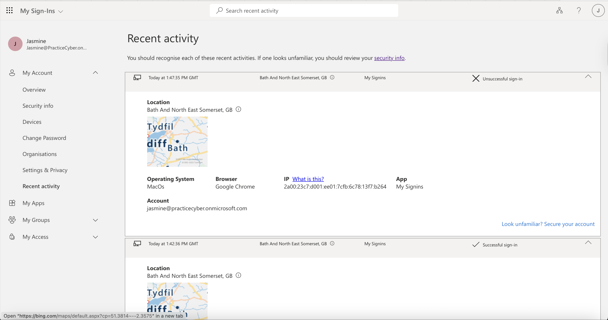
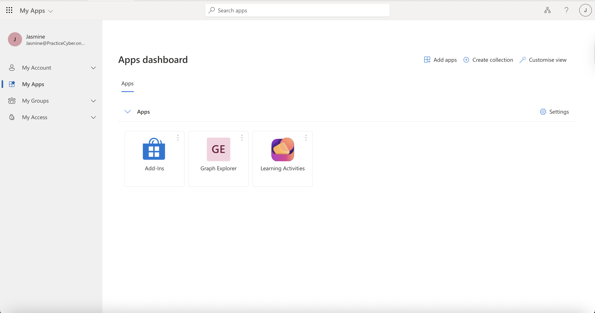

# Microsoft Entra ID – MFA + Passwordless Authentication (FIDO2)

## 🧩 Overview
This lab demonstrates how to implement **Multi-Factor Authentication (MFA)** combined with **Passwordless authentication using FIDO2 security keys** in Microsoft Entra ID (Azure AD).

The goal is to showcase a **modern, phishing-resistant identity security design** where users authenticate **without passwords**, significantly reducing the risk of credential theft, phishing, and account takeover.

This lab reflects a **real-world enterprise implementation** aligned with **Zero Trust principles**, **FIDO2 standards**, and **NIST 800-63B** recommendations.

---

## ⚠️ Real-World Risk

> **Over 80% of breaches involve stolen or weak credentials** (Verizon DBIR).

Traditional MFA still relies on passwords, which means:
- Passwords can be phished
- Passwords can be reused
- Passwords can be leaked or brute-forced

**Passwordless authentication removes the password entirely**, eliminating the most exploited attack surface.

### This lab reduces:
- Credential phishing  
- Password spray attacks  
- MFA fatigue attacks  
- Account takeover (ATO)

### Security alignment:
- Zero Trust architecture  
- NIST 800-63B (Phishing-resistant MFA)  
- Microsoft passwordless strategy  

---

## 🛠 What I Built
- **2 cloud-only users** (Jasmine, Aaron)
- **Security Group:** `Passwordless-FIDO2-Users`
- **FIDO2 authentication method enabled**
- **Passwordless sign-in tested using FIDO2 security key**
- **Conditional Access Policy** enforcing MFA
- **End-to-end authentication flow validated**
- **Full cleanup performed** (no persistent lab artifacts)

---

## 🎥 Full Authentication Flow Demo (Passwordless Sign-In)

---

## 🛠 Architecture Diagram


---

## 🛠 Authentication Decision Flow


---

## 🔐 Conditional Access Policy (JSON – Exportable)

```json
  "authenticationStrength@odata.context": "https://graph.microsoft.com/v1.0/$metadata#identity/conditionalAccess/policies('a3f20e81-d502-4a97-8e25-c45060c5a634')/grantControls/authenticationStrength/$entity",
                "authenticationStrength": null
        {
            "id": "410bf431-a878-4543-b99e-b661291ded9a",
            "templateId": null,
            "displayName": "IAM - Require Passwordless MFA (Passkey / FIDO2)",
            "createdDateTime": "2025-12-17T13:28:07.5314132Z",
            "modifiedDateTime": null,
            "state": "enabled",
            "sessionControls": null,
            "conditions": {
                "userRiskLevels": [],
                "signInRiskLevels": [],
                "clientAppTypes": [
                    "all"
                ],
                "servicePrincipalRiskLevels": [],
                "insiderRiskLevels": null,
                "platforms": null,
                "locations": null,
                "devices": null,
                "clientApplications": null,
                "authenticationFlows": null,
                "applications": {
                    "includeApplications": [
                        "All"
                    ],
                    "excludeApplications": [],
                    "includeUserActions": [],
                    "includeAuthenticationContextClassReferences": [],
                    "applicationFilter": null
                },
                "users": {
                    "includeUsers": [],
                    "excludeUsers": [
                        "ef9e7ac1-dc0f-4f8d-8a3a-da364c47514b",
                        "332d31b2-05c0-42f4-98cc-48fe4932372b"
                    ],
                    "includeGroups": [
                        "b8afb51e-4309-427a-a1fd-6f46444bcfcd"
                    ],
                    "excludeGroups": [],
                    "includeRoles": [],
                    "excludeRoles": [],
                    "includeGuestsOrExternalUsers": null,
                    "excludeGuestsOrExternalUsers": null
                }
            },
            "grantControls": {
                "operator": "OR",
                "builtInControls": [
                    "mfa"
                ],
                "customAuthenticationFactors": [],
                "termsOfUse": [],
                "authenticationStrength@odata.context": "https://graph.microsoft.com/v1.0/$metadata#identity/conditionalAccess/policies('410bf431-a878-4543-b99e-b661291ded9a')/grantControls/authenticationStrength/$entity",
                "authenticationStrength": null
            }
        
```
----


### 🧪 Step-by-Step Evidence

| # | Action                            | Screenshot                                                                              |
| - | --------------------------------- | --------------------------------------------------------------------------------------- |
| 1 | Create cloud-only users           |               |
| 2 | Create security group             |               |
| 3 | Enable FIDO2 authentication       |       |
| 4 | Register FIDO2 security key       |  |
| 5 | Configure Conditional Access      |  |
| 6 | Passwordless sign-in test         |  |
| 7 | Access granted (no password used) |      |


----

## 🔎 IAM Implementation Details

## 1️⃣ Create Cloud-Only Identities
Purpose (IAM reasoning):
Cloud-only identities remove on-prem dependencies and reflect modern cloud-first IAM architectures.

**Actions:**
  - Navigate to Microsoft Entra ID → Users
  - Create two users:
      Jasmine Demo
      Aaron Demo
  - Set strong temporary passwords (for initial sign-in only)
  - Mark users as cloud-only
    
**Validation:**
  - Users appear in Entra ID
No hybrid or directory sync attributes present

📸 Screenshot: User.png

## 2️⃣ Create IAM Security Group
Purpose (IAM reasoning):
Groups enable scalable policy enforcement and reduce administrative overhead.

**Actions:**
  - Go to Microsoft Entra ID → Groups
    
  - Create security group
  - Name: Passwordless-FIDO2-Users
    
**Type:** Security
    Add Jasmine and Aaron as members
    
**Validation:**
- Group membership confirmed
- Group ready for Conditional Access & auth method scoping
  
📸 Screenshot: Group.png

### 3️⃣ Enable FIDO2 Authentication Method

**Purpose (IAM reasoning):**  
Authentication Methods define which credential types are permitted in the tenant and control who can use them.  
Enabling FIDO2 at the method level establishes passwordless authentication as an approved credential while maintaining centralized governance and least-privilege access.

**Actions:**
- Navigated to **Microsoft Entra ID → Authentication methods**
- Selected **FIDO2 Security Keys**
- Enabled the FIDO2 authentication method
- Scoped the method to **Selected groups** only
- Assigned access to the IAM-controlled group `Passwordless-FIDO2-Users`
- Enabled **self-service registration** for security keys
- Key restriction enforcement was intentionally not enabled, as AAGUID-based restrictions are typically applied in environments with standardized FIDO2 hardware.


**Validation:**
- FIDO2 Security Keys authentication is enabled
- Usage is restricted to the `Passwordless-FIDO2-Users` group
- No tenant-wide exposure of passwordless credentials

📸 Screenshot: `FIDO2-enabled.png`

## 4️⃣ Register FIDO2 Security Key

**Purpose (IAM reasoning):**  
Credential registration is a user-driven process that binds a cryptographic key pair to a specific identity.  
Authentication methods are governed by administrators, while credential enrollment is performed by end users.

**Actions:**
- Signed in as **Jasmine Demo** (standard user)
- Navigated to **My Security Info**:
  - https://mysignins.microsoft.com/security-info
- Selected **Add sign-in method**
- Chose **Security key (FIDO2)**
- Completed registration:
  - Configured a local PIN
  - Performed the physical security key challenge

**Validation:**
- FIDO2 security key appears under Jasmine’s registered authentication methods
- Registration completed without requiring administrative access
- No password was used during the authentication flow

📸 Screenshot: `FIDO2-registration.png`


## 5️⃣ Configure Conditional Access Policy (Require Passwordless MFA)

**Purpose (IAM reasoning):**  
Conditional Access evaluates authentication context in real time and enforces access decisions based on identity, group membership, and approved authentication strength.  
This policy ensures that only passwordless, phishing-resistant authentication is permitted for scoped users.

**Actions:**
- Navigated to **Microsoft Entra ID → Conditional Access**
- Created a new Conditional Access policy

**Policy configuration:**
- **Name:** `IAM - Require Passwordless MFA (Passkey / FIDO2)`
- **Users:** Assigned to the IAM-controlled group `Passwordless-FIDO2-Users`
- **Target resources:** All cloud apps
- **Grant controls:**
  - Require multi-factor authentication
- **Policy state:** Enabled

**Validation:**
- Conditional Access policy is enabled
- Policy scope is limited to `Passwordless-FIDO2-Users`
- Authentication enforcement relies on passwordless credentials governed by Authentication Methods
- Administrative access was excluded at the user scope level to safely validate passwordless enforcement without impacting tenant management.


📸 Screenshot: `Conditional-Access.png`


## 6️⃣ Validate Passwordless Authentication Flow
Purpose (IAM reasoning):
Verification ensures that FIDO2 satisfies MFA requirements and removes password dependency.

**Actions:**
  - Sign out completely
  - Start a new sign-in as Jasmine
    
**Observe authentication flow:**
  - Username entered
  - FIDO2 challenge presented
  - No password prompt
  - Access granted
    
**Validation:**
  - MFA satisfied via FIDO2
  - Passwordless authentication confirmed
    
📸 Screenshot: Passwordless-login.png

## 7️⃣ Access Validation & Policy Enforcement
Purpose (IAM reasoning):
Final confirmation that Conditional Access is enforcing intended controls.

**Actions:**
  - Access a cloud application
  - Confirm no bypass or fallback to password
    
**Validation:**
  - Access granted only after phishing-resistant MFA
  - Access was granted only after successful Passkey-based authentication, with no password or legacy MFA fallback available.
  - Access validation was performed using a representative Microsoft cloud application. Because Conditional Access is evaluated per sign-in, successful enforcement on a single application confirms correct policy behavior across all scoped resources.


    
📸 Screenshot: Access-granted.png

----
## 🔐 License Assignment & IAM Validation
To enable Conditional Access and advanced authentication methods, Microsoft Entra ID P2 licenses were assigned.
Steps performed:
  - Microsoft 365 Admin Center → Billing → Licenses
  - Assigned Microsoft Entra ID P2 to:
    Jasmine@PracticeCyber.onmicrosoft.com
    Aaron@PracticeCyber.onmicrosoft.com
  - Verified license assignment in Entra Admin Center
    
## IAM Validation Results:
  - Conditional Access policy successfully enforced
  - FIDO2 accepted as phishing-resistant MFA
  - Passwordless authentication confirmed

## 🧰 IAM Tools & Services Used
  - Microsoft Entra ID (Azure AD)
  - Conditional Access
  - Authentication Methods (FIDO2)
  - Microsoft Azure Portal
  - Microsoft 365 Admin Center
  - Microsoft Graph Dev Center

## 💡 IAM Outcome
This lab demonstrates an enterprise-grade IAM control implementing phishing-resistant, passwordless authentication using FIDO2 and Conditional Access.
From an IAM perspective, this solution:
  - Strengthens identity assurance
  - Reduces credential-based risk
  - Scales through group-based governance
  - Aligns with Zero Trust and compliance frameworks
    
## 🔐 IAM Key Takeaway:
Passwordless FIDO2 authentication is a core IAM capability, not an optional enhancement — it is essential for modern identity security.

## 👩‍💻 *Author:* [Yaz.](https://www.linkedin.com/in/yasmina-g-p-227576a)
