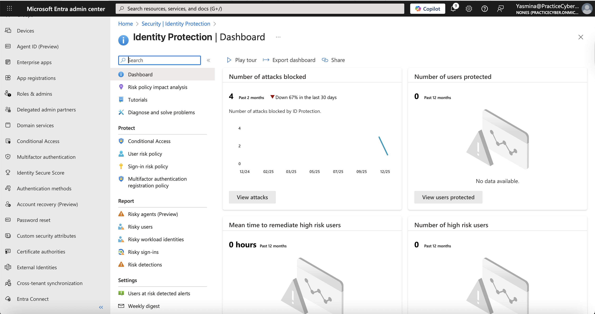
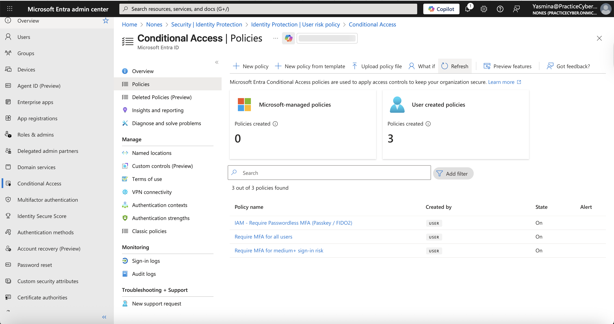
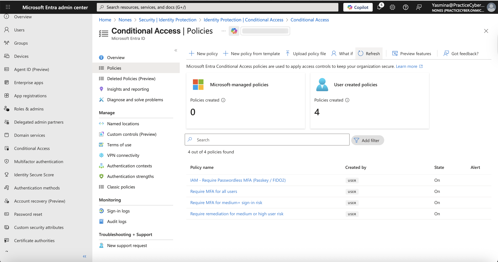

# 🔐 Lab 08 – Identity Protection & Risk Policies

## 📌 Overview

This lab demonstrates the configuration and implementation of Microsoft Entra ID Identity Protection, including risk detection and risk-based Conditional Access policies.
The goal is to showcase hands-on expertise in detecting compromised identities using machine learning signals and automatically enforcing remediation controls — a critical capability for modern Zero Trust security architectures.
This implementation aligns with enterprise requirements for automated identity threat response and is highly relevant for roles in  **Cloud Security, IAM, SOC, and Azure Administration**.

---

## 🎯 Lab Objectives

- Understand identity risk concepts (User Risk & Sign-in Risk)
- Configure Identity Protection features
- Create and enforce risk-based policies
- Apply automatic remediation controls
- Validate policy enforcement through testing

---
## ⚠️ Real-World Risk
81% of breaches involve weak, stolen, or reused credentials (Verizon DBIR 2024).
Traditional authentication relies on static signals that adversaries can bypass. Identity Protection uses AI/ML-driven risk detection to identify anomalies in real time, enabling proactive remediation.

## This lab mitigates:

Account takeover (ATO) via leaked credentials
Impossible travel or anomalous sign-in patterns
Credential stuffing and spray attacks
Lateral movement from compromised accounts

## Security alignment:

Zero Trust principles
NIST 800-63B (risk-based authentication)
Microsoft recommended identity security practices

## 🛠 What I Built

Reviewed Identity Protection dashboard and risk detections
Configured User Risk policy (remediate High/Medium risk with password reset)
Configured Sign-in Risk policy (require MFA for High/Medium risk sign-ins)
Validated automated enforcement through simulated risky scenarios
Full cleanup performed (policies disabled, no persistent artifacts)

---
## 🎥 Full Authentication Flow identity-protection-mfa-enforcement.gif

---

## 📐 Architecture & Risk Diagrams (Mermaid)

> These diagrams are included to document the **identity risk lifecycle** end-to-end:  
> **where Identity Protection fits**, **how risk is evaluated**, and **what enforcement actions are applied**.

---

### Diagram 01 – High-Level Identity Architecture

> **Description:** This diagram shows how a user sign-in request reaches **Microsoft Entra ID**, where **Identity Protection** evaluates risk signals and **Conditional Access** enforces access controls before granting access to cloud applications.

## 📐 Architecture & Flow Diagrams (Mermaid)

### Diagram 01 – High-Level Identity Architecture

flowchart LR
    subgraph UserSide [User Environment]
        U[User / Device]
        Browser[Browser / App]
    end

    subgraph Global [Microsoft Global Network]
        Edge[Edge Network]
    end

    subgraph EntraID [Microsoft Entra ID]
        direction TB
        Auth[Authentication Service]
        IP[Identity Protection ML Risk Engine]
        CA[Conditional Access Policy Engine]
    end

    subgraph Apps [Protected Resources]
        M365[Microsoft 365]
        Azure[Azure Resources]
        SaaS[SaaS Applications]
    end

    U --> Browser
    Browser --> Edge
    Edge --> Auth
    Auth --> IP
    Auth --> CA
    IP --> CA
    CA --> Apps

    style UserSide fill:#e3f2fd,stroke:#90caf9
    style Global fill:#f3e5f5,stroke:#ce93d8
    style EntraID fill:#e8f5e8,stroke:#81c784
    style Apps fill:#fff3e0,stroke:#ffb74d

---

### Diagram 02 – Risk Detection & Policy Evaluation Flow
**Description:** This diagram illustrates the decision pipeline: a sign-in attempt generates signals (IP, location, device, behavior), Identity Protection assigns a risk level, and then risk policies + Conditional Access determine what controls must be applied.

flowchart TD
    Start[Sign-in Attempt] --> Signals[Signal Collection IP Address • Location • Device User Agent • Behavior • Credentials]

    Signals --> IP{Identity Protection Real-time ML Evaluation}

    IP -->|Low / No Risk| Low[Risk Level: Low]
    IP -->|Medium Risk| Med[Risk Level: Medium]
    IP -->|High Risk| High[Risk Level: High]

    Low --> CA[Conditional Access Policy Evaluation]
    Med --> CA
    High --> CA

    CA --> Grant[Grant Access]
    CA --> Challenge[Enforce Controls]

    style Low fill:#d4edda,stroke:#28a745,color:#155724
    style Med fill:#fff3cd,stroke:#ffc107,color:#856404
    style High fill:#f8d7da,stroke:#dc3545,color:#721c24
    style Challenge fill:#f8d7da,stroke:#dc3545
    style Grant fill:#d1ecf1,stroke:#17a2b8

---

### Diagram 03 – Enforcement & Remediation Actions
**Description:** This diagram maps risk levels to security outcomes. Medium risk sign-ins are challenged with MFA, high-risk users are remediated by forcing a password reset, and critical risk events can result in access being blocked.

flowchart TD

    Eval[Risk Evaluation Complete] --> Type{Which Risk?}

    Type -->|Sign-in Risk| SignIn[Sign-in Risk Level]
    Type -->|User Risk| UserR[User Risk Level]

    SignIn --> SMed[Medium]
    SignIn --> SHigh[High]

    UserR --> UMed[Medium]
    UserR --> UHigh[High]

    SMed --> MFA[Require Multi-Factor Authentication]
    SHigh --> MFAHigh[Require MFA (or Block Access)]

    UMed --> Remed[Require Risk Remediation (Self-remediation flow)]
    UHigh --> RemedHigh[Require Risk Remediation (Immediate action)]

    MFA --> Success1[Access Granted after MFA]
    MFAHigh --> Success2[Access Granted or Blocked]
    Remed --> Success3[Access Granted after Remediation]
    RemedHigh --> Success4[Access Granted after Remediation]

    style SMed fill:#fff3cd,stroke:#ffc107
    style SHigh fill:#f8d7da,stroke:#dc3545
    style UMed fill:#fff3cd,stroke:#ffc107
    style UHigh fill:#f8d7da,stroke:#dc3545
    style MFA fill:#e3f2fd,stroke:#2196f3
    style Remed fill:#e1bee7,stroke:#9c27b0
    style Success1 fill:#d4edda,stroke:#28a745
    style Success2 fill:#d4edda,stroke:#28a745
    style Success3 fill:#d4edda,stroke:#28a745
    style Success4 fill:#d4edda,stroke:#28a745

---

## 📊 Evidence Summary (Screenshots)

| # | Action                            | Screenshot                                                                              |
| - | --------------------------------- | --------------------------------------------------------------------------------------- |
| 1 | Create cloud-only users           |   |
| 2 | Create security group             |      |
| 3 | Enable FIDO2 authentication       |       |
| 4 | Register FIDO2 security key       |  |
| 5 | Configure Conditional Access      |  |
| 6 | Passwordless sign-in test         |  |

----

## 🧪 Step-by-Step Implementation 
## 1️⃣ Access Identity Protection Dashboard
Purpose (Security reasoning):
Gain visibility into current identity risk posture using ML-powered detections.
## Actions:
Sign in to Microsoft Entra admin center
Navigate to Identity Protection > Overview

## Validation:
Dashboard shows risk summary, trends, and flagged users/sign-ins
📸 Screenshot: dashboard.png.

---
## 2️⃣ Review Risky Users
Purpose (Security reasoning):
Identify accounts likely compromised (e.g., leaked credentials detected on dark web).

## Actions:
Go to Identity Protection > Risky users
Filter for Medium/High risk
Review detection details and risk factors

📸 Screenshot: risk-detected.png

## 3️⃣ Review Risky Sign-ins
Purpose (Security reasoning):
Detect anomalous authentication attempts in real time.

## Actions:
Go to Identity Protection > Risky sign-ins
Analyze signals: unfamiliar location, impossible travel, anonymous IP, etc.

📸 Screenshot: risk-events.png

## 4️⃣ Configure User Risk Policy
Purpose (Security reasoning):
Dynamically require stronger authentication for suspicious sign-in attempts.
**Actions:**

Navigate to Protection > Conditional Access > Policies
Create new policy (or use template: "Require MFA for medium+ sign-in risk")
Conditions → Sign-in risk → Yes → Medium and above
Access controls → Grant → Require multi-factor authentication
Enable policy

📸 Screenshot: signin-risk-policy.png, user-risk-policy.png

## 5️⃣ Create User Risk Conditional Access Policy
Purpose (Security reasoning):
Force secure remediation for accounts likely compromised.
**Actions:**

Navigate to Protection > Conditional Access > Policies
Create a new policy (recommended: use the built-in template "Require remediation for medium or high user risk")
Under Conditions → User risk → Select Yes
Choose risk levels: High and Medium (or High only for stricter enforcement)
Under Access controls → Grant → Select Require risk remediation
(Optional) Scope to All users or a pilot group
Set policy to On (or Report-only for initial testing)
Save and enable the policy

📸 Screenshot: sign-in-risk-policy.png
## 6️⃣ Validate Policy Enforcement
Purpose (Security reasoning):
Confirm adaptive controls activate correctly based on risk signals.
**Actions:**

- Use a test user account with some sign-in history (ideally 10+ logins or 14 days old for reliable risk detection).
**Simulate a risky sign-in to trigger Sign-in Risk (most reliable for labs):**
- Download and open the Tor Browser (official way to simulate anonymous IP address).
- Navigate to https://myapps.microsoft.com or https://office.com.
- Sign in with your test user credentials.
**Observe:** The system should detect "Anonymous IP" risk and prompt for multi-factor authentication (MFA) automatically.

**Alternative simulation for Sign-in Risk (Atypical/Impossible Travel):**
- Sign in normally from your usual location/IP.
- Immediately change your IP (using a VPN to a distant country) and optionally change user agent (in browser Dev Tools F12).
- Sign in again quickly — this may trigger "impossible travel".

**For User Risk testing (if needed):**
Use Microsoft Graph Explorer to manually mark the test user as compromised (requires IdentityRiskEvent.ReadWrite permissions).

**After the risky sign-in:**
- Wait 5-15 minutes for risk processing.
- Check Identity Protection > Risky sign-ins or Risky users for the detection.
- Review Sign-in logs (Entra ID > Sign-in logs) — filter by the user and look for "Conditional Access" status showing your policy applied, risk level (Medium/High), and enforced control (e.g., MFA required).

📸 Screenshot: enforcement-test.png

---

## ✅ Expected Results

- Automatic detection of identity risks
- Enforcement of security controls without manual intervention
- Improved security posture for identities
- Reduced risk of account compromise

---

## 🔐 License Requirement
This lab requires Microsoft Entra ID P2 licenses (or EMS E5) to enable:

Identity Protection risk detections
Risk-based Conditional Access policies
Automated remediation controls

Licenses were assigned temporarily for lab purposes and removed during cleanup.

---
## 🧰 Tools & Services Used

Microsoft Entra ID (formerly Azure AD)
Identity Protection
Risk-based Conditional Access policies
Microsoft Entra admin center
Sign-in and audit logs

