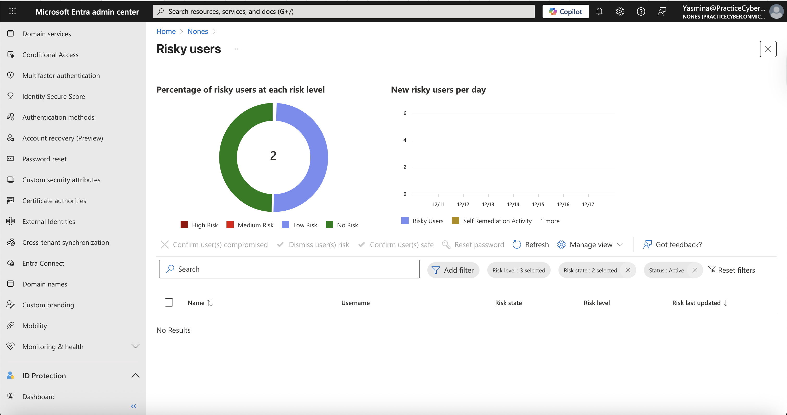
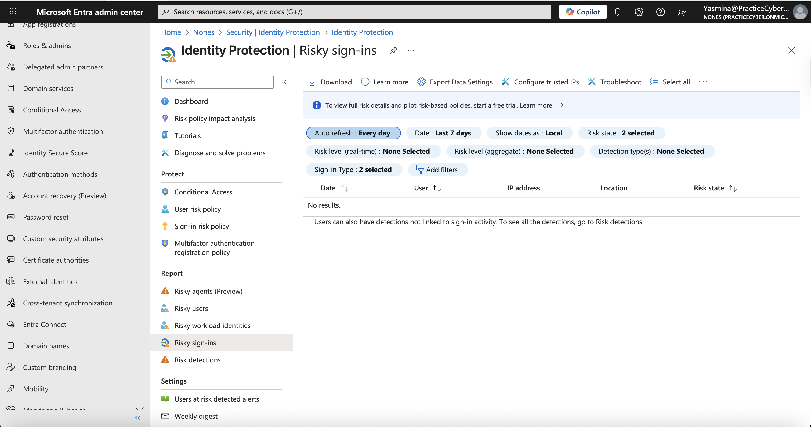
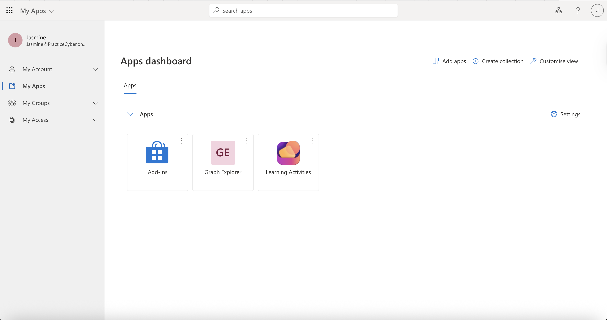

# 🔐 Lab 08 – Identity Protection & Risk Policies

## 📌 Overview

This lab demonstrates the implementation and configuration of **Identity Protection** and **risk-based policies** using **:contentReference[oaicite:0]{index=0}** (formerly Azure Active Directory).

The purpose of this lab is to showcase hands-on knowledge of **identity risk detection, automated remediation, and conditional access**, which are critical skills for roles in **Cloud Security, IAM, SOC, and Azure Administration**.

---

## 🎯 Lab Objectives

- Understand identity risk concepts (User Risk & Sign-in Risk)
- Configure Identity Protection features
- Create and enforce risk-based policies
- Apply automatic remediation controls
- Validate policy enforcement through testing

---

## 🧠 Key Concepts Covered

| Concept | Description |
|------|-------------|
| Identity Protection | Detects compromised identities using ML signals |
| User Risk | Probability that a user account is compromised |
| Sign-in Risk | Risk associated with a specific authentication attempt |
| Conditional Access | Policy-based access control |
| MFA | Multi-Factor Authentication as a mitigation control |

---

## 🛠️ Prerequisites

- Active Azure tenant
- Access to Microsoft Entra ID
- User with **Global Administrator** or **Security Administrator** role
- **Entra ID P2** license (or trial)

---

## 📐 Architecture & Flow Diagrams

The following diagrams provide architectural context, risk evaluation logic, and enforcement outcomes.

### Diagram 01 – High-Level Identity Architecture
**Description:** Shows where Identity Protection fits within the Azure identity architecture.

📸 File: `diagram-01-identity-architecture.png`

---

### Diagram 02 – Risk Detection & Policy Evaluation Flow
**Description:** Illustrates how sign-in signals are evaluated and mapped to risk policies.

📸 File: `diagram-02-risk-policy-flow.png`

---

### Diagram 03 – Enforcement & Remediation Actions
**Description:** Displays enforcement actions based on risk level (MFA, password reset, or block).

📸 File: `diagram-03-enforcement-remediation.png`

---

## 📊 Evidence Summary (Screenshots)

| # | Action                            | Screenshot                                                                              |
| - | --------------------------------- | --------------------------------------------------------------------------------------- |
| 1 | Create cloud-only users           |   |
| 2 | Create security group             |      |
| 3 | Enable FIDO2 authentication       |       |
| 4 | Register FIDO2 security key       |  |
| 5 | Configure Conditional Access      |  |
| 6 | Passwordless sign-in test         |  |

----
## 🧪 Lab Steps

### Step 1 – Access Identity Protection
- Navigate to **Microsoft Entra ID**
- Open **Identity Protection**

📸 Screenshot: `dashboard.png`

---

### Step 2 – Review User Risk Detections
- Identify users marked as risky
- Analyze risk level and detection type

📸 Screenshot: `risk-detected.png`

---

### Step 3 – Review Sign-in Risk Events
- Analyze risky sign-in attempts
- Review IP address, location, and behavior

📸 Screenshot: `risk-events.png`

---

### Step 4 – Configure User Risk Policy
- Create a policy targeting **Medium and High user risk**
- Enforce **Require password change**

📸 Screenshot: `policy-configuration.png`

---

### Step 5 – Configure Sign-in Risk Policy
- Create a policy for risky sign-ins
- Enforce **Require MFA**

📸 Screenshot: `risk-policy-configuration.png`

---

### Step 6 – Test Policy Enforcement
- Simulate a risky sign-in scenario
- Verify MFA or password reset enforcement

📸 Screenshot: `enforcement-test.png`

---

## ✅ Expected Results

- Automatic detection of identity risks
- Enforcement of security controls without manual intervention
- Improved security posture for identities
- Reduced risk of account compromise

---

## 🧩 Real-World Use Cases

- Preventing Account Takeover (ATO)
- Blocking or challenging suspicious sign-ins
- Enforcing Zero Trust security principles
- Automating IAM incident response

---

## 🧠 Skills Demonstrated

- Identity & Access Management (IAM)
- Cloud Security (Azure)
- Risk-based Authentication
- Conditional Access Policies
- Zero Trust Architecture

---
## 🛠️ Tools Used

 Identity Protection & IAM 
 Configuration & monitoring 
 Risk detection  Risk-based enforcement 
 Remediation control 
 Risk validation

