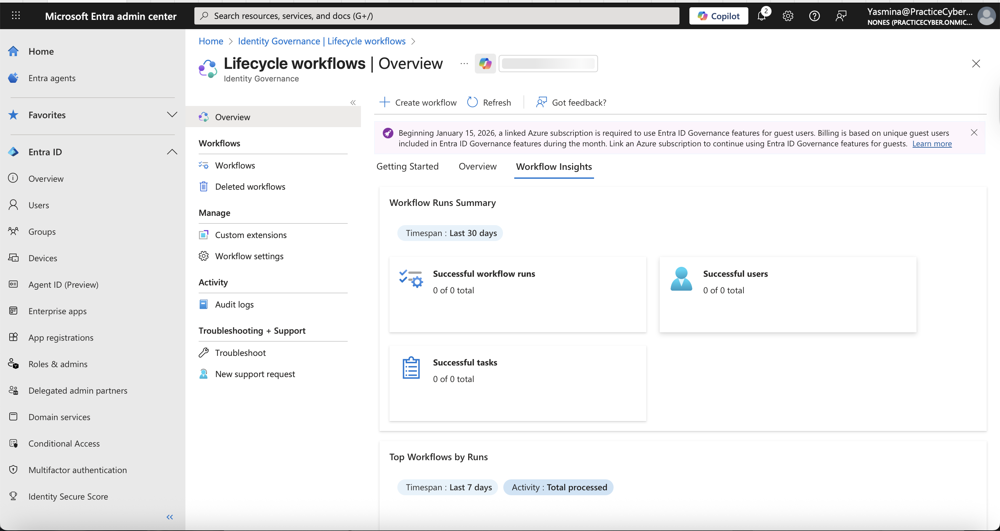
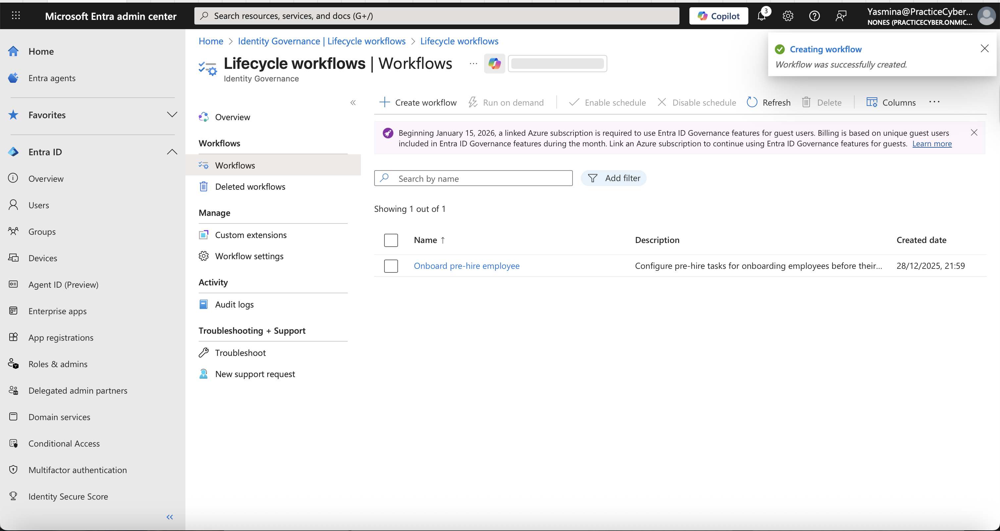
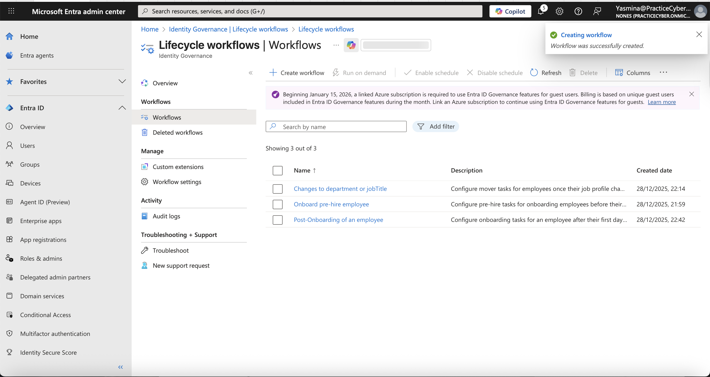
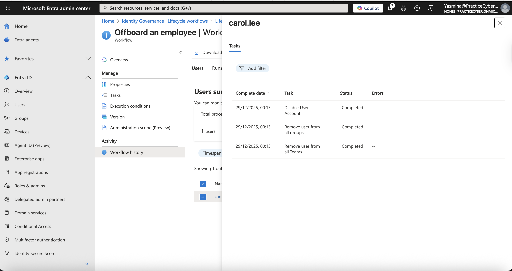

## 🔐 Lab 09 – Microsoft Entra ID Lifecycle Workflows (Joiner-Mover-Leaver Automation)
## 📌 Overview
This lab demonstrates hands-on configuration of Microsoft Entra ID Governance Lifecycle Workflows to automate the full Joiner-Mover-Leaver (JML) identity lifecycle.
- The implementation automates onboarding,
- role changes, and secure offboarding using HR-driven attributes, built-in tasks, and triggers
- reducing manual effort, enforcing least-privilege access, and ensuring compliance in enterprise environments.
  
This showcases production-level IAM automation expertise, highly valued in roles such as Identity Engineer, Cloud Security Specialist, Governance Administrator, and Zero Trust Architect.

## 🎯 Lab Objectives

- Understand the Joiner-Mover-Leaver (JML) model and Lifecycle Workflows
- Create automated workflows for Joiner (onboarding), Mover (role changes), and Leaver (offboarding)
- Configure triggers, scopes, and tasks (e.g., TAP generation, group management, account disable)
- Test on-demand execution and monitor runs/audits
- Validate automated provisioning and de-provisioning


## ⚠️ Real-World Risk
- Manual JML processes lead to delays,
- orphaned accounts, and over-privileged access
- contributing to 80% of breaches involving compromised identities (per industry reports).
  
Lifecycle Workflows enable proactive, automated governance aligned with:

- Zero Trust (timely access revocation)
- NIST IR 7628 (identity lifecycle management)
- GDPR/SOX compliance (audit-ready trails)
- Microsoft Secure Future Initiative

## This lab mitigates:

- Delayed onboarding → reduced productivity
- Forgotten access on role changes → privilege creep
- Orphaned accounts after departure → insider/exfiltration risk

## 🛠 What I Built

- Joiner workflow: Pre-hire TAP generation + welcome email + group addition
- Mover workflow: Automatic group/license updates on department change
- Leaver workflow: Disable account + remove all access on termination date
- On-demand testing and full monitoring via Insights & Audit logs
- Cleanup: Workflows disabled/deleted after validation


## 🎥 Suggested Demo Animation
Create a short screen recording GIF (e.g., lifecycle-workflow-demo.gif) showing:

Creating a workflow
Running on-demand on a test user
Verifying user changes (e.g., groups added, account disabled)

Example placeholder (replace with your own):
./Screenshots/lifecycle-workflow-demo.gif

## 📐 Architecture & Flow Diagrams (Mermaid)
Diagram 01 – High-Level JML Lifecycle in Microsoft Entra ID
Description: Overview of how HR attributes trigger automated workflows across Joiner, Mover, and Leaver phases.


flowchart LR

    subgraph HR [HR System]
        Attr[Attributes<br/>employeeHireDate<br/>department<br/>employeeLeaveDateTime]
    end
    subgraph EntraID [Microsoft Entra ID Governance]
        direction TB
        LW[Lifecycle Workflows<br/>Engine]
        Trigger[Triggers<br/>Time-based / Attribute Change / On-Demand]
        Scope[Execution Conditions<br/>Scope Rules]
        Tasks[Tasks<br/>TAP, Email, Groups, Disable, etc.]
    end
    subgraph User [User Object]
        New[New Hire]
        Active[Active Employee]
        Former[Former Employee]
    end
    HR -->|Sync Attributes| EntraID
    Trigger --> LW
    Scope --> LW
    LW --> Tasks
    Tasks --> User
    style HR fill:#e3f2fd,stroke:#90caf9
    style EntraID fill:#e8f5e8,stroke:#81c784
    style User fill:#fff3e0,stroke:#ffb74d

<details> <summary>📷 Visual Diagram (PNG)</summary>  </details> ```
----
## Diagram 02 – Workflow Execution Flow
Description: Step-by-step automation pipeline from trigger to task completion.  

flowchart TD

    Start[Trigger Fired] --> ScopeCheck{Scope Matches?}
    ScopeCheck -->|No| End[Skip]
    ScopeCheck -->|Yes| Tasks[Execute Tasks Sequentially]
    Tasks --> Status[Update Run Status]
    Status --> Audit[Log to Audit]
    Status --> End[Complete]
    style ScopeCheck fill:#fff3cd,stroke:#ffc107
    style Tasks fill:#e3f2fd,stroke:#2196f3
    style End fill:#d4edda,stroke:#28a745


<details> <summary>📷 Visual Diagram (PNG)</summary>  </details> ```
----


## Diagram 03 – Joiner vs. Leaver Task Comparison
Description: Contrasting actions for onboarding and offboarding.


flowchart LR

    subgraph Joiner [Joiner Phase]
        J1[Generate TAP]
        J2[Send Welcome Email]
        J3[Add to Groups]
        J4[Assign Licenses]
    end
    subgraph Leaver [Leaver Phase]
        L1[Disable Account]
        L2[Remove Groups]
        L3[Remove Licenses]
        L4[Send Notification]
    end
    style Joiner fill:#d4edda,stroke:#28a745
    style Leaver fill:#f8d7da,stroke:#dc3545

<details> <summary>📷 Visual Diagram (PNG)</summary>  </details> ```
----    


## 📊 Evidence Summary (Screenshots)

| # | Action | Screenshot |
| - | ------ | ---------- |
| 1 | Lifecycle Workflows Dashboard |  |
| 2 | Template Selection |  , |
| 3 | Joiner Workflow Configuration |  |
| 4 | Mover Workflow Tasks |    |
| 5 | Leaver Workflow (Disable Account) |  |
| 6 | On-Demand Run & Success |  |
| 7 | Audit Logs Verification |  |

----

## 🧪 Step-by-Step Implementation
## 1️⃣ Access Lifecycle Workflows Dashboard
Purpose (IAM reasoning): Gain visibility into automated lifecycle processes and execution insights.

**Actions:**

- Sign in to Microsoft Entra admin center
- Navigate to Identity Governance > Lifecycle workflows > Overview/Insights

**Validation:** Dashboard shows workflow runs, success rates, and trends.

📸 Screenshot: Lifecycle-workflows-dashboard.png

## 2️⃣ Create Joiner Workflow
Purpose (IAM reasoning): Automate secure, efficient onboarding with pre-hire preparation.

**Actions:**

- Click Create workflow > Browse templates > Select Onboard pre-hire employee 
- Set trigger: employeeHireDate with offset (-7 or 0 days)
- Add scope: e.g., department equals "Sales"
- Add tasks: Generate Temporary Access Pass, Send welcome email, Add to groups
- Review > Create > Enable schedule

**Validation:** Workflow appears in list; test on-demand.

📸 Screenshots: templates.png


## 3️⃣ Create Mover Workflow

**Purpose (IAM reasoning):**  
Prevent privilege creep by automatically adjusting group memberships and licenses when an employee’s job profile changes.

### Actions

1. Go to **Microsoft Entra admin center** → **Identity Governance** → **Lifecycle workflows**.
2. Click **Create workflow** and select the **Employee job profile change** template.
3. Configure the trigger:
   - **Trigger condition:** When an attribute changes  
   - **Attribute:** `Department` (or `JobTitle`)
4. Define the scope:
   - Target **Users**
   - Condition: `Department is not null` (or a specific department if required)
5. Configure workflow tasks:
   - **Send email to notify manager of user move** (optional, enabled)
   - **Remove user from selected groups**  
     - Select legacy groups (e.g., Sales-Users)
   - **Add user to selected groups**  
     - Select new role-based groups (e.g., Marketing-Users)
   - **Add or remove licenses**  
     - Remove old licenses and assign new licenses based on the updated role
6. Disable or remove tasks not required for this lab:
   - Remove user from selected Teams
   - Request user access package assignment
7. Review the workflow, click **Create**, and enable the workflow schedule.

### Validation

- Update the `Department` or `JobTitle` attribute of a test user.
- Confirm the workflow runs successfully.
- Verify the user is removed from old groups, added to new groups, and licenses are updated.

📸 **Screenshot:** `mover-tasks.png`


## 4️⃣ Create Leaver Workflow

**Purpose (IAM reasoning):**  
Ensure rapid and consistent de-provisioning to minimize security risks when an employee leaves the organization.

### Actions

1. Go to **Microsoft Entra admin center** → **Identity Governance** → **Lifecycle workflows**.
2. Click **Create workflow** and select the **Offboard an employee** (Post-offboarding) template.
3. Configure the trigger:
   - **Trigger type:** Time based attribute
   - **Event timing:** After
   - **Attribute:** `createdDateTime`  
   - **Days from event:** 7  
   
   > **Note:** The lab tenant does not expose the `employeeLeaveDateTime` attribute.  
   > The `createdDateTime` attribute is used to simulate a leaver event for demonstration purposes.
4. Define the scope:
   - Target **Users**
   - Condition: `createdDateTime is not null` (or limit to a test department/user if preferred)
5. Configure workflow tasks:
   - **Disable user account**
   - **Remove user from all groups**
   - **Remove all licenses**
6. Review the workflow configuration, click **Create**, and enable the workflow schedule.
7. Optionally, run the workflow using **Run on demand** with a test user to validate behavior.

### Validation

- Execute the workflow on a test user.
- Confirm the user account is disabled (sign-in blocked).
- Verify all group memberships and licenses are removed.

📸 **Screenshot:** `leaver-disable.png`


## 5️⃣ Test & Monitor Execution

**Purpose (IAM reasoning):**  
Validate lifecycle workflow execution, confirm expected user changes, and ensure auditability for governance and compliance.

### Actions

1. Navigate to **Microsoft Entra admin center** → **Identity Governance** → **Lifecycle workflows** → **Workflows**.
2. Open the previously created workflow (Joiner, Mover, or Leaver).
3. Click **Run on demand**.
4. Select one test user that meets the workflow scope and start the execution.
5. Go to **Activity** → **Workflow history** and monitor the run status.
6. Wait until the execution status shows **Succeeded**.
7. Verify the results on the user object:
   - Joiner: groups and licenses assigned.
   - Mover: legacy access removed and new access assigned.
   - Leaver: account disabled (sign-in blocked), groups and licenses removed.
8. Review **Audit logs** under **Identity Governance** to confirm lifecycle workflow actions were logged.

### Validation

- Workflow execution completed successfully with status **Succeeded**.
- User object changes match the expected lifecycle behavior.
- Audit logs contain entries related to lifecycle workflow execution.

📸 **Screenshot:** `run-success.png`


## 6️⃣ Run Workflows On-Demand & Verify Execution Success
 **Purpose (IAM reasoning):** Confirm that workflows execute correctly in a controlled manner and produce the expected changes on user objects before enabling scheduled runs.
 
## Actions:

- Select one of your created workflows (Joiner, Mover, or Leaver)
- Click Run on demand
- Choose 1–2 test users (ensure they meet scope conditions)
- Start the run
- Navigate to the Runs tab of the workflow
- Wait for processing (usually a few minutes) and refresh until status shows Succeeded

## Validation:

- Run history shows "Succeeded" with no failed tasks
- Check the test user(s): e.g., groups added (Joiner), groups updated (Mover), or account disabled (Leaver)

📸 Screenshot: demand-run-success.png (capture the "Runs" tab showing successful completion)

## 7️⃣ Verify Changes & Review Audit Logs
**Purpose (IAM reasoning):** Ensure full traceability and compliance by confirming automated actions are logged for governance and auditing purposes.

## Actions:

- Open the affected test user(s) in Users > All users
- Verify changes: e.g., new group memberships, license assignments, or sign-in blocked status
- Go to Identity Governance > Audit logs
- Filter by Activity: "Lifecycle Workflows" or specific task names
- Review entries for workflow execution, task completion, and user attribute modifications

**Validation:** Audit logs show detailed entries for each task executed (e.g., "User added to group", "User account disabled")

📸 Screenshot: Gov-audit-logs.png (capture filtered audit log entries related to your workflow runs)

## ✅ Expected Results

- Automated JML processes with zero manual intervention
- Secure onboarding (TAP + groups)
- Timely offboarding (account disabled)
- Complete audit logging for compliance


## 🔐 License Requirement
Microsoft Entra ID Governance or Microsoft Entra Suite (P2-level) required for Lifecycle Workflows.
Licenses assigned temporarily for lab and removed during cleanup.

## 🧰 Tools & Services Used

- Microsoft Entra admin center
- Identity Governance > Lifecycle Workflows
- Built-in tasks and templates
- Audit & Sign-in logs for verification

This lab provides strong, verifiable proof of advanced IAM automation skills with Microsoft Entra ID, 
perfect for demonstrating expertise in identity lifecycle governance.
