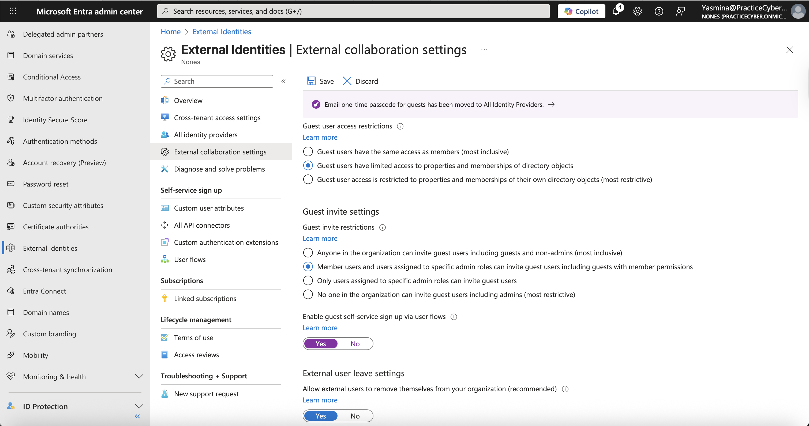
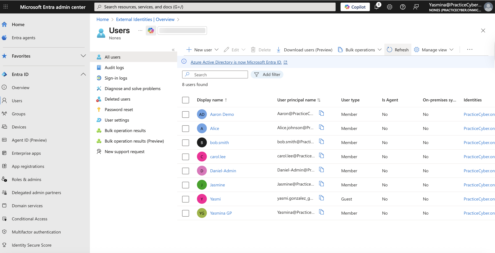
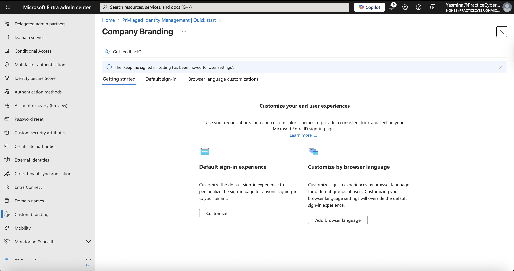
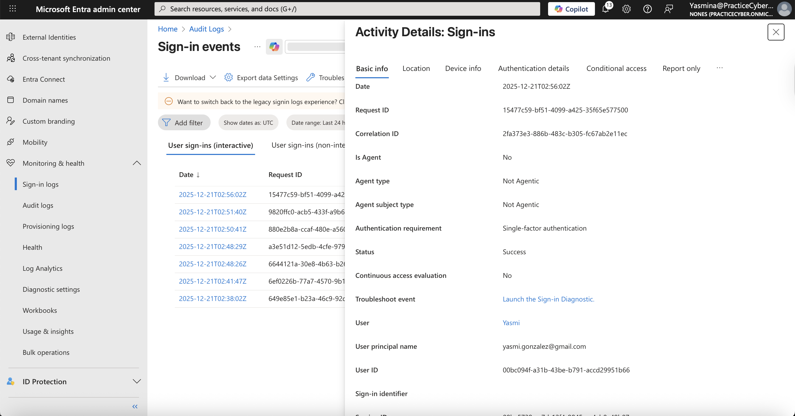

## 🔐 Lab 10 – Microsoft Entra External Identities (B2B Collaboration & Customer CIAM)
## 📌 Overview
This hands-on lab explores Microsoft Entra External ID, the unified platform for managing external identities, including B2B collaboration (partners/guests) and customer identity and access management (CIAM) scenarios.
The lab covers inviting external guests, configuring collaboration settings, and setting up basic customer authentication flows — demonstrating secure, scalable access for partners and consumers while maintaining control and compliance.
This implementation highlights advanced IAM skills in external identity governance, highly relevant for Identity Architect, Cloud Security Engineer, CIAM Developer, and Zero Trust Specialist roles.

## 🎯 Lab Objectives

- Configure B2B collaboration: Invite guests,
- manage external collaboration settings, and apply cross-tenant access
- Enable self-service sign-up and federation (Google, Microsoft accounts)
- Set up a basic customer sign-up/sign-in user flow for CIAM
- Apply branding and test authentication experiences
- Monitor guest users and audit external access


## ⚠️ Real-World Risk
- External sharing without proper controls leads to data exfiltration,
- unauthorized access, and compliance violations (e.g., 60% of breaches involve third-party risk – per industry reports).
- Entra External ID enables secure collaboration aligned with:

Zero Trust (verify every external access)
NIST 800-63 (digital identity guidelines)
GDPR/CCPA (consumer data protection)

## This lab mitigates:

- Uncontrolled guest invitations → over-exposure
- Weak consumer authentication → account takeover
- Siloed B2B/B2C management → operational complexity

## 🛠 What I Built

- Configured external collaboration restrictions and cross-tenant settings
- Invited B2B guests from Gmail and another Entra tenant
- Enabled self-service sign-up with social identities
- Created a customer sign-up/sign-in user flow with custom branding
- Tested guest redemption and consumer authentication
- Cleanup: Removed guests and disabled flows


## 🎥 Suggested Demo Animation
Create a short GIF (e.g., external-id-demo.gif) showing:

Inviting a guest and redemption process
Running a customer user flow sign-up

Example placeholder (replace with yours):
./Screenshots/external-id-demo.gif

## 📐 Architecture & Flow Diagrams (Mermaid)
## Diagram 01 – B2B Collaboration Overview
**Description:*+  External users authenticate with their home identity provider while accessing resources in your tenant.


flowchart LR

    subgraph External [External User]
        User[Guest User]
        IdP[Home IdP<br/>(Entra, Google, etc.)]
    end
    subgraph ResourceTenant [Resource Tenant]
        Apps[Apps & Resources<br/>(M365, Custom Apps)]
        Entra[Microsoft Entra ID]
    end
    User --> IdP
    IdP --> Entra
    Entra --> Apps
    style External fill:#fff3e0,stroke:#ffb74d
    style ResourceTenant fill:#e8f5e8,stroke:#81c784


<details> <summary>📷 Visual Diagram (PNG)</summary>  </details> ```

## Diagram 02 – B2B Direct Connect vs. Standard Collaboration
Description: Direct connect for seamless Teams shared channels (no guest object) vs. traditional guest invitation.

flowchart TD

    Start[External Access Request] --> Type{Collaboration Type?}
    Type -->|Standard B2B| Invite[Invite Guest → Create #EXT# User]
    Type -->|Direct Connect| Trust[Mutual Cross-Tenant Trust → No Guest Object]
    Invite --> Access[Access Resources]
    Trust --> Access[Access Shared Channels]
    style Invite fill:#fff3cd,stroke:#ffc107
    style Trust fill:#d4edda,stroke:#28a745

<details> <summary>📷 Visual Diagram (PNG)</summary>  </details> ```


## Diagram 03 – Customer CIAM Authentication Flow
**Description:** Consumer sign-up/sign-in with local or social accounts.    

flowchart TD

    App[Customer App] --> Flow[User Flow / Policy]
    Flow --> IdP{Social / Local?}
    IdP -->|Social| ExternalIdP[Google / Facebook]
    IdP -->|Local| Local[Email + Password / OTP]
    ExternalIdP --> Token[Issue Token]
    Local --> Token
    Token --> App
    style Flow fill:#e3f2fd,stroke:#2196f3
    style Token fill:#d4edda,stroke:#28a745

<details> <summary>📷 Visual Diagram (PNG)</summary>  </details> ```

## 📊 Evidence Summary (Screenshots)

| # | Action | Screenshot |
| - | ------ | ---------- |
| 1 | External Identities Dashboard |  |
| 2 | External Collaboration Settings |  |
| 3 | Inviting B2B Guest User |  ,  |
| 4 | Guest User Object (#EXT#) |  |
| 5 | Customer User Flow Creation |  |
| 6 | Branding & Identity Providers |  |
| 7 | Test Sign-Up & Audit Logs |  |


---
## 🧪 Step-by-Step Implementation
## 1️⃣ Access External Identities Settings
Purpose (IAM reasoning): Centralize control over external access and invitations.
## Actions:

- Sign in to Microsoft Entra admin center
- Navigate to Identity > External Identities > All identity providers / External collaboration settings

**Validation:** Review current allow/block lists and guest invite restrictions.

📸 Screenshot: External-Identities.png

## 2️⃣ Configure B2B Collaboration Settings
Purpose (IAM reasoning): Enforce least-privilege for external partners.
## Actions:

- Go to External Identities > External collaboration settings
- Set guest invite restrictions (e.g., specific roles only)
- Configure domain allow/block lists
- Review Cross-tenant access settings for specific partners

**Validation:** Settings applied; test restricted invitation.
- Reviewed External Collaboration Settings and Cross-tenant Access Settings to enforce least-privilege B2B collaboration.
- Guest invitation permissions were restricted to specific admin roles.
- Domain-based allow/block lists are no longer configured directly; external access is governed through cross-tenant access policies.
  
📸 Screenshot: collab-settings.png

## 3️⃣ Invite and Manage B2B Guest Users
Purpose (IAM reasoning): Securely onboard partners using their own credentials.
## Actions:

- Users > New user > Invite external user
- Enter guest email (Gmail or another Entra tenant)
- Assign groups/apps as needed
- Guest redeems invitation via email

**Validation:** 

- Microsoft Entra admin center → Users → All users → (usuario invitado)

📸 Screenshots: invite-guest.png

## 4️⃣ Enable Self-Service Sign-Up (B2B or CIAM)
Purpose (IAM reasoning): Allow controlled external access without manual invites.

## Actions:

- External Identities > User flows > Create new user flow (Sign up and sign in)
- Add identity providers (Google, Microsoft account)
- Configure user attributes and claims

**Validation:**

- A self-service sign-up and sign-in user flow was created using Microsoft Entra External Identities.
- Azure Active Directory sign-up was configured as the identity provider to allow controlled external user registration without manual invitations.

📸 Screenshot: user-flow.png

## 5️⃣ Customize Branding & Test Customer Flow
Purpose (IAM reasoning): Deliver trusted, branded consumer experiences.

## Actions:

- Navigate to Microsoft Entra ID > Company branding
- Upload a company logo and customize the sign-in page appearance (colors, background, text)
- Save the branding configuration
- Run the previously created User Flow to validate the sign-in experience
  
Note: In Enterprise Entra ID tenants, branding is applied at the tenant level. Per-user-flow branding is only available in dedicated Entra External ID (CIAM) tenants.

**Validation:**

- Company branding customization options were reviewed.
- In this Microsoft Entra ID Enterprise tenant, branding settings are available in read-only mode.
- Full branding customization (logo, backgrounds, per-flow UI) is supported only in dedicated Entra External ID (CIAM) tenants.
- The objective of this step was to validate awareness of sign-in experience management and tenant capability differences.

**📸 Screenshots:** branding-idps.png

## 6️⃣ Monitor & Audit External Access
Purpose (IAM reasoning): Maintain visibility and compliance for external identities.

## Actions:

- Navigate to **Monitoring > Sign-in logs**
- Apply filters such as:
  - **User type:** Guest
  - **Status:** Success
  - **Time range:** Last 7 days (or broader if needed)
- Review an external user authentication event

## Validate that the sign-in log shows:
- External or guest user
- Application or user flow
- Authentication method
- Successful sign-in result

### Validation
- Guest users are visible in the directory and correctly identified as external
- Audit logs show external user lifecycle activities (invitation or creation)
- Sign-in logs provide visibility into external authentication events

📸 **Screenshot:** `test-signup-audit.png`  
*(Capture either the Audit Logs or Sign-in Logs page showing an external user event with filters applied.)*


## ✅ Expected Results

- Secure B2B guest access with home credentials
- Branded consumer sign-up/sign-in experiences
- Granular controls over external collaboration
- Full audit trail for external activities


## 🔐 License Requirement

- B2B collaboration: Included in Microsoft Entra ID
- Advanced CIAM/user flows: Microsoft Entra External ID (MAU-based pricing; free up to 50K MAU)
- Resources assigned temporarily for lab and cleaned up.

## 🧰 Tools & Services Used

- Microsoft Entra admin center
- External Identities > Collaboration settings & User flows
- Identity providers (Google, Microsoft)
- Audit & Sign-in logs

This lab provides verifiable evidence of expertise in managing external identities with Microsoft Entra, essential for modern hybrid and customer facing IAM scenarios.
